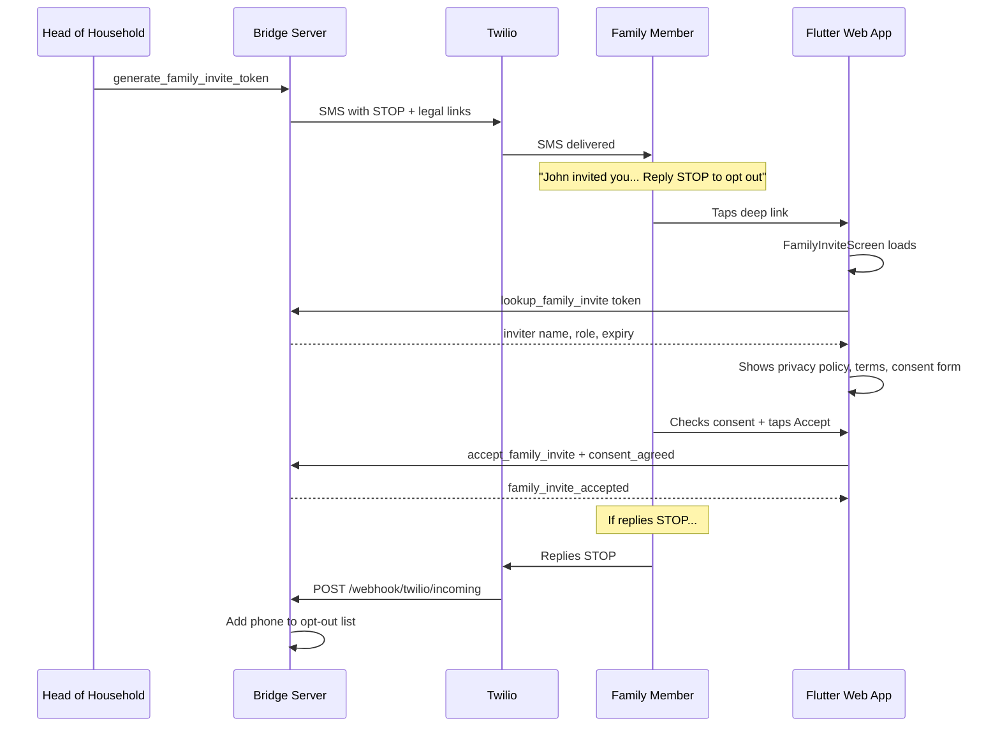

# A2P 10DLC Compliance + Family Invite Consent Flow

## Overview

This plan covers four areas: (1) STOP opt-out in SMS messages, (2) public privacy policy and terms pages, (3) a deep-link family invite acceptance screen with consent, and (4) a Twilio webhook for opt-out handling.




---

## 1. Public Privacy Policy and Terms Pages

Create two standalone HTML pages styled with the Sovereign Sanctuary dark theme, served as static files alongside the dashboard pages. Content sourced from [legal/sovereign_sanctuary_agreement.md](legal/sovereign_sanctuary_agreement.md).

### Files to create

- `**dashboard/privacy.html**` -- Privacy Policy (Parts II + III from the agreement: sections 12-18)
- `**dashboard/terms.html**` -- Terms of Use + Therapeutic Waiver (Parts I + IV + V: sections 1-11, 19-26)

These will be accessible at:

- `https://app.sovereignsanctuary.net/privacy.html`
- `https://app.sovereignsanctuary.net/terms.html`

They are static HTML files deployed alongside the existing dashboard files -- no nginx changes needed since dashboard HTML is already copied into the web root at `/var/www/sovereignsanctuary-web/`.

---

## 2. STOP Opt-Out in SMS Messages

### Update SMS message bodies in [notification_system.py](backend/app/websocket/notification_system.py)

**Family invitation** (line 777) -- add STOP language and legal links:

```python
msg = (
    f"{inviter_name} has invited you to join their Family Circle on Sovereign Sanctuary. "
    f"Use code {token} when registering at {invite_url}\n\n"
    f"Privacy: {app_url}/privacy.html | Terms: {app_url}/terms.html\n"
    f"Reply STOP to opt out of messages."
)
```

**Coach invite** (line 809) -- same pattern:

```python
msg = (
    f"{coach_name} has invited you to Sovereign Sanctuary. "
    f"Sign up with invite code {invite_token}: {signup_url}\n\n"
    f"Privacy: {app_url}/privacy.html | Terms: {app_url}/terms.html\n"
    f"Reply STOP to opt out of messages."
)
```

**Password reset** (line 761) -- transactional/user-initiated, no STOP language needed per TCPA.

### Update email templates

In the `send_family_invitation` email HTML (line 782), add links to privacy policy and terms before the sign-up link.

---

## 3. Opt-Out Storage and Pre-Send Check

### Add to [notification_system.py](backend/app/websocket/notification_system.py)

In `__init__` (line 77), add:

```python
self.sms_opt_out_file = self.data_dir / "sms_opt_out.json"
```

Add methods:

- `_load_opt_outs() -> set` -- load normalized phone numbers from `sms_opt_out.json`
- `save_opt_out(phone: str)` -- add normalized phone to opt-out set, write to file
- `remove_opt_out(phone: str)` -- remove phone from opt-out set (for START re-subscribe)
- `is_opted_out(phone: str) -> bool` -- check if a phone is opted out

In `send_sms` (line 728), add opt-out check before the Twilio call:

```python
to_phone = self._normalize_phone(to_phone)
if self.is_opted_out(to_phone):
    print(f">>> [NOTIFY] SMS blocked (opted out): {to_phone}")
    self._log_sms(to_phone, body[:50], "blocked_opt_out")
    return False
```

---

## 4. Twilio Incoming SMS Webhook

### Create new file: `backend/app/routers/twilio_webhook.py`

A FastAPI router that handles incoming SMS from Twilio:

- `POST /webhook/twilio/incoming` -- receives `From`, `Body`, `To` form fields from Twilio
- Handles keywords: STOP/STOPALL/UNSUBSCRIBE/CANCEL/END/QUIT -> add to opt-out
- Handles: START/UNSTOP/YES -> remove from opt-out
- Handles: HELP -> return TwiML with support info
- Returns empty `<Response></Response>` TwiML for STOP/START (Twilio's Advanced Opt-Out sends its own auto-reply)

The webhook reads/writes `sms_opt_out.json` directly (same file the NotificationSystem uses). Both processes share the same data directory.

### Register in [main.py](backend/app/main.py) at line ~130:

```python
from app.routers import twilio_webhook
app.include_router(twilio_webhook.router)
```

### Nginx route

Add to server config so `/webhook/twilio/` reaches FastAPI (port 8000):

```nginx
location /webhook/twilio/ {
    proxy_pass http://127.0.0.1:8000;
}
```

### Twilio Console configuration

Set the phone number (+16562318192) incoming message webhook to:
`https://app.sovereignsanctuary.net/webhook/twilio/incoming` (POST)

---

## 5. Family Invite Lookup Endpoint

### Add to [bridge_server.py](backend/app/websocket/bridge_server.py)

Add a new WebSocket message handler `lookup_family_invite` that returns invite details without requiring authentication (so the acceptance screen can show who invited them before they log in):

```python
elif t == "lookup_family_invite":
    token = d.get("token", "").strip().upper()
    registry = load_registry()
    invites = registry.get("_family_invites", {})
    invite = invites.get(token)
    if invite:
        expires = invite.get("expires_at", "")
        expired = expires and str(datetime.datetime.now()) > expires
        await websocket.send(json.dumps({
            "type": "family_invite_details",
            "valid": not expired,
            "inviter_name": invite.get("inviter_name", "A family member"),
            "role": invite.get("role", "DEPENDENT"),
            "expires_at": expires,
        }))
    else:
        await websocket.send(json.dumps({
            "type": "family_invite_details",
            "valid": False,
            "message": "Invalid or expired invite code."
        }))
```

Also update `accept_family_invite` to require and record consent:

```python
# In accept_family_invite handler, add:
v["profile"]["family_consent_agreed"] = True
v["profile"]["family_consent_date"] = str(datetime.datetime.now())
v["profile"]["family_consent_version"] = "v13.0_2026"
```

---

## 6. Deep-Link Family Invite Acceptance Screen (Flutter)

### URL routing in [main.dart](mobile/lib/main.dart)

Update `_InitialRouteWidget` (line 191) to also parse `family-invite` and `code` parameter from the URL, alongside the existing `reset_token` parsing:

```dart
// After reset_token check:
String? familyCode;
try {
  familyCode = Uri.base.queryParameters['code'];
  if (familyCode == null) {
    final path = Uri.base.path;
    if (path.contains('family-invite')) {
      familyCode = Uri.base.queryParameters['code'];
    }
  }
} catch (_) {}
if (familyCode != null && familyCode.isNotEmpty) {
  return FamilyInviteAcceptScreen(inviteCode: familyCode);
}
```

### New screen: `FamilyInviteAcceptScreen` in [main.dart](mobile/lib/main.dart)

A new StatefulWidget that:

1. **On load**: connects to WebSocket and sends `lookup_family_invite` with the token to get inviter name and role
2. **Shows**: "You've been invited by {name} to join their Family Circle"
3. **Displays**: scrollable privacy policy and terms of service content (reuse `SovereignCovenantDoc` at line 6716)
4. **Consent checkboxes**:
  - "I have read and agree to the Privacy Policy"
  - "I have read and agree to the Terms of Use and Therapeutic Waiver"
  - "I am 18 years of age or older"
5. **If not logged in**: shows login/register buttons (preserving the invite code)
6. **If logged in + all consent checked**: "Accept Invitation" button sends `accept_family_invite` with `token` and `consent_agreed: true`
7. **On success**: shows confirmation and navigates to main app
8. **On error/expired**: shows appropriate message with option to go to home

Styled with the existing design system (dark void background, gold accents, Cormorant Garamond headers).

---

## Files Summary


| File                                           | Action                                                                                |
| ---------------------------------------------- | ------------------------------------------------------------------------------------- |
| `dashboard/privacy.html`                       | **NEW** -- public privacy policy page                                                 |
| `dashboard/terms.html`                         | **NEW** -- public terms of use page                                                   |
| `backend/app/websocket/notification_system.py` | Add STOP language to SMS, opt-out storage + pre-send check                            |
| `backend/app/routers/twilio_webhook.py`        | **NEW** -- incoming SMS webhook                                                       |
| `backend/app/main.py`                          | Register twilio_webhook router                                                        |
| `backend/app/websocket/bridge_server.py`       | Add `lookup_family_invite` handler, update `accept_family_invite` with consent fields |
| `mobile/lib/main.dart`                         | Add family-invite URL parsing + `FamilyInviteAcceptScreen`                            |
| Server nginx config                            | Add `/webhook/twilio/` proxy rule                                                     |
| Twilio Console                                 | Set incoming message webhook URL                                                      |


