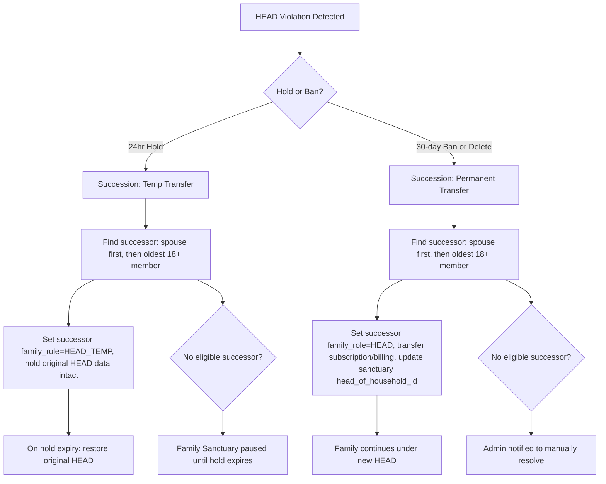
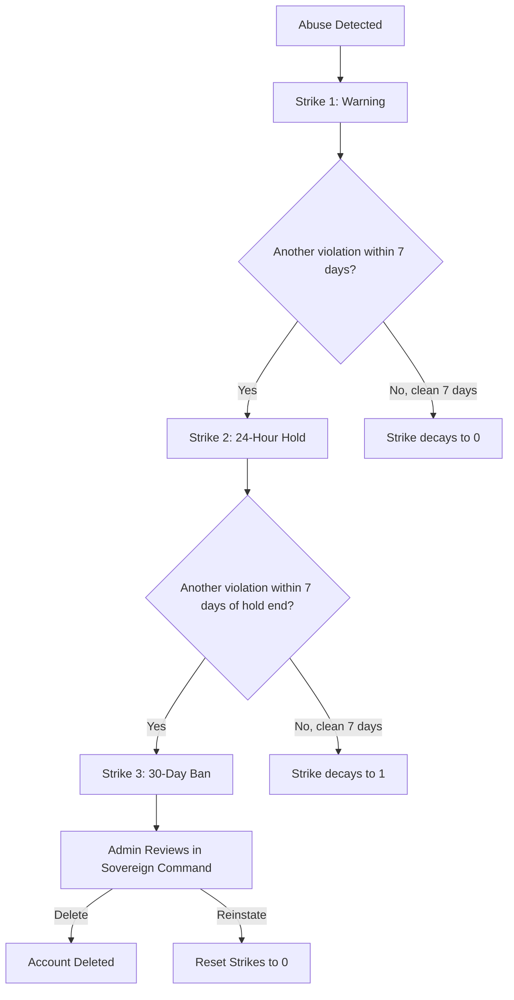

# Account Management and Abuse System

## 1. Abuse Detection and Progressive Discipline

**Define abuse behaviors** (tracked per user in registry profile):

- **Explicit threats or harmful language** toward Nate, coaches, or other family members (detected via existing PII/content filter in `night_school_director.py` PIIDetector, extended with a threat lexicon)
- **Excessive rate abuse** -- sending more than 120 messages per minute (bot behavior) or spamming WebSocket reconnects (>20 in 5 minutes)
- **Attempting to manipulate AI** -- jailbreak prompts, prompt injection attempts (keyword patterns)
- **Sharing credentials** -- multiple simultaneous device logins beyond 2 (already partially detected in `device_protection.py` suspicious activity checks)
- **Harassment in Family Sanctuary** -- flagged by coach or other members (triggers family succession protocol if abuser is HEAD)

**Family Sanctuary Succession Protocol:**

When the abuser is the HEAD of household:




Succession logic in `abuse_manager.py`:

- `find_family_successor(family_id, excluded_uid)` -- scans registry for same `family_id`, excludes the abuser, returns first match by priority: (1) user with `family_role=SPOUSE`, (2) oldest member age 18+, (3) None
- On 24hr hold of HEAD: set successor as `HEAD_TEMP`, original HEAD's `family_role` preserved as `HEAD_SUSPENDED`; on hold expiry, auto-restore
- On permanent ban/delete of HEAD: promote successor to `HEAD`, transfer `subscription_plan` to successor, update all active sanctuary sessions (`head_of_household_id`), update `billing.json` billing target
- Successor gets in-app notification: "You have been designated as the new head of household for your family sanctuary."

**Progressive discipline flow:**




**Backend implementation** -- new file [backend/app/websocket/abuse_manager.py](backend/app/websocket/abuse_manager.py):

- `AbuseManager` class with methods: `record_violation()`, `check_status()`, `get_user_discipline()`, `lift_hold()`, `lift_ban()`
- Stores per-user discipline state in `user_registry.json` under `profile.discipline`:
  ```python
  "discipline": {
      "strikes": 1,
      "warnings": [{"reason": "...", "timestamp": "..."}],
      "hold_until": null,       # ISO datetime if on 24hr hold
      "ban_until": null,        # ISO datetime if on 30-day ban
      "ban_reasons": [],
      "last_violation": "..."   # ISO datetime
  }
  ```
- Rate-limit check integrated into the main message loop in [bridge_server.py](backend/app/websocket/bridge_server.py) `handle_client()` -- before processing any message, call `abuse_manager.check_status(uid)` to block held/banned users with a `account_held` or `account_banned` WebSocket response
- Content violation check hooked into the existing AI response pipeline (after user message, before sending to Azure)

## 2. Account Deletion -- Three Flows

### Flow A: Admin Simple Delete (from Sovereign Command)

New WebSocket handler `admin_delete_user` in [bridge_server.py](backend/app/websocket/bridge_server.py):

1. Verify requester is ADMIN
2. Locate user in registry by `hardware_id`
3. **Family succession check**: if user has `family_role=HEAD`, run `find_family_successor()` and promote successor before deletion (transfer subscription, update `head_of_household_id` in active sanctuaries, update billing target). Notify successor.
4. Delete user's vault directory: `Vaults/{Clients|Coaches}/{hardware_id}/` (metrics, memory, story, breakthroughs, sessions)
5. Remove user entry from `user_registry.json`
6. Remove user references from shared files:
  - `sessions.json` -- remove entries where `client_id` or `coach_id` matches (preserve the other party's session records by only removing this user's identifying data)
  - `billing.json` -- remove their billing record
  - `device_registry.json` -- remove their device entries
  - `crisis_log.json` -- remove entries for this user
  - `analytics.json` -- remove from `unique_users` / `active_users` arrays
7. Do NOT delete: family members' data, coach's data, or shared family sanctuary sessions (just anonymize this user's references within them, e.g. replace name with "Deleted User")
8. Send notification to the deleted user's email (via existing SendGrid in `notification_system.py`): "Your account has been removed for unforeseen conditions."
9. Force-disconnect the user's WebSocket if connected
10. Log the deletion event in `analytics.json`

### Flow B: User-Requested Deletion (GDPR-style)

New WebSocket handler `request_account_deletion` in bridge_server.py:

1. User sends request from Flutter app (new settings option)
2. Server confirms identity (must be logged in)
3. **Family succession check**: same as Flow A -- if HEAD, promote successor before deletion
4. Runs the same cleanup as Flow A but triggered by the user themselves
5. Sends confirmation email: "Your account and personal data have been permanently deleted."
6. Preserves: other family members' data, coach records, anonymized session data (replace name with "Deleted User" in shared records)

### Flow C: Abuse-Based Delete (30-day ban expired, admin reviews)

1. Admin views banned users list in Sovereign Command
2. Sees Nate's recorded violations and reasons
3. Clicks "Delete Account" (same as Flow A) or "Reinstate" (lifts ban, resets strikes)

## 3. Sovereign Command UI Updates

**[dashboard/users.html](dashboard/users.html)** -- Update Identity Actions:

- Wire "Ban Account" button to new `admin_suspend_user` / `admin_ban_user` handler
- Add "Delete Account" button (red, with confirmation dialog)
- Add "View Violations" button that shows discipline history

**[dashboard/command.html](dashboard/command.html)** -- Add "Banned Users" section:

- New card in the Command tab showing users on hold or banned
- Each entry shows: name, violation count, hold/ban expiry, Nate's violation notes
- Actions: "Review", "Reinstate", "Delete Account"

## 4. Admin Account Protection (WebAuthn + TOTP)

**Requirement:** Deleting the ADMIN account requires biometric fingerprint + Microsoft Authenticator. Only works from the hosted dashboard (HTTPS).

**Backend** -- new handlers in bridge_server.py:

- `admin_setup_totp` -- generates TOTP secret, returns QR code URI for Microsoft Authenticator enrollment
- `admin_verify_totp` -- verifies 6-digit code from Authenticator
- `admin_webauthn_register` -- WebAuthn credential registration (stores public key in registry)
- `admin_webauthn_verify` -- WebAuthn assertion verification (fingerprint challenge)
- `admin_delete_admin_account` -- requires both WebAuthn assertion + TOTP code in the same request; rejects if either fails

**Dependencies:** `pyotp` (already used for search proxy TOTP), `py_webauthn` (new dependency for WebAuthn/FIDO2)

**Frontend** -- add to [dashboard/users.html](dashboard/users.html) and [dashboard/command.html](dashboard/command.html):

- When admin clicks "Delete" on an ADMIN-role user, show a modal requiring:
  1. Fingerprint scan (WebAuthn `navigator.credentials.get()`)
  2. Microsoft Authenticator 6-digit code
- Setup flow accessible from System tab: "Setup Admin 2FA" button

## 5. Nate Sentinel Mode -- AI Intrusion Protection

**Goal:** Even if an attacker steals admin credentials, Little Nate detects anomalous behavior and freezes the session before damage is done.

### 5A. 2FA Policy for Admin Login

- **New device or IP**: Require TOTP code (Microsoft Authenticator) after password. Store trusted device/IP fingerprints in `profile.trusted_devices[]` (hashed user-agent + IP).
- **Recognized device**: Password-only login (trusted after first 2FA verification).
- **Sensitive actions** (delete user, ban, config changes, wipe memory): Always require TOTP regardless of device trust.

### 5B. Admin Session Fingerprinting

Store admin's behavioral baseline in `profile.sentinel_baseline` (built over first 7 days, continuously updated):

```python
"sentinel_baseline": {
    "known_ips": ["68.43.85.92", ...],
    "known_devices": ["hash_of_ua_1", ...],
    "typical_hours": [9, 10, 11, 14, 15, 16, ...],  # hours (local time) when admin is usually active
    "typical_actions_per_minute": 2.5,  # average action rate
    "typical_action_types": {"admin_get_stats": 45, "coach_get_clients": 30, ...}  # frequency distribution
}
```

### 5C. Anomaly Detection (scored per session)

Each admin action is scored for suspicion. Anomaly triggers and weights:

- **Unknown IP address**: +40 points
- **Unknown device fingerprint**: +30 points
- **Unusual hour** (outside typical_hours): +20 points
- **Rapid action rate** (>3x typical rate): +25 points
- **Bulk destructive actions** (>3 deletes/bans in 5 minutes): +50 points
- **Accessing data never previously accessed**: +15 points
- **Attempting to modify admin credentials**: +60 points

**Thresholds:**

- Score >= 50: Log warning, send email alert to admin's registered email
- Score >= 80: **FREEZE session** -- all further messages return `session_frozen` error. Send push alert via email. Require full re-auth (password + TOTP + WebAuthn) to unfreeze.

### 5D. Nate Guardian Response

When freeze triggers:

1. Server immediately sets `session_state = "FROZEN"` for that WebSocket connection
2. All subsequent messages return: `{"type": "session_frozen", "reason": "Suspicious activity detected. Session locked by Nate Sentinel.", "alert_sent": true}`
3. Email sent to admin's registered email: "ALERT: Your admin session was frozen due to suspicious activity from IP {ip} at {time}. If this was you, re-authenticate at the dashboard. If not, your account is safe -- the intruder has been locked out."
4. Frozen session logged in `audit_log.json` with full details (IP, device, all actions taken, anomaly scores)
5. To unfreeze: admin must log in fresh from a trusted device with full 2FA (password + TOTP + fingerprint)

### 5E. Admin Audit Log

New file `data/admin_audit_log.json` -- every admin action recorded:

```python
{
    "timestamp": "2026-02-09T11:45:00",
    "admin_id": "ADMIN_FATHER_ID",
    "action": "admin_delete_user",
    "target": "CLIENT_001",
    "ip": "68.43.85.92",
    "device_hash": "abc123...",
    "anomaly_score": 5,
    "details": {"reason": "User requested deletion"}
}
```

Viewable in Sovereign Command System tab -- scrollable audit trail with filters by date, action type, and anomaly score. Entries with high anomaly scores highlighted in red.

## 5. Files Changed


| Area | File | Changes |
| ---- | ---- | ------- |


- **New file**: `backend/app/websocket/abuse_manager.py` -- AbuseManager class, violation types, discipline logic, family succession
- **New file**: `backend/app/websocket/sentinel.py` -- NateSentinel class: session fingerprinting, anomaly scoring, freeze logic, audit logging
- **Backend**: `bridge_server.py` -- New handlers: `admin_delete_user`, `request_account_deletion`, `admin_ban_user`, `admin_setup_totp`, `admin_verify_totp`, `admin_webauthn_register`, `admin_webauthn_verify`, `admin_delete_admin_account`; abuse check in message loop; sentinel anomaly check on every admin action; 2FA on new device login; trusted device management
- **Dashboard**: `dashboard/users.html` -- Wire identity actions, add Delete button, violation history
- **Dashboard**: `dashboard/command.html` -- Add banned users card, review/reinstate/delete actions, audit log viewer in System tab, sentinel status indicator
- **Flutter** (future): Settings screen delete account option (not in this phase unless requested)

