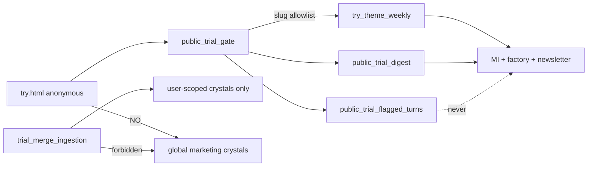
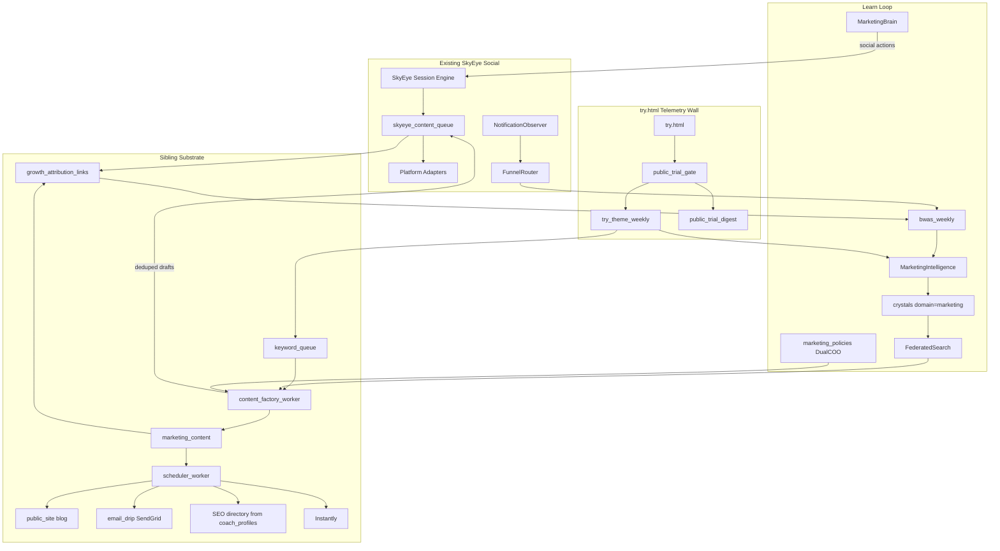

# Adaptive Growth Engine (Plans 1–5 Adapted)

## Locked decisions

- **1A Sibling queues:** SkyEye keeps social (`skyeye_content_queue` + platform adapters + session Create/Post). New `marketing_content` covers **blog / email_drip / outreach / directory_page only**. Newsletter/Dispatch stays on existing newsletter stack — **not** a growth/ publisher.
- **2A Instantly + SendGrid:** Instantly for cold buyer sequences. SendGrid for product drips / trial / Dispatch / GKM-style transactional mail.
- **Reuse, don’t fork:** MarketingBrain, FunnelRouter, `content_ab_tests`, `growth_snapshots`, crystallizer harvest, Dual-COO Queens, Studio/SSE, try.html, `coach_profiles` + [`coach_directory_api.py`](backend/app/routers/coach_directory_api.py).
- **Firewall:** Nate Creative Atelier stays separate from this growth engine.
- **try.html learning wall (immutable):** Anonymous public trial ([try.html](https://app.sovereignsanctuary.net/try.html)) is marketing/product signal via **anonymized aggregates only**. Never poison `nate_intelligence_crystals` while anonymous. Full per-user crystallize only after signup merge — and merge must not create **global marketing** crystals from pre-merge try text. Crisis language stays ops-only.
- **CEO approval UX (locked):** Primary decision path = **email/SMS via existing [`ceo_inbox_notify.py`](backend/app/services/ceo_inbox_notify.py)** (same as Dual-COO / trust / code-style CEO approvals). Reply to `approve@reply.sovereignsanctuary.net`. Dashboard `marketing_engine.html` remains a secondary full-queue console, not the only path.

---

## CEO inbox approval (Dispatch/Dual-COO style)

### Trigger
When `marketing_content` enters `pending_review` (factory, rewrite resubmit, outreach sequence draft, directory SEO page), enqueue a **YELLOW** CEO inbox item + call `notify_ceo_inbox_item`. Batch option: if >N items in one factory run, send **one digest email** listing all IDs + one deep-link to the review queue (still one reply token per item, or digest APPROVE_ALL only for blog/social children — never for outreach/directory).

Default: **one email per content row** for outreach / directory / first article of a keyword; **digest** for bulk social-child drafts.

### Reply commands (extend ApprovalProtocol / ceo_inbox_notify)

| Reply | Effect on `marketing_content` |
|---|---|
| `APPROVE` | → `approved` then `scheduled` (default `scheduled_at=now` or payload schedule) |
| `REJECT` | → `rejected` (+ optional note from reply body) |
| `REWRITE` | → create revision draft (`revision_of`), copy note from reply body after command, original superseded |
| `DELAY <ISO or +Nd>` | → stay approved/pending with new `scheduled_at` (parse from reply) |
| `ACK` / `DISMISS` | Clear inbox only — **does not** publish (same as trust alerts) |

Subject line includes `[#ceoXXXX]` correlator (existing pattern). Payload carries `kind=growth_content_review`, `content_id`, `apply` actions for content service.

### Email body — proofs, reasoning, real metrics only

Built by `growth/ceo_review_brief.py` → feeds `build_ceo_review_brief` / payload fields (`ceo_summary`, `what_happened`, `why_it_matters`, `action_steps`, plus structured blocks below).

**1. Content proof (must be inspectable without guessing)**
- Title, platform, audience, content_type, keyword/cluster
- **Preview:** first ~400 chars of `draft_body` (plain text) or “video/clip — open preview URL”
- **Proof links (signed, short TTL):** HTML preview URL and/or `command…/marketing_engine.html#content={id}` deep link; for media, R2 signed URL
- `prompt_version`, `generation_meta.model` (no fabricated cost — only recorded `cost_usd` if present in meta)
- Parent/child links (article ↔ SkyEye draft ids)

**2. Reasoning (why Nate queued this)**
- Keyword priority formula inputs (volume_norm, intent, audience_value, buyer_prior / demand_prior) — numbers from DB
- try theme slug counts if used (counts only)
- Brand-voice checklist pass/fail dimensions
- If rewrite: prior `review_note` + what changed

**3. Metrics block — non-hallucinating rules (immutable)**

| Label | Allowed source | Forbidden |
|---|---|---|
| **Measured (growth)** | Only if this `content_id` (or linked SkyEye id) is `published` and has synced `performance` / `lead_events` / BWAS contribution | Invented “expected clicks” |
| **Cohort baseline (estimate)** | Trailing 28d **aggregate** for same `(platform, audience, content_type)` with **n ≥ 5** published siblings: median impressions/clicks/captures/BWAS — label explicitly `cohort_median_28d (n=N)` | LLM prose estimates; n &lt; 5 → show `insufficient_history` not a fake number |
| **Funnel / try demand** | Real `try_theme_weekly` counts, `bwas_weekly` for audience, Instantly campaign health if outreach | Projected reply rates without Instantly analytics rows |

Every metric line in the email must include `source=` tag (`measured` | `cohort_median_28d` | `try_theme_weekly` | `unavailable`). If unavailable, print `—` / `insufficient_history`, never a model guess.

**4. Ask of CEO**
- One-line decision ask + reply command cheat-sheet
- Spend impact if any recorded ledger amount for this item; else omit

### SMS
YELLOW = email only (existing policy). RED reserved for deliverability circuit breaker / compliance (bounce spike, sender-domain violation) — not routine content review.

### Dashboard
`marketing_engine.html` still shows full queue, calendar, proofs, same metrics blocks. CEO inbox decide API already used by Command UI — growth items appear there too.

### Implementation hooks
- Extend [`ceo_inbox_notify.py`](backend/app/services/ceo_inbox_notify.py) `build_ceo_review_brief` branch for `payload.kind == growth_content_review` (or call site passes prebuilt English brief).
- `growth/marketing_content_service.py` status transition → `enqueue_ceo` + notify.
- Apply path on APPROVE/REJECT/REWRITE/DELAY → content service (idempotent; audit log).
- Tests: pending_review enqueues notify; APPROVE schedules; metric block never includes keys without source tag; n&lt;5 shows insufficient_history.

---

## Gaps & locks (all addressed)

### Privacy / crystal poison

| Gap | Lock |
|---|---|
| Theme emitter call site unnamed | Emit from [`public_trial_gate.py`](backend/app/services/public_trial_gate.py) after a verified `public_trial_chat` user turn succeeds — single call site. |
| Theme classifier LLM leak risk | **Keyword/slug classifier only** in v1 (`growth/try_theme_classifier.py`). No LLM. Output = theme slug from closed allowlist (~40 themes). Discard utterance after classify. Never log utterance alongside theme upsert. |
| `try_theme_weekly` vs `newsletter_chat_signals` | **Dedicated** `try_theme_weekly (theme, week_bucket, count_bucket, PK)`. Newsletter keeps `newsletter_chat_signals`. Factory/MI may read both with separate weights; never double-count into one BWAS line without `source` tag. |
| Post-merge global marketing bleed | Amend [`trial_merge_ingestion.py`](backend/app/services/trial_merge_ingestion.py): crystallize with `scope=user:{username}` / user_id only; **forbid** `domain=marketing` + `scope=global` from merge. Marketing strategy uses theme aggregates, not merged try prose. |
| Crystallizer harvest pulling trial rows | Explicit denylist in crystallizer harvest SQL + unit test: no public_trial session sources, no try transcript tables. |
| Crisis → marketing | Classifier maps crisis-adjacent hits to `ops_only` (not upserted to `try_theme_weekly`). Consumers filter `ops_only`. Ads/factory hard-ban crisis theme list. |

### Overlap with existing product

| Gap | Lock |
|---|---|
| Second coach directory | **No new `provider_profiles` table.** Extend `coach_profiles` with `consent_public`, `public_slug`, `seo_bio_md`, `directory_published`, `content_id` (FK marketing_content). In-app API stays [`coach_directory_api.py`](backend/app/routers/coach_directory_api.py); SEO static pages read same table. |
| Newsletter publisher collision | Growth Phase 1 **does not** implement `newsletter_publisher`. Platform window “Newsletter” in marketing_engine.html is a **read-only deep link** to Dispatch / existing newsletter admin. Growth may enqueue `email_drip` rows for outreach/product drips only. |
| MarketingBrain vs marketing_policies | **Authority map:** (1) day-to-day social strategy = MarketingBrain playbook + `marketing_actions`; (2) generation prompt/policy versions for growth factory + outreach = `marketing_policies` + Dual-COO; (3) BWAS stage weights = `growth_config` admin-only (RED). Brain may *propose* via actions; policies are the versioned source of truth for factory prompts. |

### Sibling-queue glue

| Gap | Lock |
|---|---|
| Link schema | Migration adds `skyeye_content_queue.parent_marketing_content_id BIGINT NULL` + `marketing_content.generation_meta.skyeye_queue_ids[]`. Unique partial index to prevent duplicate social children per parent+platform. |
| BWAS for SkyEye posts | Attribution join table `growth_attribution_links (content_kind [marketing\|skyeye], content_id, keyword_id, utm_campaign, provider_slug, created_at)`. Beacon + FunnelRouter + quiz CTAs write links. BWAS job joins both queues through this table. |
| Duplicate social drafts | Distribution worker skips if child SkyEye row exists for `(parent_marketing_content_id, platform)` OR session Create already queued same `parent_marketing_content_id`. Prefer **one** writer: factory creates social drafts at article insert; daily distribution only fills gaps for articles published without children. |

### Infra / SEO

| Gap | Lock |
|---|---|
| Blog/directory doc root | Public static site root: **`/var/www/sovereign-public/`** (new host-nginx vhost or location under `app.sovereignsanctuary.net` paths `/blog/`, `/providers/`, `/enterprise/`). Repo source: `public_site/` (blog, providers, enterprise templates). Deploy: rsync **without** `--delete` from BLUE→GREEN, then `systemctl reload nginx`. Never write into Flutter `/var/www/sovereignsanctuary-web/index.html`. |
| GSC / Ahrefs / Instantly / enrichment | Phase gates: Instantly required for Phase 3 push (fail health if missing when `ENABLE_OUTREACH_ENGINE=true`). Enrichment vendors optional (skip missing keys). GSC optional for diagnostics (skip check if unset). Ahrefs = CSV admin import only (no live API required). |
| GDPR erasure | `DELETE /api/outreach/leads/erasure` hard-deletes `buyer_leads` + enrichment payloads, inserts `outreach_suppression`, emits audit. Required Phase 3 acceptance. |

### Governance / ops

| Gap | Lock |
|---|---|
| Dual-COO task kinds | Register on CLI bus: `growth_policy_cross_review` (YELLOW), `growth_weekly_digest` (YELLOW), `growth_segment_propose` (YELLOW), `growth_experiment_conclude` (GREEN notify). Peer Queen must APPROVE before GREEN policy activate. |
| Content approve UX | Primary = CEO inbox email/SMS + reply (`APPROVE`/`REJECT`/`REWRITE`/`DELAY`) via [`ceo_inbox_notify.py`](backend/app/services/ceo_inbox_notify.py). Brief includes content proof links, reasoning, **real-only** measured/cohort metrics (`source=` tags; n&lt;5 → `insufficient_history`). Dashboard secondary. |
| Trust / services | Each new worker in `_service_checks` + Agent Status Digest. New auditor checks for content CRUD + growth-config + erasure + try-theme health; update all 5 trust locations + baselines in same commit. |
| Month spend header | `growth_spend_ledger (month, category [instantly\|enrichment\|studio_media\|other], amount_usd, detail JSONB)`. Publishers/workers append. Marketing tab reads SUM for current month. |
| Brand voice on blog/outreach | Factory runs a **lightweight liminal-style checklist** (no full liminal agents): reject/rewrite-request if therapy-speak / algorithm-bait / certainty-inflation scores exceed thresholds (reuse LanguageDriftMonitor dimension names as offline scorer or shared helper). SkyEye Create keeps existing liminal injection. |
| Phase 2 vs 4b ordering | **Phase 2 v1** ships without try boost. **Phase 2b** (after 4b) enables `demand_prior`. Explicit in execution order. |

### Final pre-build locks

| Gap | Lock |
|---|---|
| Preview link auth | Proof links in CEO emails = HMAC-signed backend endpoint `GET /api/marketing/content/{id}/preview?exp=&sig=` (72h TTL, read-only rendered HTML, no auth needed within TTL). Dashboard deep link stays admin-auth. Sign with `JWT_SECRET`-derived key; never embed bridge tokens in email. |
| No auto-approve / queue rot | Unanswered `pending_review` items are **never** auto-approved or auto-expired. Items older than 7 days resurface as one line each in the weekly growth digest email with fresh reply tokens. |
| Unpublish / retraction | New `unpublished` status on `marketing_content`: removes static file from `/var/www/sovereign-public/`, regenerates sitemap, single-URL Cloudflare purge, marks linked SkyEye children for takedown review. Reply command `RETRACT <id>` (RED confirm) or dashboard button. Required before Phase 2 volume — bad-claim recovery path. |
| public_site SEO plumbing | Phase 1 includes `sitemap.xml` generator (blog + providers + enterprise), `robots.txt`, canonical tags in templates, and sitemap regen on every publish/unpublish. |
| Outreach sender domain (ops prerequisite) | Phase 3 cannot start until a **separate cold-outreach domain is purchased, DNS (SPF/DKIM/DMARC) configured, and warmed in Instantly (~2–3 weeks)**. Nathan action item; startup hard-fail already blocks `sovereignsanctuary.net`. Flag this in Phase 3 acceptance. |

---

## What already exists (do not rebuild)

| Capability | Existing home |
|---|---|
| Social content factory | [`skyeye_session_engine.py`](backend/app/services/skyeye_session_engine.py), [`skyeye_content_generator.py`](backend/app/services/skyeye_content_generator.py) |
| Strategy / playbook / actions | [`marketing_brain.py`](backend/app/services/marketing_brain.py), [`marketing_api.py`](backend/app/routers/marketing_api.py), migration [`006_marketing_brain.sql`](backend/migrations/006_marketing_brain.sql) |
| Funnel social→quiz→drip | [`funnel_router.py`](backend/app/services/funnel_router.py), [`drip_scheduler.py`](backend/app/services/drip_scheduler.py), [`quiz_factory.py`](backend/app/services/quiz_factory.py) |
| A/B + growth snapshots | `content_ab_tests`, `growth_snapshots`, `marketing_actions` |
| Self-learning | [`MarketingIntelligenceAgent`](backend/app/services/nate_agent_template.py) → `_harvest_buffer` → [`nate_memory_crystallizer.py`](backend/app/services/nate_memory_crystallizer.py) |
| Voice integrity (social) | Liminal triad → Create-phase `voice_correction` |
| Queen governance | [`cli_dual_coo.py`](backend/app/websocket/cli_dual_coo.py) + CLI task bus |
| Studio video | [`studio_service.py`](backend/app/sse/studio_service.py), [`studio_api.py`](backend/app/routers/studio_api.py) |
| Trial capture | [`dashboard/try.html`](dashboard/try.html), [`public_trial_digest.py`](backend/app/services/public_trial_digest.py) |
| Trial isolation | `trial_safe`, [`test_public_trial_isolation.py`](backend/tests/test_public_trial_isolation.py) |
| Post-signup merge | [`trial_merge_ingestion.py`](backend/app/services/trial_merge_ingestion.py) — tighten scope locks in 4b |
| Newsletter / Dispatch | `newsletter_*` services, `newsletter_chat_signals`, `ENABLE_NEWSLETTER_AGENT` |
| In-app coach directory | [`coach_directory_api.py`](backend/app/routers/coach_directory_api.py), `coach_profiles` |
| Crisis ops | `public_trial_flagged_turns` |

---

## try.html learning center (privacy-safe)

**Role:** Top-of-funnel learning for *what converts* — not Nate’s clinical memory of strangers.

Live: [https://app.sovereignsanctuary.net/try.html](https://app.sovereignsanctuary.net/try.html)

### Allowed

| Use | Form |
|---|---|
| Content / ads themes | `try_theme_weekly` counts only |
| Funnel copy | `public_trial_digest` + `lead_events` stages |
| Newsletter topics | Separate `newsletter_chat_signals`; may *also* read try themes with `source=try` weight |
| Crisis ops | `public_trial_flagged_turns` — ops dashboards only |

### Forbidden while anonymous

- Any path into `nate_intelligence_crystals` / `_harvest_buffer` / FederatedSearch from try turns.
- First-person narrative in marketing crystals.
- Quotes, emails, device ids in theme/BWAS tables.
- Crisis language in ads or factory prompts.

### Data flow

### Implementation (locked)

1. Table `try_theme_weekly` — dedicated (not newsletter_chat_signals).
2. Emitter in `public_trial_gate` → `growth/try_theme_classifier.py` (keyword allowlist only).
3. Consumers: MI.observe, factory Phase 2b, newsletter topic engine (optional weight), marketing_engine Themes strip, weekly digest.
4. Tests (CI): theme increment; zero harvest/crystallize/FederatedSearch on try; merge cannot write global marketing; crisis not in `try_theme_weekly`; classifier never logs raw text.

---

## Architecture (adapted)

---

## Phase 1 — Foundation

**Goal:** Review-gated non-social substrate + BWAS weights + Instantly client + sender hard-guard + public_site deploy path.

### Migration
- `marketing_content` platforms: `blog`, `email_drip`, `outreach`, `directory_page` only.
- `growth_config` BWAS seeds (unchanged weights).
- `marketing_audit_log`, `marketing_platform_credentials`.
- `skyeye_content_queue.parent_marketing_content_id`.
- `growth_attribution_links`, `growth_spend_ledger`.

### Code
- `backend/app/services/growth/` — content service, blog publisher, scheduler, instantly_client.
- **No** `newsletter_publisher`.
- Extend [`marketing_api.py`](backend/app/routers/marketing_api.py): content CRUD, growth-config, worker health, spend summary.
- Startup hard-fail: `OUTREACH_SENDER_DOMAINS` must not contain `sovereignsanctuary.net` or subdomains when outreach flag on.

### Public site
- Repo: `public_site/blog/`, templates Jinja2 → HTML + JSON-LD.
- Deploy target: `/var/www/sovereign-public/` + nginx locations; Cloudflare purge for changed URLs after deploy.

### Dashboard
[`dashboard/marketing_engine.html`](dashboard/marketing_engine.html): Blog | Email drip | Outreach | Directory | Themes (placeholder until 4b) | Funnel/BWAS. Newsletter tab = link out to Dispatch. Month spend from `growth_spend_ledger`. **Primary approve path = CEO email/SMS reply** (Phase 1b); dashboard is the full console + deep-link target from the email.

### Phase 1b — CEO approve wiring
Ship with or immediately after Phase 1: `growth/ceo_review_brief.py`, enqueue on `pending_review`, reply apply, digest batching, metric source tags. No factory volume without this — otherwise Nathan is stuck in-dashboard only.

---

## Phase 2 — Content Factory (v1 then 2b)

### Phase 2 v1 (no try boost)
- `keyword_queue` + priority formula from `growth_config`.
- `content_factory_worker` → articles + **deduped** SkyEye social drafts via link columns.
- Studio agent budget modes; release gate; brand-voice checklist on blog drafts.
- Blog publish → `/var/www/sovereign-public/blog/{slug}.html`.

### Phase 2b (after 4b)
- `demand_prior` from `try_theme_weekly` (bound 1.0–1.5).
- Prompt `demand_themes` = top slugs only.

### Hard prompt rules
No diagnosis/outcome claims, no fabricated stats, YMYL footer, 988-only crisis, no PHI, no AGI claims, no try quotes, no crisis themes.

---

## Phase 3 — Outbound Buyer Engine (Instantly)

- Tables: `buyer_leads`, `outreach_suppression`, `enrichment_runs`.
- NPI ingest + ICP filter; enrichment waterfall (skip missing vendor keys); Instantly verify; deterministic scoring.
- Sequences as `marketing_content` (`outreach`) → admin approve → Instantly; caps; circuit breaker.
- Replies: classify → review queue; never auto-send.
- Landings under `public_site/providers/`, `public_site/enterprise/` → capture + SendGrid drips.
- **GDPR erasure endpoint** + permanent suppression.
- Spend: Instantly + enrichment costs → `growth_spend_ledger`.
- Gate: `ENABLE_OUTREACH_ENGINE=true` requires Instantly credentials or worker health = degraded (no silent fake sends).

---

## Phase 4 — Directory, Distribution, Attribution

### Directory (extend coach_profiles)
- Columns: `consent_public`, `public_slug`, `seo_bio_md`, `directory_published`, `directory_content_id`.
- Dual gate: consent + admin approve → static page under `/providers/{slug}.html`.
- Aggregation pages `directory_pages` (city/specialty) with `min_profiles`.
- Signup `?provider={slug}&src=directory` → `lead_events` + `growth_attribution_links`.
- Consent withdrawal → 410 + sitemap regen same day.
- In-app list continues via existing coach directory API (filter `directory_published` / accepting_new as appropriate).

### Social distribution
- Gap-fill only; unique (parent, platform); Reddit hard gate unchanged.

### Attribution
- `lead_events` + `bwas_weekly` + `growth_attribution_links`.
- Beacon `POST /api/analytics/hit` on public_site pages.
- Wire quiz, try stages, FunnelRouter, outreach, directory.
- Funnel UI ranks by BWAS; Themes strip after 4b.

### Phase 4b — try telemetry
- Full try.html section implementation + merge scope lock + crystallizer denylist + CI poison tests.
- `ENABLE_TRY_THEME_TELEMETRY`.

### Authority campaigns
- `authority_targets` + pitch drafts into review queue; Instantly/sender rules.

---

## Phase 5 — Adaptive Marketing Intelligence

### crystal_bridge
- Harvest → `_harvest_buffer` `domain=marketing` only from allowed sources; hard-reject try/crisis/PII evidence.
- Recall via FederatedSearch `domain=marketing`.

### MarketingIntelligence
- Widen observe: post analytics, funnel_routing_log, marketing_content.performance, bwas_weekly, keyword_queue, content_ab_tests, **try_theme_weekly**, digest metrics.
- Never trial chat / flagged turn text.

### Experiments
- **Extend** `content_ab_tests` (hypothesis, scope, min_sample, verdict, crystal_ref). No parallel experiments table unless forced.
- Tags flow through `growth_attribution_links` / `lead_events`.

### Diagnostics
- GSC if keyed; else skip with “unconfigured” in digest. Content decay, funnel leak, Instantly health, SkyEye cadence. Propose experiments only.

### Dual-COO policies
- `marketing_policies` GREEN/RED as before.
- Bus task kinds: `growth_policy_cross_review`, `growth_weekly_digest`, `growth_segment_propose`, `growth_experiment_conclude`.
- Authority map vs MarketingBrain (see Gaps & locks).

### Segment discovery / digest / InsightAccumulator
- As prior plan; cite try theme counts only; digest includes spend + themes + BWAS.

---

## Service registration / trust

- Flags: `ENABLE_GROWTH_ENGINE`, `ENABLE_CONTENT_FACTORY`, `ENABLE_OUTREACH_ENGINE`, `ENABLE_BWAS`, `ENABLE_GROWTH_DIAGNOSTICS`, `ENABLE_TRY_THEME_TELEMETRY` (all default off).
- `_service_checks` + digest + auditor 5-location sync per new surface.
- Atelier firewall; crystal poison CI tests in `run_ci_tests.sh`.

---

## Execution order

1. Phase 1 foundation (incl. public_site path, attribution/spend tables, Instantly client, no NL publisher).
2. **Phase 1b CEO approve** (email briefs + reply apply + real-only metrics) — before heavy factory volume.
3. Phase 2 v1 factory (no try boost) + SkyEye deduped handoff + brand checklist + CEO notify per pending_review.
4. Phase 3 outbound + erasure + spend ledger writes (outreach drafts also CEO-email gated).
5. Phase 4 directory-on-coach_profiles + BWAS + beacon.
6. Phase 4b try telemetry + poison/merge guards + CI.
7. Phase 2b theme boost + Themes UI consumers (themes appear in CEO briefs as demand proof).
8. Phase 5 adaptive intelligence + Dual-COO kinds + authority map.

---

## Explicit non-goals

- Replacing SkyEye session engine or platform adapters.
- Parallel crystallizer or alternate domain enum.
- Third-party analytics on health-adjacent pages.
- Auto-send outreach replies; auto-publish without admin (+ provider consent for directory).
- Creative Atelier merge.
- New `provider_profiles` table (use `coach_profiles`).
- Growth-owned newsletter send pipeline (Dispatch owns it).
- Anonymous try → any crystals; merge → global marketing crystals.
- Crisis ideation in ads/factory/marketing crystals.
- Quotes / emails / device ids in theme or BWAS marketing tables.
- LLM theme classifier in v1.
- Hallucinated or LLM-invented performance forecasts in CEO emails (cohort medians with n≥5 or `insufficient_history` only).
- Dashboard-only approval as the sole path (email/SMS CEO reply is primary).
