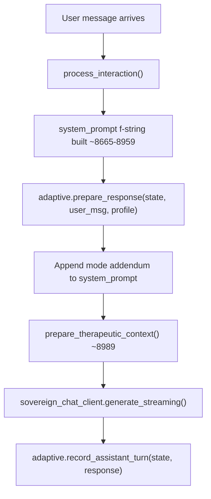

# Adaptive Mode System for Little Nate

## Architecture



## Integration Points

The system prompt is a single f-string in `bridge_server.py` (~8665-8959), then optionally enriched by `therapeutic_controller.prepare_therapeutic_context()` (~8989-8995). The adaptive mode addendum injects **between** these two steps — after the base prompt is assembled, before therapeutic preflight. This ensures mode instructions sit at the end of the base prompt where they have strong positional influence on the LLM.

Per-user state is tracked via a module-level dict keyed by `uid`, similar to the existing `_chat_session_turns` pattern at line ~226.

## Files to Create/Modify

- **NEW:** `backend/app/services/little_nate_adaptive.py` — the module provided by the user (with `user` parameter adapted to accept a profile dict instead of an ORM object)
- **MODIFY:** `backend/app/websocket/bridge_server.py` — wire in state tracking + addendum injection (~15 lines added)

## Key Decisions

- The `user` parameter in `build_system_addendum` becomes the bridge's `profile` dict. Coach name resolves from `profile.get("assigned_coach", "your coach")`.
- `SessionState` is stored in a module-level `_adaptive_states: dict[str, SessionState] = {}` in `bridge_server.py`, keyed by `uid`.
- `recent_assistant_msgs` is populated from `_final_response` after post-processing (at ~9449+), keeping only last 5 to bound memory.
- `recent_user_msgs` is populated from `user_text` at entry to `process_interaction`.
- Handoff mode surfaces a coach offer via an additional `should_offer_coach_ui` flag returned to the client alongside the response (existing `_send` mechanism with a `metadata` field).

## Gap Mitigations (Pre-flight)

### G1. State eviction — TTL-based

`SessionState` gains a `last_touched_ts: float = field(default_factory=time.time)` field. `_adaptive_states` is swept on every 50th interaction (counter at module scope); entries with `now - last_touched_ts > 7200` (2 hours idle) are dropped. Also cleared explicitly in `AzureCortex.unregister()`. Avoids slow leak on long-lived bridge processes while preserving state across normal websocket reconnects (which happen in seconds, not hours).

### G2. Concurrency on state dict

Per-uid `asyncio.Lock` stored in a parallel `_adaptive_locks: dict[str, asyncio.Lock] = {}`. The block around `prepare_response()` + the eventual `record_assistant_turn()` runs under that lock. Lock created lazily on first interaction, dropped during the same TTL sweep. Double-tap-send is rare but the lock prevents counter corruption when it happens.

### G3. _SP_CAP cannot silently eat the addendum

**Reserve headroom first.** Before appending, compute `_ADDENDUM_RESERVE = 2000` chars. If `len(system_prompt) > _SP_CAP - _ADDENDUM_RESERVE`, trim the **base** prompt to that size (preserving the start, dropping middle-context blocks like `pg_history_context` first). Then append the addendum. This guarantees the mode instruction is always present at exactly the moments (long sessions) where mode-switching matters most.

### G4. Handoff UI delivery — backend + client land together

Backend sends `metadata: {"offer_coach_handoff": true, "coach_name": "<name>"}` alongside `nate_response`. **Verify** `mobile/lib/updated_screens.dart` chat handler reads this field; if not, add a minimal renderer that shows a "Reach out to {coach_name}" tappable chip below the bubble. If the client change can't ship in the same release, gate the handoff mode behind `ENABLE_ADAPTIVE_HANDOFF_UI=false` and only let it set the prose addendum — don't half-ship.

### G5. Regex calibration — trace before trusting

The user-provided patterns are tuned to example phrases, not the actual transcripts. Specifically:
- `ACTION_REQUEST_PHRASES` does NOT currently match "tell me why" or "give me a list of reasons" — Kristy's clearest action requests would NOT trip the detector as-shipped.
- Expansion needed: add `r"\btell me (why|how|what|the reason)"`, `r"\bgive me (a |some |any )?(list|reasons|breakdown)"`, `r"\bexplain (why|how|what)\b"`, `r"\bwhat (are|is) (the )?reason"`.

Before shipping, run all turns from both transcripts through `select_mode()` and log the firing signals per turn. Expected outcomes (these are the calibration acceptance test):
- Kristy 7:18 AM "give me a list of reasons" → `mismatch` fires → exploratory
- Kristy 7:22 AM (long disclosure, no action request) → stays reflective (correct)
- Margie 1st "next steps" message → `mismatch` fires → exploratory
- Margie "repetitive...circular...going nowhere" → `dissatisfaction` fires → strategic

If any expected firing point misses, expand patterns until it hits. Document the trace in a comment block at the bottom of `little_nate_adaptive.py` so future regex changes can be re-validated.

### G6. Neurodivergent-communication accommodation (NEW MODE — ships with this PR)

Kristy's transcript explicitly named "processing disorder," "learning disabilities," and described the masking-and-exhaustion cycle plus a classic "everyone speaks a language I don't" social-cognition framing. These are **not** distress signals — routing them to handoff is the wrong move because what these users often need is **cognitive scaffolding**, not emotional escalation. The reflective-mirroring default actively harms users with auditory/verbal processing differences: long emotionally-loaded paragraphs reflecting their content back are exactly the kind of input that's hardest to parse, then the bot asks them to introspect on it. Kristy 8:52 happened right after a dense reflective response.

**New signal class** added to `little_nate_adaptive.py`:

```python
NEURODIVERGENT_SIGNALS = [
    # Self-identification (diagnostic vocabulary)
    r"\bprocessing disorder\b",
    r"\blearning disabilit(y|ies)\b",
    r"\bauditory processing\b",
    r"\bADHD\b",
    r"\bautis(m|tic)\b",
    r"\bdyslexi(a|c)\b",
    r"\bsensory (overload|processing|issues)\b",
    r"\bneurodivergent\b",
    # Cognitive-load descriptors
    r"\bscatters? (my|all) thoughts\b",
    r"\bthoughts (are )?jumbled\b",
    r"\bcan'?t find (my |the )?words\b",
    r"\blose my train of thought\b",
    r"\bmind goes blank\b",
    r"\bcan'?t process\b",
    r"\btoo much (input|information|going on)\b",
    # Masking-and-exhaustion
    r"\btrying (so |really )?hard to\b.{0,40}(right|fit in|understand|say)",
    r"\bsay(ing)? the wrong thing\b",
    r"\bwalking on eggshells\b",
    r"\bnever know (what|how) to\b",
    r"\beveryone else (seems|knows|gets|understands)\b",
    # "Language I don't speak" framing
    r"\blike (everyone|they all) speak\b",
    r"\bdon'?t (know|understand) the (rules|language|code)\b",
    r"\bmiss(ing|ed) (something|cues|signals)\b",
    r"\bsupposed to (know|understand)\b",
]
```

**New `Mode`:** `"accommodating"` added to the Literal. Detection runs alongside the others and has **priority just below `dissatisfaction`** — above `distress`, because distress→handoff is the wrong route for these users.

**New addendum** (verbatim into `MODE_ADDENDA`):

```
Mode: ACCOMMODATING. The user has indicated processing differences,
cognitive load, or difficulty with neurotypical conversational
patterns. Adjust your communication style:

- Use shorter responses. One idea per paragraph.
- Be concrete and literal. Avoid metaphor, indirection, or
  "reading between the lines."
- Do NOT ask open-ended questions like "what's coming up for you."
  Ask specific yes/no or pick-one questions if you ask at all.
- When the user struggles to articulate, offer language options:
  "Does it feel more like X or more like Y? Or something else?"
- If the user has shared a long, scattered message, do NOT mirror
  it back at length. Pick the one thread that seems most central
  and ask if that's what they want to focus on.
- Validate the experience of processing difficulty without trying
  to fix it. "That sounds exhausting" is more useful than
  "let's explore what's underneath that."
- If they ask for a list, give a list. Numbered. Concrete.
```

**State stickiness:** Once `accommodating` mode fires from a self-identification signal (`processing disorder`, `ADHD`, etc.), it persists for the rest of the session — these are stable cognitive traits, not state. Add `state.accommodating_locked: bool = False` field; once True, `select_mode()` returns `accommodating` unless the user explicitly asks for action (mismatch) or strategic options.

**Updated priority** in `select_mode()`:
1. `dissatisfaction` → strategic (user explicitly called out the pattern)
2. `accommodating_locked` OR new `neurodivergent` signal → accommodating
3. `distress` → handoff
4. `mismatch` → exploratory
5. `rut` → exploratory
6. else → keep current mode

**Calibration acceptance test addition:**
- Kristy 7:31 AM "my processing disorder scatters all my thoughts" → fires `neurodivergent` self-id + cognitive-load → switches to accommodating AND sets `accommodating_locked = True`
- Kristy 8:52 AM "like asking me to speak a language everyone else seems to know" → fires `neurodivergent` masking + language pattern → stays accommodating (already locked)
- All Kristy turns after 7:31 should be in accommodating mode regardless of other signals (unless dissatisfaction fires)

### G7. Default-mode framing (follow-up, not this PR)

The base system prompt weights heavily toward reflective mirroring. The adaptive layer corrects after the fact, which means conversations start in the wrong mode for many users. **Follow-up ticket:** detect initial request shape on turn 1-2 (does the first message contain action language, problem-framing, or pure emotion?) and set `state.current_mode` accordingly instead of always defaulting to reflective. Add a `# TODO: turn-1 initial mode detection` comment near `SessionState.current_mode` so it's visible.

## Kristy/Margie Transcript Analysis (Corrected)

- **Kristy 7:18 AM "give me a list of reasons"** → requires expanded `ACTION_REQUEST_PHRASES` (currently misses); after expansion, fires `mismatch` → exploratory mode would offer 2-3 framings instead of more open questions.
- **Kristy 7:31 AM "my processing disorder scatters all my thoughts"** → fires `neurodivergent` (self-id + cognitive-load) → switches to `accommodating` and locks for rest of session. This is the most important fix in this PR — every subsequent reflective-mirror response from Nate was actively counter-therapeutic for Kristy.
- **Kristy 8:52 AM** → garbled output (fixed by prior deploy). The dense reflective response that preceded it would not have happened under `accommodating` mode (shorter responses, no "what's coming up for you").
- **Margie "Are you not able to help me figure out next steps?"** → matches existing `r"\bhelp me (figure|decide|choose|find|understand)\b"` → `mismatch` fires → exploratory.
- **Margie "That feels repetitive...circular...going nowhere"** → matches `DISSATISFACTION_PHRASES` → `strategic` mode → concrete options instead of more mirroring.
