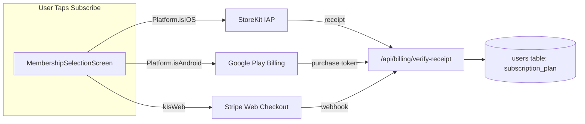
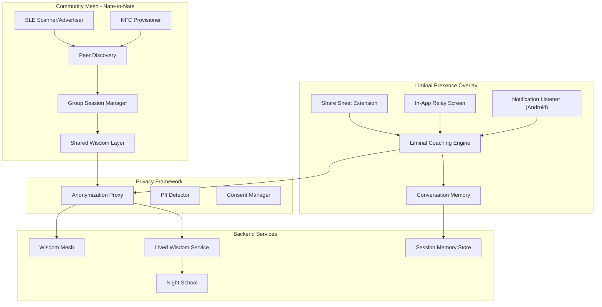
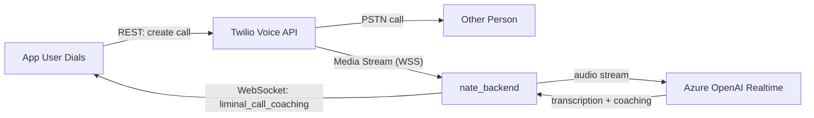

# App Store Launch Build

## 1. In-App Purchase — StoreKit + Google Play Billing (alongside Stripe)

### Strategy

Apple requires all digital subscriptions purchased within an iOS app to use StoreKit. Google Play has a similar requirement. Stripe remains for web purchases. The app detects platform and routes accordingly.




### Files to Create/Modify

- **Add to `pubspec.yaml**`: `in_app_purchase: ^3.2.0`
- **Create `mobile/lib/services/payment_service.dart**`: Platform-aware payment abstraction
  - `PaymentService.purchase(planKey)` routes to StoreKit, Google Play, or Stripe based on platform
  - Handles purchase lifecycle: initiate, verify, restore
  - Product IDs: `sanctuary_inner_chamber_monthly`, `sanctuary_inner_chamber_annual`, `sanctuary_sovereign_circle_monthly`, `sanctuary_sovereign_circle_annual`
- **Modify [mobile/lib/screens/billing_screens.dart**](mobile/lib/screens/billing_screens.dart): Replace direct Stripe checkout calls with `PaymentService.purchase()`. Keep tier cards, comparison UI, and coaching pack flow (packs stay Stripe-only via web redirect since they're consumables, or can be StoreKit consumables).
- **Create `backend/app/routers/receipt_validation.py**`: New endpoint `POST /api/billing/verify-receipt` that validates Apple/Google receipts server-side, updates `users.subscription_plan`, and logs to `skyeye_activity`.
- **Apple App Store Connect**: Create subscription products (4 total: 2 tiers x monthly/annual). Set up Subscription Group "Sovereign Sanctuary".
- **Google Play Console**: Create subscription products with same IDs.

### Coaching Packs

Coaching packs ($175, $600, $1120) are one-time purchases. These can be:

- StoreKit **consumable** in-app purchases on iOS
- Google Play **one-time products** on Android
- Stripe checkout on web (unchanged)

---

## 2. NSFaceIDUsageDescription (iOS Info.plist Fix)

Add to [mobile/ios/Runner/Info.plist](mobile/ios/Runner/Info.plist):

```xml
<key>NSFaceIDUsageDescription</key>
<string>Sovereign Sanctuary uses Face ID to protect your therapeutic data and authenticate sensitive actions.</string>
```

The app already imports `local_auth` and uses biometric auth. Without this key, iOS will crash on FaceID prompt.

---

## 3. Encryption Export Compliance Fix

In [mobile/ios/Runner/Info.plist](mobile/ios/Runner/Info.plist), change:

```xml
<key>ITSAppUsesNonExemptEncryption</key>
<false/>
```

And remove the empty `ITSEncryptionExportComplianceCode` key. The app only uses standard HTTPS/TLS (exempt encryption). No custom cryptographic algorithms are exported.

---

## 4. Android targetSdk 35

In [mobile/android/app/build.gradle](mobile/android/app/build.gradle), update:

```groovy
compileSdk = 35
targetSdk = 35
```

Google Play requires targetSdk 35 for new app submissions as of August 2025. Verify no breaking changes from SDK 34 to 35 (primarily predictive back gesture and edge-to-edge enforcement).

---

## 5. Privacy Policy URL

Create a standalone web page at `https://sovereignsanctuary.net/privacy` by deploying an HTML file to the production nginx server.

- **Create `dashboard/privacy.html**`: Extract the legal text already in [mobile/lib/screens/settings_screen.dart](mobile/lib/screens/settings_screen.dart) (sections 1-21+ of `_LegalAgreementScreen`) into a styled HTML page matching the Sovereign Sanctuary design system (dark background #050505, gold #C9A962 accents, Cormorant Garamond headings, DM Sans body).
- **Deploy** to `/var/www/sovereignsanctuary-web/privacy.html`
- **Add nginx location** block for `/privacy` to serve the file
- This URL goes into both App Store Connect and Google Play Console listings.

---

## 7. Data Export ("Download My Data")

Add a "Download My Data" option to the Settings screen for both client and coach portals.

- **Backend**: Create `GET /api/users/{user_id}/data-export` in a new or existing router. This endpoint gathers:
  - Profile data (anonymized IDs, tier, consent version)
  - Session summaries (not raw transcripts — those are PHI)
  - Coherence metrics history
  - Wisdom extractions attributed to the user
  - Social memory entries
  - Billing history
  - Returns as a JSON download or triggers an email with a secure download link
- **Frontend**: Add to [mobile/lib/screens/settings_screen.dart](mobile/lib/screens/settings_screen.dart) in the "LEGAL & PRIVACY" section:
  - "Download My Data" action row
  - Confirmation dialog explaining what's included
  - Progress indicator while export is prepared
  - Opens share sheet with exported file or shows "check your email" message

---

## 9. Clean Backup Files + 11. Gitignore Without Trust Loss

Add to `.gitignore`:

```
mobile/lib/*.backup*
mobile/lib/**/*.backup*
```

These `.backup` files are development artifacts and do not affect the 66/66 service health, 251/251 trust checks, or any auditor. The auditors test backend endpoints and services — they do not inspect the mobile source tree. No trust impact.

---

## 10. Nate-to-Nate Community Mesh + Liminal Presence Overlay

This is the largest feature. It has two interconnected sub-features that share a privacy framework and lived wisdom infrastructure.

### Architecture Overview




### 10A. Community Mesh (Nate-to-Nate BLE/NFC)

**Concept**: Users' Little Nates connect via BLE/NFC in physical proximity (AA meetings, SA groups, therapy groups). Each Nate shares anonymized emotional resonance and community wisdom — never PII, names, or session content.

**Tier gating**: Available to TRIAL + STANDARD + TOP_TIER (all client tiers). NOT available to COACH_ONLY accounts.

**What Nates Share (Anonymized)**:

- Quakete resonance signals (emotional state without content)
- Community wisdom topics ("boundaries", "forgiveness", "sobriety milestones") — no names attached
- Group momentum metrics (how many Nates present, aggregate emotional trend)
- Anonymous check-in signals ("I'm here, I'm struggling" / "I'm here, I'm strong today")

**What Nates NEVER Share**:

- User names, PII, or identifiers
- Session transcripts or coaching content
- Specific personal stories or details
- Health data (C_emo scores, voice biometrics)

#### Files to Create (Mobile)

- `**mobile/lib/screens/community_mesh_screen.dart**`: Main UI
  - "Start Group Session" button (begins BLE advertising + scanning)
  - Peer discovery list (shows anonymous Nate avatars, e.g., "Nate-7F3A")
  - Group circle visualization (animated ring showing connected Nates)
  - Community check-in prompt (user selects mood/state for anonymous sharing)
  - Group wisdom feed (anonymized insights surfaced by connected Nates)
  - "End Session" button (stops mesh, stores session summary locally)
  - Tier gate check: `_canUseCommunityMesh()` returns true for TRIAL, STANDARD, TOP_TIER clients
- `**mobile/lib/services/community_mesh_service.dart**`: Mesh orchestration
  - Uses existing `BleScanner`, `BleAdvertiser`, `FibreIdentity` from ZEFCP
  - Implements Nate-to-Nate discovery protocol (new service UUID for community mesh)
  - Manages group session state machine: IDLE, DISCOVERING, FORMING, ACTIVE, CLOSING
  - Handles message exchange via BLE fragments (reuses `FragmentBuffer`)
  - Offline buffer integration for storing session data when connectivity drops
  - Privacy enforcement: runs `PIIDetector` on any outgoing data, strips all identifiers
- `**mobile/lib/services/community_wisdom_service.dart**`: Wisdom aggregation
  - Collects anonymized insights from group
  - Merges with user's personal lived wisdom
  - Sends aggregated community learnings to backend via `MeshBridge` when online
  - Stores locally in `OfflineBuffer` when offline

#### Files to Create (Backend)

- `**backend/app/services/community_mesh_engine.py**`: Server-side group wisdom
  - Receives anonymized community mesh data from multiple users
  - Runs convergence detection (from existing `WisdomMesh`) across community sessions
  - Stores community wisdom in new `community_wisdom` table
  - Never stores which users participated — only anonymous insight data
  - Feeds convergence discoveries into Night School for global learning
- `**backend/migrations/061_community_mesh.sql**`: New tables
  - `community_sessions` — group session metadata (session_id, start_time, end_time, peer_count, topic_tags, momentum_score, location_lat DOUBLE, location_lng DOUBLE, location_name VARCHAR, group_name VARCHAR, manager_user_id UUID)
  - `community_wisdom` — aggregated anonymous insights (topic, insight_text, convergence_count, source_session_count, location_name, created_at)
  - `community_check_ins` — mood signals WITH attendance proof (session_id, user_id, check_in_time TIMESTAMPTZ, check_out_time TIMESTAMPTZ, mood_valence, location_lat, location_lng, location_name, verified BOOLEAN DEFAULT FALSE)
  - `community_attendance_records` — exportable attendance log (session_id, user_id, display_name, check_in_time, check_out_time, location_name, group_name, session_date DATE, duration_minutes INT, verified_by_manager BOOLEAN DEFAULT FALSE, signature_b64 TEXT)

#### Attendance / Proof-of-Presence Feature

This sub-feature allows community mesh sessions to serve as verifiable attendance records for probation officers, court orders, or judicial requests (e.g., court-ordered AA/SA meeting attendance).

**Group Manager Role**:

- Any user can create a group session and become the "group manager" for that session
- Manager can "Take Attendance" — sees list of connected Nates with opt-in display names
- Manager can mark members as "verified present" (tap to confirm)
- Manager can export the full attendance sheet as PDF/CSV or email it

**User Attendance Record**:

- Each user's attendance is logged with: date, time in, time out, location (GPS + user-provided name like "St. Mary's Church"), group name, duration, manager verification status
- Users can export their own attendance history via Settings or the Community Mesh screen
- Export formats: PDF (formatted for court/PO submission), CSV, or email directly to a specified address (e.g., probation officer email)
- Each record includes a cryptographic signature (Ed25519 from the user's FibreIdentity) as tamper-evidence

**Privacy balance**: The `community_check_ins` and `community_attendance_records` tables store user_id for attendance tracking (user opts in to attendance mode). The `community_wisdom` and emotional resonance data remain fully anonymous. Users choose whether to participate in attendance tracking — it is NOT automatic.

**Files to add**:

- `**mobile/lib/screens/attendance_export_screen.dart**`: Attendance history view with date range filter + export (PDF/CSV/email share sheet)
- `**backend/app/routers/community_api.py**`: REST endpoints — `GET /api/community/attendance/{user_id}?format=pdf&from=2026-01-01&to=2026-02-22`, `POST /api/community/attendance/email` (sends PDF to specified email via SendGrid)
- Modify `community_mesh_screen.dart`: "Take Attendance" button for group managers, attendance opt-in toggle for members, location permission request

#### Existing Infrastructure Reused

- `FibreIdentity` for cryptographic identity (Ed25519 keypairs)
- `BleScanner` / `BleAdvertiser` for physical transport
- `FragmentBuffer` for message assembly
- `OfflineBuffer` for offline-first storage
- `MeshBridge` for backend forwarding
- `QuaketeStateMachine` for emotional resonance signals
- `TrailEmitter` for broadcasting emotional trails
- `WisdomMesh` convergence detection for cross-user insight discovery
- `PIIDetector` for privacy enforcement

### 10B. Liminal Presence Overlay

**Concept**: Little Nate sits alongside the user's external conversations (SMS, Facebook Messenger, LinkedIn, X, Instagram) as an invisible coaching companion. He observes, learns the user's communication patterns, and offers coaching when asked — without ever storing the other person's data.

**Four access methods** (combined approach per user selection):

1. **Share Sheet** (iOS + Android): User highlights text in any messaging app, taps Share > Little Nate. Conversation snippet sent to Nate for coaching.
2. **In-App Relay** (iOS + Android): Dedicated "Companion Chat" screen where user copy-pastes or screenshots conversations. Nate coaches in split-screen view.
3. **Notification Listener** (Android only): Nate reads incoming message notifications to build context passively. iOS fallback: Share Sheet only.
4. **Live Call Coaching** (iOS + Android): User initiates phone calls THROUGH the Little Nate app via Twilio Programmable Voice. Twilio streams audio to Azure OpenAI Realtime API. Little Nate listens to both sides and coaches the app-user in real-time via text overlay during the call. Also supports "debrief after call" mode. **This method is token-charged** — per-minute Twilio Voice costs + Azure Realtime API usage are deducted from the user's token balance.

**Tier gating**: Same as Community Mesh — all paid client tiers + trial. Live Call Coaching is available to all paid tiers but **consumes tokens at an elevated rate** (~50 tokens/minute for Twilio + Azure streaming).

**Privacy rules**:

- Little Nate stores ONLY the app-user's side of conversations and their own observations
- Non-app-user names are stored only if the app-user mentions them ("bring up that conversation with XYZ")
- No PII of non-app-users is sent to the backend — all processing happens on-device or via anonymized context
- The user explicitly selects which platforms to enable (opt-in per platform)

#### Files to Create (Mobile)

- `**mobile/lib/screens/liminal_presence_screen.dart**`: Main hub
  - Platform selector (toggles for SMS, Facebook Messenger, LinkedIn DMs, X DMs, Instagram DMs)
  - Active conversations list (shows recent conversations Nate has observed)
  - "Bring up conversation with [name]" search/recall
  - Split-screen coaching view: left side shows conversation context, right side shows Nate's coaching
  - Settings: notification listener toggle (Android), share sheet instructions (iOS)
- `**mobile/lib/screens/companion_chat_screen.dart**`: In-App Relay
  - Split-screen layout: top half for pasting/viewing external conversation, bottom half for Nate's coaching
  - "Paste Conversation" button + text input area
  - Screenshot import via `file_picker` (OCR optional, or user describes what happened)
  - Real-time coaching: as user adds conversation context, Nate offers observations
  - "What should I say?" quick action — Nate drafts a response suggestion
  - "What are they really saying?" — Nate interprets subtext
  - "Is this abusive language?" — Nate flags concerning patterns
  - Session history: user can recall past companion chat sessions
- `**mobile/lib/services/liminal_presence_service.dart**`: Core service
  - Manages platform connections (which platforms are enabled)
  - Processes incoming conversation data from all three methods (share sheet, relay, notifications)
  - Runs local anonymization (strips non-app-user PII before backend processing)
  - Maintains conversation memory (per-contact, keyed by user-provided name)
  - Integrates with existing coaching patterns (`sanctuary_coaching_*` style WebSocket messages)
  - Sends anonymized interaction summaries to backend for lived wisdom extraction
- **iOS Share Extension** (`mobile/ios/LittleNateShare/`):
  - Native iOS Share Extension that receives text from any app
  - Passes selected text to the main app via App Groups shared container
  - Minimal UI: "Sent to Little Nate" confirmation
- **Android Share Target** (already supported via Flutter's share intent handling):
  - Register as share target in `AndroidManifest.xml` for `text/plain`
  - Route shared text to `LiminalPresenceService`
- `**mobile/lib/services/notification_listener_service.dart**` (Android only):
  - Uses Android `NotificationListenerService` via platform channel
  - Captures incoming message notifications from selected apps
  - Extracts sender name + message preview
  - Feeds to `LiminalPresenceService` for passive context building
  - User must explicitly grant notification access in Android settings
  - iOS: not available — shows guidance to use Share Sheet instead
- `**mobile/lib/screens/live_call_screen.dart**`: Twilio-powered call coaching
  - Dialer UI or contact picker to initiate call through Little Nate
  - Active call screen: call timer, mute/speaker buttons, and Nate's coaching panel below
  - Nate's coaching appears as scrolling text cards during the call (real-time interpretation)
  - Quick action buttons: "What do they mean?", "Help me respond", "Is this healthy?"
  - Post-call debrief: summary of the conversation + coaching notes
  - Token cost estimator shown before call: "This call will use ~X tokens/minute"
  - FaceTime/video not routed through Twilio (Apple restriction) — video calls use the In-App Relay debrief flow instead
- `**mobile/lib/services/twilio_call_service.dart**`: Twilio Voice client
  - Initiates outbound calls via Twilio Programmable Voice (REST API through backend)
  - Receives call audio stream via Twilio Media Streams (WebSocket)
  - Forwards audio stream to Azure OpenAI Realtime API for transcription + coaching
  - Tracks call duration for token billing
  - Handles call lifecycle: ringing, connected, ended, failed
  - Token deduction: calls `deduct_tokens()` per minute based on call duration

#### Files to Create (Backend)

- `**backend/app/services/liminal_coaching_engine.py**`: Coaching AI for external conversations
  - Receives anonymized conversation context from app-user
  - Uses existing Azure OpenAI integration (same pattern as `process_private_coaching`)
  - System prompt emphasizes: interpret subtext, flag abusive patterns, suggest healthy responses, maintain liminal presence
  - Pulls from user's lived wisdom and session history for personalized coaching
  - Never stores non-app-user data in identifiable form
- **New WebSocket message types** in [backend/app/websocket/bridge_server.py](backend/app/websocket/bridge_server.py):
  - `liminal_context_update` — app-user sends conversation snippet
  - `liminal_coaching_request` — app-user asks for coaching
  - `liminal_coaching_response` — Nate's coaching reply
  - `liminal_recall_request` — "bring up that conversation with XYZ"
  - `liminal_recall_response` — Nate retrieves past conversation context
- `**backend/migrations/062_liminal_presence.sql**`: New tables
  - `liminal_sessions` — user_id, platform, started_at, contact_alias (user-provided), message_count
  - `liminal_observations` — session_id, observation_text (Nate's notes about user's communication patterns), coaching_given
- **Modify** [backend/app/services/lived_wisdom.py](backend/app/services/lived_wisdom.py): Add `extract_liminal_wisdom()` that extracts communication pattern insights from liminal sessions (e.g., "user tends to over-apologize", "user struggles with boundary-setting in close friendships").

#### Twilio Voice Infrastructure (New — for Live Call Coaching)

Twilio Programmable Voice is NOT currently implemented. This is new infrastructure.




- `**backend/app/routers/twilio_voice.py**`: New router
  - `POST /api/calls/initiate` — Creates outbound call via Twilio, returns call SID. Requires user auth + token balance check.
  - `POST /api/calls/twiml` — TwiML webhook that Twilio calls to get instructions. Returns `<Stream>` directive pointing to our Media Stream WebSocket endpoint.
  - `POST /api/calls/status` — Call status webhook (ringing, in-progress, completed). Triggers token deduction on completion based on duration.
  - `GET /api/calls/history/{user_id}` — Call history for the user
- `**backend/app/services/call_coaching_engine.py**`: Media Stream processor
  - Receives Twilio Media Stream WebSocket (raw audio from both call legs)
  - Forwards to Azure OpenAI Realtime API for live transcription
  - Generates coaching observations in real-time
  - Sends coaching via WebSocket to the app-user's connected session (`liminal_call_coaching` message type)
  - Stores call summary + coaching notes in `liminal_sessions` after call ends
- **Token billing for calls**:
  - Twilio Voice: ~$0.014/min outbound + ~$0.004/min for Media Streams
  - Azure Realtime: ~$0.06/min for audio processing
  - Combined: ~$0.08/min → mapped to ~50 tokens/minute
  - Token check before call initiation; call rejected if insufficient balance
  - Real-time token deduction every 60 seconds during active call
  - Final adjustment on call end (actual duration vs estimated)
- **New `.env` variables**:
  - `TWILIO_VOICE_APP_SID` — TwiML Application SID
  - `TWILIO_CALL_WEBHOOK_URL` — Public URL for TwiML/status webhooks
  - `TWILIO_MEDIA_STREAM_URL` — WSS endpoint for Media Streams
  - `LIMINAL_CALL_TOKEN_RATE` — tokens per minute (default: 50)
- **Migration 062 addition**: Add to `liminal_sessions` table:
  - `call_sid VARCHAR(64)` — Twilio Call SID
  - `call_duration_seconds INTEGER` — actual call length
  - `tokens_consumed INTEGER` — tokens charged for the call
  - `call_type VARCHAR(16)` — 'voice' or 'debrief'

### 10C. DOJO Mentor Presence — Little Nate in Zoom Sessions (Coach Portal)

**Concept**: When a coach conducts a live Zoom session with a client (or students, or opposing counsel in Judge DOJO), Little Nate appears as a **coach-only pop-up overlay** — visible and audible only to the coach. Little Nate blends ALL of the coach's active DOJO subscriptions into a single Master-Level mentor persona and provides real-time guidance during the session.

**Key behaviors**:

- Little Nate already knows the client (session history, coherence metrics, lived wisdom, patterns, triggers) — he brings this context into the mentorship
- He monitors the Zoom audio stream and provides real-time coaching cards to the coach
- He does NOT speak into the Zoom call — he only communicates to the coach via the pop-up overlay
- The coach can ask Little Nate questions during the session via text input in the overlay
- The coach can toggle which DOJO lenses are active mid-session

**Multi-DOJO Blending Examples**:

- **Therapist only** → Master-Level Clinical Supervisor and Psychiatrist mentor
- **Therapist + Judge** → Therapeutic guidance with family law perspective (custody, DV dynamics, court-ordered treatment compliance)
- **Business + Judge** → Master-Level Business Law Judge (contract disputes, corporate governance, regulatory compliance)
- **Business + Therapist** → Industrial Psychology / Organizational Psychology mentor (workplace dynamics, leadership psychology, team pathology)
- **MCAT + Business** → Master-Level Hospitalist / Medical Director with business acumen (practice management, clinical decision-making, healthcare operations)
- **Therapist + CNC** → Vocational rehabilitation + therapeutic guidance (helping clients find meaning through skilled trades)
- **All 7 DOJOs** → Little Nate synthesizes all disciplines into a polymath mentor, prioritizing the most relevant lens for each moment

**Session modes**:

1. **Coach + Client** (standard) — Little Nate mentors the coach while they work with their client. Nate sees the full client history.
2. **Coach + Students** (teaching) — Little Nate mentors the coach as an instructor, providing pedagogical guidance and subject-matter expertise.
3. **Judge DOJO: Two Lawyers Debating** — Little Nate serves as the presiding Judge in a joint Zoom call. Two coaches (lawyers) argue opposing sides. Nate evaluates arguments, asks probing questions, and renders analysis.
4. **Lawyer + Client** — Little Nate acts as an Expert-Level Legal Assistant to the lawyer/coach, providing case law references, procedural guidance, and strategic counsel.

#### Files to Create (Mobile)

- `**mobile/lib/screens/dojo_mentor_overlay.dart**`: Floating pop-up overlay
  - Implemented as a draggable, resizable floating panel (Flutter `Overlay` widget)
  - Appears on top of the Zoom WebView/iframe during live sessions
  - Shows Little Nate's coaching cards (scrolling text feed, real-time)
  - DOJO selector chips at the top — coach taps to toggle active DOJO lenses (therapist, judge, business, etc.)
  - Quick action buttons: "What should I ask?", "Risk assessment", "Client pattern alert", "Summarize so far"
  - Text input at bottom for coach to ask Nate questions mid-session
  - Minimize button (shrinks to small floating Nate avatar icon)
  - Session recording consent indicator
  - Only visible to coach — never rendered in the Zoom stream
- `**mobile/lib/services/dojo_mentor_service.dart**`: Mentor orchestration
  - Queries coach's active DOJO subscriptions from `profile_data["dojo_subscriptions"]`
  - Builds blended mentor persona dynamically based on active DOJOs
  - Connects to Zoom audio stream (via Twilio Media Streams or Zoom SDK raw audio) for real-time transcription
  - Sends transcribed audio + client context to backend for mentor response generation
  - Manages session state: pre-session briefing, active mentoring, post-session debrief
  - Handles multi-party sessions (coach + client, coach + students, lawyer vs lawyer)
- **Modify `mobile/lib/screens/coach_portal_v2_complete.dart**`: Add "Start DOJO-Mentored Session" option alongside existing "Start Live Session". This creates the Zoom meeting AND activates the mentor overlay.

#### Files to Create (Backend)

- `**backend/app/services/dojo_mentor_engine.py**`: Multi-DOJO mentor AI
  - Core function: `build_mentor_system_prompt(active_dojos: List[str], client_context: Dict) -> str`
  - Dynamically constructs a blended system prompt based on which DOJOs are active
  - DOJO persona definitions (master level for each):
    - `therapist` → "You are a Master-Level Clinical Supervisor with 30+ years experience, board-certified psychiatrist..."
    - `judge` → "You are a Senior Federal Judge with expertise in constitutional law, family law, criminal procedure..."
    - `business` → "You are a Fortune 500 CEO-turned-advisor with deep expertise in strategy, finance, operations..."
    - `mcat` → "You are an attending physician and medical school professor with board certifications in internal medicine..."
    - `cnc` → "You are a Master Machinist and manufacturing engineer with 25+ years in precision CNC..."
    - `teacher` → "You are a National Board Certified Teacher and education researcher..."
    - `project_pm` → "You are a PMP-certified Program Director with expertise in Agile, Lean, and enterprise transformation..."
  - Blending logic: combines persona fragments intelligently, resolving conflicts (e.g., therapist empathy + judge objectivity → "empathetic but legally precise")
  - Pulls client context: session history, coherence metrics, pattern detections, growth trajectory, lived wisdom
  - Uses Azure OpenAI Chat Completions (same pattern as `skyeye_chat.py`) for mentor responses
  - Streams responses via WebSocket to coach's overlay
- **New WebSocket message types** in [backend/app/websocket/bridge_server.py](backend/app/websocket/bridge_server.py):
  - `dojo_mentor_start` — coach starts mentored session (includes active_dojos[], client_id, session_mode)
  - `dojo_mentor_transcript` — real-time transcript chunk from Zoom audio
  - `dojo_mentor_ask` — coach asks Nate a direct question during session
  - `dojo_mentor_response` — Nate's mentoring card (observation, suggestion, or answer)
  - `dojo_mentor_toggle_dojo` — coach activates/deactivates a DOJO lens mid-session
  - `dojo_mentor_end` — session ends, triggers post-session analysis
- `**backend/app/services/dojo_mentor_zoom.py**`: Zoom audio integration
  - Creates Zoom meeting with Zoom API (reuses existing `zoom_client.py`)
  - Configures Zoom raw audio streaming OR uses Twilio as audio bridge (dial into Zoom via Twilio, capture Media Stream)
  - Forwards audio to Azure OpenAI Realtime for transcription
  - Routes transcripts to `dojo_mentor_engine.py` for mentor response generation
- **Migration 063 addition** (`backend/migrations/063_dojo_mentor.sql`):
  - `dojo_mentor_sessions` — session_id, coach_user_id, client_user_id (nullable for student/debate sessions), session_mode ('coach_client' | 'coach_students' | 'judge_debate' | 'lawyer_client'), active_dojos JSONB, zoom_meeting_id, started_at, ended_at, mentor_interactions_count
  - `dojo_mentor_interactions` — session_id, timestamp, interaction_type ('observation' | 'suggestion' | 'answer' | 'alert'), content, dojo_lens (which DOJO triggered this), coach_question (nullable)

#### Token Billing

- DOJO Mentor sessions consume tokens at the same rate as regular AI coaching (~10 tokens/word for responses)
- Zoom audio transcription: ~30 tokens/minute (Azure Realtime API)
- Coaches using DOJO Mentor are already paying for DOJO subscriptions ($150-$2,100/mo per DOJO), so base mentoring is included
- Extended sessions beyond the tier's included AI minutes are token-charged

#### Judge DOJO Special Modes

- **Debate mode**: Two coaches join the same Zoom call. Each is assigned a side. Little Nate acts as Judge — evaluates arguments, asks questions, and provides a ruling with reasoning. Both coaches see their own mentor overlay but Nate's Judge responses are shared.
- **Mentoring mode**: Existing Zoom mentoring flow enhanced with the pop-up overlay. Senior coach mentors junior coach with Little Nate providing master-level guidance to both.

### Shared Privacy Framework

All three features (Community Mesh, Liminal Presence, DOJO Mentor) share a consent and privacy framework:

- **Consent screen** shown on first use of either feature, explaining exactly what data is shared/stored
- **Per-platform opt-in** for Liminal Presence (user chooses which messaging apps to enable)
- **Per-session opt-in** for Community Mesh (user confirms before each group session)
- **Coach consent** for DOJO Mentor — coach must acknowledge that Little Nate will observe the session. Client is informed that AI-assisted coaching is in use (per existing Terms section 5: Texas TRAIGA Disclosure).
- **PII enforcement**: All outgoing data (to backend or to other Nates) runs through `PIIDetector`
- **Non-app-user data**: Only the app-user's own words and Nate's observations are stored. Non-app-user content is processed in-memory for coaching context but never persisted in identifiable form.
- **Community wisdom**: Fully anonymous — no user IDs, no session IDs, no names. Only topic + insight text + convergence count.
- **DOJO Mentor session data**: Mentor interactions (observations, suggestions) are stored under the coach's session record. Client session data is handled per existing HIPAA rules in `clinical-agent-safety.mdc`.

### Rule Updates

- **Update [service-health-49-49.mdc**](.cursor/rules/service-health-49-49.mdc): Add `community_mesh_engine` and `dojo_mentor_engine` to core services (68/68 target after this build)
- **Create `.cursor/rules/community-mesh-privacy.mdc**`: Privacy rules for Nate-to-Nate communication, attendance tracking, data boundaries, anonymization requirements
- **Create `.cursor/rules/liminal-presence-rules.mdc**`: Privacy rules for external conversation coaching, non-app-user data handling, platform access consent, Twilio Voice token billing
- **Create `.cursor/rules/dojo-mentor-rules.mdc**`: Rules for multi-DOJO persona blending, coach-only visibility, session data handling, Judge DOJO debate mode, token billing for mentor sessions
- **Update [trust-100-percent.mdc**](.cursor/rules/trust-100-percent.mdc): Add new endpoints to appropriate auditors, update total service count

---

## Build Order

All items are independent enough to work on in sequence within a single build pass:

1. Quick fixes first (Items 2, 3, 4, 9/11) — 15 minutes
2. Privacy Policy page (Item 5) — 30 minutes
3. Data Export (Item 7) — 1-2 hours
4. In-App Purchase (Item 1) — 3-4 hours
5. Community Mesh + Attendance (Item 10A) — 8-10 hours
6. Liminal Presence Overlay + Live Call Coaching (Item 10B) — 10-12 hours
7. DOJO Mentor Presence in Zoom (Item 10C) — 8-10 hours
8. Rules and trust updates — 1 hour

