# Apple App Store Review Fix Plan

Five issues from Apple Review must be resolved. They span IAP implementation, language rebranding, metadata, and a purchase bug.

---

## Issue 1: Token Purchase Bug (Guideline 2.1b) — HIGHEST PRIORITY

The screenshots show "Purchase failed: error code: 504" and "TimeoutException after 0:00:15.000000". The token purchase flow in `settings_screen.dart` POSTs to `/api/billing/token-packs/purchase`, which calls `stripe.checkout.Session.create` synchronously inside an async handler. The 504 comes from the Cloudflare LB / nginx proxy timing out.

### Root Cause

`stripe.checkout.Session.create` is a **blocking synchronous call** inside an async FastAPI handler in [backend/app/services/stripe_integration.py](backend/app/services/stripe_integration.py) (line ~1127). Under load or slow Stripe API response, this blocks the event loop. Combined with the Cloudflare LB's origin timeout, it returns 504.

### Fix (Backend)

In [backend/app/services/stripe_integration.py](backend/app/services/stripe_integration.py), wrap the Stripe call in `asyncio.to_thread()`:

```python
session = await asyncio.to_thread(
    stripe.checkout.Session.create,
    customer=customer_id,
    mode="payment",
    ...
)
```

Do the same for `get_or_create_customer` which also calls synchronous Stripe API (`stripe.Customer.create`, `stripe.Customer.list`).

### Fix (Flutter)

In [mobile/lib/screens/settings_screen.dart](mobile/lib/screens/settings_screen.dart), increase the HTTP timeout in `_purchaseTokenPack` (currently likely using the default `http.post` timeout):

```dart
final resp = await http.post(uri, headers: headers, body: body)
    .timeout(const Duration(seconds: 30));
```

**However** — on iOS this entire Stripe flow will be replaced by IAP (Issue 3 below), so the Stripe timeout fix is primarily for Android/web.

---

## Issue 2: Price Confirmation (Guideline 3)

Apple asks to confirm $149/mo (Sovereign Circle Monthly) and $749/mo (Sovereign Sanctuary Annual). **This requires a reply in App Store Connect** — not a code change.

**Action**: Reply in App Store Connect confirming the prices are intentional, or adjust them if they're incorrect. Check the Stripe dashboard for the actual Price IDs to verify.

---

## Issue 3: Full In-App Purchase Implementation (Guideline 3.1.1)

Apple requires all digital content purchased in the app to use IAP on iOS. Currently everything uses Stripe Checkout (external browser redirect). The `isNativeIOS` guard in [mobile/lib/main.dart](mobile/lib/main.dart) hides some paid flows but **not** token purchases or coach upgrades in `settings_screen.dart`.

### Architecture

```mermaid
flowchart TD
    subgraph ios [iOS Native Path]
        A[User taps Buy Tokens] --> B[StoreKit Product Fetch]
        B --> C[Apple Payment Sheet]
        C --> D[Purchase Success]
        D --> E[Receipt Validation on Server]
        E --> F[Credit Tokens to User]
    end
    subgraph other [Android / Web Path]
        G[User taps Buy Tokens] --> H[POST /api/billing/token-packs/purchase]
        H --> I[Stripe Checkout URL]
        I --> J[External Browser]
        J --> K[Webhook Credits Tokens]
    end
```



### StoreKit Products to Create (App Store Connect)

| Product ID | Type | Price | Maps to |
|---|---|---|---|
| `ss_token_light` | Consumable | $2.99 | Light Pack (15,000 tokens) |
| `ss_token_standard` | Consumable | $6.99 | Standard Pack (50,000 tokens) |
| `ss_token_power` | Consumable | $19.99 | Power Pack (150,000 tokens) |
| `ss_token_ultimate` | Consumable | $124.99 | Ultimate Pack (1,000,000 tokens) |
| `ss_inner_chamber_monthly` | Auto-renewable | $49.00/mo | Inner Chamber Monthly |
| `ss_inner_chamber_annual` | Auto-renewable | $490.00/yr | Inner Chamber Annual |
| `ss_sovereign_circle_monthly` | Auto-renewable | $149.00/mo | Sovereign Circle Monthly |
| `ss_sovereign_circle_annual` | Auto-renewable | $749.00/yr | Sovereign Circle Annual |

DOJO subscriptions ($150-$2100/mo) should either also be created as IAP products or the "Upgrade to Coach" flow should be hidden on iOS with a note directing coaches to the web portal. Given the complexity of 7 DOJO tiers, **hiding coach upgrade on iOS** and directing coaches to `coach.sovereignsanctuary.net` is the pragmatic choice for this submission.

### Flutter Changes

**Add dependency** to `pubspec.yaml`:
```yaml
in_app_purchase: ^3.2.0
```

**Create** `mobile/lib/services/iap_service.dart` — singleton IAP service:
- Initialize `InAppPurchase.instance`
- Load products by ID
- Listen to purchase stream
- Handle `purchaseDetails.status` (purchased, restored, error)
- On successful purchase, send receipt to backend for validation
- Call `InAppPurchase.instance.completePurchase()` after server confirms

**Modify** [mobile/lib/screens/settings_screen.dart](mobile/lib/screens/settings_screen.dart):
- In `_showBuyTokensSheet`: if `isNativeIOS`, show IAP product prices from StoreKit (not hardcoded $3/$7/$20/$125) and use `IapService.purchase(productId)` instead of `_purchaseTokenPack`
- In `_requestCoachUpgrade`: if `isNativeIOS`, show a message directing coaches to the web portal instead of Stripe checkout
- The "Upgrade to Coach" section should be hidden or replaced with informational text on iOS

**Modify** [mobile/lib/screens/billing_screens.dart](mobile/lib/screens/billing_screens.dart):
- Tier subscription checkout: if `isNativeIOS`, use IAP subscription products instead of Stripe checkout
- "Change Plan" flow: use IAP on iOS

### Backend Changes

**Add** receipt validation endpoint to [backend/app/routers/billing.py](backend/app/routers/billing.py):

```python
@router.post("/apple/validate-receipt")
async def validate_apple_receipt(body: AppleReceiptRequest, request: Request):
    """Validate Apple IAP receipt and credit tokens / activate subscription."""
    # Verify receipt with Apple's /verifyReceipt endpoint
    # For consumables: credit tokens
    # For subscriptions: activate tier
    # Store transaction_id to prevent replay
```

**Add** Apple receipt validation service using Apple's App Store Server API v2 (or the `/verifyReceipt` endpoint for sandbox).

### Server-Side Notification (Subscription lifecycle)

Register an App Store Server Notifications v2 endpoint for subscription renewals, cancellations, and billing retries:

```python
@router.post("/apple/server-notification")
async def apple_server_notification(request: Request):
    """Handle Apple subscription lifecycle events."""
```

---

## Issue 4: EULA / Terms of Use Link (Guideline 3.1.2c)

Apple requires a functional Terms of Use link in **App Store metadata** (either in the app description or the EULA field in App Store Connect).

### Actions

1. **App Store Connect**: Add a custom EULA or link to `https://app.sovereignsanctuary.net/terms.html` in the EULA field
2. **App Store Connect**: Verify Privacy Policy URL field points to `https://app.sovereignsanctuary.net/privacy.html`
3. **In-app** (already exists): The settings screen's "Terms, Privacy & Waivers" opens `_LegalAgreementScreen` — this is functional. But also add explicit URL links to the hosted pages.

**Modify** [mobile/lib/screens/settings_screen.dart](mobile/lib/screens/settings_screen.dart) in the subscription display area:
- Add visible links to Terms of Use and Privacy Policy URLs
- Show subscription title, length, and price (Apple requires these to be visible in the app for auto-renewable subscriptions)

**Verify** hosted pages are accessible:
- `https://app.sovereignsanctuary.net/terms.html` — exists in [dashboard/terms.html](dashboard/terms.html)
- `https://app.sovereignsanctuary.net/privacy.html` — exists in [dashboard/privacy.html](dashboard/privacy.html)
- Fix URL inconsistency: `ai_consent_screen.dart` uses `sovereignsanctuary.net/privacy` (without `app.` prefix and without `.html`)

---

## Issue 5: Medical Language Rebranding (Guideline 1.4.1)

Apple flagged the app for providing "medical related data, health related measurements, diagnoses or treatment advice." The app needs to rebrand medical/therapy language to wellness/coaching language.

### Language Changes Required

| Current | Replacement |
|---|---|
| "AI Therapy Platform" | "AI Wellness Companion" |
| "Therapy & Growth" (Client Portal subtitle) | "Wellness & Growth" |
| "Deep diagnostic scan" (Tri-Corder) | "Deep emotional reflection" |
| "Clinical quality oversight" | "Quality oversight" |
| "Coherence Reports" | "Wellness Reports" or "Insight Reports" |
| "Reply Therapy" | "Reply Reflection" |
| "medical scanner for your inner world" (Tri-Corder FAQ) | "reflection tool for your inner world" |

### Files to Change

- [mobile/lib/main.dart](mobile/lib/main.dart) — "Therapy & Growth" lobby text (~line 7539, 7568, 8457)
- [mobile/lib/updated_screens.dart](mobile/lib/updated_screens.dart) — Tri-Corder descriptions (~1905-1908), onboarding text
- [mobile/lib/screens/settings_screen.dart](mobile/lib/screens/settings_screen.dart) — "Coherence Reports" labels (~2170-2175), Tri-Corder FAQ (~4681)
- [mobile/lib/screens/nevedal_reports_screen.dart](mobile/lib/screens/nevedal_reports_screen.dart) — "Reply Therapy" labels (~361-365, 618+)
- [mobile/pubspec.yaml](mobile/pubspec.yaml) — description field

### Strengthen Disclaimers

In `_LegalAgreementScreen` and `SovereignCovenantDoc`, ensure the disclaimer is prominent:
- "This app is a wellness and personal growth tool, not a medical device"
- "Content is for informational and self-reflection purposes only"
- "Not intended to diagnose, treat, cure, or prevent any condition"
- "If you are in crisis, call 988 or go to the nearest emergency room"

### Privacy Manifest

[mobile/ios/Runner/PrivacyInfo.xcprivacy](mobile/ios/Runner/PrivacyInfo.xcprivacy) declares "Health" data type with "Emotional coherence metrics". Consider changing the category from "Health" to a non-health category, or keeping it but ensuring the disclosure is accurate. Apple may flag "Health" data collection as requiring HealthKit framework.

---

## Deployment Sequence

1. **Immediate** (no code): Reply to Apple in App Store Connect confirming pricing (Issue 2)
2. **Code: Fix 504 timeout** on Stripe checkout (Issue 1) — wrap in `asyncio.to_thread`
3. **Code: Rebrand language** (Issue 5) — string changes across Flutter files
4. **App Store Connect**: Add EULA link and verify Privacy Policy URL (Issue 4)
5. **Code: Implement IAP** (Issue 3) — largest effort, requires:
   - Create StoreKit products in App Store Connect
   - Add `in_app_purchase` package
   - Build `IapService` class
   - Gate purchase flows by `isNativeIOS`
   - Add server-side receipt validation
   - Hide DOJO/coach-upgrade on iOS
6. **Build + Submit**: `flutter build ios`, archive in Xcode, upload to App Store Connect
7. **Reply to Apple**: Include notes explaining the changes, the wellness (not medical) nature of the app, and confirm pricing
