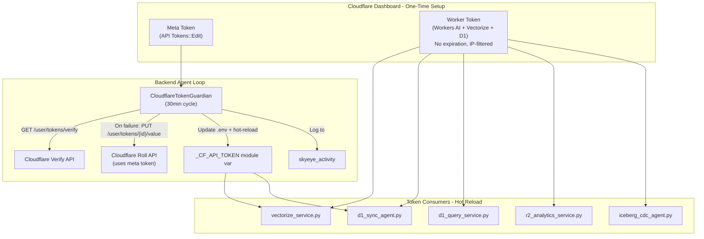

# Cloudflare API Token Automation

## Current State

- `CLOUDFLARE_API_TOKEN` is returning 401 on all Vectorize API calls
- Token is read once at import time in [vectorize_service.py](backend/app/services/vectorize_service.py) (line 39) — no way to hot-reload
- 5 services depend on it: `vectorize_service`, `d1_sync_agent`, `d1_query_service`, `r2_analytics_service`, `iceberg_cdc_agent`
- R2 storage uses separate S3-style credentials (`R2_ACCESS_KEY_ID`) — unaffected
- Token Guardian / Token Renewal Agent only handle social OAuth tokens — Cloudflare is not covered
- Vectorize Pipeline Auditor detects failures (10/12 TRUSTED) but cannot remediate

## Architecture




## Phase 1: Immediate Fix (Manual in Cloudflare Dashboard)

Create two tokens in the Cloudflare dashboard:

**Token 1 — Worker Token (non-expiring, IP-filtered)**

- Permissions: `Workers AI:Read`, `Vectorize:Edit`, `D1:Edit`, `Workers R2 Storage:Read`
- IP filter: `68.183.168.75/32` (production server only)
- No expiration
- Update `.env` on server: `CLOUDFLARE_API_TOKEN=<new_token>`
- Restart backend to pick up new token

**Token 2 — Meta Token (for programmatic management)**

- Use the "Create Additional Tokens" template
- Permissions: `API Tokens:Edit`
- IP filter: `68.183.168.75/32`
- No expiration
- Store as `CLOUDFLARE_META_TOKEN` in `.env`
- Also store the Worker Token's ID as `CLOUDFLARE_TOKEN_ID` (needed for roll endpoint)

New env vars in `.env.template`:

```
CLOUDFLARE_API_TOKEN=        # Worker token (Vectorize, Workers AI, D1, R2 Analytics)
CLOUDFLARE_META_TOKEN=       # Meta token (API Tokens::Edit — for programmatic rolling)
CLOUDFLARE_TOKEN_ID=         # UUID of the Worker Token (needed for roll API)
```

## Phase 2: Hot-Reload Support in vectorize_service.py

Currently `_CF_API_TOKEN` is set once at module scope. Add a `reload_token()` function and make `_headers()` read from a mutable reference:

In [vectorize_service.py](backend/app/services/vectorize_service.py):

```python
_cf_token_lock = asyncio.Lock()
_cf_api_token = os.getenv("CLOUDFLARE_API_TOKEN", "").strip()

def reload_cf_token(new_token: str):
    global _cf_api_token
    _cf_api_token = new_token

def _headers():
    return {"Authorization": f"Bearer {_cf_api_token}", ...}
```

Apply the same pattern to `d1_sync_agent.py`, `d1_query_service.py`, `r2_analytics_service.py`, and `iceberg_cdc_agent.py` — each gets a `reload_cf_token()` function.

## Phase 3: CloudflareTokenGuardian Agent

New file: `backend/app/services/cloudflare_token_guardian.py`

- **Cycle**: Every 30 minutes
- **Verify**: `GET https://api.cloudflare.com/client/v4/user/tokens/verify` with the current worker token
  - 200 + `status: "active"` = healthy
  - 401 or `status: "expired"` = trigger roll
- **Roll** (on failure): `PUT https://api.cloudflare.com/client/v4/user/tokens/{CLOUDFLARE_TOKEN_ID}/value` using the meta token
  - Returns the new token secret
  - Call `reload_cf_token(new_secret)` on all consumers
  - Update `.env` on disk for persistence across restarts
  - Log `cloudflare_token_rolled` event to `skyeye_activity`
- **Activity logging**: Every cycle logs `cloudflare_token_health` to `skyeye_activity` with status (healthy/rolled/failed)

Key behaviors:

- If verify succeeds, no action — just log health
- If verify fails AND meta token is configured, attempt roll
- If verify fails AND no meta token, log a WARNING for Trust Enforcer to pick up
- After rolling, verify the new token immediately before declaring success

## Phase 4: Trust Integration

**Add to `_service_checks` in [main.py](backend/app/main.py):**

- `("cloudflare_token_guardian", app.state.cloudflare_token_guardian is not None)`
- Increment service health denominator from 104 to 105

**Add to Vectorize Pipeline Auditor** ([vectorize_pipeline_auditor.py](backend/app/services/vectorize_pipeline_auditor.py)):

- Before running the 12 functional checks, add a pre-flight that calls the verify endpoint
- If verify returns non-active, report all 12 checks as WARNING with "Token expired — awaiting auto-roll"
- This way the Trust Enforcer sees a clear root cause instead of 12 individual failures

**Service health rule update:** Update `service-health-49-49.mdc` to include the new agent.

## Phase 5: Cursor Rule

Create `.cursor/rules/cloudflare-token-lifecycle.mdc` documenting:

- The two tokens (worker + meta) and their purposes
- The verify/roll API endpoints
- The hot-reload pattern
- Which env vars must be set
- IP filtering requirement

## File Changes Summary


| File                                                 | Change                                                     |
| ---------------------------------------------------- | ---------------------------------------------------------- |
| `backend/app/services/cloudflare_token_guardian.py`  | NEW — 30min verify/roll agent                              |
| `backend/app/services/vectorize_service.py`          | Add `reload_cf_token()`, make `_headers()` use mutable var |
| `backend/app/services/d1_sync_agent.py`              | Add `reload_cf_token()`                                    |
| `backend/app/services/d1_query_service.py`           | Add `reload_cf_token()`                                    |
| `backend/app/services/r2_analytics_service.py`       | Add `reload_cf_token()`                                    |
| `backend/app/services/iceberg_cdc_agent.py`          | Add `reload_cf_token()`                                    |
| `backend/app/services/vectorize_pipeline_auditor.py` | Add token verify pre-flight                                |
| `backend/app/main.py`                                | Register new agent in lifespan + `_service_checks`         |
| `.env.template`                                      | Add `CLOUDFLARE_META_TOKEN`, `CLOUDFLARE_TOKEN_ID`         |
| `.cursor/rules/cloudflare-token-lifecycle.mdc`       | NEW — lifecycle documentation                              |
| `.cursor/rules/service-health-49-49.mdc`             | Increment denominator                                      |


