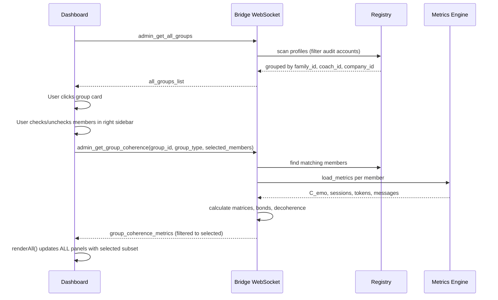

# Nate Coherence Matrix -- Selection & Metrics Rebuild

## Problems Identified from Screenshots

- **All members clustered**: The Coach Team shows ~18 users (including test/audit accounts) with no way to pick a subset
- `**selected_members` is dead code**: Frontend always sends `null`; backend filtering logic is never triggered
- **No right sidebar**: Metrics (Nate Wellness, Decoherence, Individual Bonds) are on the LEFT -- user wants them on the RIGHT, dynamically updating based on selection
- **Test accounts visible**: `audit_client`, `Audit Student 1`, `Audit Student 2` clutter the view
- **Uniform Nate bonds (all 0.12)**: Expected with low data, but should show raw engagement numbers for context
- **No individual toggle for graphs/matrix**: The member toggles only affect 3D; 2D graphs and matrix always show everyone

## New Layout: Three-Column

```
LEFT SIDEBAR (220px)          CENTER CONTENT (flex)          RIGHT SIDEBAR (280px)
+-----------------------+   +---------------------------+   +-----------------------+
| Group Type Tabs       |   | Wellness Summary Row      |   | Member Selection      |
|  ALL|FAM|COACH|CORP   |   | [With Nate][Without][Delta]|   | [x] Select All        |
+-----------------------+   +---------------------------+   | [ ] Deselect All      |
| Group Cards           |   | 2D Baseline Comparison    |   | [x] Bill West         |
|  FAM_0F708896 (4)     |   | [WITH NATE] [WITHOUT]     |   | [x] Lisa West         |
|  Team: CoachN (12)    |   +---------------------------+   | [ ] Kristy Moore      |
|  Company: XYZ (6)     |   | 3D Coherence Explorer     |   | [x] Little Nate       |
|                       |   | [Force] [Helix]           |   +-----------------------+
|                       |   +---------------------------+   | Metrics for Selected  |
|                       |   | Coherence Matrix          |   | Nate Bonds --------   |
|                       |   | (only selected members)   |   | Decoherence Alerts    |
|                       |   +---------------------------+   | Engagement Stats      |
+-----------------------+                                   +-----------------------+
```

## Changes Required

### 1. Frontend -- [dashboard/nevedal_lab_family.html](dashboard/nevedal_lab_family.html)

**Layout restructure:**

- Change `.main-grid` from `grid-template-columns: 280px 1fr` to `220px 1fr 280px`
- LEFT: Group Selection only (slimmed down)
- CENTER: Wellness row + 2D graphs + 3D graph + Coherence Matrix
- RIGHT (NEW): Member checkboxes + dynamic metrics (Nate Bonds, Decoherence Alerts, Engagement Stats)

**Member selection panel (right sidebar):**

- Checkbox list of all members in the selected group
- "Select All" / "Deselect All" buttons
- "Include Little Nate" toggle at top
- Each checkbox click triggers `requestGroupCoherence()` with the actual `selected_members` array
- Selection drives ALL visualizations (2D, 3D, matrix, wellness cards, decoherence alerts)

**Filter test accounts:**

- Skip members whose `name` contains "audit" or "Audit Student" in `buildGroupList()` display
- Backend should also filter (see below)

**Fix `requestGroupCoherence()`:**

```javascript
// CURRENT (broken -- always sends null):
selected_members: sel.length > 0 ? null : null

// NEW:
selected_members: sel.length > 0 ? sel : null
```

When `null`, backend returns all members. When populated, backend filters to only those IDs.

**All render functions respect selection:**

- `render2DNetwork()` -- only draw selected members
- `render3DGraph()` -- only draw selected members (remove bottom toggles, selection is in right sidebar now)
- `renderMatrix()` -- only include selected members in rows/columns
- `renderWellnessCards()` -- calculate from selected subset
- `renderDecoherenceAlerts()` -- only between selected members
- `renderNateBonds()` -- only for selected members

**Add group type filter tabs:**

- Top of left sidebar: `ALL | FAMILIES | COACH TEAMS | COMPANIES`
- Clicking a tab filters the group cards shown below

### 2. Backend -- [backend/app/websocket/bridge_server.py](backend/app/websocket/bridge_server.py)

`**admin_get_all_groups` handler (~line 17181):**

- Filter out users with `username` containing "audit" (case-insensitive)
- Include the COACH themselves in coach_team groups (currently only CLIENTs are added)
- Add `human_swarm` group type for community mesh sessions (query `community_sessions` if data exists)

`**admin_get_group_coherence` handler (~line 17217):**

- The `selected_members` filtering already exists but is never triggered. Verify it works correctly when the frontend starts sending real selections.
- When `selected_members` is provided, recalculate ALL metrics (wellness, matrix, decoherence) using only the selected subset -- this is already the case.
- Add engagement stats per member in the response: `sessions`, `tokens`, `messages`, `last_active`

### 3. Copy to mobile web -- [mobile/web/nevedal_lab_family.html](mobile/web/nevedal_lab_family.html)

Keep in sync after frontend rebuild.

## Data Flow




## Key Rules Followed

- Dashboard deployed to all 3 server directories per `deployment-safety.mdc`
- No `rsync --delete`
- Auth headers on all fetch calls (uses WebSocket, not REST)
- Bridge restart after deploying `bridge_server.py`
- Verify container health after deploy per `build-deploy-ux-verification.mdc`

