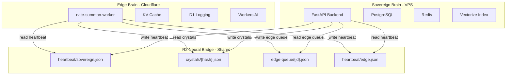

# Dual-Brain Mutual Repair Architecture

## Current State (Gaps)

The two brains currently have no mutual repair capability:

- **Edge has no circuit breaker** -- every request that needs the Sovereign Brain makes a fresh `fetch()` with a hard timeout. If the VPS is down, every single TENSION/PROVISIONAL request pays a 10-15s penalty before falling back.
- **Sovereign has no Edge health probe** -- the VPS cannot tell if the Cloudflare Worker is down, misconfigured, or rate-limited. The `EdgeHealthAuditor` checks local `app.state` services but never actually calls the Edge Worker.
- **No shared repair channel** -- R2 and Vectorize are accessible from both brains but neither uses them to communicate health state, sync crystals, or queue repair actions.
- **No crystal replication to R2** -- intelligence crystals live only in PostgreSQL + Vectorize. The Edge Worker cannot access them for enriched responses.
- **No reconciliation after outage** -- when either brain recovers, there is no mechanism to replay missed state (new crystals, new user interactions, cache invalidation).

## Architecture: R2 as the Neural Bridge




## Component 1: Circuit Breaker in Edge Worker

**File:** `cloudflare/workers/nate-summon-worker/worker.js`

Add a KV-backed circuit breaker for Sovereign Brain calls:

- **States:** CLOSED (normal) -> OPEN (Sovereign down) -> HALF_OPEN (testing recovery)
- **Trip threshold:** 3 consecutive failures within 5 minutes
- **Open duration:** 60 seconds (skip Sovereign calls entirely, serve from Edge)
- **Half-open:** Allow 1 test request per 60s; if it succeeds, close the circuit
- **KV key:** `circuit:sovereign` with TTL = 300s

```javascript
// Pattern for circuit breaker check
const circuitKey = 'circuit:sovereign';
const circuit = JSON.parse(await env.SUMMON_RATE.get(circuitKey) || '{"state":"closed","failures":0}');

if (circuit.state === 'open') {
  // Skip sovereign call entirely, use edge-only response
} else {
  // Try sovereign, on failure increment circuit.failures
}
```

**Benefit:** When the VPS is down, Edge stops wasting 10-15s per request on doomed `fetch()` calls. Users get sub-second Edge-only responses instead.

## Component 2: R2 Heartbeat Exchange

Both brains write a heartbeat JSON to R2 every 5 minutes. Both brains read each other's heartbeat.

**Sovereign writes:** `heartbeat/sovereign.json`

```json
{
  "timestamp": "2026-03-13T02:00:00Z",
  "healthy": true,
  "services": 156,
  "crystal_count": 1247,
  "latest_crystal_hash": "abc123...",
  "inference_providers": {"sovereign": true, "azure": true, "grok": true}
}
```

**Edge writes:** `heartbeat/edge.json` (via Worker Cron trigger or on every Nth request)

```json
{
  "timestamp": "2026-03-13T02:00:00Z",
  "healthy": true,
  "cache_hit_rate": 0.73,
  "requests_since_last": 142,
  "circuit_state": "closed",
  "workers_ai_healthy": true
}
```

**Implementation files:**

- Sovereign heartbeat writer: new background task in [backend/app/main.py](backend/app/main.py) using `r2_storage.py`
- Edge heartbeat reader: read `heartbeat/sovereign.json` from R2 in [worker.js](cloudflare/workers/nate-summon-worker/worker.js) before sovereign calls
- Sovereign heartbeat reader: new method in [edge_health_auditor.py](backend/app/services/edge_health_auditor.py) that reads `heartbeat/edge.json` from R2

**Benefit:** Each brain knows the other's last-known health state without making a live network call. A stale heartbeat (>10 minutes old) = presumed down.

## Component 3: Crystal Replication to R2

After every crystal is written to PostgreSQL, replicate it to R2 so the Edge Worker can access Nate's knowledge without hitting the VPS.

**File:** [backend/app/services/nate_memory_crystallizer.py](backend/app/services/nate_memory_crystallizer.py)

After the PostgreSQL insert in `_store_crystal()`:

```python
# Replicate to R2 for Edge Brain access
await blob_storage.upload_bytes(
    f"crystals/{crystal['content_hash']}.json",
    json.dumps(crystal).encode(),
    bucket="nate-vault"
)
```

**Edge Worker usage:** On LOCKED/PROVISIONAL signals, the Worker can fetch relevant crystals from R2 via presigned URL or direct R2 binding, enriching its response without a VPS round-trip.

**File:** Add R2 binding to [wrangler.toml](cloudflare/workers/nate-summon-worker/wrangler.toml):

```toml
[[r2_buckets]]
binding = "CRYSTAL_STORE"
bucket_name = "nate-vault"
```

## Component 4: Edge Queue for Deferred Sovereign Sync

When the Sovereign Brain is down (circuit OPEN), the Edge Worker queues state changes to R2 for later processing.

**What gets queued:**

- New summon interactions (question + response + signal + timestamp)
- Cache invalidation requests from users
- Edge-observed anomalies (rate limit spikes, unusual patterns)

**Queue format:** `edge-queue/{timestamp}-{uuid}.json` in R2

**Sovereign recovery:** A new background agent (`EdgeQueueDrainer`) on the VPS polls `edge-queue/` in R2 every 5 minutes:

1. Lists objects in `edge-queue/` prefix
2. For each: read, process (log to `skyeye_activity`, update analytics), delete
3. If queue grows beyond 1000 items, alert via `agent_status_digest`

**File:** New service `backend/app/services/edge_queue_drainer.py`

## Component 5: Sovereign -> Edge Health Probe

The VPS actively probes the Edge Worker to detect if it's down.

**File:** [backend/app/services/edge_health_auditor.py](backend/app/services/edge_health_auditor.py)

Add a new check that calls the public Edge Worker health endpoint:

```python
# New check: actually probe the Cloudflare Worker
async def _probe_edge_worker(self) -> str:
    try:
        async with aiohttp.ClientSession() as session:
            async with session.get(
                "https://api.sovereignsanctuary.net/api/summon/health",
                timeout=aiohttp.ClientTimeout(total=10),
            ) as resp:
                if resp.status == 200:
                    data = await resp.json()
                    if data.get("status") == "ok" and data.get("edge") is True:
                        return "TRUSTED"
                return "WARNING"
    except Exception:
        return "FAILED"
```

**If Edge is down:** The Sovereign Brain can:

1. Expose the summon API directly (bypass Worker routes) via a DNS failover record
2. Log an alert to `skyeye_activity` for the Trust Enforcer
3. Write a "direct mode" flag to Redis that tells the inference router to handle summon traffic directly

## Component 6: Sovereign Self-Repair via Edge

When the Sovereign Brain restarts after a crash:

1. Read `heartbeat/edge.json` from R2 to assess Edge state during downtime
2. Drain `edge-queue/` to replay missed interactions
3. Compare `latest_crystal_hash` in the edge heartbeat against local crystals to detect drift
4. If the Edge Worker was serving cached responses during the outage, the Sovereign can verify cache consistency by comparing recent Edge responses (logged in D1) against what the Sovereign would have generated

## Component 7: Edge Self-Repair via Sovereign

When the Edge Worker detects the Sovereign Brain has recovered (circuit transitions from OPEN -> HALF_OPEN -> CLOSED):

1. Read `heartbeat/sovereign.json` to get `latest_crystal_hash` and `crystal_count`
2. Invalidate stale KV cache entries that were served during the outage (cache keys older than the outage start)
3. Resume dual-brain resonance for PROVISIONAL/TENSION signals
4. Log recovery event to D1 with outage duration and requests served in degraded mode

## Summary of Changes


| File                          | Change                                                                                              |
| ----------------------------- | --------------------------------------------------------------------------------------------------- |
| `worker.js`                   | Circuit breaker, R2 heartbeat write, crystal read, edge queue write, cache invalidation on recovery |
| `wrangler.toml`               | Add R2 bucket binding, Cron trigger for heartbeat                                                   |
| `nate_memory_crystallizer.py` | R2 crystal replication after PostgreSQL insert                                                      |
| `edge_health_auditor.py`      | Add live Edge Worker probe, R2 heartbeat read                                                       |
| `main.py`                     | Register heartbeat writer task, register EdgeQueueDrainer                                           |
| New: `edge_queue_drainer.py`  | Background agent to process queued Edge state                                                       |
| New: `sovereign_heartbeat.py` | Background task writing sovereign heartbeat to R2                                                   |
| Rule: `dual-brain-repair.mdc` | Document the mutual repair protocol                                                                 |


