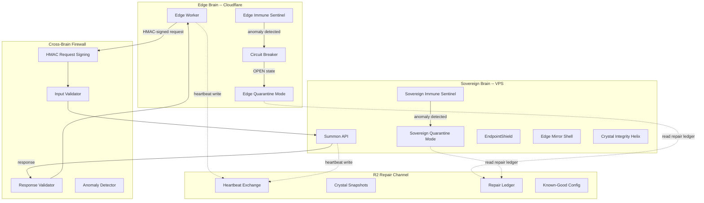
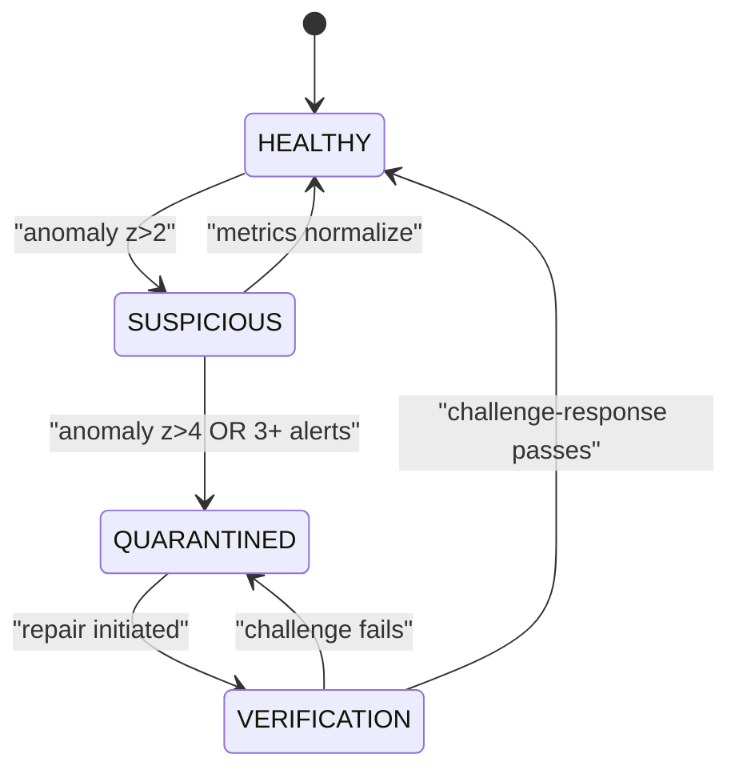

# Dual-Brain Immune System Architecture

## Current State: Critical Gaps

The exploration revealed that **5 defense systems exist in code but are never invoked**:


| Defense System                  | File                            | Status                                                                                            |
| ------------------------------- | ------------------------------- | ------------------------------------------------------------------------------------------------- |
| EndpointShield payload scanning | `security/endpoint_shield.py`   | Initialized on `app.state` but `evaluate_payload()` and `sanitize_ai_response()` are never called |
| Edge Mirror Shell               | `security/edge_mirror_shell.py` | Has `CLOUDFLARE_WORKER` source type but never invoked on any request                              |
| SASE outbound validation        | `security/sase_controller.py`   | `validate_outbound()` defined but never called before outbound HTTP                               |
| Crystal Integrity Helix         | `distributed_defense.py`        | Helix `verify()` never called in crystallizer pipeline                                            |
| NateResponseValidator           | `nate_response_validator.py`    | Runs in `log_only` mode -- warns but never blocks                                                 |


Additionally, the cross-brain channel (`/api/summon/internal`) has:

- No input validation (no length limit, no type checking, no sanitization)
- No request signing (static bearer token only)
- No rate limiting
- No anomaly detection
- No response validation (Edge accepts Sovereign responses without verification)

## Architecture: Biological Immune System Metaphor




## Component 1: Cryptographic Immune Handshake (HMAC Request Signing)

**Problem**: The current `INTERNAL_TOKEN` is a static bearer token. If exfiltrated from one brain, it can be used indefinitely from anywhere. No replay protection exists.

**Solution**: HMAC-SHA256 request signing with timestamp + nonce.

### Edge Worker side (`worker.js`)

```javascript
async function signRequest(env, body) {
  const timestamp = Math.floor(Date.now() / 1000);
  const nonce = crypto.randomUUID();
  const payload = `${timestamp}.${nonce}.${JSON.stringify(body)}`;
  const key = await crypto.subtle.importKey(
    'raw', new TextEncoder().encode(env.HMAC_SECRET),
    { name: 'HMAC', hash: 'SHA-256' }, false, ['sign']
  );
  const sig = await crypto.subtle.sign('HMAC', key, new TextEncoder().encode(payload));
  const signature = btoa(String.fromCharCode(...new Uint8Array(sig)));
  return { timestamp, nonce, signature };
}
```

Headers sent: `X-Nate-Timestamp`, `X-Nate-Nonce`, `X-Nate-Signature`

### Sovereign Brain side (`[summon_api.py](backend/app/routers/summon_api.py)`)

```python
def _verify_hmac(request, body_bytes):
    timestamp = int(request.headers.get("X-Nate-Timestamp", "0"))
    nonce = request.headers.get("X-Nate-Nonce", "")
    signature = request.headers.get("X-Nate-Signature", "")
    # Reject if timestamp > 30 seconds old (replay window)
    if abs(time.time() - timestamp) > 30:
        raise HTTPException(403, "Request expired")
    # Reject if nonce already seen (Redis SET with 60s TTL)
    # Verify HMAC matches
    payload = f"{timestamp}.{nonce}.{body_bytes.decode()}"
    expected = hmac.new(HMAC_SECRET, payload.encode(), hashlib.sha256).digest()
    if not hmac.compare_digest(base64.b64decode(signature), expected):
        raise HTTPException(403, "Invalid signature")
```

**New env vars**: `HMAC_SECRET` (shared between Worker and VPS, rotated monthly via `wrangler secret put`).

**Files modified**:

- `[cloudflare/workers/nate-summon-worker/worker.js](cloudflare/workers/nate-summon-worker/worker.js)` -- add `signRequest()`, use in `handleSummon()`
- `[backend/app/routers/summon_api.py](backend/app/routers/summon_api.py)` -- add `_verify_hmac()`, call in `/internal`

---

## Component 2: Cross-Brain Input/Output Firewall

**Problem**: `/api/summon/internal` accepts raw JSON with no validation. Edge accepts Sovereign responses without checking.

### Sovereign side -- Harden `/api/summon/internal`

In `[summon_api.py](backend/app/routers/summon_api.py)`:

```python
class InternalSummonRequest(BaseModel):
    message: str = Field(..., min_length=1, max_length=2000)
    source: str = Field(..., pattern=r"^(edge_resonance|edge_fallback)$")

@router.post("/internal")
async def summon_internal(req: InternalSummonRequest, request: Request):
    _verify_hmac(request, await request.body())
    # Sanitize: strip control characters, limit to printable
    clean_message = _sanitize_input(req.message)
    # Rate limit: max 60 internal requests per minute
    if not _check_internal_rate_limit():
        raise HTTPException(429, "Internal rate limit exceeded")
    # Generate response
    response = await summon_service._generate_response(clean_message, max_tokens=1000)
    # Sanitize response before returning to Edge
    response = _sanitize_outbound(response)
    return {"response": response, "source": "sovereign_brain"}
```

New `_sanitize_input()`: strip non-printable chars, collapse whitespace, detect prompt injection patterns (`ignore previous`, `system:`, `<|im_start|>`).

New `_sanitize_outbound()`: call `EndpointShield.sanitize_ai_response()` (currently dormant) on the response before returning to Edge.

### Edge side -- Validate Sovereign responses

In `[worker.js](cloudflare/workers/nate-summon-worker/worker.js)`:

```javascript
function validateSovereignResponse(text) {
  if (!text || typeof text !== 'string') return null;
  if (text.length > 10000) return null;  // response too large
  // Check for obvious injection markers
  const poisonPatterns = [/<script/i, /javascript:/i, /data:text\/html/i, 
                          /\beval\b/, /\bFunction\b/, /__proto__/];
  for (const p of poisonPatterns) {
    if (p.test(text)) return null;
  }
  return text;
}
```

---

## Component 3: Immune Sentinel (Behavioral Anomaly Detection)

**Problem**: Neither brain monitors the other's behavior patterns. A compromised brain could slowly poison the other through gradually degrading responses.

### New file: `[backend/app/services/immune_sentinel.py](backend/app/services/immune_sentinel.py)`

The Immune Sentinel tracks baseline behavioral metrics and triggers alerts when deviations exceed thresholds:

**Metrics tracked per 5-minute window**:

- `request_count` -- number of Edge->Sovereign requests
- `avg_payload_size` -- average message length from Edge
- `error_rate` -- percentage of 4xx/5xx responses to Edge
- `avg_latency_ms` -- response generation time
- `response_entropy` -- Shannon entropy of responses (low entropy = repetitive/degraded)
- `unique_message_ratio` -- ratio of unique messages to total (low = replay attack)

**Anomaly detection**: Z-score against rolling 1-hour baseline. Alert if any metric deviates > 3 standard deviations.

**Progressive response**:

1. **NOTICE** (z > 2): Log warning, increase monitoring frequency
2. **ALERT** (z > 3): Log error, notify admin via `skyeye_activity`
3. **QUARANTINE** (z > 4 OR 3+ metrics at ALERT): Trigger quarantine protocol

### Edge-side sentinel (in `worker.js`)

KV-backed metrics tracking:

- Track Sovereign response times, error rates, response sizes
- If Sovereign error rate > 50% in 5 minutes: trip circuit breaker
- If Sovereign responses suddenly become very short/repetitive: flag as potentially compromised

---

## Component 4: Quarantine Protocol (Isolation When Infected)

**Problem**: If one brain is compromised, there's no mechanism to sever the connection while keeping both brains operational independently.

### Quarantine states




### Edge Brain quarantine

When Edge detects Sovereign is compromised (or Sovereign quarantines Edge):

In `[worker.js](cloudflare/workers/nate-summon-worker/worker.js)`:

```javascript
// KV key: "quarantine:sovereign" = { active: true, since: timestamp, reason: "..." }
async function isSovereignQuarantined(env) {
  const q = await env.SUMMON_CACHE.get("quarantine:sovereign");
  if (!q) return false;
  const data = JSON.parse(q);
  return data.active === true;
}
```

When quarantined:

- All Sovereign calls skip (no resonance, no fallback)
- Edge operates on Workers AI only
- Circuit breaker forced OPEN
- Quarantine status logged to D1

### Sovereign Brain quarantine

When Sovereign detects Edge is compromised:

In `[immune_sentinel.py](backend/app/services/immune_sentinel.py)`:

```python
async def quarantine_edge(self, reason: str):
    # 1. Revoke HMAC_SECRET (Edge can no longer sign requests)
    # 2. Block all /api/summon/internal requests
    # 3. Log quarantine event to skyeye_activity
    # 4. Write quarantine status to R2 repair channel
    self._edge_quarantined = True
    self._quarantine_reason = reason
```

When quarantined:

- `/api/summon/internal` returns 503 immediately
- Sovereign processes only direct client requests
- Admin notified via Trust Enforcer email

---

## Component 5: Wire Dormant Defense Systems

These 5 systems are built but sleeping. Wiring them activates the existing immune infrastructure.

### 5a. Wire EndpointShield into summon responses

In `[summon_api.py](backend/app/routers/summon_api.py)`, after generating a response:

```python
shield = getattr(request.app.state, "endpoint_shield", None)
if shield:
    verdict = shield.sanitize_ai_response(response_text)
    response_text = verdict  # URLs replaced with [BLOCKED]
```

### 5b. Wire Edge Mirror Shell for internal requests

In `[summon_api.py](backend/app/routers/summon_api.py)`, at the start of `/internal`:

```python
edge_mirror = getattr(request.app.state, "distributed_defense", None)
if edge_mirror:
    from app.services.security.edge_mirror_shell import SignalSource
    assessment = edge_mirror.edge_mirror.assess_signal(
        SignalSource.CLOUDFLARE_WORKER,
        {"message": message, "source": source},
        identity=client_ip
    )
    if assessment.should_mirror:
        return {"response": assessment.phantom_response, "source": "phantom"}
```

### 5c. Wire Crystal Integrity Helix into crystallizer

In `[nate_memory_crystallizer.py](backend/app/services/nate_memory_crystallizer.py)`, before storing a crystal:

```python
helix = getattr(self._app_state, "distributed_defense", None)
if helix:
    verdict = helix.crystal_helix.verify({
        "crystal_text": crystal_text,
        "domain": domain,
        "content_hash": content_hash,
        "scope": scope,
        "generation": generation,
    })
    if verdict.status != "INTACT":
        logger.warning("Crystal failed integrity helix: %s", verdict.status)
        continue  # skip this crystal
```

### 5d. Switch NateResponseValidator to blocking mode

In `[nate_response_validator.py](backend/app/services/nate_response_validator.py)`:

```python
# Change from log_only to enforce
self._mode = "enforce"  # was "log_only"
```

High-severity violations now prevent crystal storage and flag responses.

### 5e. Wire SASE outbound validation

In `[nate_inference_router.py](backend/app/services/nate_inference_router.py)`, before outbound API calls:

```python
sase = getattr(self._app_state, "sase_controller", None)
if sase:
    allowed = sase.validate_outbound(target_host, "llm_inference")
    if not allowed:
        logger.warning("SASE blocked outbound to %s", target_host)
        # skip this provider, try next in chain
```

---

## Component 6: Self-Repair Protocol

**Problem**: After quarantine, the healthy brain needs to repair the damaged one.

### R2 Repair Channel

Use R2 bucket `nate-vault` with prefix `immune/`:


| Key                               | Written by         | Purpose                                    |
| --------------------------------- | ------------------ | ------------------------------------------ |
| `immune/sovereign_heartbeat.json` | Sovereign (5min)   | Timestamp, service count, trust score      |
| `immune/edge_heartbeat.json`      | Edge Worker (cron) | Timestamp, cache stats, error rate         |
| `immune/quarantine_log.json`      | Either brain       | Quarantine events with reason and evidence |
| `immune/repair_ledger.json`       | Repairing brain    | Steps taken, verification results          |
| `immune/known_good_config.json`   | Admin (on deploy)  | Last verified-good Worker config hash      |


### Edge repairs Sovereign

When Edge detects Sovereign is down/compromised:

1. **Continue serving**: Workers AI handles all requests independently
2. **Queue interactions**: Write summon interactions to R2 `immune/edge_queue/` for Sovereign to process after recovery
3. **Cache known-good crystals**: Edge KV stores last N validated crystal responses
4. **Signal admin**: Write `immune/sovereign_alert.json` with diagnostics

### Sovereign repairs Edge

When Sovereign detects Edge is compromised:

1. **Revoke HMAC secret**: Immediately prevents compromised Edge from authenticating
2. **Purge Edge KV cache**: Via Cloudflare API -- clears potentially poisoned cached responses
3. **Write repair instructions**: `immune/edge_repair.json` with new HMAC secret and config
4. **Verify before reconnect**: Challenge-response test where Sovereign sends a known question and validates Edge returns a semantically correct answer (via embedding similarity > 0.80)

### Post-repair verification

Before reconnecting brains:

```python
async def verify_brain_integrity(self, brain: str) -> bool:
    # 1. Send 3 known challenge questions with known-good answers
    # 2. Compare responses via embedding similarity
    # 3. Check response latency is within normal range
    # 4. Verify no prompt injection markers in responses
    # All 3 must pass for brain to be cleared
```

---

## Component 7: Cursor Rule

Create `[dual-brain-immune-system.mdc](.cursor/rules/dual-brain-immune-system.mdc)` documenting:

- HMAC signing protocol and rotation schedule
- Quarantine triggers and progressive response
- Repair protocol steps
- Which defenses are wired where
- Never-do list (never disable HMAC, never skip sanitization, etc.)

---

## Files Changed/Created


| File                                                  | Action | Description                                                                                            |
| ----------------------------------------------------- | ------ | ------------------------------------------------------------------------------------------------------ |
| `cloudflare/workers/nate-summon-worker/worker.js`     | Modify | HMAC signing, response validation, circuit breaker, quarantine check, Edge sentinel metrics            |
| `cloudflare/workers/nate-summon-worker/wrangler.toml` | Modify | Add R2 binding for repair channel                                                                      |
| `backend/app/routers/summon_api.py`                   | Modify | HMAC verification, Pydantic model, input sanitization, rate limit, EndpointShield + Edge Mirror wiring |
| `backend/app/services/immune_sentinel.py`             | Create | Behavioral anomaly detection, quarantine triggers, repair orchestration                                |
| `backend/app/services/nate_memory_crystallizer.py`    | Modify | Wire Crystal Integrity Helix before storage                                                            |
| `backend/app/services/nate_response_validator.py`     | Modify | Switch from `log_only` to `enforce` mode                                                               |
| `backend/app/services/nate_inference_router.py`       | Modify | Wire SASE outbound validation                                                                          |
| `backend/app/main.py`                                 | Modify | Initialize Immune Sentinel, add to service checks                                                      |
| `backend/app/services/trust_enforcer.py`              | Modify | Register immune sentinel auditor                                                                       |
| `.env.template`                                       | Modify | Add `HMAC_SECRET`                                                                                      |
| `.cursor/rules/dual-brain-immune-system.mdc`          | Create | Immune system protocol documentation                                                                   |


---

## Deployment Order

1. **Phase A** (Defense Wiring -- no cross-brain changes): Wire EndpointShield, Crystal Helix, NateResponseValidator enforce mode, SASE outbound. Deploy to VPS only.
2. **Phase B** (Cross-Brain Firewall): Add HMAC signing to Worker + verification to Sovereign. Deploy Worker via `wrangler deploy`, then VPS.
3. **Phase C** (Immune Sentinel + Quarantine): Deploy sentinel agent, quarantine protocol. Test with simulated anomalies.
4. **Phase D** (Repair Channel): Set up R2 repair keys, heartbeat exchange, repair ledger. Full end-to-end test.

