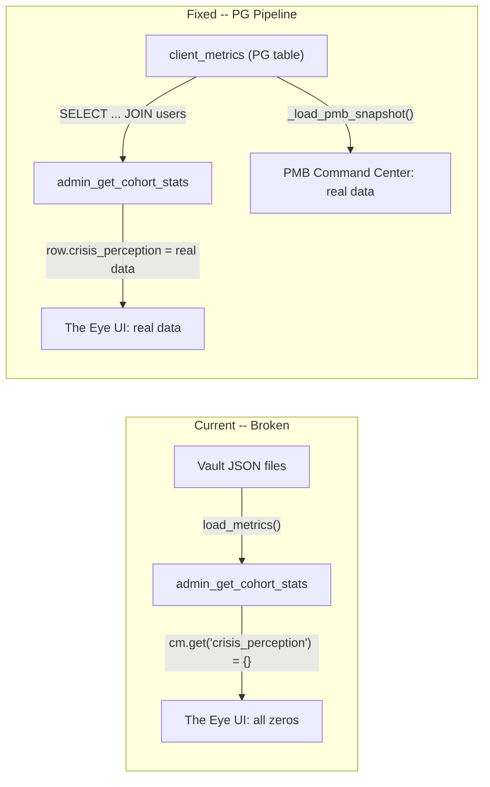

# Fix The Eye to PMB Command Center Data Pipeline Sync

## Problem Summary

The PMB Command Center (`pmb_reports.html`) shows correct data because it reads from the PostgreSQL `client_metrics` table via REST endpoints (`/api/reports/pmb/*`). The Eye's Community Wellness tab and Patent 2 overview both show all zeros because the WebSocket handler `admin_get_cohort_stats` in [bridge_server.py](backend/app/websocket/bridge_server.py) has two critical bugs:

1. **Wrong nesting level** -- reads `crisis_perception`, `shame_profile`, `pmb` from the top level of `metrics_engine.load_metrics()` return value, but they live inside `nevedal_state`
2. **Uses JSON vault files** instead of the PostgreSQL `client_metrics` table (which is what PMB reports reads and which has the real data)

## Root Cause (lines 16414-16433 of bridge_server.py)

```python
cm = metrics_engine.load_metrics({"role": "CLIENT", "hardware_id": ...})
cp = cm.get("crisis_perception", {})    # BUG: should be cm["nevedal_state"]["crisis_perception"]
sp = cm.get("shame_profile", {})        # BUG: same
pmb = cm.get("pmb", {})                 # BUG: same
```

`load_metrics()` returns `{"nevedal_state": {"crisis_perception": {...}, ...}, "history": [...]}` -- the PMB/shame/crisis data is nested inside `nevedal_state`, not at the top level. This causes every distribution counter to remain at 0.

Additional bugs:

- `**avg_shame_index**` is computed as `sum(masking_pattern_counts) / user_count`, which is a meaningless ratio. It should average individual `shame_profile.shame_index` values.
- **3 redundant loops** over all clients, each calling `load_metrics()` (disk I/O per user). Should be one loop.
- `**total_cees**` read from top-level `cm.get("total_cees", 0)` which may not exist.

## Data Flow (Current vs Fixed)




## Fix: Rewrite `admin_get_cohort_stats` to use PostgreSQL

### Single file change: [backend/app/websocket/bridge_server.py](backend/app/websocket/bridge_server.py)

**Location**: Lines ~16280-16520 (the `admin_get_cohort_stats` handler)

**Strategy**: Replace the three-loop vault-file-based approach with a single PostgreSQL query, matching how `pmb_reports_api.py` loads data. Keep vault JSON as a fallback when `db_pool` is unavailable.

**PostgreSQL query** (matches PMB reports approach):

```sql
SELECT cm.hardware_id, cm.c_emo, cm.gap, cm.quantum,
       cm.anxiety_level, cm.stress_level, cm.engagement,
       cm.session_count, cm.breakthrough_count,
       cm.crisis_perception, cm.shame_profile, cm.pmb,
       cm.nevedal_state,
       u.profile_data
FROM client_metrics cm
JOIN users u ON cm.hardware_id = u.hardware_id
WHERE u.role = 'CLIENT' AND u.deleted_at IS NULL
```

**Aggregation logic** (single pass over rows):

- **C_emo average**: Sum `c_emo` / count (same as current, but from PG)
- **Crisis perception distribution**: Parse `crisis_perception->>'perception_baseline'` and count CALIBRATED/NORMALIZER/MINIMIZER/AMPLIFIER
- **Reactivity distribution**: Parse `pmb->>'reactivity_type'` and count FIGHT/FLIGHT/FREEZE/FAWN
- **Shame index average**: Average individual `shame_profile->>'shame_index'` values (float)
- **Confidence tiers**: Parse `nevedal_state->>'confidence_tier'` and count LEARNING/OBSERVATION/AWARENESS/REFLECTION
- **CEE rate**: Count entries where `nevedal_state->'cee_experiences'` array is non-empty, or read `total_cees` from nevedal_state
- **By age_group / diagnosis / treatment**: Derive from `profile_data` JSONB on the users table

**Vault JSON fallback** (when `db_pool is None`): Keep the existing `metrics_engine.load_metrics()` approach but fix the nesting -- read from `cm.get("nevedal_state", {})` instead of `cm` directly.

**Response shape stays identical** -- the `cohort_stats` message format does not change, so both `the_eye.html` and `the_eye_community.html` render correctly without any frontend changes.

### No frontend changes needed

Both [dashboard/the_eye.html](dashboard/the_eye.html) and [dashboard/the_eye_community.html](dashboard/the_eye_community.html) already correctly consume the `cohort_stats` WebSocket response fields (`perception_distribution`, `reactivity_distribution`, `confidence_tiers`, `avg_shame_index`). The bug is purely backend -- fixing the data source fixes all downstream consumers.

### Deployment

- SCP the updated `bridge_server.py` to the production server
- Restart `nate_bridge` container
- Verify The Eye Community tab shows non-zero distributions that match PMB Command Center aggregates

