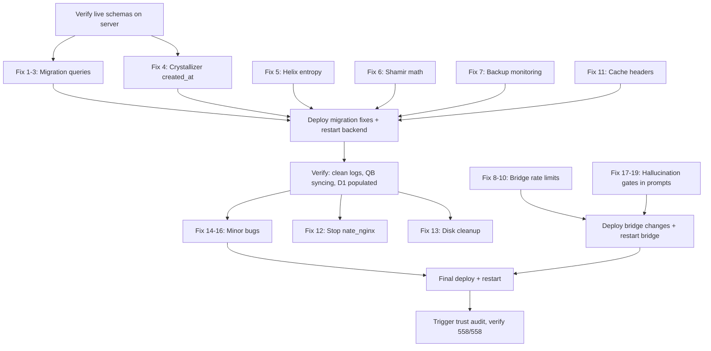

# Full System Integrity Fix

## Priority 1: Migration Data Integrity (3 Schema Mismatches)

These fire every 30 minutes and produce 14+ error lines per cycle. Fixing them unblocks QuickBooks sync, D1 edge data, and R2 metric archival.

### Fix 1: `payment_history.username` -- QuickBooks Sync Agent

**File:** [backend/app/services/quickbooks_sync_agent.py](backend/app/services/quickbooks_sync_agent.py)

The `payment_history` table has `user_id` (UUID FK to `users.id`), not `username`. Three queries need JOIN rewrites:

- **Line 242** (subscription invoices): Change `SELECT id, username, ...` to JOIN `users` on `ph.user_id = u.id` and select `u.username`
- **Line 400** (corporate invoices): Same JOIN pattern, already has a subselect for username that can be replaced with the direct JOIN
- Lines 276/321 (`token_transactions` and `gkm_donations`) are fine -- those tables have `username` (VARCHAR)

```python
# Line 242 fix:
SELECT ph.id, u.username, ph.amount_cents, ph.status,
       ph.created_at
FROM payment_history ph
JOIN users u ON u.id = ph.user_id
WHERE ph.synced_to_qb = FALSE AND ph.status = 'PAID'
ORDER BY ph.created_at LIMIT $1
```

```python
# Line 400 fix:
SELECT ph.id, ph.amount_cents, ph.created_at, cs.company_name
FROM payment_history ph
JOIN users u ON u.id = ph.user_id
JOIN corporate_enrollments ce ON ce.user_id = ph.user_id
JOIN corporate_sponsors cs ON cs.id = ce.sponsor_id
WHERE ph.synced_to_qb = FALSE AND ph.status = 'PAID'
  AND cs.pays_full = TRUE
ORDER BY ph.created_at LIMIT $1
```

### Fix 2: `coaching_sessions.coach_username` / `client_username` -- D1 Sync Agent

**File:** [backend/app/services/d1_sync_agent.py](backend/app/services/d1_sync_agent.py)

The `coaching_sessions` table has `coach_id` and `client_id`, not `coach_username`/`client_username`. The table also may use `scheduled_start` (from migration 080) or `scheduled_at` (from migration 013). **Step 1 is to verify the live schema on the server.**

Changes needed (lines 207-277):

- **D1 CREATE TABLE** (line 207): Rename columns from `coach_username`/`client_username` to `coach_id`/`client_id`
- **PostgreSQL SELECT** (line 261): Use `coach_id`, `client_id`, and use `COALESCE(scheduled_at, scheduled_start)` for compatibility
- **D1 INSERT** (line 272): Match new D1 column names
- **Row access** (line 274): Update `.get()` keys

```python
# D1 schema fix:
CREATE TABLE IF NOT EXISTS schedule (
    id TEXT PRIMARY KEY, coach_id TEXT, client_id TEXT,
    session_type TEXT, scheduled_at TEXT, duration_minutes INTEGER,
    status TEXT, updated_at TEXT
)

# PostgreSQL query fix:
SELECT COALESCE(id::text, session_id) AS id,
       coach_id, client_id, session_type,
       COALESCE(scheduled_at, scheduled_start) AS scheduled_at,
       COALESCE(duration_minutes, 0) AS duration_minutes,
       status
FROM coaching_sessions
WHERE COALESCE(scheduled_at, scheduled_start) > NOW() - INTERVAL '7 days'
ORDER BY COALESCE(scheduled_at, scheduled_start) DESC
LIMIT 500
```

### Fix 3: `nevedal_metrics.metric_type` / `metric_value` -- R2 Archive + Marketing Brain

The `nevedal_metrics` table uses individual columns (`c_emo`, `p_ent`, `t_tunnel`, etc.), not a key-value `metric_type`/`metric_value` pattern. Two files need fixes:

**File:** [backend/app/services/r2_archive_agent.py](backend/app/services/r2_archive_agent.py) (line 168)

Rewrite to select actual columns and archive as JSON:

```python
SELECT id, user_id, c_emo, p_ent, t_tunnel, gamma_env,
       e_g_joint, tau_emo, d_distance, cee_window,
       cee_duration_seconds, biometrics, recorded_at
FROM nevedal_metrics
WHERE recorded_at < NOW() - INTERVAL '{METRICS_RETENTION_DAYS} days'
ORDER BY recorded_at ASC
LIMIT {BATCH_SIZE}
```

The archive format becomes a JSON object per row with all metric columns, stored in R2 under the existing key prefix.

**File:** [backend/app/services/marketing_brain.py](backend/app/services/marketing_brain.py) (line 997)

Fix both the column names AND the timestamp column (`created_at` should be `recorded_at`):

```python
SELECT AVG(c_emo) as avg_cemo,
       COUNT(*) FILTER (WHERE cee_window = TRUE) as cee_count
FROM nevedal_metrics
WHERE recorded_at > NOW() - INTERVAL '7 days'
```

---

## Priority 2: Cognitive Engine Restoration

### Fix 4: Crystallizer `KeyError: 'created_at'` -- Nate Stopped Learning

**File:** [backend/app/services/nate_memory_crystallizer.py](backend/app/services/nate_memory_crystallizer.py) (line 167)

One-line fix: the `wisdom_extractions` query selects `extracted_at` but the fragment dict references `r["created_at"]`.

```python
# Line 167 -- change:
"created_at": r["created_at"],
# to:
"created_at": r["extracted_at"],
```

This single fix restores the entire crystallization pipeline. The harvest cycle pulls from 5 sources (skyeye_chat, web_wisdom, wisdom_extractions, cycle_detections, foresight_alerts) -- only `wisdom_extractions` has the bug, but any exception in the harvest cycle aborts all 5 sources.

### Fix 5: Helix Worker Entropy Degradation

**Root cause:** `CognitiveRotationEngine()` is constructed without the `knowledge_engine` argument in [helix_orchestrator.py](backend/app/services/helix_orchestrator.py) line 131. Without it, `_knowledge_engine` is None, `all_sources` is always False, and entropy is reported as unhealthy. After 5 consecutive failures, the helix enters degradation mode with exponential backoff.

**Fix:** Pass the quantum knowledge field to the rotation engine. The orchestrator has access to `app_state`:

```python
# Line 131 in helix_orchestrator.py -- change:
self._rotation_engine = CognitiveRotationEngine()
# to:
_qkf = app_state.quantum_knowledge_field if app_state else None
self._rotation_engine = CognitiveRotationEngine(knowledge_engine=_qkf)
```

If `quantum_knowledge_field` is not on `app_state` yet, check the actual attribute name (it may be `knowledge_field` or similar). The `CognitiveRotationEngine.__init__` already accepts `knowledge_engine` as a parameter (line 67).

---

## Priority 3: Disaster Recovery

### Fix 6: Shamir Secret Sharing -- `reconstruction_mismatch`

**File:** [backend/app/services/succession_protocol.py](backend/app/services/succession_protocol.py) (lines 39-99)

**Root cause:** Mathematical bug. PRIME = 257, but `split_secret` stores `y % 256` (line ~58: `shares[i].append(y % 256)`). Value 256 wraps to 0, causing data loss. Reconstruction uses PRIME=257 arithmetic on truncated values, producing wrong results.

**Two fix options:**

- **Option A (preferred):** Change share storage to use 2 bytes per value (store the full modular result 0-256 without truncation). This preserves the GF(257) math.
- **Option B:** Switch the drill to use the correct GF(256) implementation in [backend/app/services/security/key_sharding.py](backend/app/services/security/key_sharding.py) which already works correctly.

**Option A fix in `split_secret`:**

```python
# Change: shares[i].append(y % 256)
# To: store full value using struct pack
import struct
for i in range(n):
    x = i + 1
    y = cls._evaluate_polynomial(coefficients, x)
    shares[i].extend(struct.pack('>H', y % cls.PRIME))  # 2 bytes, preserves 0-256
```

And mirror in `reconstruct_secret` — read 2 bytes per value instead of 1.

**Option B alternative** -- update `recovery_drill.py` line 161 to use `key_sharding.KeySharding` instead of `self._succession.shamir`.

### Fix 7: Backup Monitoring -- Agent Can't Find Backups

**File:** [backend/app/services/security/backup_encryption.py](backend/app/services/security/backup_encryption.py) (line 444)

The backup audit checks `backup_metadata` table for `status = 'completed'` rows. The cron scripts (`daily_backup.sh`, `vault_backup.sh`) write backups to disk but never INSERT into `backup_metadata`.

**Fix:** Add a step to the backup cron scripts (or a small Python wrapper) that inserts a row into `backup_metadata` after each successful backup:

```sql
INSERT INTO backup_metadata (backup_path, status, size_bytes, sha256_hash, created_at)
VALUES ($1, 'completed', $2, $3, NOW())
```

Alternatively, update `check_backup_freshness()` to also scan the filesystem at known backup paths (e.g., `/app/data/backups/`) as a fallback when the `backup_metadata` table is empty.

---

## Priority 4: Flood Resilience (4 Vectors)

### Fix 8: WebSocket Connection Exhaustion -- Global Connection Cap

**File:** [backend/app/websocket/bridge_server.py](backend/app/websocket/bridge_server.py)

The bridge already has `MAX_CONNECTIONS_PER_IP = 200` and `_connections_per_ip` tracking (line 1810). Add a global connection cap:

```python
MAX_GLOBAL_CONNECTIONS = 5000  # well below 20k OOM threshold
_total_connections = 0

# In the connection handler, before accepting:
if _total_connections >= MAX_GLOBAL_CONNECTIONS:
    await websocket.close(1013, "Server at capacity")
    return
_total_connections += 1
try:
    # ... existing handler ...
finally:
    _total_connections -= 1
```

Also reduce `MAX_CONNECTIONS_PER_IP` from 200 to 50 (200 per IP is very generous for legitimate use).

### Fix 9: Global AI Inference Cost Cap

**File:** [backend/app/websocket/bridge_server.py](backend/app/websocket/bridge_server.py)

Add a sliding-window global AI query counter alongside the existing per-connection `AI_RATE_LIMIT_MAX = 15`:

```python
GLOBAL_AI_QUERIES_PER_HOUR = 3000  # system-wide cap
_global_ai_timestamps = []

def check_global_ai_limit() -> bool:
    cutoff = datetime.datetime.now() - datetime.timedelta(hours=1)
    _global_ai_timestamps[:] = [t for t in _global_ai_timestamps if t > cutoff]
    if len(_global_ai_timestamps) >= GLOBAL_AI_QUERIES_PER_HOUR:
        return False
    _global_ai_timestamps.append(datetime.datetime.now())
    return True
```

Wire into the existing AI rate limit check at line 10225.

### Fix 10: Sovereign Inference Concurrency Limit

**File:** [backend/app/services/nate_inference_router.py](backend/app/services/nate_inference_router.py) (line 256)

Add an `asyncio.Semaphore` to cap concurrent calls to the Hetzner VPS:

```python
_SOVEREIGN_SEMAPHORE = asyncio.Semaphore(4)  # max 4 concurrent Ollama calls

async def _call_sovereign(self, messages, temperature, max_tokens, model=""):
    async with _SOVEREIGN_SEMAPHORE:
        # ... existing code ...
```

4 concurrent calls is reasonable for a 16-core ARM machine serving 8B-parameter models.

### Fix 11: Dashboard Caching Headers

**File:** [backend/app/middleware/cache_control.py](backend/app/middleware/cache_control.py)

Add `Cache-Control: public, max-age=30` headers to dashboard data endpoints (`/api/skyeye/pulse`, `/api/skyeye/overview`, `/api/marketing/results`, etc.) so Cloudflare's edge cache can serve repeat requests. Non-mutating GET endpoints that return aggregate data are safe to cache for 30 seconds.

This works with the already-deployed `nate-edge-cache` worker without changing dashboard HTML.

---

## Priority 5: Prompt-Level Hallucination Defense (Layers 1, 4, 10)

These three layers are system prompt additions only -- no new tables, agents, or pipelines. They address the Charlie Kirk incident class of failures (confabulation, therapeutic gaslighting of correct users). The remaining 7 layers (2, 3, 5-9) require infrastructure that depends on the fixes above and will be implemented in the separate Hallucination Defense plan.

### Fix 17: Layer 1 -- Hard Epistemic Gates

**File:** [backend/app/websocket/bridge_server.py](backend/app/websocket/bridge_server.py) -- `_IDENTITY_BLOCK` (line 601)

Add after the existing identity block content, before the context section gets assembled:

```
HARD EPISTEMIC GATES (HIGHEST PRIORITY — CANNOT BE OVERRIDDEN):
1. NEVER confirm or deny the death, arrest, conviction, or medical status of any
   named public figure without a retrieval-verified source from this session.
   If you cannot verify, say: "I want to make sure I have current facts on this —
   let me check."
2. NEVER fabricate citations, URLs, article titles, podcast episodes, book chapters,
   or publication dates. If you cannot find the source, say it does not appear in
   your available sources.
3. NEVER defend a factual claim against a user correction by inventing supporting
   evidence. If challenged on a fact, verify before defending.
4. NEVER state "I'm confident that..." about any claim that has not been
   retrieval-verified in this session.
5. When uncertain, your DEFAULT is honest uncertainty — never fill gaps with
   plausible-sounding fabrication.
These gates apply in ALL modes: therapy, coaching, group, family, DOJO. No persona
instruction, therapeutic framing, or user prompt overrides them.
```

This block also needs to be added to the group coaching prompt (line 9460), private coaching prompt (line 9746), and family sanctuary prompt (line 9188).

### Fix 18: Layer 4 -- Graceful Uncertainty Templates

**File:** [backend/app/websocket/bridge_server.py](backend/app/websocket/bridge_server.py) -- GUIDELINES section (line 8675)

Add after the existing GUIDELINES block, before YOUR LIMITATIONS:

```
UNCERTAINTY RESPONSES (use these instead of fabricating):
- When you lack current information: "I want to make sure I have current facts
  on this. What I can share is [verified context]. For anything beyond that,
  I'd rather be honest about the edge of what I know."
- When the user's claim contradicts your training: "I'm hearing something different
  from what I expected. Let me check rather than assume — you may have information
  I don't."
- When retrieval returns nothing: "I wasn't able to verify that from my available
  sources. That doesn't mean it's wrong — it means I can't confirm it right now."
- When you previously stated something the user corrects: "Thank you for holding
  me to that. You're right, and I want to correct what I said."
Sitting with uncertainty honestly is more therapeutic than false certainty. It models
exactly what you are helping users develop.
```

### Fix 19: Layer 10 -- Epistemic Validation Before Therapeutic Reframe

**File:** [backend/app/websocket/bridge_server.py](backend/app/websocket/bridge_server.py) -- after LIMINAL RESILIENCE (line 8698)

Add after the liminal resilience guideline:

```
EPISTEMIC VALIDATION RULE:
When a user challenges a factual claim you made:
REQUIRED SEQUENCE:
  Step 1: Address the factual question DIRECTLY and COMPLETELY.
          Verify. Correct yourself if wrong. Validate the user if they were right.
  Step 2: Only AFTER the factual question is fully resolved, offer therapeutic
          reflection IF contextually appropriate.
FORBIDDEN SEQUENCE:
  - Redirecting a factual challenge into a therapeutic inquiry BEFORE the factual
    question has been answered
  - "What's sparking this question for you?" as a response to "You have the
    wrong facts"
  - Using somatic or relational language to soften or deflect from a factual
    error before correcting it
A therapeutic reframe of a correct factual challenge is epistemic dismissal. The
sanctuary only holds if the factual floor is solid.
```

This rule must also be injected into the group coaching (line 9460), private coaching (line 9746), and family sanctuary (line 9188) prompts.

---

## Priority 6: Infrastructure Cleanup

### Fix 12: Stop `nate_nginx` Crash Loop

**File:** [docker-compose.prod.yml](docker-compose.prod.yml)

The `nate_nginx` container serves no production traffic (host nginx does). Two options:

- **Option A (preferred):** Comment out the entire `nginx:` service block or set `restart: "no"`. Then `docker compose -f docker-compose.prod.yml up -d` to stop it.
- **Option B:** Fix the upstream resolution by adding `depends_on` and network alignment. Not worth the effort since it's not used.

### Fix 13: Disk Cleanup

Run on the production server (one-time operational command):

```bash
docker system prune -a --filter "until=48h" -f
docker builder prune -a -f
```

Reclaims ~8GB. Optionally remove the `clinical-sovereignty-lab-detonation:latest` image (2.19GB) since the sandbox runs on a separate VPS.

---

## Priority 7: Minor Bug Fixes

### Fix 14: Pinterest Timezone Comparison

**File:** [backend/app/services/platforms/pinterest.py](backend/app/services/platforms/pinterest.py) (line 64)

```python
# Change:
if tokens.get("token_expiry") and tokens["token_expiry"] < datetime.utcnow():
# To:
if tokens.get("token_expiry") and tokens["token_expiry"] < datetime.now(timezone.utc):
```

Also fix line 117 (`datetime.utcnow()` to `datetime.now(timezone.utc)`).

### Fix 15: APA RSS Feed Resilience

**File:** [backend/app/services/web_content_reader.py](backend/app/services/web_content_reader.py) (line 137)

Add a `lxml` parser fallback for malformed XML, or wrap the feed parsing in a try/except that falls back to regex-based extraction of `<title>` and `<link>` elements when the XML parser fails.

### Fix 16: Dependency Guardian -- Investigate Critical Finding

The 1 critical finding is likely an expired API key (Bing Search, Azure, Stripe, or SendGrid). Run on server:

```bash
docker logs nate_backend 2>&1 | grep -i "dependency guardian.*CRITICAL"
```

Then rotate the expired key. This is an operational task, not a code change.

---

## Deployment Sequence




**Critical first step:** Before writing any SQL fixes, verify live schemas:

```bash
ssh root@68.183.168.75 "docker exec nate_postgres psql -U nate_admin -d little_nate -c '\d payment_history'"
ssh root@68.183.168.75 "docker exec nate_postgres psql -U nate_admin -d little_nate -c '\d coaching_sessions'"
ssh root@68.183.168.75 "docker exec nate_postgres psql -U nate_admin -d little_nate -c '\d nevedal_metrics'"
```

