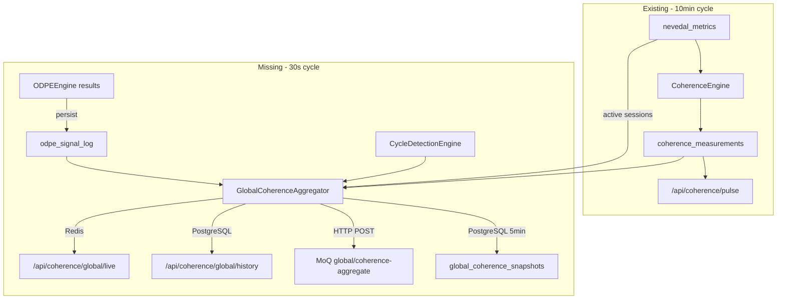

# Global Coherence Aggregation Pipeline

## Current State

The coherence infrastructure already has strong foundations:

- **CoherenceEngine** ([coherence_engine.py](backend/app/services/coherence_engine.py)) computes `global_coherence_index` via `measure_global()` using 5 weighted layers (individual 0.20, family 0.25, community 0.30, cultural 0.25) stored in `coherence_measurements`
- **CoherenceWorker** ([coherence_worker.py](backend/app/workers/coherence_worker.py)) runs every 600s calling `generate_pulse_snapshot()` which triggers `measure_global()`
- **NevedalEngine** ([nevedal_engine.py](backend/app/services/nevedal_engine.py)) computes per-session C_emo and stores to `nevedal_metrics`
- **ODPE Engine** ([odpe_engine.py](backend/app/services/odpe_engine.py)) computes signal classification per `think()` cycle but results are **not persisted**
- **MoQ namespace** `global/coherence-aggregate` is documented in [cloudflare-realtime-webrtc.mdc](.cursor/rules/cloudflare-realtime-webrtc.mdc) and referenced in [cloudflare_realtime_api.py](backend/app/routers/cloudflare_realtime_api.py) but has **no publisher**

## What's Missing




## Architecture

### 1. New Background Agent: `GlobalCoherenceAggregator`

**File:** `backend/app/services/global_coherence_aggregator.py`

30-second cycle agent that:

- Queries `nevedal_metrics` for active sessions (last 5 min)
- Reads ODPE signal distribution from new `odpe_signal_log` table
- Reads current layer scores from `coherence_measurements`
- Reads cycle signals from `cycle_detection_engine` (if available on `app_state`)
- Computes `GlobalCoherenceSnapshot`:
  - `global_c_emo_weighted` — weighted mean C_emo across active sessions (recency-biased)
  - `active_session_count` — sessions with metrics in last 5 min
  - `active_user_count` — distinct users
  - `cee_density` — fraction of active sessions in CEE window
  - `odpe_distribution` — `{LOCKED: N, PROMOTED: N, TENSION: N, NOISE: N, PROVISIONAL: N}`
  - `layer_scores` — latest individual/family/community/cultural/global
  - `cycle_signals` — population-level cycle detection (anonymized)
  - `trend_1h`, `trend_6h`, `trend_24h` — C_emo deltas vs prior windows
  - `timestamp`
- Stores to Redis key `nate:global:coherence:latest` (JSON, TTL 120s) for hot reads
- Every 5 min (every 10th cycle), persists to `global_coherence_snapshots` table
- Publishes to MoQ `global/coherence-aggregate` via HTTP POST to voice-edge worker

**Anonymization rule:** No user IDs, session IDs, names, or identifiable data in the snapshot. Only aggregate counts and metrics.

### 2. ODPE Signal Persistence

**File:** Modify [helix_orchestrator.py](backend/app/services/helix_orchestrator.py)

After ODPE evaluation in Step 4.5 of `think()`, log the signal to a new `odpe_signal_log` table:

```python
if odpe and self._db_pool:
    await self._persist_odpe_signal(odpe, cycle_id)
```

**New table `odpe_signal_log`:**

```sql
CREATE TABLE IF NOT EXISTS odpe_signal_log (
    id BIGSERIAL PRIMARY KEY,
    cycle_id UUID NOT NULL,
    dominant_signal VARCHAR(16) NOT NULL,
    dodec_amplitude DECIMAL(6,5),
    icosi_amplitude DECIMAL(6,5),
    resonance_ratio DECIMAL(8,5),
    context_tokens_recommended INTEGER,
    inference_tier VARCHAR(16),
    per_helix_signals JSONB DEFAULT '{}',
    created_at TIMESTAMPTZ NOT NULL DEFAULT NOW()
);
CREATE INDEX idx_odpe_signal_created ON odpe_signal_log(created_at);
```

### 3. Global Coherence Snapshots Table

**Migration file:** `backend/migrations/XXX_global_coherence_pipeline.sql`

```sql
CREATE TABLE IF NOT EXISTS global_coherence_snapshots (
    id BIGSERIAL PRIMARY KEY,
    snapshot_id UUID NOT NULL DEFAULT gen_random_uuid() UNIQUE,
    global_c_emo DECIMAL(6,5) NOT NULL,
    active_sessions INTEGER DEFAULT 0,
    active_users INTEGER DEFAULT 0,
    cee_density DECIMAL(6,5) DEFAULT 0,
    odpe_distribution JSONB DEFAULT '{}',
    layer_scores JSONB DEFAULT '{}',
    cycle_signals JSONB DEFAULT '{}',
    trend_1h DECIMAL(8,5),
    trend_6h DECIMAL(8,5),
    trend_24h DECIMAL(8,5),
    metadata JSONB DEFAULT '{}',
    captured_at TIMESTAMPTZ NOT NULL DEFAULT NOW()
);
CREATE INDEX idx_gcs_captured ON global_coherence_snapshots(captured_at);
```

### 4. REST API Endpoints

**File:** Modify [coherence_api.py](backend/app/routers/coherence_api.py) — add 2 endpoints:

- `GET /api/coherence/global/live` — reads from Redis `nate:global:coherence:latest`, falls back to latest `global_coherence_snapshots` row. Sub-second response, no DB query on hot path.
- `GET /api/coherence/global/history?hours=24&resolution=5m` — reads from `global_coherence_snapshots`, returns time series. Supports `hours` (1-168) and `resolution` (1m, 5m, 15m, 1h).

### 5. MoQ Publishing via Voice-Edge Worker

**File:** Modify [worker.js](cloudflare/workers/nate-voice-edge/worker.js)

Add handler for `POST /api/voice/moq/publish-coherence`:

- Accepts the anonymized `GlobalCoherenceSnapshot` JSON
- Validates HMAC signature (shared secret between backend and worker)
- Stores in KV `coherence:latest` (TTL 120s) for edge reads
- Returns success (actual MoQ relay publish is a future enhancement when Cloudflare exposes HTTP-based MoQ publish API)

Add handler for `GET /api/voice/moq/coherence`:

- Returns latest coherence snapshot from KV
- Zero-origin-pull for dashboard subscribers

### 6. Registration in main.py

**File:** Modify [main.py](backend/app/main.py)

- Import and instantiate `GlobalCoherenceAggregator`
- Pass `db_pool`, `redis_pool`, coherence_engine reference, cycle_detection_engine reference
- `await aggregator.start()` in lifespan, `await aggregator.stop()` in shutdown
- Add to `_service_checks`
- Add to `agent_status_digest.py`

### 7. Documentation Updates

- [voice-infrastructure.mdc](.cursor/rules/voice-infrastructure.mdc) — change Global coherence stream from "Planned" to "Wired" with code integration points
- [service-health-49-49.mdc](.cursor/rules/service-health-49-49.mdc) — add `global_coherence_aggregator` entry, update total count
- [service-health-124.mdc](.cursor/rules/service-health-124.mdc) — update count

## Key Design Decisions

- **30s cycle** (not 10s or 60s): Fast enough for "real-time feel" on dashboards, slow enough to avoid DB pressure. The CoherenceWorker's 10-min `measure_global()` continues independently for deep layer analysis.
- **Redis hot path**: `/api/coherence/global/live` never hits PostgreSQL on the happy path. Redis TTL 120s means at most 4 missed cycles before fallback.
- **PostgreSQL every 5 min** (not every 30s): 288 rows/day is manageable. 30s persistence would produce 2,880 rows/day — unnecessary for historical analysis.
- **ODPE persistence is lightweight**: One row per `think()` cycle. Only aggregate fields, not full per-face scores. The `per_helix_signals` JSONB captures the distribution.
- **No user IDs in snapshots**: Per rules 14 and 19 in the edge-worker-fleet and cloudflare-realtime-webrtc rules. Only counts and aggregate metrics.
- **HMAC-signed coherence publishes**: The voice-edge worker validates a shared secret to prevent spoofed coherence data.

