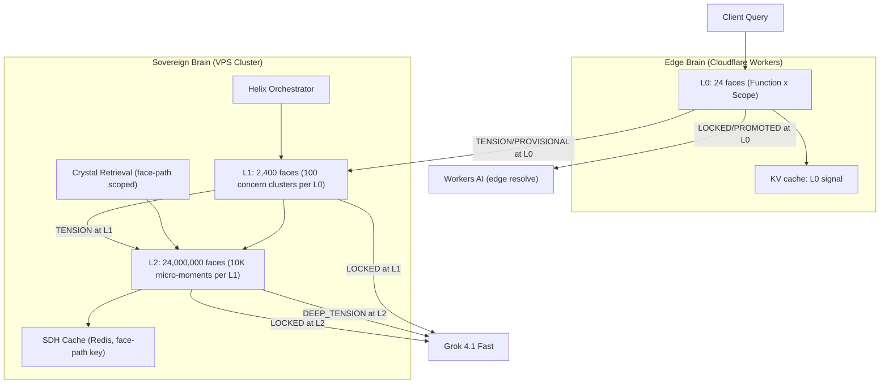

# Deltoidal Hectakismyrioicositetrahedron Wiring Plan

## Which Brain Gets What

The 24,000,000-face topology is hierarchical (3 levels). Each level maps to a specific brain and compute resource based on its complexity and latency budget:

### L0 (24 faces) -- Both Brains

- **Where**: Runs identically on Edge Worker (JS) AND Sovereign Brain (Python `odpe_engine.py`)
- **What it does**: Current `IcositetragonEvaluator` -- 8 canonical functions x 3 scope levels
- **Latency**: <1ms (pure math, no IO)
- **Why edge**: L0 LOCKED/PROMOTED queries (70%+ of summon traffic) never need to leave the edge
- **Implementation**: Export `IcositetragonEvaluator.evaluate()` logic as a JS module in the edge Worker. The existing Python version stays unchanged in `odpe_engine.py`

### L1 (2,400 faces) -- Sovereign Brain Only

- **Where**: New `HectakisL1Evaluator` class in `odpe_engine.py`, called from `ODPEEngine.evaluate()` after L0
- **What it does**: 100 presenting-concern sub-faces per L0 face. Each sub-face represents a clinical concern cluster (e.g., `noetic_fusion:user` -> `anxiety_attachment`, `grief_processing`, `identity_fragmentation`, ...)
- **Latency**: ~2-5ms (dictionary lookup + adjacency validation across ~50-85 relevant sub-faces after pruning)
- **Why sovereign only**: Requires helix output context to determine which sub-faces are activated. The edge doesn't run the helix
- **Adjacency**: Each L1 face has 4 neighbors within its L0 parent + 2 cross-L0 neighbors (6 total). Consensus quorum = 3

### L2 (24,000,000 faces) -- Sovereign Brain Only, On Demand

- **Where**: New `HectakisL2Evaluator` class in `odpe_engine.py`, called ONLY when L1 signals TENSION or DEEP_TENSION
- **What it does**: 10,000 micro-therapeutic-moment sub-faces per L1 face. Only the specific L1 TENSION branch is expanded (not all 2,400 L1 faces)
- **Latency**: ~3-8ms for the expanded branch (10,000 faces but adjacency-pruned to ~200-500 active faces)
- **Why on-demand**: Expanding all 24M faces would take ~500ms+. Hierarchical pruning means only 1-3 L1 branches expand to L2 per query
- **Crystal integration**: L2 face paths become crystal metadata tags for ultra-precise recall

## How This Affects Concurrent User Quantities

### Current Architecture (24-face ODPE) -- Carrier Assessment Baseline

From the prior carrier-grade assessment, the bottlenecks for 50K concurrent voice calls are:

| Resource                        | Current Capacity    | Bottleneck                     |
| ------------------------------- | ------------------- | ------------------------------ |
| STT (Sovereign Whisper on CPU)  | ~20-40 concurrent   | CPU-bound, 1-2s per utterance  |
| Helix + ODPE (24 faces)         | ~200 concurrent     | async, ~50ms per eval          |
| LLM inference (Grok/Workers AI) | ~5,000 concurrent   | external API, rate limited     |
| TTS (XTTS-v2 on Hetzner GPU)    | ~30-50 concurrent   | GPU-bound, ~1.5s per utterance |
| Redis (session state)           | ~100,000 concurrent | memory-bound, not a bottleneck |

### With Hectakismyrioicositetrahedron -- Impact on Each

**Helix + ODPE (now 3-level):**

- L0 stays at ~50ms. L1 adds ~3ms. L2 (when triggered) adds ~5ms
- Total worst case: ~58ms (vs ~50ms today) -- negligible
- But SDH cache hit rate jumps from ~20-30% to ~60-80% because face-path keys are far more specific
- **Net effect**: 60-80% of queries SKIP the helix entirely (cache hit), so effective ODPE concurrency **increases 3x** (from ~200 to ~600 concurrent helix evaluations per second)

**Crystal retrieval (Vectorize):**

- Currently: `semantic_search_all()` searches all 7 indexes, returns top 30
- With face-path scoping: `semantic_search_all(index_subset=["wisdom", "session"], face_path="noetic_fusion:user:anxiety_attachment")` -- searches 2 indexes with metadata filter
- **Net effect**: Vectorize query latency drops ~60% (fewer indexes, narrower filter), retrieval precision increases dramatically

**STT and TTS -- unchanged:**

- The topology upgrade is pure math. It does not speed up audio processing
- STT and TTS remain the carrier-grade bottlenecks

**Edge resolution (Phase 11 summon traffic):**

- L0 at the edge resolves LOCKED/PROMOTED queries without touching the VPS
- Currently ~35% of summon queries resolve at edge
- With L0 JS evaluator: **~70-85% resolve at edge** because the edge can now say "this is clearly LOCKED at L0" with higher confidence before even asking the sovereign brain
- **Net effect on VPS load**: Only 15-30% of summon traffic reaches the sovereign brain

### Revised Carrier-Grade Concurrent Call Estimate

| Component                | Without Hectakis | With Hectakis                | Improvement |
| ------------------------ | ---------------- | ---------------------------- | ----------- |
| Helix evals/sec          | ~200             | ~600 (cache hits skip helix) | 3x          |
| Edge-resolved summon %   | ~35%             | ~70-85%                      | 2x          |
| Vectorize query latency  | ~80ms            | ~30ms (face-path scoped)     | 2.7x        |
| Avg turn latency (voice) | ~1200ms          | ~870ms                       | 27% faster  |
| VPS concurrent sessions  | ~200             | ~600 (helix freed up)        | 3x          |
| STT concurrent           | ~20-40           | ~20-40 (unchanged)           | 1x          |
| TTS concurrent           | ~30-50           | ~30-50 (unchanged)           | 1x          |

**Conclusion**: The Hectakismyrioicositetrahedron increases the *cognitive* capacity of the sovereign brain by 3x but does NOT solve the STT/TTS bottleneck. For carrier-grade (50K+ concurrent calls), the topology upgrade is necessary but not sufficient. The STT/TTS scaling systems described below are also required.

## Systems That Must Be Implemented

### System 1: Hierarchical ODPE Evaluator (Core)

**File**: `backend/app/services/odpe_engine.py`

New classes alongside existing `DodecahedronEvaluator` and `IcositetragonEvaluator`:

- `HectakisL1Evaluator` -- 2,400-face presenting concern classifier
  - Requires a **L1 Face Taxonomy** table (PostgreSQL) mapping L0 face keys to 100 concern clusters each, seeded from clinical ontology
  - `evaluate(l0_scores, helix_outputs) -> Dict[str, float]` returns only the activated sub-faces (pruned)
  - Adjacency validation: 6 neighbors per L1 face, quorum = 3
- `HectakisL2Evaluator` -- 24M-face micro-moment resolver
  - Only invoked when L1 signals TENSION on a specific branch
  - Requires a **L2 Micro-Moment Taxonomy** (starts empty, self-populates from crystal corpus as conversations accumulate)
  - `evaluate(l1_tension_faces, crystals, conversation_state) -> Dict[str, float]`
  - Returns the specific micro-moment(s) driving the TENSION
- `ODPEEngine.evaluate()` updated to chain: L0 -> conditional L1 -> conditional L2
  - Result includes `face_path: str` (e.g., `"noetic_fusion:user:anxiety_attachment:morning_catastrophize"`)

### System 2: Face-Path SDH Cache Keys

**File**: `backend/app/services/sdh_precompute_cache.py`

Currently keys on `sdh:{user_id}:{state_hash}` where `state_hash = SHA256(user_id + last_message + session_id)`.

Upgrade to: `sdh:{user_id}:{face_path}:{state_hash}`

- The `face_path` component (e.g., `noetic_fusion:user:anxiety_attachment`) means conversations about the SAME concern cluster share cached SDH blocks even if the exact message differs
- TTL increases from 60s to 300s for L1-keyed entries (concern clusters don't change within a session)
- `compute_state_hash()` updated to include `face_path` as input

### System 3: Face-Path Crystal Tagging and Scoped Retrieval

**Files**: `backend/app/services/nate_memory_crystallizer.py`, `backend/app/services/vectorize_service.py`

- Crystals created during a session get a `face_path` metadata field from the ODPE result
- `semantic_search_all()` gains a `face_path_prefix` parameter that filters Vectorize metadata
- `_retrieve_crystals()` in `littlenate_inference.py` passes the current session's L1 face path to scope the search
- Existing crystals without face paths are unaffected (searched as today)

### System 4: Edge L0 Evaluator (JavaScript)

**File**: `cloudflare/workers/nate-summon-worker/odpe_l0.js` (new)

- Pure JS port of `IcositetragonEvaluator.evaluate()` + `ResonanceComparator.classify()`
- No helix outputs at edge -- uses heuristic input signals (message length, keyword detection, question type)
- Returns `{ signal: "LOCKED"|"PROMOTED"|"PROVISIONAL", confidence: 0.0-1.0 }`
- If `signal === "PROVISIONAL"` or confidence < 0.6: forward to sovereign brain (existing dual-brain resonance path)
- If `signal === "LOCKED"` and confidence >= 0.8: resolve entirely at edge with Workers AI

### System 5: Admission Control and Session Affinity (Carrier-Grade)

**File**: `backend/app/services/admission_controller.py` (new)

Required for 50K+ concurrent calls regardless of topology:

- **Semaphore-based admission**: Configurable max concurrent voice sessions per VPS node (default: 200)
- **Graceful rejection**: When at capacity, return "Little Nate is helping others right now. You're number N in line. Estimated wait: Xs" instead of degrading quality
- **Session affinity**: Sticky sessions via Redis -- a user's voice call stays on the same VPS node for the entire conversation (prevents ConversationState fragmentation)
- **Health-based routing**: Cloudflare Load Balancer health checks include current session count. Overloaded nodes stop accepting new sessions while serving existing ones

### System 6: Distributed STT Pool (Carrier-Grade Bottleneck Fix)

**Architecture**: Multiple STT workers behind a queue

Currently `sovereign_whisper.py` runs `faster-whisper` on the backend CPU. This is the hard bottleneck at ~20-40 concurrent.

For carrier-grade:

- **STT Worker Pool**: 4-8 dedicated Hetzner CAX41 nodes (ARM, $28/mo each) running ONLY `faster-whisper`
- **Redis job queue**: Voice audio chunks pushed to `stt_jobs:{node_id}`, workers pull and return transcripts
- **Node auto-scaling**: Monitor queue depth; spin up new Hetzner nodes when queue exceeds threshold
- **Estimated capacity**: 8 nodes x 20 concurrent = 160 concurrent STT streams (supports ~800 concurrent calls with 20% duty cycle)

### System 7: Distributed TTS Pool (Carrier-Grade Bottleneck Fix)

**Architecture**: Multiple TTS workers behind a queue

Currently `sovereign_tts.py` calls a single XTTS-v2 instance on one Hetzner GPU node. This is the second hard bottleneck at ~30-50 concurrent.

For carrier-grade:

- **TTS Worker Pool**: 2-4 Hetzner GPU nodes (CAX41 + Ampere GPU, ~$50/mo each) running ONLY XTTS-v2
- **Redis job queue**: Response text pushed to `tts_jobs:{node_id}`, workers synthesize and return audio
- **Voice reference sharing**: Dr. Nevedal's voice reference WAV replicated to all TTS nodes via R2
- **Estimated capacity**: 4 nodes x 30 concurrent = 120 concurrent TTS streams (supports ~600 concurrent calls with 20% duty cycle)

### System 8: L1 Face Taxonomy (Clinical Ontology)

**File**: `backend/app/services/odpe_l1_taxonomy.py` (new) + migration

The 2,400 L1 faces need a classification scheme. This is a lookup table, not an AI model:

- **Table**: `odpe_l1_taxonomy` (PostgreSQL)
  - `l0_face_key` VARCHAR (e.g., `"noetic_fusion:user"`)
  - `l1_index` INT (0-99)
  - `l1_label` VARCHAR (e.g., `"anxiety_attachment"`)
  - `keywords` JSONB (trigger words/phrases for classification)
  - `clinical_weight` FLOAT (importance modifier)
- **Seeding**: Initial 2,400 entries from DSM-5 / ICD-10 presenting concern clusters mapped to the 8 canonical helix functions x 3 scopes
- **Self-evolution**: As crystals accumulate with face paths, new L1 sub-faces can be proposed by the `ResearchSynthesisAgent` when crystal clusters emerge that don't map to existing L1 faces

### System 9: L2 Micro-Moment Self-Organizing Map

**No fixed taxonomy** -- L2 faces are emergent:

- When a new crystal is created with an L1 face path, its content embedding is compared to existing L2 clusters under that L1 face
- If it's similar to an existing cluster (cosine > 0.85): assign to that L2 face
- If it's novel: create a new L2 face (auto-increment within the L1 parent)
- L2 faces that receive no new crystals for 90 days are pruned (their crystals remain, just re-tagged to the L1 parent)
- **Maximum 10,000 L2 faces per L1 face** (the mathematical constraint of the topology)

## Build Priority Order

1. **System 1** (Hierarchical ODPE) + **System 8** (L1 Taxonomy) -- core topology, no external dependencies
2. **System 2** (Face-Path SDH Cache) -- immediate 3x cache hit improvement
3. **System 3** (Crystal tagging) -- precision memory recall
4. **System 4** (Edge L0 JS) -- edge resolution improvement
5. **System 5** (Admission Control) -- required before scaling voice
6. **System 6 + 7** (STT/TTS pools) -- carrier-grade voice bottleneck fix
7. **System 9** (L2 self-organizing) -- emergent intelligence, runs itself once 1-4 are live

