# JSON-to-PostgreSQL Migration Plan

## Scope Summary

The audit found **100+ JSON file read/write sites** across 8 routers/services using 14+ distinct JSON file types. Many of these have corresponding PG tables that already exist but are unused.

```mermaid
flowchart TD
    subgraph jsonFiles [JSON Files Currently Used]
        UR[user_registry.json]
        SJ[sessions.json]
        BJ[billing.json]
        MJ[metrics.json]
        CL[crisis_log.json]
        AL[audit_log.json]
        AJ[analytics.json]
        AV[availability.json]
        CN[coach_notes.json]
        HW[homework.json]
        MM[memory.json]
        AS[admin_settings.json]
    end

    subgraph pgTables [PG Tables That EXIST]
        UT[users table]
        CS[coaching_sessions]
        SUB[subscriptions + payment_history]
        CM[client_metrics + nevedal_metrics]
        CE[crisis_events]
        ALT[audit_log]
        DA[daily_analytics]
        CA[coach_availability]
        CNT[coach_notes]
    end

    subgraph noTable [NO PG Table]
        HWT[homework - NEEDS TABLE]
        MMT[memory per-user - memory_ledger differs]
        AST[admin_settings - use skyeye_settings]
    end

    UR --> UT
    SJ --> CS
    BJ --> SUB
    MJ --> CM
    CL --> CE
    AL --> ALT
    AJ --> DA
    AV --> CA
    CN --> CNT
    HW --> HWT
    MM --> MMT
    AS --> AST
```




## Reusable PG-First Pattern

Every conversion follows this pattern (already used in `admin.py` `get_dashboard_stats` and `sessions.py` `_load_sessions_pf`):

```python
pool = getattr(request.app.state, "db_pool", None)
if pool:
    try:
        async with pool.acquire() as conn:
            rows = await conn.fetch("SELECT ... FROM table WHERE ...", *params)
            # build response from rows
            return response
    except Exception as e:
        logger.warning("endpoint_name: PG read failed: %s", e)

# JSON fallback (legacy)
data = load_json(PATH / "file.json", default)
```

---

## Phase 0: PMB Tab Fix

The PMB nav tab already exists in [dashboard/command.html](dashboard/command.html) (line 1062) pointing to `pmb_reports.html`. The file [dashboard/pmb_reports.html](dashboard/pmb_reports.html) exists locally. The fix is purely a deployment step:

```bash
scp dashboard/pmb_reports.html root@68.183.168.75:/var/www/sovereign-command/
scp dashboard/pmb_reports.html root@68.183.168.75:/opt/clinical-sovereignty-lab/dashboard/
```

No code changes needed.

---

## Phase 1: `admin.py` -- user_registry.json and Other JSON Reads to PG-First

**File:** [backend/app/routers/admin.py](backend/app/routers/admin.py)

**Impact:** ~55 JSON read sites across 14 JSON file types. The 4 endpoints that already have PG-first (`get_dashboard_stats`, `get_all_users`, `get_coaches`, `get_crisis_watchlist`) serve as templates.

**Convert these endpoint groups (PG tables exist):**

- **user_registry.json reads** (~16 pure-JSON sites) -- use `users` table
  - `get_user_details`, `admin_reset_password`, `admin_reset_biometrics`, `admin_ban_user`, `admin_wipe_memory`, `admin_delete_user`, `approve_coach`, `assign_coach`, `get_metrics_distribution`, `get_revenue_metrics`, `process_refund`, `override_user_plan`, `create_coupon_legacy`, `emergency_purge`
- **sessions.json reads** (1 pure-JSON site) -- use `coaching_sessions` table
  - `get_user_details` session history
- **analytics.json reads** (3 pure-JSON sites) -- use `daily_analytics` table
  - `get_daily_analytics`, `trim_analytics_events`, `_load_events`
- **crisis_log.json reads** (1 pure-JSON site) -- use `crisis_events` table
  - `resolve_crisis`
- **billing.json reads** (4 pure-JSON sites) -- use `subscriptions` + `payment_history` tables
  - `get_revenue_metrics`, `get_failed_payments`, `process_refund`, `create_coupon_legacy`
- **audit_log.json reads/writes** (3 sites) -- use `audit_log` PG table
  - `_audit_log_append`, `process_refund`, `override_user_plan`
- **metrics.json per-user reads** (6 sites) -- use `nevedal_metrics`/`client_metrics` tables
  - Various endpoints reading `VAULT_ROOT/Clients/{hw_id}/metrics.json`

**Defer (no PG table):**

- `admin_settings.json` -- could use `skyeye_settings` table but low priority
- `notifications.json` -- could use `skyeye_activity` but low priority
- `learning_history.json` / `little_nate_wisdom.json` -- Night School specific
- `family_sanctuaries.json` -- `family_sanctuary_sessions` PG table exists but structure differs

---

## Phase 2: `coach.py` -- JSON Reads to PG-First

**File:** [backend/app/routers/coach.py](backend/app/routers/coach.py)

**Convert (PG tables exist):**

- **user_registry.json** (~5 sites) -- use `users` table
  - `get_assigned_clients`, `get_presession_brief`, `get_coach_stats`, `ask_nate_about_client`
- **sessions.json** (~3 sites) -- use `coaching_sessions` table
  - `get_assigned_clients`, `get_presession_brief`, `get_coach_stats`
- **metrics.json** -- already has PG-first via `_load_metrics_pg()` (keep as-is)
- **coach_notes.json** (~3 sites) -- use `coach_notes` PG table
  - `add_coach_note`, `get_coach_notes`
- **memory.json** (~2 sites) -- use `memory_ledger` PG table (structure check needed)
  - `get_presession_brief`, `ask_nate_about_client`

**Defer (no PG table):**

- **homework.json** (~3 sites) -- needs a new `homework_assignments` table via migration

---

## Phase 3: `sessions.py` -- Complete PG Migration (CRITICAL)

**File:** [backend/app/routers/sessions.py](backend/app/routers/sessions.py)

**Already PG-first** (7 endpoints via `_load_sessions_pf` / `_save_session_dual`):

- schedule, get_client, get_coach, get_upcoming, get_session, start_session, end_session

**Convert to PG-first** (10 endpoints still JSON-only):

- `delete_zoom_meeting` -- use `coaching_sessions` table
- `get_recording_status` -- use `coaching_sessions` table
- `archive_zoom_transcript` -- use `coaching_sessions` table + dual-write
- `update_session` -- use `upsert_session_pg` + dual-write
- `cancel_session` -- use `delete_session_pg` or status update + dual-write
- `get_available_slots` -- use `coaching_sessions` for conflict check
- `get_coach_stats` -- use `coaching_sessions` aggregate query
- `set_coach_availability` / `get_coach_availability` -- use `coach_availability` PG table
- `upload_classroom_video` -- use `coaching_sessions` or keep JSON (classroom-specific)

**Also fix:**

- `auto_analyze_transcript` reads `registry.json` -- switch to `users` table
- `archive_zoom_transcript` reads `user_registry.json` -- switch to `users` table
- `end_session` has a bug: `await db.execute(...)` on a Pool object (should use `async with db.acquire() as conn`)
- `zoom_meeting_map.json` -- no PG table, keep as-is (low volume, Zoom-specific)

---

## Phase 4: `billing.py` -- JSON Reads to PG-First

**File:** [backend/app/routers/billing.py](backend/app/routers/billing.py)

**The billing router has ~20 JSON operations.** PG tables exist: `subscriptions`, `payment_history`, `token_transactions`.

**Convert:**

- **billing.json** subscription reads -- use `subscriptions` table
  - `get_subscription`, `create_subscription`, `upgrade_subscription`, `downgrade_subscription`
- **billing.json** transaction reads -- use `payment_history` + `token_transactions` tables
  - `get_transactions`, `get_invoices`
- **user_registry.json** profile reads -- use `users` table
  - `get_usage`, `use_tokens`, `_find_user_profile`, `_get_stripe_customer`
- **billing.json** coaching pack reads -- keep JSON or create PG table
  - `get_user_coaching_packs`, `get_coaching_sessions`, `book_coaching_session_rest`, `cancel_coaching_session`

**Key change:** Every endpoint needs `request: Request` parameter added (many billing endpoints currently lack it, which is why they can't access `db_pool`).

---

## Phase 5: Other Routers

- **[backend/app/routers/client_data_api.py](backend/app/routers/client_data_api.py)** -- `_load_registry()` reads user_registry.json at 3 paths. Switch to `users` table via `request.app.state.db_pool`. `memory_search` uses per-user memory.json -- switch to `memory_ledger` PG table.
- **[backend/app/routers/me2me.py](backend/app/routers/me2me.py)** -- `_load_registry()` reads user_registry.json for tier checks. Switch to `users` table query.
- **[backend/app/websocket/sanctuary_engine.py](backend/app/websocket/sanctuary_engine.py)** -- reads `family_sanctuaries.json` and `user_registry.json`. PG tables exist (`family_sanctuary_sessions`, `users`). Convert reads.
- **[backend/app/services/drip_scheduler.py](backend/app/services/drip_scheduler.py)** -- `sweep_trial_expirations` reads user_registry.json for trial users. Switch to `users WHERE subscription_status = 'TRIAL_ACTIVE'`.
- **[backend/app/routers/coherence_api.py](backend/app/routers/coherence_api.py)** -- VERIFIED: Already PG-first with JSON fallback. No changes needed.

---

## Phase 6: Deploy and Verify

1. Deploy all changed Python files via `scp` to `/opt/clinical-sovereignty-lab/backend/app/`
2. Deploy `pmb_reports.html` to all 3 dashboard directories
3. `docker compose up -d backend` to restart
4. Verify `STARTUP COMPLETE: 87/87 services healthy`
5. Verify PMB tab loads at `command.sovereignsanctuary.net`
6. Trigger audit cascade, verify trust score maintained

---

## What NOT to Change (Defer)

- **homework.json** -- needs new PG table + migration (separate task)
- **admin_settings.json** -- could use `skyeye_settings` but low priority
- **notifications.json** -- could use `skyeye_activity` but structure differs
- **zoom_meeting_map.json** -- Zoom-specific, low volume
- **classroom_sessions.json** -- classroom-specific, low volume
- **learning_history.json / little_nate_wisdom.json** -- Night School specific, low volume
- **family_sanctuaries.json** -- structure mismatch with PG tables, needs careful mapping

## Risk Mitigation

- Every PG-first conversion retains the JSON fallback path, so if PG fails, the old behavior is preserved
- No new PG tables are created in this plan -- we only use existing tables
- The `profile_data` JSONB guard (`isinstance(pd, str): json.loads(pd)`) must be applied everywhere
- All `except Exception` blocks must use `logger.warning()` per the silent-exception-prevention rule

