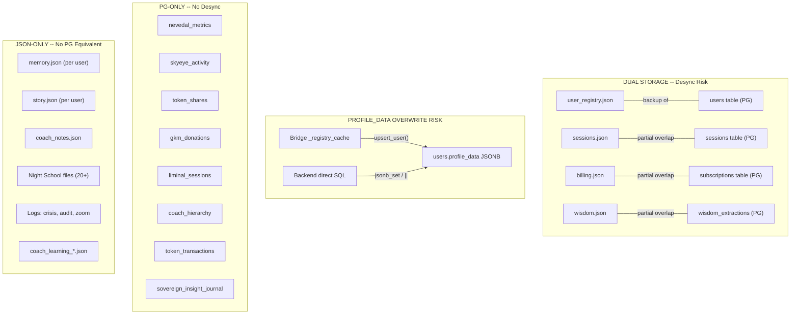
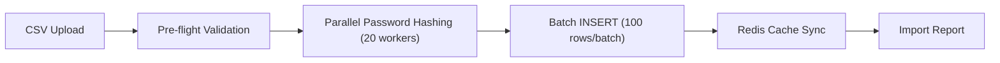

# JSON to PostgreSQL Data Sovereignty Plan

## The Real Problem

Not all JSON needs to move to PG. The actual risks are:

1. **URGENT** -- The bridge's `upsert_user()` in `user_store.py` overwrites 17 DB-owned `profile_data` keys with stale cache values (same pattern as the token_balance bug, but affecting MFA, sentinel, subscriptions, and usage counters)
2. **HIGH** -- Critical operational data (sessions, billing, wisdom) exists in BOTH JSON and PG with no sync, so reads can return stale/contradictory data
3. **MEDIUM** -- 30+ JSON files have no PG equivalent at all (single point of failure on disk)
4. **LOW** -- Per-user vault files (memory, story, coach notes) are single-writer so they don't desync, but they're not backed up by PG

## Current Data Architecture




## Phase 0: Fix profile_data Overwrite (URGENT -- Day 1)

The bridge's `upsert_user()` currently does:

```sql
profile_data = jsonb_set(
    COALESCE(EXCLUDED.profile_data::jsonb, users.profile_data),
    '{token_balance}', ...
)
```

`EXCLUDED.profile_data` (bridge cache) wins. Only `token_balance` is patched back. **17 other keys are at risk.**

**Fix**: Change the merge strategy in [user_store.py](backend/app/websocket/user_store.py) to protect all DB-owned keys:

```sql
profile_data = COALESCE(EXCLUDED.profile_data::jsonb, users.profile_data)
    || COALESCE(
        (SELECT jsonb_object_agg(key, value)
         FROM jsonb_each(users.profile_data)
         WHERE key IN (
             'webauthn_enabled', 'webauthn_credentials', 'webauthn_credential',
             'webauthn_last_verified', 'webauthn_active_key',
             'totp_secret', 'totp_enabled',
             'phone', 'sms_verified',
             'sentinel_frozen', 'sentinel_auth_method',
             'token_usage_today', 'token_usage_month', 'last_token_reset',
             'subscription_plan', 'payment_source',
             'checkin_snooze_until'
         )),
        '{}'::jsonb
    )
```

This takes the bridge's full profile, then overlays DB-owned keys from the existing PG row. Adding a new DB-owned key = adding one string to the IN list.

**At-risk fields by category:**

Security-critical (11 keys):

- `webauthn_enabled`, `webauthn_credentials`, `webauthn_credential` -- YubiKey registration
- `webauthn_last_verified`, `webauthn_active_key` -- auth tracking
- `totp_secret`, `totp_enabled` -- TOTP authenticator
- `phone`, `sms_verified` -- SMS verification
- `sentinel_frozen`, `sentinel_auth_method` -- Sentinel state

Operational (6 keys):

- `token_usage_today`, `token_usage_month`, `last_token_reset` -- usage counters
- `subscription_plan`, `payment_source` -- IAP billing
- `checkin_snooze_until` -- check-in snooze

## Phase 1: Eliminate Dual Storage (Week 1-2)

These files have BOTH JSON and PG storage with no sync. One must become authoritative and the other eliminated.

### 1a. `sessions.json` --> `sessions` table (PG-only)

- Currently: bridge writes to JSON, some routers read from PG, some from JSON
- Fix: All session writes go to PG via `db_pool`, JSON write becomes backup-only (like user_registry)
- Files: `bridge_server.py`, `sessions.py`, `coach.py`

### 1b. `billing.json` --> `subscriptions` / `token_transactions` tables (PG-only)

- Currently: `billing.py` reads/writes JSON; `stripe_integration.py` writes PG
- Fix: Retire JSON reads in `billing.py`, read from PG tables instead
- Files: `billing.py`, `bridge_server.py`

### 1c. `wisdom.json` --> `wisdom_extractions` table (PG-only)

- Currently: Night School writes JSON files, wisdom pipeline auditor checks PG
- Fix: Night School `_save_wisdom()` writes to PG, JSON becomes backup
- Files: `night_school_director.py`, `sanctuary_engine.py`

## Phase 2: Critical JSON-Only Files --> PG (Week 3-4)

These are currently JSON-only with no PG backup. A disk failure loses them permanently.

### Priority order (by clinical/business impact):


| Priority | File(s)                          | New PG Table            | Rationale                                              |
| -------- | -------------------------------- | ----------------------- | ------------------------------------------------------ |
| P0       | `memory.json` (per user)         | `user_memories`         | Little Nate's conversational memory -- core to therapy |
| P0       | `story.json` (per user)          | `client_narratives`     | Client story context -- irreplaceable                  |
| P1       | `coach_notes.json`               | `coach_session_notes`   | Coach observations -- clinical record                  |
| P1       | `breakthroughs.json`             | `client_breakthroughs`  | Breakthrough moments -- clinical value                 |
| P1       | `coach_learning_*.json`          | `coach_learning_queue`  | Coach development tracking                             |
| P2       | Night School files (20+)         | `night_school_*` tables | Wisdom, curriculum, DOJO logs, assessments             |
| P2       | `availability.json`              | `coach_availability`    | Coach scheduling                                       |
| P3       | Log files (crisis, zoom, search) | `system_logs`           | Operational logs -- less critical                      |
| P3       | `analytics.json`                 | `platform_analytics`    | Analytics snapshots                                    |


### Migration pattern for each:

1. Create PG table with migration SQL
2. Add dual-write: write to PG first, then JSON as backup
3. Switch all reads to PG
4. Remove JSON writes (keep JSON as disaster-recovery backup)
5. Add to appropriate auditor's `TAB_ENDPOINTS` if API endpoints are created

## Phase 3: What Should Stay as JSON (No Migration Needed)

These files are fine as JSON:

- `google-service-account.json` -- external credential, not our data
- `admin_settings.json` -- small config, single writer
- `zoom_meeting_map.json` -- ephemeral mapping, recreated on restart
- Report files (`report_*.json`) -- generated artifacts, not source-of-truth
- Search audit JSONL -- append-only log, fine as file

## What This Means for Data You Asked About


| System                       | Storage Today                                   | Desync Risk                   | After Plan           |
| ---------------------------- | ----------------------------------------------- | ----------------------------- | -------------------- |
| **Nevedal Labs / CEE**       | `nevedal_metrics` (PG) + `metrics.json` (vault) | LOW -- PG is primary          | Safe (PG-only reads) |
| **SkyEye Sessions**          | PG tables only                                  | NONE                          | Safe                 |
| **DOJOs**                    | PG tables (`coaching_mesh_*`)                   | NONE                          | Safe                 |
| **Night School / Wisdom**    | JSON primary, PG partial                        | MEDIUM -- JSON/PG can diverge | Phase 2 fixes this   |
| **Little Nate Memory**       | JSON only (`memory.json`)                       | HIGH -- no backup             | Phase 2 adds PG      |
| **Little Nate Observations** | PG only (`liminal_sessions`)                    | NONE                          | Safe                 |
| **Chat History / Briefs**    | PG only (`skyeye_activity`)                     | NONE                          | Safe                 |
| **PMB Reports**              | Computed from PG + `metrics.json`               | LOW -- PG values correct      | Safe                 |
| **GKM 501(c)(3)**            | PG only (`gkm_donations`, `token_shares`)       | NONE                          | Safe                 |
| **BLE/NFC Sharing**          | PG only (`token_shares`)                        | NONE                          | Safe                 |
| **Insight Accumulator**      | PG only (`sovereign_insight_journal`)           | NONE                          | Safe                 |
| **Coach Hierarchy**          | PG only (`coach_hierarchy`)                     | NONE                          | Safe                 |
| **Token Economy**            | PG + bridge cache                               | FIXED -- Redis sync added     | Safe                 |
| **MFA / Security**           | PG `profile_data` + bridge cache                | **HIGH -- UNPROTECTED**       | Phase 0 fixes this   |


## Phase 4: Enterprise Bulk Import (Week 5+)

The platform currently has ~40 users. A corporate client importing 5,000+ accounts from CSV/Excel would hit several bottlenecks. This phase adds enterprise-grade bulk onboarding.

### Current Limitations


| Bottleneck        | Current State                                               | At 5,000 Users                  |
| ----------------- | ----------------------------------------------------------- | ------------------------------- |
| Registration path | WebSocket-only (`register_new_user()`)                      | No REST API for batch creation  |
| Password hashing  | Sequential, 100-200ms each (`pbkdf2_hmac`, 100k iterations) | 8-17 minutes sequential         |
| DB inserts        | One-at-a-time via `upsert_user()`                           | 5-10 minutes sequential         |
| Coach assignment  | All default to CoachN                                       | 5,000 unassigned clients        |
| Bridge cache      | Not notified of new users                                   | Requires restart to see imports |
| CSV/Excel parsing | No capability exists                                        | Need parser added               |


### Solution: `POST /api/admin/bulk-import/users`

New endpoint in [admin.py](backend/app/routers/admin.py) (requires `require_admin`):

**Input**: CSV or Excel file upload with columns:

```
name, email, username, password, plan, coach_username, family_group, phone
```

**Processing pipeline**:




**Phase 4a: Endpoint + CSV parser**

- Accept `multipart/form-data` with CSV file
- Parse with Python `csv` module (no pandas dependency needed)
- Column mapping: required (`name`, `email`, `username`, `password`) + optional (`plan`, `coach_username`, `family_group`, `phone`)
- Return job ID for progress tracking

**Phase 4b: Pre-flight validation (before any inserts)**

- Check all usernames for uniqueness against `users` table in one query
- Validate email format
- Verify referenced `coach_username` values exist with role=COACH
- Validate `plan` values against CHECK constraint (`TRIAL`, `STANDARD`, etc.)
- Collect all errors, return detailed report: `{row: N, field: "username", error: "already exists"}`
- Reject entire batch if critical errors found (atomic -- all or nothing)

**Phase 4c: Parallel password hashing**

- Use `asyncio.to_thread()` with `asyncio.gather()` for 20 concurrent hash workers
- 5,000 passwords at 20 concurrent: ~25-50 seconds (vs. 8-17 minutes sequential)
- Each hash uses existing `hash_password()` function (pbkdf2_hmac, 100k iterations, 32-char hex salt)

**Phase 4d: Batch PostgreSQL insert**

- Use `asyncpg.copy_records_to_table()` or multi-row INSERT with `executemany()`
- Set all 3 coach assignment fields (`coach_id`, `assigned_coach_id`, `assigned_coach`)
- Set default token allocation per plan (TRIAL=10,000, STANDARD=50,000)
- Family grouping: create `families` rows first, then assign `family_id` UUIDs

**Phase 4e: Post-import bridge sync**

- Publish Redis `nate:user_imported` event for each new user (or batch event with count)
- Bridge listener reloads affected users from PG into `_registry_cache`
- Alternative: single `nate:registry_reload` event triggers full cache refresh from PG

**Performance targets**:

- Pre-flight validation: ~5 seconds for 5,000 rows
- Password hashing (20 workers): ~30 seconds
- Batch INSERT: ~10 seconds
- Cache sync: ~5 seconds
- **Total: ~1 minute for 5,000 users**

**Memory**: 5,000 users x ~5KB = ~25MB added to bridge cache (acceptable)

**PG capacity**: The `users` table with proper indexes handles millions of rows. 5,000 is trivial for PostgreSQL.

### What a corporate CSV would look like

```csv
name,email,username,password,plan,coach_username,family_group,phone
"John Smith",john@corp.com,jsmith,TempPass123!,STANDARD,CoachN,,555-0101
"Jane Doe",jane@corp.com,jdoe,TempPass456!,STANDARD,CoachN,,555-0102
```

Optional: `force_password_reset=true` column to require password change on first login.

## Summary

The answer is **not** "move all JSON to PG." The answer is:

1. **Phase 0 (urgent)**: Fix the `profile_data` overwrite in `upsert_user()` -- 17 keys at risk, including MFA and Sentinel
2. **Phase 1**: Eliminate dual-storage for `sessions.json`, `billing.json`, `wisdom.json`
3. **Phase 2**: Migrate clinically critical JSON-only files (`memory.json`, `story.json`, `coach_notes.json`) to PG for durability
4. **Phase 3**: Leave ephemeral/config JSON files alone
5. **Phase 4**: Enterprise bulk import endpoint for 5,000+ client onboarding from CSV/Excel (~1 minute target)

Most of the critical systems (SkyEye, DOJOs, GKM, BLE, Nevedal Labs, Insights, Liminal, Coach Hierarchy) are already PG-only and syncing correctly. The bridge cache overwrite is the single biggest remaining risk. Enterprise bulk import is a new capability that unlocks corporate client onboarding.