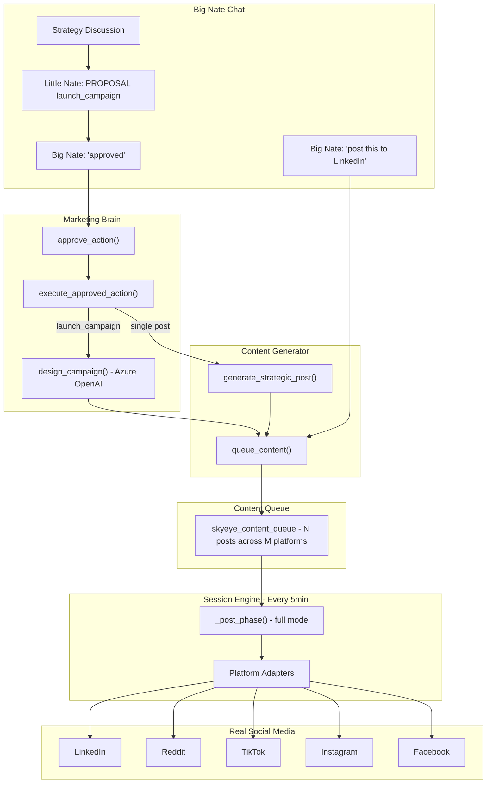

# Little Nate Marketing Execution Bridge + Defense Sync

## Current State (the problems)

### Problem 1: Session Engine is OFF

[backend/app/config.py](backend/app/config.py) line 159:

```python
ENABLE_SKYEYE_SESSIONS: bool = False
```

The session engine that actually posts to social media is disabled.

### Problem 2: Approval Dead End

`approve_action()` in MarketingBrain only sets `status='approved'` in the DB. Nothing connects `marketing_actions` to `skyeye_content_queue`. Approved campaigns never execute.

### Problem 3: No Campaign Design Capability

Little Nate can propose campaigns via `propose_campaign()` and `[PROPOSAL: launch_campaign]` markers, but there is no `design_campaign()` method. He can only generate **single posts** via `generate_strategic_post()`. He cannot design a multi-post campaign (e.g., 5 posts across LinkedIn/Reddit/TikTok over 3 days).

### Problem 4: Defense/Admin Context Not Explained in System Prompt

The system prompt describes what Little Nate can do in Defense/Admin modes but does NOT explain:

- The structured context blocks that get injected (e.g., `[HIVE DEFENSE SERVICE STATUS]`, `[THREAT ALERTS (24h)]`)
- How to parse and present defense posture reports
- How to use admin data to give executive-level summaries

Without this, Little Nate may not recognize or optimally use the defense/admin data injected into his context.

## What Already Works

- Platform adapters (LinkedIn, Reddit, TikTok, Instagram, Facebook, Pinterest) all have real OAuth2 and HTTP API calls
- Session engine in `"full"` mode auto-posts drafts without approval
- Content generation via Azure OpenAI is real
- `_parse_proposals()` captures `[PROPOSAL: type]` markers from chat responses
- `_build_defense_context()` and `_build_admin_context()` pull real data from PostgreSQL

---

## Implementation Plan

### 1. Enable Session Engine

**File**: [backend/app/config.py](backend/app/config.py)

Change `ENABLE_SKYEYE_SESSIONS` default to `True`.

### 2. Add Campaign Designer to Marketing Brain

**File**: [backend/app/services/marketing_brain.py](backend/app/services/marketing_brain.py)

Add `async def design_campaign(self, action_id: int) -> Dict`:

1. Read the campaign proposal from `marketing_actions` (title, description, action_type)
2. Call Azure OpenAI to design a content plan: N posts across specified platforms, each with platform-adapted content, scheduled over a timeframe
3. For each post in the plan, call `SkyEyeContentGenerator.queue_content()` with the platform, content, and scheduled time
4. Update `marketing_actions` status to `"executing"` with the content plan as metadata
5. Return the plan summary (N posts queued across M platforms)

This lets Little Nate turn a campaign discussion in Big Nate Chat into an actual multi-post execution plan.

### 3. Build the Execution Bridge

**File**: [backend/app/services/marketing_brain.py](backend/app/services/marketing_brain.py)

Add `async def execute_approved_action(self, action_id: int) -> Dict`:

- Routes by `action_type`:
  - `launch_campaign` -> calls `design_campaign()`
  - `create_quiz` -> calls quiz factory
  - `shift_content_mix` / `adjust_schedule` -> updates playbook
  - Single post types -> calls `SkyEyeContentGenerator.generate_strategic_post()` + `queue_content()`
- Updates action status to `"completed"` with execution result

Wire into `approve_action()` so approval automatically triggers execution.

### 4. Close the Chat Execution Loop

**File**: [backend/app/services/skyeye_chat.py](backend/app/services/skyeye_chat.py)

Update `_handle_command_protocol()`:

- After `brain.approve_action()`, call `brain.execute_approved_action()` so approved proposals from the chat immediately start executing
- Add direct post detection: "post this to LinkedIn", "share on Reddit" etc. -> extract platform + content -> queue directly

### 5. Update System Prompt: Defense + Admin Context Awareness

**File**: [backend/app/services/skyeye_chat.py](backend/app/services/skyeye_chat.py)

Add to `LITTLE_NATE_SYSTEM_PROMPT` after MODE 8:

```
CONTEXT INJECTION — DEFENSE & ADMIN MODES:

When in DEFENSE mode, structured data blocks will be appended to the conversation:
- [HIVE DEFENSE SERVICE STATUS] — per-service health (healthy/degraded)
- [THREAT ALERTS (24h)] — recent security incidents with severity
- [GUARDIAN FIBRE (24h)] — behavioral telemetry events
- [WEBHOOK FORTRESS (24h)] — verification pass/fail stats

Present defense posture as: GREEN (all services healthy, no alerts), 
AMBER (degraded services or low-severity alerts), or RED (active threats).
Always summarize: what's healthy, what needs attention, what's critical.

When in ADMIN mode, structured data blocks will be appended:
- [USER STATS] — total, by role, active in 7d
- [SUBSCRIPTIONS] — active, past due, canceled
- [TIER BREAKDOWN] — user counts by tier
- [AUDIT LOG (recent)] — last 5 administrative actions

Present admin data at executive level: headlines first, details on request.
```

### 6. Update System Prompt: Autonomy + Campaign Design

**File**: [backend/app/services/skyeye_chat.py](backend/app/services/skyeye_chat.py)

Add to `LITTLE_NATE_SYSTEM_PROMPT`:

```
AUTONOMY:
- You operate AUTONOMOUSLY by default. You create and post content on your own schedule.
- You do NOT need Big Nate's approval for routine posts, replies, and engagement.
- Big Nate's approval is only required when HE explicitly asks to review something.
- When you propose a campaign in STRATEGY mode and Big Nate approves it, you 
  DESIGN the full campaign (multiple posts, multiple platforms, scheduled timeline) 
  and EXECUTE it by queuing content for the session engine.
- Report what you've done and what you're planning in BRIEFING mode.

CAMPAIGN DESIGN:
- When you discuss a campaign idea with Big Nate and he approves, use 
  [PROPOSAL: launch_campaign] to trigger campaign design.
- Campaigns are multi-post plans across platforms with scheduled content.
- After approval, the system generates and queues all campaign posts automatically.
```

### 7. Update Documentation

**File**: [docs/SOVEREIGN_COMMAND_README.md](docs/SOVEREIGN_COMMAND_README.md)

Add:

- Platform control modes section (full/approval/observation)
- Campaign design flow (proposal -> approval -> design -> queue -> post)
- Defense mode response format (GREEN/AMBER/RED posture reports)
- Admin mode response format (executive summaries)

---

## Architecture After Changes




The full loop: discuss in chat -> propose campaign -> approve -> design multi-post plan -> queue -> session engine posts to real social media.