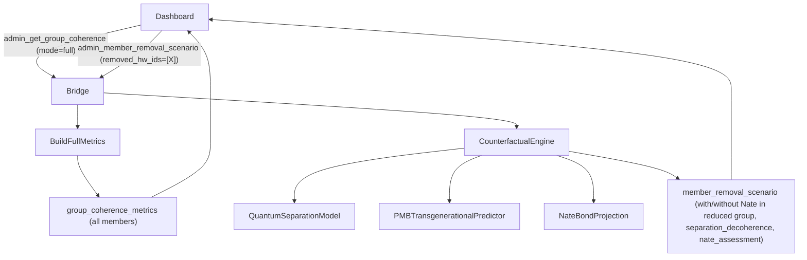

# Member Removal Counterfactual Engine

## What changes today

Currently, deselecting a member in the dashboard simply re-sends `admin_get_group_coherence` with a smaller `selected_members` list, collapsing everything to the smaller group. The With/Without Nate panels show the surviving group only. Decoherence signals reset to the reduced set.

The user wants: **when you remove member X**, the top stats remain visible as a counterfactual ("what does this group look like without X?"), decoherence redefines itself as the quantum entanglement disruption *caused* by X's removal, and Nate evaluates the removal using PMB transgenerational predictions.

---

## Architecture




---

## 1. New WebSocket handler in bridge_server.py

**File:** `[backend/app/websocket/bridge_server.py](backend/app/websocket/bridge_server.py)`

Add a new `elif t == "admin_member_removal_scenario":` branch after the existing `admin_get_group_coherence` handler (~line 17470).

**Input message:**

```json
{
  "type": "admin_member_removal_scenario",
  "group_id": "FAM_0F706896",
  "group_type": "family",
  "removed_member_ids": ["HARDWARE_ID_BILL"],
  "remaining_member_ids": ["HARDWARE_ID_LISA"]
}
```

**What it computes:**

### A. Baseline (full group) — reuse existing logic

Pull the full group's `with_wellness`, `without_wellness`, `nate_contribution`, and per-member `nate_coherence_per_member` exactly as the current `admin_get_group_coherence` handler does. This becomes the `baseline` in the response.

### B. Reduced group With/Without Nate

Re-run the same `with_nate_matrix` / `without_nate_matrix` / `wellness_index` logic on only the `remaining_member_ids`. This gives the reduced-group With Nate and Without Nate scores.

### C. Quantum Separation Decoherence model

For each removed member X paired with each remaining member Y, compute a **separation decoherence score** using three quantum analogs:

```python
# Quantum entanglement shift: how tightly bonded were they?
entanglement_strength = with_nate_matrix_full.get(f"{X}:{Y}", 0.5)

# Quantum tunnelling factor: X's historical CEE window frequency
# (how often X was a "bridge" between states — from nevedal_state pmb.reconsolidation_readiness)
tunnelling_factor = ns_x.get("pmb", {}).get("reconsolidation_readiness", 0.5)

# Quantum quak adjustment: emotional separation cost
# based on X's shame_index, legacy_patterns count, and C_emo_trend
shame_x = ns_x.get("shame_profile", {}).get("shame_index", 0.0)
legacy_depth = min(len(ns_x.get("pmb", {}).get("legacy_patterns", [])), 5) / 5.0
c_emo_trend_x = ns_x.get("C_emo_trend", 0.0)
quak_adjustment = shame_x * 0.4 + legacy_depth * 0.35 + max(0, -c_emo_trend_x) * 0.25

separation_decoherence = round(min(1.0,
    entanglement_strength * 0.40 +
    tunnelling_factor * 0.30 +
    quak_adjustment * 0.30
), 3)

trend = "critical" if separation_decoherence > 0.55 else "significant" if separation_decoherence > 0.30 else "moderate"
```

Each pair emits a `separation_decoherence` signal with: `risk`, `trend`, `entanglement_strength`, `tunnelling_factor`, `quak_adjustment`, `names`.

### D. PMB Transgenerational Nate Assessment

For each removed member X, pull their PMB data:

- `legacy_patterns` (transgenerational): list of detected pattern categories (`emotional_suppression`, `abandonment`, `enmeshment`, etc.)
- `predictions` from `_compute_pmb` (behavioral cycle predictions with confidence ≥ 0.5)
- `crisis_perception` baseline type (MINIMIZER / AMPLIFIER / NORMALIZER / CALIBRATED)
- `reconsolidation_readiness` score
- `c_emo_trend`, `engagement`, `mood_trend`

Nate uses this to generate a brief structured assessment:

```python
nate_assessment = {
    "removed_member": X_name,
    "separation_risk": "high|moderate|low",  # derived from quak_adjustment + legacy_depth
    "transgenerational_patterns": [p["category"] for p in legacy_patterns[:3]],
    "behavioral_predictions": predictions[:2],  # top-2 by confidence
    "reconsolidation_readiness": reconsolidation_readiness,
    "crisis_perception_type": crisis_perception_baseline,
    "nate_recommendation": _build_removal_recommendation(...)  # text string
}
```

`_build_removal_recommendation()` is a small helper that returns a one-sentence clinical observation based on the combination of `separation_risk`, `crisis_perception_type`, and top transgenerational pattern.

### E. Full response payload `member_removal_scenario`

```json
{
  "type": "member_removal_scenario",
  "group_id": "...",
  "removed_members": [{ "id": "...", "name": "Bill" }],
  "remaining_members": [...],
  "baseline": {
    "with_nate": { "wellness_index": 0.55, "network_bonds": [...] },
    "without_nate": { "wellness_index": 0.73, "network_bonds": [...] },
    "nate_contribution": -0.18,
    "nate_coherence_per_member": {...}
  },
  "reduced": {
    "with_nate": { "wellness_index": 0.59, "network_bonds": [...] },
    "without_nate": { "wellness_index": 0.71, "network_bonds": [...] },
    "nate_contribution": -0.12,
    "nate_coherence_per_member": {...}
  },
  "separation_decoherence": {
    "BILL_ID:LISA_ID": {
      "risk": 0.47,
      "trend": "significant",
      "entanglement_strength": 0.63,
      "tunnelling_factor": 0.55,
      "quak_adjustment": 0.22,
      "names": ["Bill", "Lisa"]
    }
  },
  "nate_assessments": [{ "removed_member": "Bill", ... }]
}
```

---

## 2. Dashboard changes in nevedal_lab_family.html

**File:** `[dashboard/nevedal_lab_family.html](dashboard/nevedal_lab_family.html)`

### A. Member toggle now triggers counterfactual

Modify `toggleMember(el)` (~line 476): when a **human** member (not Nate) is toggled OFF, instead of immediately calling `renderAll(lastData)` with the reduced set, it:

1. Adds the member to a `removedMembers = {}` map
2. Sends the new `admin_member_removal_scenario` WebSocket message with `removed_member_ids` and `remaining_member_ids`
3. Shows a loading shimmer on the three stat cards while waiting

When a member is toggled back ON, it clears them from `removedMembers`, and re-sends `admin_get_group_coherence` to return to the full group state.

Nate toggle remains unchanged (toggles Nate from the network visualization only, using `includeNate`).

### B. Handle `member_removal_scenario` WebSocket message

Add a new `case "member_removal_scenario":` branch in the WS `onmessage` handler. It stores `lastRemovalData` and calls `renderRemovalScenario(data)`.

### C. `renderRemovalScenario(data)` — new function

- **Top 3 stat cards**: render `baseline` With/Without Nate and Nate's Contribution (unchanged from the full group — these are the baseline stats). Add a small "Baseline (full group)" label beneath the cards.
- **Coherence Network (left canvas "WITH NATE")**: draws the reduced group only, using `reduced.with_nate.network_bonds`. Removed members render as **ghost nodes** — faded rings with dashed outline at their original position.
- **Coherence Network (right canvas "WITHOUT NATE")**: same with `reduced.without_nate.network_bonds`.
- **Decoherence section**: replace/supplement the normal decoherence signals with `separation_decoherence` signals. Each shows:
  - Pair name: "Bill ↔ Lisa (Separation)"
  - Separation decoherence risk bar
  - Three sub-metrics: Entanglement Strength, Tunnelling Factor, Quak Adjustment
  - Trend badge: CRITICAL / SIGNIFICANT / MODERATE
- **Nate Assessment panel** (new element, collapsible): shows `nate_assessments[0]` — removed member name, separation risk, top transgenerational patterns, behavioral predictions, Nate's one-line recommendation.

### D. Ghost node rendering in `draw2DNetwork`

Add a `ghostIds` parameter. Removed members are placed at their original circular position but drawn at 25% opacity with a dashed circle border. Their bonds to remaining members are drawn as dashed lines colored by `separation_decoherence[pair].risk` (red = high, orange = moderate, gray = low).

---

## 3. Add `_SENTINEL_SKIP` entry

**File:** `[backend/app/websocket/bridge_server.py](backend/app/websocket/bridge_server.py)`

Add `"admin_member_removal_scenario"` to the `_SENTINEL_SKIP` frozenset (it is read-only analysis, no state changes).

---

## Files changed

- `[backend/app/websocket/bridge_server.py](backend/app/websocket/bridge_server.py)` — new WS handler + quantum separation model + PMB assessment builder
- `[dashboard/nevedal_lab_family.html](dashboard/nevedal_lab_family.html)` — toggle logic, new WS message handler, ghost nodes, separation decoherence UI, Nate assessment panel

