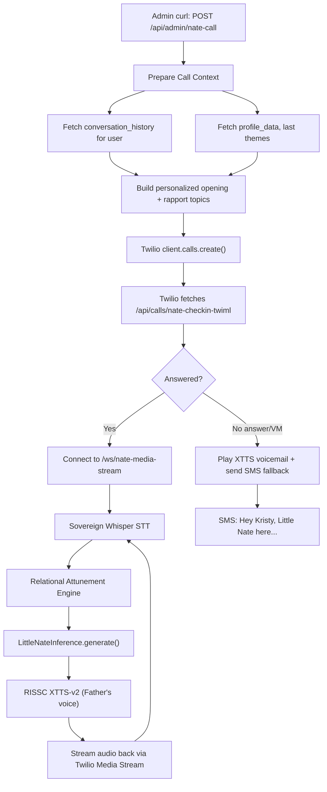

# Little Nate Outbound Voice Check-In System

## Overview

Build a complete outbound check-in call pipeline where Little Nate can autonomously call a client, introduce himself using conversation memory, hold a relational conversation using the RISSC voice + attunement engine, and fall back to SMS/email/voicemail if unanswered. The first test target is Kristy Moore (`sweet2noend` client account, phone: `734-679-9310`).

## Architecture




## What Exists vs What's Missing


| Component                                 | Status                                                 | File                                                      |
| ----------------------------------------- | ------------------------------------------------------ | --------------------------------------------------------- |
| Twilio outbound `calls.create()`          | Exists                                                 | `backend/app/routers/twilio_voice.py`                     |
| TwiML webhook for media stream            | Exists (needs variant for Nate-initiated)              | `twilio_voice.py`                                         |
| CallCoachingEngine (media stream handler) | Exists but is coaching-only, not conversational        | `backend/app/services/call_coaching_engine.py`            |
| `/ws/media-stream` WebSocket route        | **MISSING** — TwiML references it but it doesn't exist | Needs creation                                            |
| Conversation memory + attunement          | Just built                                             | `relational_attunement.py`, `littlenate_realtime.py`      |
| RISSC voice (Father's clone)              | Just built                                             | `rissc_voice.py`, `sovereign_tts.py`, Hetzner XTTS server |
| LittleNateInference pipeline              | Built                                                  | `littlenate_inference.py`                                 |
| Admin check-in call endpoint              | **MISSING**                                            | Needs creation                                            |
| Personalized opening from history         | **MISSING**                                            | Needs creation                                            |
| SMS/email fallback on no answer           | Partially exists (check-in agent has SMS)              | Needs wiring                                              |


## Files to Create/Modify

### 1. NEW: `backend/app/services/nate_outbound_call.py` — Outbound Call Orchestrator

The brain that prepares a check-in call:

- `prepare_checkin_context(username, db_pool)` — queries `conversation_history` (last 10 entries), `profile_data` (name, themes, last_activity), and `nate_checkins` (last check-in). Builds a personalized opening and 3 rapport topics from history.
- `build_checkin_system_prompt(context)` — creates the system prompt telling Nate this is an outbound check-in, not an inbound session. Includes the opening line, rapport topics, and instructions to introduce himself naturally.
- `send_fallback_sms(username, phone, name, db_pool)` — if call goes to voicemail or is unanswered, send SMS via Twilio: "Hey {name}, it's Little Nate. Just tried to call and check in. When you get a chance, open the app — I'd love to hear how you're doing."
- `send_fallback_email(username, email, name, db_pool)` — same via SendGrid.

### 2. NEW: `/ws/nate-media-stream` WebSocket route in `littlenate_api.py`

This is the missing piece. A FastAPI WebSocket endpoint that:

1. Accepts Twilio's Media Stream connection (receives mulaw audio at 8kHz)
2. Reads `user_id` and `call_sid` from query params
3. Reads `call_context` from a Redis key set during call preparation
4. Creates a `RealtimeSession` with the call context pre-loaded (opening line, conversation history, relational mode)
5. Converts Twilio mulaw chunks -> PCM for STT
6. Runs the full pipeline: STT -> Attunement -> Inference -> RISSC TTS
7. Converts TTS output (22kHz WAV) -> 8kHz mulaw and streams back via Twilio's `media` message format
8. On `stop` event: finalizes, stores conversation in `conversation_history`, sends post-call summary

### 3. MODIFY: `backend/app/routers/twilio_voice.py` — Add admin check-in call endpoint

New endpoint `POST /api/calls/nate-checkin` (requires `require_admin`):

```python
class NateCheckinRequest(BaseModel):
    username: str
    phone: str  # e.g. "+17346799310"
    reason: str = "routine_checkin"
```

Flow:

1. Call `prepare_checkin_context(username)` to build personalized context
2. Store context in Redis with TTL (keyed by a generated `call_id`)
3. `client.calls.create()` with TwiML URL pointing to `/api/calls/nate-checkin-twiml?call_id=X`
4. The TwiML returns `<Say>` greeting (XTTS pre-synthesized) + `<Connect><Stream>` to `/ws/nate-media-stream`
5. If `machine_detection` triggers (answering machine), play voicemail message + send SMS

New TwiML endpoint `POST /api/calls/nate-checkin-twiml`:

- Retrieves call context from Redis
- Returns TwiML with `<Connect><Stream url="wss://api.sovereignsanctuary.net/ws/nate-media-stream?call_id=X">`

New status variant for no-answer detection:

- On `CallStatus=no-answer` or `CallStatus=busy`: trigger `send_fallback_sms()`

### 4. MODIFY: `backend/app/services/littlenate_realtime.py` — Twilio audio format support

Add a `TwilioMediaSession` subclass of `RealtimeSession` that:

- Accepts mulaw 8kHz audio instead of raw PCM
- Converts mulaw -> PCM for the STT pipeline
- Converts XTTS WAV output -> mulaw 8kHz for Twilio playback
- Pre-loads conversation context (opening line, history, rapport topics) into `ConversationState`
- Uses `is_nate_initiated=True` so the attunement engine selects check-in opening behavior
- Handles Twilio's JSON protocol (`event: "media"`, `event: "stop"`) instead of OpenAI's protocol

### 5. MODIFY: `backend/app/services/relational_attunement.py` — Complete the pacing enhancements

Finish the edits that were interrupted in the previous conversation turn:

- Opening line pools (check-in, friendly, therapeutic)
- `get_opening_line()` function
- `assess_conversational_pacing()` function
- Enhanced system prompts with lean-back/lean-in/patience
- Overtalking guard

### 6. Audio format utilities

Twilio sends/receives **mulaw 8kHz mono**. The XTTS server outputs **PCM 22kHz**. Sovereign Whisper expects **PCM 16kHz**. Need conversion utilities:

- `mulaw_to_pcm16(data)` — Twilio input -> Whisper-compatible
- `wav_to_mulaw8k(wav_bytes)` — XTTS output -> Twilio output
- These are small pure-Python functions using `audioop` (stdlib) or numpy

## Test Flow for Kristy Moore

1. Deploy all changes, restart backend
2. Admin curls:

```bash
curl -X POST -H "Authorization: Bearer $TOKEN" \
  -H "Content-Type: application/json" \
  -d '{"username": "sweet2noend@yahoo.com", "phone": "+17346799310", "reason": "routine_checkin"}' \
  https://api.sovereignsanctuary.net/api/calls/nate-checkin
```

1. Twilio calls 734-679-9310
2. If Kristy answers: Nate introduces himself in Father's voice, references conversation history, holds a relational check-in conversation
3. If no answer: Nate leaves a short XTTS voicemail + sends SMS fallback
4. Post-call: conversation stored in `conversation_history`, activity logged to `skyeye_activity`

## Key Design Decisions

- **No token deduction for admin-initiated check-ins** — this is clinical outreach, not user-consumed
- **Father's voice (XTTS)** for the opening and conversation — falls back to Edge TTS if Hetzner is unavailable
- **Conversation history drives the opening** — Nate doesn't say generic things; he references what they last talked about
- **SMS fallback uses Twilio Verify channel** to avoid A2P 10DLC blocks (per existing `learned-integration-patterns.mdc`)
- **Redis stores call context** with 10-minute TTL — the TwiML webhook and media stream both read from it

