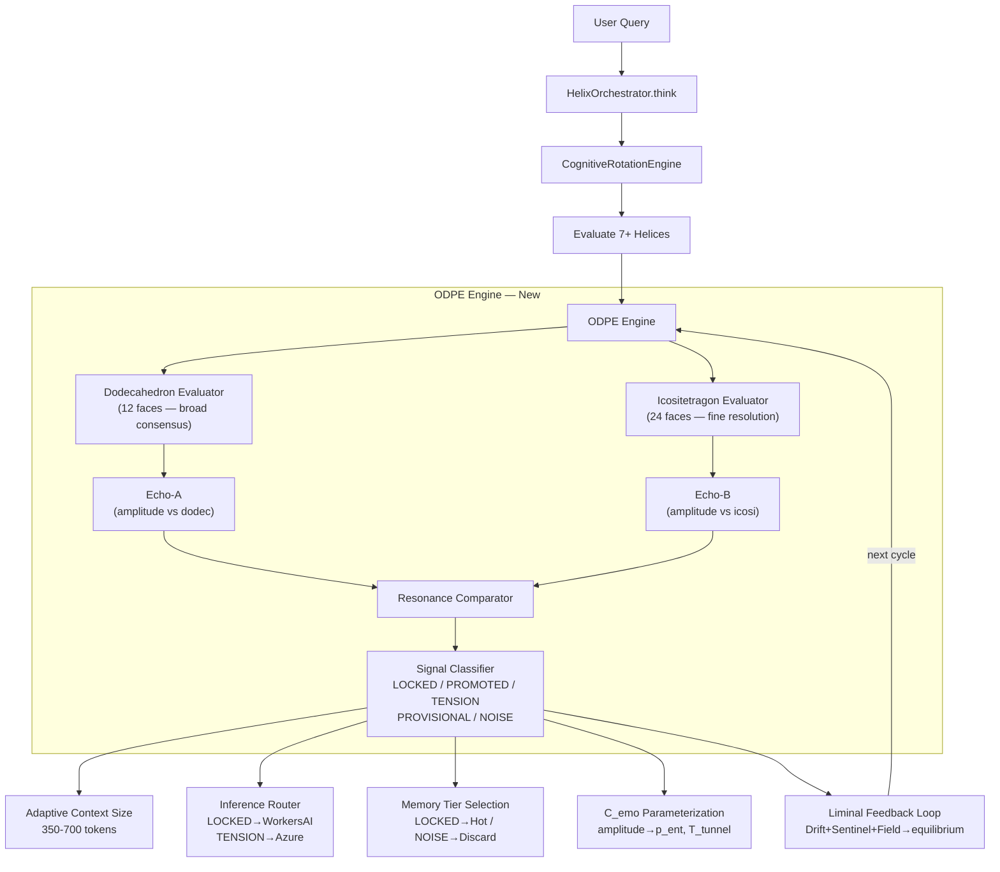

# ODPE Architecture Build Plan

## Architecture Overview




## Phase 1: Core ODPE Engine (New File)

**Create** `backend/app/services/odpe_engine.py`

This is the central new component. It contains:

- `**ODPESignal`** enum: `LOCKED`, `PROMOTED`, `TENSION`, `PROVISIONAL`, `NOISE`
- `**AmplitudeVector`** dataclass: `dodec_amplitude: float`, `icosi_amplitude: float`, `resonance_ratio: float`
- `**ODPEResult`** dataclass: per-helix signal classifications, aggregate amplitude vectors, recommended context tokens, recommended inference tier, oscillation profile dict
- `**DodecahedronEvaluator`** class:
  - Takes helix outputs from `NoeticReflectionEngine.synthesize()` (the existing first-order + second-order reflections)
  - Maps them onto 12 "faces": 7 canonical helices + 5 emergent (or cross-domain blend faces)
  - Each face produces a consensus score by checking agreement among its 5 neighbors (dodecahedron adjacency)
  - Uses existing `DIRECT_HELIX_WEIGHT=0.5` and `FIRST_ORDER_WEIGHT=0.3` from [noetic_reflection_engine.py](backend/app/services/noetic_reflection_engine.py) line 41-44
- `**IcositetragonEvaluator`** class:
  - Takes output from `QuantumCognitionEngine.evaluate()` (the 4-layer quantum eval)
  - Maps onto 24 faces: 8 `HelixFunction` types x 3 scope levels (user, global, superseded-chain)
  - Each face produces a fine-grained resolution score
  - Uses existing `OMEGA_*` domain coupling constants from [quantum_cognition.py](backend/app/services/quantum_cognition.py) lines 47-49
- `**ResonanceComparator**` class:
  - Takes dodecahedron face scores and icositetragon face scores
  - Computes per-helix amplitude vectors: `AmplitudeVector(dodec, icosi, ratio)`
  - Classifies each helix's contribution:
    - `LOCKED`: both topologies agree (ratio 0.8-1.2) — compress to ~350 tokens
    - `PROMOTED`: moderate agreement (ratio 0.5-0.8 or 1.2-1.5) — standard ~500 tokens
    - `TENSION`: active disagreement (ratio < 0.5 or > 1.5) — expand to ~700 tokens
    - `PROVISIONAL`: one topology has no signal — ~500 tokens, flagged for re-evaluation
    - `NOISE`: both topologies score below threshold (0.05) — discard
  - Computes aggregate recommended context size and inference tier
- `**LiminalEquilibriumReader**` class:
  - Reads latest signals from `liminal_presence_analysis` table (3 agents: `silence_sentinel`, `language_drift`, `field_response`)
  - Adjusts the oscillation equilibrium: when Language Drift is RED, bias toward icositetragon; when Silence Sentinel is GREEN, bias toward dodecahedron
  - Uses the same insert format as [language_drift_monitor.py](backend/app/services/language_drift_monitor.py) lines 272-282
- `**ODPEEngine**` class:
  - `__init__(db_pool)` — instantiates all sub-components
  - `async evaluate(helix_outputs, reflection_synthesis, quantum_evaluation, crystals)` — runs both topologies in parallel, computes echo, classifies signals, reads liminal feedback
  - `get_status()` — for health checks and auditor
  - Returns `ODPEResult`

**Key design constraints:**

- No new database tables in Phase 1 — ODPE state is computed per-request and passed downstream
- No AI calls — ODPE is pure math (comparisons, ratios, thresholds)
- All constants are module-level for easy tuning

## Phase 2: Modify Helix Orchestrator

**Modify** [helix_orchestrator.py](backend/app/services/helix_orchestrator.py)

The `think()` method (lines 165-261) currently runs Steps 1-6 sequentially. Modify to:

1. Steps 1-2 remain unchanged (rotate + evaluate helices)
2. Steps 3-4 remain unchanged (reflect + quantum eval)
3. **New Step 3.5**: Pass reflection synthesis + quantum eval into `ODPEEngine.evaluate()`
4. Step 5-6 remain unchanged (lifecycle + spawns)
5. **New**: Attach `ODPEResult` to `OrchestratorCycleResult` for downstream consumers

Changes to `__init`__ (line 114):

- Accept `odpe_engine` parameter (injected from `main.py`)
- Store as `self._odpe_engine`

Changes to `OrchestratorCycleResult` dataclass:

- Add `odpe_result: Optional[Dict]` field
- Add `recommended_context_tokens: int` field
- Add `recommended_inference_tier: str` field

## Phase 3: Adaptive Context Search

**Modify** [quantum_knowledge_field.py](backend/app/services/quantum_knowledge_field.py)

`FederatedSearchCoordinator.search()` (lines 213-254):

- Add optional `context_budget: Optional[int] = None` parameter
- When `context_budget` is provided, adjust `top_k` proportionally: `top_k = max(5, context_budget // 50)` (roughly 50 tokens per result)
- When `context_budget` is small (LOCKED, ~350 tokens), use shorter `timeout_seconds=2.0`
- When `context_budget` is large (TENSION, ~700 tokens), use longer `timeout_seconds=8.0`
- Default behavior (no budget) is unchanged — backward compatible

**Modify** [vectorize_service.py](backend/app/services/vectorize_service.py)

`semantic_search_all()` (lines 474-511):

- Add optional `index_subset: Optional[List[str]] = None` parameter
- When provided, only search the specified indexes instead of all 6
- Dodecahedron queries use `["conversation", "wisdom"]` (broad)
- Icositetragon queries use `["session", "me2me", "annotation", "vault"]` (deep)
- Default (None) searches all — backward compatible

## Phase 4: Signal-Driven Inference Routing

**Modify** [nate_inference_router.py](backend/app/services/nate_inference_router.py)

`generate()` (lines 77-128):

- Add optional `odpe_signal: Optional[str] = None` parameter
- When provided, override the tier selection:
  - `LOCKED` → force `TIER_UTILITY` (Workers AI first — cheapest)
  - `PROMOTED` → use the domain's natural tier (no change)
  - `TENSION` → force `TIER_CLINICAL` (Sovereign → Azure — smartest)
  - `NOISE` → return early with empty response (no LLM call)
- The `domain` parameter still governs temperature — only the provider chain changes
- Default (None) preserves existing behavior — backward compatible

## Phase 5: Memory and Recall Integration

**Modify** [session_memory_store.py](backend/app/services/session_memory_store.py)

`store_session()` (lines 99-249):

- Add optional `oscillation_profile: Optional[Dict] = None` parameter
- When provided, include in `memory_record` metadata (line 155):

```python
  "oscillation_profile": oscillation_profile or {},
  

```

- Profile contains: dominant topology, TENSION points, equilibrium position, signal distribution

**Modify** [nate_memory_crystallizer.py](backend/app/services/nate_memory_crystallizer.py)

`record_recall()` (lines 361-371):

- Add optional `odpe_signal: Optional[str] = None` parameter
- LOCKED recalls increment `recall_count` by 2 (double reinforcement — crystal is universally relevant)
- TENSION recalls increment by 1 but also set a `needs_reeval` flag in crystal metadata
- NOISE recalls do not increment (the crystal was surfaced but discarded)
- Default (None) increments by 1 as today — backward compatible

## Phase 6: C_emo Integration

**Modify** [nevedal_engine.py](backend/app/services/nevedal_engine.py)

`process_biometrics()` method:

- Add optional `odpe_amplitudes: Optional[Dict] = None` parameter
- When provided, modulate C_emo parameters:
  - `p_ent` scaled by echo agreement ratio (high agreement = high entanglement)
  - `T_tunnel` scaled by icositetragon depth (more faces engaged = deeper tunneling)
  - `gamma_env` increased by NOISE signal count (more noise = faster decay)
  - `E_G_joint` increased by TENSION signal count (unresolved disagreement = higher energy barrier)
- Default (None) preserves existing C_emo computation — backward compatible

## Phase 7: Liminal Feedback Loop

**Modify** `ODPEEngine` (created in Phase 1):

`LiminalEquilibriumReader` queries:

```sql
SELECT agent, signal, score, metadata
FROM liminal_presence_analysis
WHERE agent IN ('silence_sentinel', 'language_drift', 'field_response')
ORDER BY created_at DESC
LIMIT 3
```

Equilibrium adjustment logic:

- Language Drift RED → `icosi_weight_bias += 0.2` (need fine-grained correction)
- Language Drift GREEN → `dodec_weight_bias += 0.1` (broad consensus sufficient)
- Silence Sentinel RED → `icosi_weight_bias += 0.1` (something is wrong, investigate deeply)
- Field Response `authority_transfer` detected → `tension_threshold *= 0.8` (lower threshold = more sensitive to TENSION)

These biases shift the resonance ratio thresholds, making the system more or less inclined toward one topology.

## Phase 8: Auditor and Trust Updates

**Modify** [noetic_helix_auditor.py](backend/app/services/noetic_helix_auditor.py)

Add 4 new checks to `TAB_ENDPOINTS` (lines 37-76) in a new tab:

- Tab 5: ODPE Engine
  - `odpe_engine_status` — ODPEEngine is not None and has run at least 1 cycle
  - `dual_topology_health` — both evaluators initialized
  - `liminal_equilibrium_reader` — can query `liminal_presence_analysis`
  - `signal_classification_valid` — last classification produced valid ODPESignal values

This increases the Noetic Helix auditor from 14 to 18 checks.

**Update 5 trust locations** per `trust-enforcer-architecture.mdc`:

1. `TAB_ENDPOINTS` in `noetic_helix_auditor.py` — add 4 checks
2. `AUDITOR_ACTIVITY_TYPES` in `trust_enforcer.py` — no change (same auditor)
3. `AUDITOR_LABELS` in `trust_enforcer.py` — no change (same auditor)
4. `_baseline_key_for()` in `trust_enforcer.py` — no change (same key)
5. `trust_baseline` table — UPDATE `noetic_helix_check_count` from 14 to 18

**Modify** [main.py](backend/app/main.py):

- Import and initialize `ODPEEngine` after `HelixOrchestrator` (around line 2872)
- Pass `odpe_engine` to `HelixOrchestrator`
- Add `odpe_engine` to `_service_checks`
- Update service health denominator from 97 to 98

**Update** `service-health-49-49.mdc` rule — add `odpe_engine` entry, increment denominator.

## Phase 9: Deploy and Verify

1. Deploy all modified files via `scp` (no `--delete`)
2. Apply trust baseline update: `UPDATE trust_baseline SET parameter_value = '{"expected": 18}'::jsonb WHERE parameter_key = 'noetic_helix_check_count'`
3. Restart backend: `docker compose -f docker-compose.prod.yml up -d backend`
4. Verify startup: `STARTUP COMPLETE: 98/98 services healthy`
5. Trigger audit cascade and verify Noetic Helix auditor reports 18/18
6. Verify Trust Enforcer total increases from 553 to 557

## File Change Summary


| File                                               | Action     | Lines Changed (est.) |
| -------------------------------------------------- | ---------- | -------------------- |
| `backend/app/services/odpe_engine.py`              | **CREATE** | ~400                 |
| `backend/app/services/helix_orchestrator.py`       | MODIFY     | ~30                  |
| `backend/app/services/quantum_knowledge_field.py`  | MODIFY     | ~15                  |
| `backend/app/services/vectorize_service.py`        | MODIFY     | ~10                  |
| `backend/app/services/nate_inference_router.py`    | MODIFY     | ~15                  |
| `backend/app/services/session_memory_store.py`     | MODIFY     | ~5                   |
| `backend/app/services/nate_memory_crystallizer.py` | MODIFY     | ~10                  |
| `backend/app/services/nevedal_engine.py`           | MODIFY     | ~15                  |
| `backend/app/services/noetic_helix_auditor.py`     | MODIFY     | ~20                  |
| `backend/app/main.py`                              | MODIFY     | ~15                  |
| `.cursor/rules/service-health-49-49.mdc`           | MODIFY     | ~5                   |


**Total**: 1 new file, 10 modified files. All modifications are backward-compatible (new optional parameters with defaults that preserve existing behavior).

---

## Phase 10: Provisional Patent 6 — ODPE + Geometric Topology (QEC Continuation)

**Create** `patent/QUANTUM_EMOTIONAL_COHERENCE_PATENT_PROVISIONAL_6.md`

This is the 6th provisional in the Quantum Emotional Coherence series, continuing from Provisional 5 (Service Modes, filed March 1, 2026). It follows the identical format established in Provisionals 1-5: title page, related applications (all 5 prior provisionals), abstract, field, definitions, background, brief description of drawings, detailed description, claims, advantages, inventor's statement.

### Title

**"Quantum Emotional Coherence — Continuation: Systems and Methods for Oscillating Dual-Process Cognitive Topology with Amplitude-Based Signal Classification, Adaptive Context Compression, and Liminal Feedback Equilibrium in AI-Assisted Therapeutic Systems"**

### New Definitions (12)

- **"Oscillating Dual-Process Echo" (ODPE)** — A computational method for evaluating cognitive helix outputs through two concurrent geometric topologies and comparing their agreement to classify signals and govern downstream processing.
- **"Dodecahedron Topology"** — A 12-face regular polyhedron structure applied to cognitive helix evaluation, where each face represents a cognitive processing unit with exactly 5 adjacent neighbors, producing broad consensus through neighbor agreement.
- **"Icositetragon Topology"** — A 24-face polyhedron structure applied to cognitive helix evaluation, providing finer-grained resolution with smaller faces and a graph diameter of 3 (vs 5 for dodecahedron).
- **"Amplitude Vector"** — A tuple of (dodecahedron_amplitude, icositetragon_amplitude, resonance_ratio) computed per cognitive helix, quantifying the agreement between the two topologies.
- **"Resonance Ratio"** — The quotient of dodecahedron amplitude divided by icositetragon amplitude for a given cognitive unit, used to classify the signal type.
- **"LOCKED Signal"** — A classification indicating both topologies agree (resonance ratio 0.8-1.2), permitting maximum context compression.
- **"PROMOTED Signal"** — A classification indicating moderate agreement (ratio 0.5-0.8 or 1.2-1.5), using standard context allocation.
- **"TENSION Signal"** — A classification indicating active disagreement (ratio below 0.5 or above 1.5), requiring expanded context and higher-capability inference.
- **"PROVISIONAL Signal"** — A classification indicating one topology has insufficient data, flagging the knowledge area for re-evaluation.
- **"NOISE Signal"** — A classification indicating both topologies score below a minimum threshold, warranting signal discard.
- **"Liminal Equilibrium"** — The dynamic bias between dodecahedron and icositetragon weighting, adjusted by real-time feedback from voice integrity monitoring, audience response classification, and posting rhythm analysis.
- **"Topology-Aware Inference Routing"** — A method for selecting among a plurality of AI inference providers based on the ODPE signal classification rather than fixed domain assignment.

### Figures (4)

- **FIG. 38** — Oscillating Dual-Process Echo Architecture (3800): ODPE engine (3802), dodecahedron evaluator with 12 faces and adjacency graph (3804), icositetragon evaluator with 24 faces (3806), echo amplitude measurer (3808), resonance comparator (3810), signal classifier (3812), liminal equilibrium reader (3814).
- **FIG. 39** — Signal Classification Decision Tree (3900): resonance ratio thresholds (3902), LOCKED/PROMOTED/TENSION/PROVISIONAL/NOISE regions (3904), context budget output (3906), inference tier output (3908).
- **FIG. 40** — Adaptive Context Compression via Topology Oscillation (4000): LOCKED path (350 tokens, 3 results, 2s timeout) (4002), PROMOTED path (500 tokens, 7 results, 5s timeout) (4004), TENSION path (700 tokens, 14 results, 8s timeout) (4006), NOISE path (discard, 0 tokens) (4008).
- **FIG. 41** — C_emo Integration with ODPE Amplitude Vectors (4100): amplitude-to-C_emo parameter mapping (4102: echo agreement → p_ent, 4104: icositetragon depth → T_tunnel, 4106: NOISE count → gamma_env, 4108: TENSION count → E_G_joint), oscillation profile persistence (4110).

### Detailed Description (4 Claims)

- **Claim 1**: Oscillating Dual-Process Cognitive Topology — the core method of running two geometric topology evaluations concurrently on cognitive helix outputs, computing amplitude vectors, and classifying signals
- **Claim 2**: Adaptive Context Compression — the method of dynamically adjusting context window size, search depth, and search timeout based on ODPE signal classification
- **Claim 3**: Topology-Aware Inference Routing — the method of selecting AI inference providers based on signal classification (LOCKED→cheapest, TENSION→most capable, NOISE→skip)
- **Claim 4**: Liminal Feedback Equilibrium — the method of using real-time voice integrity, audience response, and posting rhythm signals to shift the oscillation bias between topologies

### Claims (8 Independent + 8-10 Dependent)

**Independent Claims:**

1. A computer-implemented method for evaluating cognitive outputs of an AI therapeutic companion through concurrent geometric topologies, comprising: mapping helix outputs onto a first polyhedron topology (dodecahedron, 12 faces) and a second polyhedron topology (icositetragon, 24 faces); computing amplitude vectors per cognitive unit; classifying signals based on resonance ratios; and governing downstream processing based on signal classification.
2. The system implementing claim 1 within the quantum emotional coherence framework described in the prior provisionals.
3. A method for adaptive context compression in an AI therapeutic system, wherein the context window size for knowledge retrieval is dynamically determined by the signal classification produced by concurrent dual-topology evaluation.
4. A method for topology-aware inference routing, wherein the selection among a plurality of AI inference providers is determined by the signal classification rather than fixed domain assignment.
5. A method for computing emotional coherence (C_emo) in which the parameters of the Nevedal Formula are modulated by amplitude vectors from a dual-topology cognitive evaluation.
6. A method for maintaining a liminal feedback equilibrium that adjusts the oscillation bias between two geometric cognitive topologies based on real-time signals from voice integrity monitoring, audience response classification, and posting rhythm analysis.
7. A method for ODPE-aware memory recall in an AI therapeutic system, wherein the reinforcement of intelligence crystal recall counts is weighted by signal classification (LOCKED crystals reinforced at double rate, NOISE crystals not reinforced).
8. A computer-implemented system comprising: a noetic helix orchestrator with 7 canonical cognitive helices; an ODPE engine with dodecahedron and icositetragon evaluators, a resonance comparator, and a signal classifier; a liminal equilibrium reader; and the integration points described in claims 3-7.

**Dependent Claims (8-10):**

- The method of claim 1, wherein dodecahedron face consensus requires agreement among at least 3 of 5 adjacent faces.
- The method of claim 1, wherein the resonance ratio thresholds (0.5, 0.8, 1.2, 1.5) are configurable parameters stored in a governance table requiring administrator approval to modify.
- The method of claim 3, wherein LOCKED signals route to a first inference provider (Workers AI) costing $0.00 per request, and TENSION signals route to a second provider (Azure OpenAI) with higher capability.
- The method of claim 5, wherein the echo agreement ratio maps to p_ent, icositetragon face engagement depth maps to T_tunnel, NOISE signal count maps to gamma_env, and TENSION signal count maps to E_G_joint.
- The method of claim 6, wherein a RED signal from a language drift monitor increases icositetragon bias by a first increment (0.2), and a GREEN signal from a silence sentinel increases dodecahedron bias by a second increment (0.1).
- The method of claim 6, wherein detection of authority transfer patterns in audience responses reduces the TENSION threshold by a multiplicative factor (0.8).
- The method of claim 7, wherein crystals classified as TENSION during recall are flagged with a `needs_reeval` metadata key for subsequent re-evaluation by a research synthesis agent.
- The system of claim 8, wherein the ODPE engine is registered as a health-checked service with an auditor that verifies engine status, dual topology health, liminal equilibrium reader connectivity, and signal classification validity.

---

## Phase 11: Standalone Patent — Geometric Topology for AI Cognition

**Create** `patent/PATENT_OSCILLATING_DUAL_PROCESS_ECHO.md`

This is a **separate** provisional patent filing (not part of the QEC continuation series) covering the geometric topology IP broadly — applicable beyond therapeutic AI to any multi-agent cognitive architecture.

### Title

**"Oscillating Dual-Process Echo: Systems and Methods for Applying Concurrent Geometric Polyhedron Topologies to Multi-Agent Cognitive Evaluation with Amplitude-Based Signal Classification and Adaptive Resource Allocation"**

### Scope

This patent covers the general-purpose invention:

- Applying regular polyhedron topologies (dodecahedron, icositetragon, or any convex polyhedron) to structure the information flow and consensus mechanisms of multi-agent AI cognitive systems
- The dual-process echo method of running two topologies concurrently and measuring amplitude agreement
- Signal classification based on resonance ratios
- Adaptive resource allocation (context window, inference provider, memory tier) driven by signal classification
- Liminal feedback loops that adjust topology bias based on external quality signals

This patent is domain-agnostic — it applies to any AI system with multiple cognitive agents, not just therapeutic AI. The QEC Provisional 6 above claims the specific application to the Nevedal therapeutic framework; this standalone patent claims the broader methodology.

### Claims (6 Independent)

1. A method for structuring multi-agent AI cognitive evaluation using geometric polyhedron topologies, wherein each face of a polyhedron represents an independent cognitive processing unit and neighbor adjacency governs consensus formation.
2. A method for concurrent dual-topology evaluation, wherein outputs from a plurality of cognitive agents are simultaneously mapped onto two distinct polyhedron topologies of different resolution (face count), and the agreement between topologies is quantified as an amplitude vector per agent.
3. A method for classifying cognitive signals based on resonance ratios derived from dual-topology amplitude vectors, wherein the classification governs at least one of: context window size, inference provider selection, memory persistence tier, or signal discard.
4. A method for adaptive resource allocation in a multi-agent AI system, wherein the computational resources allocated to processing a query are dynamically determined by the signal classification produced by concurrent dual-topology evaluation, such that queries producing high-agreement signals consume fewer resources than queries producing disagreement signals.
5. A method for maintaining an oscillation equilibrium between two geometric cognitive topologies, comprising: receiving quality signals from a plurality of external monitors; adjusting bias weights that shift the resonance ratio thresholds; and applying the adjusted thresholds to subsequent signal classifications.
6. A computer-implemented system comprising: a plurality of cognitive agents organized into one or more helices; a first topology evaluator mapping agent outputs onto a first polyhedron; a second topology evaluator mapping agent outputs onto a second polyhedron of higher face count; a resonance comparator computing per-agent amplitude vectors; a signal classifier producing resource allocation directives; and a feedback loop receiving external quality signals and adjusting topology bias.

---

## Phase 12: Update Patent Coverage Documentation

**Modify** `docs/PHD_SOVEREIGN_QUANTUM_NATE.md` Section 10 (lines 462-479):

Add new rows to the Patent Coverage table:

- Claims 64-67: ODPE Dual-Topology Oscillation (dodecahedron + icositetragon concurrent evaluation, amplitude echo, signal classification, adaptive context compression)
- Claims 68-71: Topology-Aware Resource Allocation (inference routing by signal, ODPE-aware memory recall, C_emo amplitude integration, liminal feedback equilibrium)
- Extension: Geometric Polyhedron Cognitive Topology (general-purpose, domain-agnostic)
- Extension: Resonance Ratio Signal Classification (LOCKED/PROMOTED/TENSION/PROVISIONAL/NOISE)
- Extension: Dual-Process Echo Amplitude Measurement

**Modify** `PATENT_SPLIT_SOVEREIGNTY_MEMORY.md`:

Add a cross-reference note in Related Applications section pointing to Provisional 6 and the standalone ODPE patent as related but independent filings.

## Patent File Summary


| File                                                         | Action     | Est. Size |
| ------------------------------------------------------------ | ---------- | --------- |
| `patent/QUANTUM_EMOTIONAL_COHERENCE_PATENT_PROVISIONAL_6.md` | **CREATE** | ~40-50 KB |
| `patent/PATENT_OSCILLATING_DUAL_PROCESS_ECHO.md`             | **CREATE** | ~25-35 KB |
| `docs/PHD_SOVEREIGN_QUANTUM_NATE.md`                         | MODIFY     | ~10 lines |
| `PATENT_SPLIT_SOVEREIGNTY_MEMORY.md`                         | MODIFY     | ~5 lines  |


