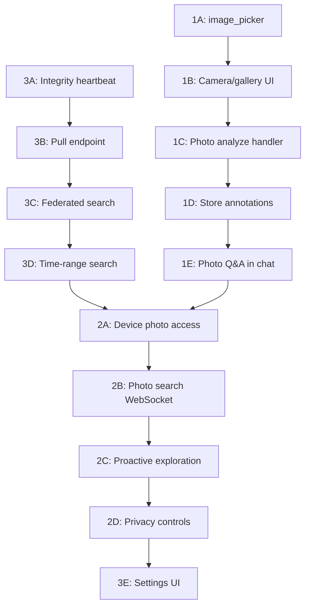

# Photo AI Analysis, Device Memory Scanning, and Conversation Integrity

## Current State

**What exists today:**

- Vault supports image uploads (JPEG, PNG, WebP, GIF) with thumbnails, base64 encoding, and blob storage
- VaultBridge injects images as vision blocks into AI chat (multimodal)
- `VisualBiometricExtractor` analyzes video frames for affect/gaze/body language using Grok vision
- Conversation history persists to PostgreSQL (`conversation_history` table) with PII encryption
- Device-local SQLite (`nate_history.db`) stores chat history with FTS5 search
- Login-time sync pushes device entries to server when device has more
- Real-time `nate_history_entry` WebSocket messages keep device in sync for new exchanges
- Federated `device_search_request` is partially wired (Flutter handles it, bridge does not send it)

**What is missing:**

- No dedicated "analyze this photo" flow — images are context-only in chat
- No photo gallery/camera picker in Flutter (only generic `FilePicker`)
- No device-local photo scanning (Nate cannot browse phone photos)
- No periodic integrity check (only login-time sync, no 5-min heartbeat)
- No pull endpoint (server cannot push older history to device)
- Federated search (server + device combined results) is not fully wired
- Me2Me does not include photo memories — only text conversations

---

## Part 1: Vault Photo Upload + Little Nate Photo Analysis

### 1A. Add `image_picker` to Flutter for camera/gallery access

File: [mobile/pubspec.yaml](mobile/pubspec.yaml)

Add `image_picker: ^1.0.7` dependency. This gives native camera capture and gallery browsing on iOS/Android, which `file_picker` alone does not provide.

### 1B. Create a dedicated photo upload + analysis flow in the Vault UI

File: [mobile/lib/widgets/vault_attachment_button.dart](mobile/lib/widgets/vault_attachment_button.dart)

Add "Take Photo" and "Choose from Gallery" options alongside the existing "Upload File" and "Browse Vault" options. Use `ImagePicker` for these.

### 1C. Add a "Photo Memory" analysis WebSocket handler

File: [backend/app/websocket/bridge_server.py](backend/app/websocket/bridge_server.py)

New message type: `vault_photo_analyze`

```
Client sends: { type: "vault_photo_analyze", vault_item_id: "...", question: "What emotions do you see?" }
Bridge: loads image from vault blob → sends as vision block to Grok with the question → returns structured analysis
```

This differs from normal chat because it creates a dedicated photo analysis thread that is stored as a vault item annotation (not just a chat message).

### 1D. Store photo analysis results alongside vault items

File: [backend/app/services/vault/vault_operations.py](backend/app/services/vault/vault_operations.py)

Add a `vault_item_annotations` table (or JSONB field on `vault_items`) to store Little Nate's photo analyses, emotional observations, and follow-up questions. These annotations become part of the Me2Me pipeline.

### 1E. Photo Memory Q&A in chat

When a user references a vault photo in chat (via `[Vault:itemId]`), Little Nate should proactively describe what he sees and ask emotionally attuned questions about the photo — not just use it as silent context.

---

## Part 2: Device-Local Photo/Memory Scanning

### 2A. Device photo access with consent

File: [mobile/lib/services/local_history_service.dart](mobile/lib/services/local_history_service.dart) (or new `device_memory_service.dart`)

Add a new service that can:

- Request photo library permission (`photo_manager` package)
- Browse recent photos by date range
- Extract EXIF metadata (date, location if available, camera info)
- Generate thumbnails for preview
- Send selected photos to the bridge for Nate analysis

Consent is critical: the user must explicitly opt in (similar to `nate_device_search_consent`). Three modes: `always_allow`, `ask_each_time`, `never`.

### 2B. Device memory search WebSocket flow

New message types:

- `device_photo_search_request` (bridge to client): "Nate wants to look at your photos from [date range]"
- `device_photo_search_results` (client to bridge): thumbnails + metadata for matching photos
- `device_photo_search_declined` (client to bridge): user declined

### 2C. Nate proactive photo exploration

When a user mentions memories, past events, or emotions tied to specific times, Little Nate can request to see photos from that period via `device_photo_search_request`. The user approves, photos are shown, and Nate asks emotionally intelligent questions about what he sees.

### 2D. Privacy architecture

- Photos are never stored on the server unless the user explicitly uploads to the Vault
- Device scanning sends thumbnails only (not full resolution) for Nate's analysis
- All photo data transmitted via WebSocket is ephemeral — processed in memory, not persisted
- User can revoke photo access at any time via Settings

---

## Part 3: Conversation History Device Sync + Integrity Verification

### 3A. Periodic integrity heartbeat (every 5 minutes)

File: [mobile/lib/updated_screens.dart](mobile/lib/updated_screens.dart) and [mobile/lib/main.dart](mobile/lib/main.dart)

Add a `Timer.periodic(Duration(minutes: 5))` that:

1. Counts local entries in `nate_history.db`
2. Sends `history_integrity_check` WebSocket message with `{local_count, last_entry_at}`
3. Bridge responds with `history_integrity_status` containing `{server_count, last_server_entry_at, missing_count}`
4. If there is a gap, Flutter initiates a push (device to server) or pull (server to device)

### 3B. Server-to-device pull endpoint

File: [backend/app/routers/client_data_api.py](backend/app/routers/client_data_api.py)

New endpoint: `GET /api/client/history/pull?hw_id=X&after=TIMESTAMP&limit=200`

Returns conversation entries the device is missing. Flutter calls this during integrity checks when `server_count > local_count`.

### 3C. Wire federated search end-to-end

File: [backend/app/websocket/bridge_server.py](backend/app/websocket/bridge_server.py)

The `memory_search` handler currently only calls `search_pg()`. Update it to also send `device_search_request` to the client, wait for `device_search_results` (with timeout), and merge both result sets before returning `memory_search_results`.

### 3D. Time-range search (Me2Me history windows)

File: [backend/app/routers/client_data_api.py](backend/app/routers/client_data_api.py)

New endpoint: `GET /api/client/history/range?hw_id=X&range=today|week|month|all`

Returns conversation entries for the specified time window. This powers the Me2Me history views (same day, last week, last month, all time). Include photo annotations from vault items in the results.

### 3E. Settings UI for device sync controls

File: [mobile/lib/screens/settings_screen.dart](mobile/lib/screens/settings_screen.dart)

Add a "Memory & Privacy" section:

- Device search consent (already exists)
- Photo access consent (new)
- Sync frequency (5 min default, configurable)
- Last sync status (timestamp, entry count)
- "Sync Now" button
- "Export All Memories" button (conversations + photo annotations)

---

## Implementation Order




Recommended sequence: **Part 3 first** (verify and harden what exists), then **Part 1** (vault photos with Nate analysis), then **Part 2** (device scanning — most complex, most privacy-sensitive).