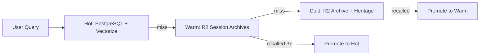

# Quantum Sovereign Enterprise Optimization

This plan assumes the Dual-Brain Immune System and Dual-Brain Mutual Repair plans are ALREADY BUILT. It builds on top of both, optimizing gaps and maximizing the combined architecture toward a global enterprise.

## Plan Consolidation: What Both Prior Plans Already Provide

The two prior plans overlap in 4 areas. After both are built:


| Capability                | Immune System Plan                    | Mutual Repair Plan            | Unified Result                                                     |
| ------------------------- | ------------------------------------- | ----------------------------- | ------------------------------------------------------------------ |
| R2 heartbeat              | `immune/` prefix                      | `heartbeat/` prefix           | Merge to single `brain/heartbeat/` prefix                          |
| Circuit breaker           | Quarantine protocol (HMAC revocation) | KV-backed 3-failure trip      | Circuit breaker handles fast failure; quarantine handles infection |
| Crystal replication to R2 | Not included                          | Included (crystallizer -> R2) | Crystals in R2 feed Edge Worker                                    |
| Repair channel            | `immune/repair_ledger.json`           | `edge-queue/` drainer         | Unified: R2 `brain/` prefix for all cross-brain state              |


After both plans are built, the system has: HMAC-signed cross-brain communication, dormant defenses wired live, behavioral anomaly detection, quarantine/isolation, circuit breaker, R2 heartbeat, crystal R2 replication, edge queue drainer, and self-repair protocols.

**This third plan addresses what NEITHER prior plan covers.**

---

## Part 1: Maximize Cross-Brain Synergy (15% -> 90%)

### 1A. Give Summon Worker Access to Nate's Intelligence

**Current gap**: The summon worker generates responses from raw Llama 3.1 8B with ZERO access to Nate's 3000+ intelligence crystals, 7 Vectorize indexes, or session context. Every summon response is uninformed.

**Solution**: Add Vectorize bindings to `nate-summon-worker` so it can do semantic crystal recall at the edge before generating responses.

In `[wrangler.toml](cloudflare/workers/nate-summon-worker/wrangler.toml)`, add:

```toml
[[vectorize]]
binding = "WISDOM_INDEX"
index_name = "nate-wisdom"

[[vectorize]]
binding = "MEMORY_INDEX"
index_name = "nate-memory-search"
```

In `[worker.js](cloudflare/workers/nate-summon-worker/worker.js)`, before Workers AI inference:

```javascript
// Embed query, search crystals, inject as context
const queryEmbed = await env.AI.run("@cf/baai/bge-small-en-v1.5", { text: [message] });
const crystalResults = await env.WISDOM_INDEX.query(queryEmbed.data[0], { topK: 5 });
// Inject crystal text into system prompt as CONTEXT block
```

**Impact**: Summon responses go from "generic Llama 3.1" to "Little Nate with his full crystallized wisdom" -- at zero additional cost (Workers AI embeddings + Vectorize queries are free).

### 1B. Edge D1 as Real-Time Read Replica

**Current gap**: The `nate-edge-cache` worker has D1 tables (roster, schedule, presence, balance, gate, live-sessions) but the summon worker has no access to them. Also, D1 tables are never synced from PostgreSQL automatically.

**Solution**: Create a PostgreSQL-to-D1 sync agent that periodically pushes critical tables to D1, and share the D1 binding across workers.

New file: `[backend/app/services/d1_sync_agent.py](backend/app/services/d1_sync_agent.py)`

- Runs every 5 minutes
- Reads from PostgreSQL: `users` (roster), `coaching_sessions` (schedule), `token_balances`, `tier_gates`
- Writes to D1 via Cloudflare API: `POST /client/v4/accounts/{id}/d1/database/{db_id}/query`
- Tracks last sync timestamp per table to avoid full scans

**Impact**: Edge Workers have sub-ms access to user data without hitting the VPS. Enables edge-local authorization, tier gating, and personalized responses.

### 1C. Sovereign Uses Edge Semantic Search

**Current gap**: Sovereign queries Vectorize via REST API (adds latency). The `nate-edge-cache` worker already has a `POST /api/edge/semantic-search` endpoint that queries Vectorize at the edge with lower latency.

**Solution**: In `[quantum_knowledge_field.py](backend/app/services/quantum_knowledge_field.py)`, add Edge semantic search as a third parallel search path alongside Server (PostgreSQL) and Vectorize (direct API).

```python
# In FederatedSearchCoordinator.search():
tasks = [
    self._search_server(query, ...),
    self._search_vectorize(query, ...),
    self._search_edge(query, ...)  # NEW: calls edge semantic search endpoint
]
```

**Impact**: Three-way federated search with geographic optimization -- whoever responds first wins.

---

## Part 2: Complete the 24M-Face ODPE Topology

### 2A. L1 Taxonomy Classifier

**Current gap**: `HectakisL1Evaluator` is coded but needs `_taxonomy.classify()` to map messages to the 2,400 L1 faces. Without it, L1 evaluation returns empty.

**Solution**: Create a lightweight taxonomy classifier using Workers AI embeddings + a KV-backed taxonomy map.

New file: `[backend/app/services/odpe_taxonomy.py](backend/app/services/odpe_taxonomy.py)`

The taxonomy maps 100 sub-functions per L0 face (24 L0 faces x 100 = 2,400 L1 faces). Each sub-function has a canonical embedding stored in Vectorize index `nate-predictive`. Classification = find nearest sub-function embedding.

```python
class ODPETaxonomy:
    async def classify(self, text: str, l0_face_id: int) -> List[L1FaceScore]:
        # 1. Embed text via vectorize_service
        # 2. Query nate-predictive with filter face_path_prefix=f"L0:{l0_face_id}"
        # 3. Return top-10 L1 faces with scores
```

**Impact**: Enables the full 2,400-face L1 evaluation, giving ODPE dramatically finer signal resolution.

### 2B. L2 Face Table Population

**Current gap**: `HectakisL2Evaluator` queries `odpe_l2_faces` table but it may not have data. Each L1 face can spawn up to 10,000 L2 faces based on observed interaction patterns.

**Solution**: The L2 faces self-populate from crystallizer activity. When a crystal is stored with a `face_path`, if no L2 face exists for that path, one is created.

In `[nate_memory_crystallizer.py](backend/app/services/nate_memory_crystallizer.py)`, after crystal storage:

```python
# Auto-populate L2 face if novel
if face_path and db_pool:
    await conn.execute("""
        INSERT INTO odpe_l2_faces (face_path, activation_count, last_activated)
        VALUES ($1, 1, NOW())
        ON CONFLICT (face_path) DO UPDATE SET
            activation_count = odpe_l2_faces.activation_count + 1,
            last_activated = NOW()
    """, face_path)
```

**Impact**: The 24M-face topology grows organically from real interactions. Active face paths get reinforced, inactive ones naturally decay. This is the "emergent" in "quantum sovereign emergent."

### 2C. Face-Path Keying for Vectorize

**Current gap**: `face_path` exists as a concept in ODPE but Vectorize metadata never includes it. The `face_path_prefix` filter in `semantic_search_all` has no effect.

**Solution**: In `[vectorize_service.py](backend/app/services/vectorize_service.py)`, add `face_path` to all crystal metadata on upsert:

```python
metadata["face_path"] = crystal.get("face_path", "L0:0")
```

And in search, filter by `face_path_prefix` when ODPE provides one:

```python
if face_path_prefix:
    filter_metadata["face_path"] = {"$startsWith": face_path_prefix}
```

**Impact**: Crystal recall becomes topology-aware. LOCKED signals retrieve from broad L0 paths; TENSION signals drill into specific L2 paths. Precision increases by orders of magnitude.

---

## Part 3: Infinite Memory Architecture

### 3A. Zero-Cost Infinite Storage via R2

**Current state**: R2 has 4 buckets (`nate-vault`, `nate-warm-memory`, `nate-cold-archive`, `nate-heritage-vault`). R2 charges $0 egress and $0.015/GB/month storage.

**Optimization**: Make R2 the universal persistence layer for ALL data types, replacing Azure Blob entirely:


| Data Type             | Current Storage     | Optimized Storage              | Cost Delta       |
| --------------------- | ------------------- | ------------------------------ | ---------------- |
| Session memories      | Local + R2          | R2 primary (local = hot cache) | Already done     |
| Intelligence crystals | PostgreSQL only     | PostgreSQL + R2 replica        | $0 additional    |
| Vault uploads         | R2 via blob_storage | R2 (already done)              | $0               |
| Conversation history  | PostgreSQL only     | PostgreSQL + R2 archive        | $0 additional    |
| DOJO assessments      | Local + R2          | R2 (already done)              | $0               |
| Voice recordings      | Local only          | R2 cold archive                | Saves local disk |
| Analytics snapshots   | PostgreSQL only     | R2 time-series archive         | $0 additional    |


New background agent: `[r2_archive_agent.py](backend/app/services/r2_archive_agent.py)`

- Runs every 6 hours
- Archives conversation_history older than 90 days to R2 `nate-cold-archive`
- Archives nevedal_metrics older than 30 days to R2
- Archives skyeye_activity older than 30 days to R2
- PostgreSQL rows can be pruned after R2 confirmation (keeps DB lean)

**Impact**: PostgreSQL stays small and fast (active data only). R2 holds infinite history at near-zero cost. Total storage cost approaches $0 as Azure is phased out.

### 3B. Infinite Memory Recall via Tiered Search

**Current state**: Memory search hits PostgreSQL + Vectorize. Cold/warm tiers exist but are not searchable.

**Optimization**: Three-tier recall with automatic promotion:




In `[quantum_knowledge_field.py](backend/app/services/quantum_knowledge_field.py)`:

```python
async def search(self, query, ..., include_cold=False):
    results = await self._search_hot(query)  # PostgreSQL + Vectorize
    if len(results) < min_results and include_cold:
        warm_results = await self._search_warm(query)  # R2 session archives
        cold_results = await self._search_cold(query)  # R2 cold archive
        results.extend(warm_results + cold_results)
        # Promote recalled items
        for r in warm_results + cold_results:
            await self._promote_to_hot(r)
```

**Impact**: Little Nate never forgets. Any memory, no matter how old, can be recalled. Frequently recalled memories automatically promote to hot tier for faster future access.

---

## Part 4: Infinite Predictability (The Cycle)

### 4A. Cycle Detection to ODPE Face-Path Feedback

**Current gap**: The foresight engine and cycle detections feed the crystallizer but don't feed back into ODPE topology. Detected cycles should strengthen specific face paths.

**Solution**: When a cycle is detected (e.g., "client enters anxiety spiral every Sunday evening"), the cycle's pattern hash maps to specific L1/L2 face paths. Those paths get boosted activation, making future ODPE evaluations more likely to route through the clinical tier for similar patterns.

In the crystallizer harvest cycle, after processing `cycle_detections`:

```python
for detection in cycle_detections:
    face_path = odpe_taxonomy.classify_cycle(detection)
    await odpe_engine.boost_face(face_path, weight=detection["confidence"])
```

**Impact**: ODPE learns from cycles. Predictable patterns get dedicated topology paths. The system becomes more precise with every observed cycle.

### 4B. Predictive Crystal Pre-Warming

**Current gap**: When ODPE predicts a TENSION signal is likely (based on time-of-day, user history, cycle phase), nothing happens until the user actually sends a message.

**Solution**: Pre-warm relevant crystals into Edge KV cache when the foresight engine predicts high-probability TENSION windows.

New background task in foresight engine:

```python
async def pre_warm_predictions(self):
    # Every 30 minutes, check upcoming predicted windows
    predictions = await self._get_upcoming_predictions(horizon_hours=2)
    for pred in predictions:
        crystals = await qkf.search(pred.pattern_text, top_k=5)
        for c in crystals:
            await r2_storage.upload_bytes(f"pre-warm/{c.content_hash}.json", ...)
```

Edge Worker reads pre-warmed crystals from R2 for instant context injection.

**Impact**: Little Nate anticipates needs before the user speaks. Response quality is highest exactly when it matters most.

---

## Part 5: Global Enterprise API

### 5A. API Key Management and Metering

**Current state**: The summon API has "3 Queries in a Bottle" for anonymous users and bearer tokens for authenticated users. No enterprise API key system exists.

**Solution**: Enterprise API keys with usage metering, SLA tiers, and rate limits.

New table: `api_keys` (migration)

```sql
CREATE TABLE api_keys (
    id UUID PRIMARY KEY DEFAULT gen_random_uuid(),
    org_name TEXT NOT NULL,
    api_key TEXT UNIQUE NOT NULL,
    tier TEXT CHECK (tier IN ('FREE','STARTER','GROWTH','ENTERPRISE')),
    rate_limit_per_minute INT DEFAULT 60,
    daily_limit INT DEFAULT 1000,
    monthly_usage INT DEFAULT 0,
    created_at TIMESTAMPTZ DEFAULT NOW()
);
```

API tiers:


| Tier       | Rate Limit     | Daily Limit | Cost    | Inference                               |
| ---------- | -------------- | ----------- | ------- | --------------------------------------- |
| FREE       | 3/day (bottle) | 3           | $0      | Workers AI only                         |
| STARTER    | 60/min         | 10,000/day  | $29/mo  | Workers AI + Grok fallback              |
| GROWTH     | 300/min        | 100,000/day | $199/mo | Full ODPE routing                       |
| ENTERPRISE | Custom         | Custom      | Custom  | Full ODPE + dedicated crystal namespace |


### 5B. Multi-Tenant Crystal Namespaces

Enterprise customers get isolated crystal namespaces in Vectorize. Their domain knowledge stays separate from the Sovereign Sanctuary's crystals.

New Vectorize index per enterprise tenant: `nate-enterprise-{org_id}`

In `[vectorize_service.py](backend/app/services/vectorize_service.py)`:

```python
async def get_or_create_tenant_index(self, org_id: str):
    index_name = f"nate-enterprise-{org_id}"
    # Create via Cloudflare API if not exists
    # Return index handle for queries
```

**Impact**: Each enterprise customer has their own knowledge base that Little Nate learns from, while the core Sovereign Sanctuary crystals remain separate and protected.

### 5C. Edge-Native API Gateway

The summon worker becomes the global API gateway. Enterprise API keys are validated at the edge via D1 (sub-ms lookup), not VPS round-trip.

D1 table: `api_keys_edge` (synced from PostgreSQL by `d1_sync_agent.py`)

In `[worker.js](cloudflare/workers/nate-summon-worker/worker.js)`:

```javascript
async function validateApiKey(env, key) {
  const row = await env.D1_HOT.prepare(
    "SELECT org_name, tier, rate_limit_per_minute, daily_limit FROM api_keys_edge WHERE api_key = ?"
  ).bind(key).first();
  if (!row) return null;
  // Check rate limit in KV
  return row;
}
```

**Impact**: API key validation happens in <1ms at the nearest Cloudflare edge, globally. No VPS round-trip for auth.

---

## Part 6: Upstream Canary + Cloudflare Monitoring

### 6A. Add Cloudflare to Upstream Canary

**Current gap**: `upstream_canary.py` monitors Azure, Stripe, SendGrid, Anthropic -- but NOT Cloudflare (Workers AI, Vectorize, R2, D1). The entire Cloudflare stack could fail silently.

In `[upstream_canary.py](backend/app/services/upstream_canary.py)`, add:

```python
CANARY_PROVIDERS["cloudflare_workers_ai"] = {
    "url": f"https://api.cloudflare.com/client/v4/accounts/{ACCOUNT_ID}/ai/run/@cf/baai/bge-small-en-v1.5",
    "method": "POST",
    "body": {"text": ["canary check"]},
    "headers": {"Authorization": f"Bearer {CF_TOKEN}"},
    "expected_status": 200,
}
CANARY_PROVIDERS["cloudflare_vectorize"] = {
    "url": f"https://api.cloudflare.com/client/v4/accounts/{ACCOUNT_ID}/vectorize/indexes",
    "method": "GET",
    "headers": {"Authorization": f"Bearer {CF_TOKEN}"},
    "expected_status": 200,
}
CANARY_PROVIDERS["cloudflare_r2"] = {
    "check_fn": "_check_r2_health",  # HEAD request on known object
}
```

### 6B. Edge Health Auditor Probes Live Worker

In `[edge_health_auditor.py](backend/app/services/edge_health_auditor.py)`, add a check that actually calls the live Edge Worker:

```python
{"path": "https://api.sovereignsanctuary.net/api/summon/health", "method": "GET", "label": "edge_worker_live_probe"}
```

**Impact**: Sovereign now monitors the Edge Worker's actual health, not just its own local state. Failures are detected within 1 audit cycle.

---

## Part 7: Voice at Global Scale

### 7A. Workers AI TTS as Free Fallback

**Current state**: Voice TTS uses Sovereign XTTS (single Hetzner node) with Edge TTS as fallback. Workers AI now offers TTS models.

**Correction**: The inference router uses Grok (xAI Foundry) as primary clinical LLM, NOT Azure. Azure is emergency fallback only. The voice router should reflect this.

In `[voice_router.py](backend/app/services/voice_router.py)`, update the fallback chain:

- STT: Sovereign Whisper -> Grok Whisper (if available) -> Azure Whisper
- Chat: Grok 4.1 Fast -> Sovereign Ollama -> Azure (emergency)
- TTS: Sovereign XTTS+RISSC -> Workers AI TTS (free, if model available) -> Edge TTS

### 7B. Voice Session Affinity via Edge

When the admission controller queues a voice session, the queue position can be tracked in D1 for edge-local status polling:

```sql
-- D1 table: voice_queue
INSERT INTO voice_queue (session_id, user_id, queue_position, estimated_wait, created_at)
VALUES (?, ?, ?, ?, datetime('now'))
```

Users poll `GET /api/edge/d1/voice-queue/{session_id}` at the edge instead of hitting the VPS.

---

## Part 8: Cursor Rules

Create `[quantum-sovereign-enterprise.mdc](.cursor/rules/quantum-sovereign-enterprise.mdc)` documenting:

- Inference chain: Workers AI (free) -> Grok (clinical) -> Sovereign Ollama -> Azure (emergency only)
- NOT Azure: Azure is emergency fallback, never primary
- Crystal flow: Crystallizer -> PostgreSQL -> Vectorize -> R2 replica -> Edge KV pre-warm
- ODPE hierarchy: L0 (24 faces) -> L1 (2,400 faces via taxonomy) -> L2 (24M faces, self-populating)
- Enterprise API tiers and crystal namespace isolation
- R2 is the universal persistence layer (zero egress)
- D1 is the edge read replica (sub-ms global reads)
- Storage cost target: approach $0 by moving all cold data to R2

---

## Architecture After All Three Plans

```mermaid
graph TB
  subgraph edge [Edge Brain - Cloudflare Global Network]
    GW[API Gateway]
    SW[Summon Worker + Crystal Recall]
    EC[Edge Cache + Semantic Search]
    D1DB[D1 Read Replica]
    KVCache[KV Cache + Pre-Warm]
    WAI[Workers AI - Free Inference]
    VEC[Vectorize - 7+ Indexes]
    CB[Circuit Breaker]
    EIS[Edge Immune Sentinel]
  end

  subgraph r2bridge [R2 Neural Bridge - Zero Egress]
    Crystals[Crystal Replicas]
    HB[Heartbeat Exchange]
    EQ[Edge Queue]
    Archive[Cold Archive - Infinite]
    PreWarm[Pre-Warmed Crystals]
    Immune[Immune Channel]
  end

  subgraph sovereign [Sovereign Brain - VPS Cluster]
    ODPE[Full ODPE - 24M Faces]
    Grok[Grok 4.1 Fast - Clinical]
    Ollama[Sovereign Ollama - 8B/14B/32B]
    PG[PostgreSQL - Hot Data]
    Redis[Redis - Session State]
    Crystallizer[Crystal Lifecycle]
    Foresight[Foresight + Cycle Detection]
    Voice[Voice Pipeline - XTTS + RISSC]
    SIS[Sovereign Immune Sentinel]
    Canary[Upstream Canary + Cloudflare]
    D1Sync[D1 Sync Agent]
    R2Archiver[R2 Archive Agent]
    QueueDrainer[Edge Queue Drainer]
  end

  subgraph enterprise [Enterprise API Layer]
    APIKeys[API Key Management]
    Metering[Usage Metering]
    TenantIdx[Tenant Crystal Namespaces]
  end

  GW --> SW
  SW --> VEC
  SW --> KVCache
  SW -->|"HMAC-signed"| sovereign
  EC --> VEC
  EC --> D1DB
  D1Sync --> D1DB

  Crystallizer --> PG
  Crystallizer --> VEC
  Crystallizer --> Crystals

  Foresight --> PreWarm
  SW --> PreWarm

  R2Archiver --> Archive
  QueueDrainer --> EQ

  CB --> HB
  EIS --> Immune
  SIS --> Immune

  APIKeys --> D1DB
  TenantIdx --> VEC

  Canary -->|"monitors"| WAI
  Canary -->|"monitors"| VEC
```




## Summary of All Gaps Addressed


| Gap                                      | Prior Plans               | This Plan                                     |
| ---------------------------------------- | ------------------------- | --------------------------------------------- |
| Summon has no crystal intelligence       | Not addressed             | Vectorize bindings on summon worker           |
| L1 taxonomy missing                      | Not addressed             | ODPETaxonomy classifier                       |
| L2 faces empty                           | Not addressed             | Self-populating from crystallizer             |
| face_path not in Vectorize               | Not addressed             | Metadata injection on upsert                  |
| D1 never synced from PostgreSQL          | Not addressed             | D1 sync agent                                 |
| Edge semantic search unused by Sovereign | Not addressed             | Third federated search path                   |
| Cloudflare not monitored                 | Not addressed             | Upstream canary expansion                     |
| Edge Worker not probed live              | Edge probe in Repair plan | Enhanced with Cloudflare canary               |
| No enterprise API                        | Not addressed             | API key management + metering                 |
| Cold memory not searchable               | Not addressed             | Tiered recall with promotion                  |
| Azure as primary                         | Assumed Azure             | Corrected: Grok primary, Azure emergency only |
| Cycles don't feed ODPE                   | Not addressed             | Cycle -> face-path feedback loop              |
| No predictive pre-warming                | Not addressed             | Foresight -> R2 -> Edge KV                    |
| Voice single-node                        | Not addressed             | Workers AI TTS fallback, D1 queue             |
| PostgreSQL grows forever                 | Not addressed             | R2 archive agent prunes old data              |


