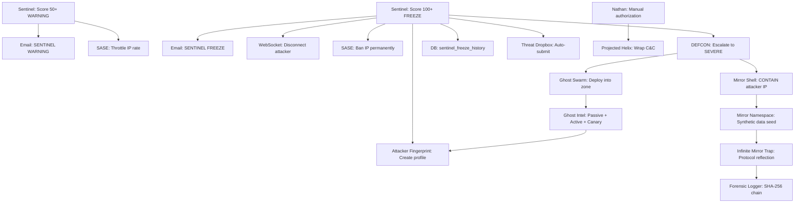

# Sentinel-to-House-of-Mirrors Auto-Deployment

## The Problem

The Sentinel correctly detects the hacker (score escalation 50 -> 75 -> 100 -> FREEZE), sends email alerts, and disconnects the WebSocket. But the attacker is **free to reconnect**. None of the patent-designed offensive defense systems activate:

- No Mirror Shell containment (Claim 30)
- No Infinite Mirror Trap deployment (Claim 35)
- No Ghost Swarm intelligence gathering (Claim 41)
- No DEFCON escalation
- No SASE blocklist ban
- No Attacker Fingerprint DB entry (Claim 34)
- No Threat Dropbox record

The code for all these systems exists and is fully implemented. The missing piece is the **event bridge** from Sentinel freeze to Hive Defense activation.

## Patent Claims Being Activated


| Claim | System                  | What It Does                                                           |
| ----- | ----------------------- | ---------------------------------------------------------------------- |
| 30    | Mirror Shell            | Routes attacker into isolated mirror namespace with synthetic data     |
| 33    | Curiosity Protocol      | Graduated escalation (NOTICE -> ALARM)                                 |
| 34    | Attacker Fingerprint DB | Behavioral signature for recognizing returning attackers               |
| 35    | Infinite Mirror Trap    | Reflects attacker's own protocol back with synthetic success responses |
| 41    | Ghost Swarm             | Multi-phantom intelligence gathering in containment zone               |
| 42-47 | v3.0 additions          | Birth rate anomaly, recursive containment, tripwires, quarantine       |
| 53-56 | Projected Helix         | Offensive wrapping of attacker C&C (manual authorization)              |


## Architecture: Sentinel -> House of Mirrors Pipeline




## Implementation Plan

### 1. Database Migration: `sentinel_banned_ips` + `sentinel_freeze_history`

File: `backend/migrations/NNN_sentinel_defense.sql`

Two new tables:

- `sentinel_banned_ips` -- persistent IP ban list (IP, reason, banned_at, banned_by, expires_at, active)
- `sentinel_freeze_history` -- forensic log of every freeze event (IP, UID, score, reasons, actions_taken, defcon_level)

### 2. Sentinel Event Callback

File: [backend/app/websocket/sentinel.py](backend/app/websocket/sentinel.py)

Add an `on_freeze_callback` parameter to `NateSentinel.__init__()`. When `score_action()` transitions to frozen, fire the callback with `(uid, ip, score, reasons, user_agent)`. This decouples Sentinel from Hive Defense knowledge while enabling event-driven activation.

Also add: score decay (reduce cumulative score by 10% per minute of inactivity), and a `frozen_at` timestamp for forensics.

### 3. Bridge Freeze Handler: The Orchestrator

File: [backend/app/websocket/bridge_server.py](backend/app/websocket/bridge_server.py)

In the existing `if _sentinel_result.get("frozen"):` block (around line 8889), after the email alert and DB writes, add the Hive Defense orchestration:

```python
# 1. SASE blocklist — immediate IP ban
if hasattr(handle_client, "_sase") and handle_client._sase:
    handle_client._sase.add_to_blocklist(client_ip, f"sentinel_freeze:{uid}")

# 2. Attacker fingerprint — create behavioral profile
_attacker_profile = {
    "ip": client_ip, "user_agent": _ws_user_agent,
    "score": _sentinel_result["total_session_score"],
    "reasons": _sentinel_result["reasons"],
    "timing": _action_timestamps,  # from Sentinel
}

# 3. DEFCON escalation — SEVERE (level 2)
if hasattr(handle_client, "_defcon") and handle_client._defcon:
    await handle_client._defcon.escalate(2, f"Sentinel freeze: {client_ip}")

# 4. Mirror Shell containment — create isolated namespace
if hasattr(handle_client, "_mirror_shell") and handle_client._mirror_shell:
    _namespace = handle_client._mirror_shell.contain_entity(
        client_ip, _attacker_profile
    )

# 5. Threat Dropbox auto-submit
# Insert into threat analysis pipeline

# 6. Freeze history — forensic record
# INSERT INTO sentinel_freeze_history (...)

# 7. Sentinel banned IPs — persistent ban
# INSERT INTO sentinel_banned_ips (...)
```

The key services (`_sase`, `_defcon`, `_mirror_shell`) need to be injected into the bridge's scope. They can be passed alongside `db_pool` at bridge startup, or loaded lazily via module-level singletons.

### 4. SASE Controller: Persistent Blocklist + Pre-Connect Check

File: [backend/app/services/security/sase_controller.py](backend/app/services/security/sase_controller.py)

- Add `sync_blocklist_from_db(db_pool)` method that loads `sentinel_banned_ips` (WHERE active = true) into the in-memory `_dynamic_blocklist` on startup and periodically (every 5 min)
- Add the ban persistence: when `add_to_blocklist()` is called with a `db_pool`, also INSERT into `sentinel_banned_ips`
- This ensures bans survive container restarts

### 5. DEFCON Controller: Sentinel Freeze Convenience Method

File: [backend/app/services/security/defcon_controller.py](backend/app/services/security/defcon_controller.py)

Add `on_sentinel_freeze(uid, ip, score, reasons)`:

- Score >= 100 (FREEZE): Escalate to SEVERE (level 2) — deploys Ghost Swarm
- Score >= 75 (WARNING pattern with rapid escalation): Escalate to ELEVATED (level 4)
- On escalation, the DEFCON broadcast event triggers Mirror Shell mode change (absorbing -> fortress)

### 6. Pre-Connect IP Check on WebSocket

File: [backend/app/websocket/bridge_server.py](backend/app/websocket/bridge_server.py)

At the very top of `handle_client()`, before any handshake:

```python
# Check if this IP is banned
if db_pool:
    _banned = await db_pool.fetchval(
        "SELECT reason FROM sentinel_banned_ips WHERE ip = $1 AND active = true",
        client_ip
    )
    if _banned:
        # Log reconnection attempt, optionally route to Mirror Trap
        await websocket.close(1008, "Access denied")
        return
```

Optionally, instead of closing immediately, route the banned IP into a Mirror Namespace (the "trap them" part) — the attacker reconnects and sees a convincing fake Sanctuary with synthetic data, while every interaction is forensically logged.

### 7. Graduated Response at WARNING Level (Score 50-99)

File: [backend/app/websocket/bridge_server.py](backend/app/websocket/bridge_server.py)

In the existing `elif` for WARNING (line 8943), add throttling:

- Score 50+: SASE rate-limits the IP to 10 req/min
- Score 75+: Send a re-auth challenge (force YubiKey/TOTP re-verification)
- Score 100+: Full freeze + House of Mirrors deployment (described above)

### 8. HW Security Auditor: Active Defense = TRUSTED

File: [backend/app/services/hardware_security_auditor.py](backend/app/services/hardware_security_auditor.py)

Update the `sentinel_clear` check: if `sentinel_frozen = true` AND a `sentinel_freeze_history` row exists within the last 24h with `actions_taken` containing "mirror_deployed" or "ip_banned", classify as TRUSTED (active defense in progress) rather than WARNING.

### 9. Threat Dropbox Integration

File: [backend/app/routers/hive_defense_api.py](backend/app/routers/hive_defense_api.py)

Add `POST /v4/sentinel-freeze/auto-hunt` endpoint that accepts Sentinel freeze data and creates a Threat Dropbox hunt entry. This makes freeze events visible in the Threat Dropbox UI alongside manual submissions.

### 10. Mirror Trap Activation Endpoint (Admin)

File: [backend/app/routers/hive_defense_api.py](backend/app/routers/hive_defense_api.py)

Add two new POST endpoints for manual/programmatic deployment:

- `POST /v4/mirror/deploy` — Deploy a Mirror Trap for a specific IP/profile
- `POST /v4/projection/propose` — Propose a Projected Helix deployment (awaits Nathan's authorization per patent design)

### 11. Projected Helix Authorization Flow (Email + SMS)

The Projected Helix requires Nathan's explicit approval. The existing `AdminContactShield.alert_admin()` already sends both SMS and email via `ADMIN_ALERT_PHONE` and `ADMIN_ALERT_EMAILS` env vars.

**Approval channels:**

- Email: `support@sovereignsanctuary.net` (set via `ADMIN_ALERT_EMAILS` in `.env`)
- SMS: `+15865243969` (set via `ADMIN_ALERT_PHONE` in `.env`)

**Approval flow:**

1. When DEFCON reaches CRITICAL (level 1) or the system proposes a Projected Helix, a `helix_proposal` record is created in a new `helix_authorization` table with status `PENDING`, a unique 6-character approval code, and an expiry (30 minutes).
2. SMS sent to `+15865243969`:

```
   [SANCTUARY DEFENSE] HELIX AUTHORIZATION REQUIRED
   Attacker IP: x.x.x.x | Score: 150 | Mirror active 12min
   Reply APPROVE-<code> to deploy Projected Helix
   Reply DENY-<code> to stand down
   

```

1. Email sent to `support@sovereignsanctuary.net` with full HTML report and two action links:
  - `https://api.sovereignsanctuary.net/api/hive-defense/v4/projection/approve/<code>` (APPROVE)
  - `https://api.sovereignsanctuary.net/api/hive-defense/v4/projection/deny/<code>` (DENY)
2. Nathan approves via either:
  - **SMS reply**: Twilio webhook receives `APPROVE-<code>`, validates the code, deploys the Projected Helix
  - **Email link click**: GET endpoint validates the code, deploys the Projected Helix
3. On approval, the system deploys the Projected Helix and sends a confirmation SMS + email.

**New endpoints:**

- `GET /api/hive-defense/v4/projection/approve/{code}` -- approve via email link
- `GET /api/hive-defense/v4/projection/deny/{code}` -- deny via email link
- `POST /api/hive-defense/v4/projection/sms-webhook` -- Twilio incoming SMS webhook for APPROVE/DENY

### 12. Live Escalation Timer (SMS to Nathan's Phone)

When the House of Mirrors activates (DEFCON 2+ with mirror deployed):

1. An initial SMS is sent to `+15865243969`:

```
   [HOUSE OF MIRRORS ACTIVE]
   Attacker IP: x.x.x.x trapped in Mirror
   DEFCON: SEVERE | Score: 150
   Interactions: 0 | Duration: 0:00
   Updates every 5min. Reply STATUS for instant update.
   

```

1. A background timer task (`_mirror_timer_task`) sends periodic SMS updates every 5 minutes:

```
   [MIRROR UPDATE 5:00]
   IP: x.x.x.x | Interactions: 47 | Commands: exfil, scan, lateral_move
   Duration: 5:12 | Ghost Swarm: 7 agents deployed
   Attacker sophistication: 3/5
   

```

1. When the attacker disengages (TrapMonitorWorker detects >1h inactivity), a final SMS:

```
   [MIRROR COMPLETE]
   Attacker disengaged after 47:23
   Total interactions: 342 | Unique commands: 12
   Full DEFCON Recon Report sent to email.
   

```

1. Nathan can text `STATUS` at any time to get an instant update on the active mirror trap.

The timer runs as an `asyncio.Task` in the bridge, using `notification_system.send_sms()`. It self-cancels when the trap deactivates.

### 13. DEFCON Recon Report (Full Email to [support@sovereignsanctuary.net](mailto:support@sovereignsanctuary.net))

On every DEFCON escalation (SEVERE or CRITICAL), and again when the attacker disengages, a comprehensive HTML email is sent to `support@sovereignsanctuary.net` with the full intelligence package:

**Report sections:**


| Section               | Content                                                                                                                                                        |
| --------------------- | -------------------------------------------------------------------------------------------------------------------------------------------------------------- |
| **WHERE**             | Attacker IP, GeoIP lookup (country, city, ISP, ASN), VPN/proxy detection, all IPs used across sessions                                                         |
| **WHAT**              | Commands attempted, targets probed, data exfiltration attempts, protocol patterns detected                                                                     |
| **WHEN**              | First contact timestamp, escalation timeline (WARNING at HH:MM, FREEZE at HH:MM, DEFCON SEVERE at HH:MM), total engagement duration                            |
| **WHO**               | Attacker Fingerprint DB profile (10-dimensional behavioral vector), sophistication level (1-5), cosine similarity matches to known attackers, user-agent chain |
| **HOW**               | Tool signatures, communication protocol grammar, attack methodology classification (brute force, credential stuffing, C&C, exfiltration)                       |
| **HOW MANY**          | Total interactions mirrored, unique command types, connection attempts from this IP, Ghost Swarm agent count deployed, canary tokens triggered                 |
| **DEFENSE ACTIONS**   | SASE blocklist entry, DEFCON level reached, Mirror Shell namespace ID, Infinite Mirror Trap stats, Ghost Swarm findings summary, forensic chain hash count     |
| **FORENSIC EVIDENCE** | First 10 + last 10 interaction hashes (SHA-256), trap deployment and deactivation timestamps, immutable chain verification status                              |


The email uses the Sanctuary design system (background #050505, gold #C9A962, DM Sans font) matching the existing Trust Enforcer report format.

**Implementation:** New method `_send_defcon_recon_report()` in the bridge freeze handler or a new `DefconReconReporter` service. Uses `notification_system._send_email()` (SendGrid) with the HTML template. GeoIP lookup via `ip-api.com` free tier or MaxMind GeoLite2 database.

## Key Design Decisions

1. **Projected Helix remains manual-authorization-only** per the patent's ethical framework: "This is a weapon, not a reflex. HUMAN AUTHORIZATION REQUIRED." Nathan approves via SMS reply or email link click.
2. **Mirror Trap is automatic** — the patent describes it as a defensive countermeasure (Claim 35), not an offensive weapon. It contains the attacker in synthetic data without touching their infrastructure.
3. **Banned IP reconnection = routed to Mirror Trap** rather than hard-blocked. This is the "trap them in the House of Mirrors" behavior. The attacker thinks they're back in, but everything they see is synthetic.
4. **Forensic chain is immutable** — every interaction in the Mirror Trap is SHA-256 hashed and logged. This supports law enforcement cooperation (Claim 56).
5. **Dual-channel approval** — Nathan can approve Projected Helix via either email link or SMS reply. Both channels validate the same unique approval code.
6. **Live timer to phone** — SMS updates every 5 min during active mirror engagement so Nathan knows the trap is working and how long the attacker has been contained.
7. **Full DEFCON Recon Report** — all intelligence (where, what, when, who, how, how many) compiled into a single email sent at escalation and again at attacker disengagement.
8. **Admin contact details** — `support@sovereignsanctuary.net` for email, `+15865243969` for SMS. Set via existing `ADMIN_ALERT_EMAILS` and `ADMIN_ALERT_PHONE` env vars.

## Files Changed


| File                                                     | Change                                                                                                                            |
| -------------------------------------------------------- | --------------------------------------------------------------------------------------------------------------------------------- |
| `backend/migrations/NNN_sentinel_defense.sql`            | NEW: 3 tables (sentinel_banned_ips, sentinel_freeze_history, helix_authorization)                                                 |
| `backend/app/websocket/sentinel.py`                      | Add callback, score decay, frozen_at                                                                                              |
| `backend/app/websocket/bridge_server.py`                 | Orchestrate Hive Defense on freeze, pre-connect ban check, graduated response, mirror timer task, DEFCON recon report             |
| `backend/app/services/security/sase_controller.py`       | Persistent blocklist from DB, sync on startup                                                                                     |
| `backend/app/services/security/defcon_controller.py`     | `on_sentinel_freeze()` convenience method                                                                                         |
| `backend/app/routers/hive_defense_api.py`                | 6 new endpoints (auto-hunt, mirror deploy, projection propose, projection approve/deny, SMS webhook)                              |
| `backend/app/services/hardware_security_auditor.py`      | Active defense = TRUSTED logic                                                                                                    |
| `backend/app/services/security/defcon_recon_reporter.py` | NEW: DEFCON Recon Report generator + sender                                                                                       |
| `.env.template`                                          | Verify ADMIN_ALERT_PHONE=+15865243969, ADMIN_ALERT_EMAILS=[support@sovereignsanctuary.net](mailto:support@sovereignsanctuary.net) |


