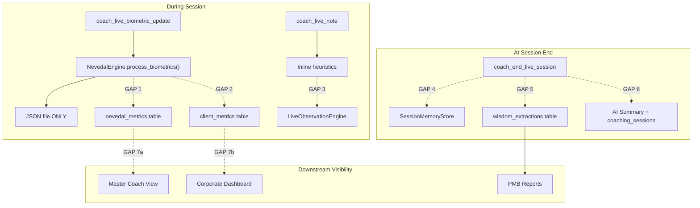
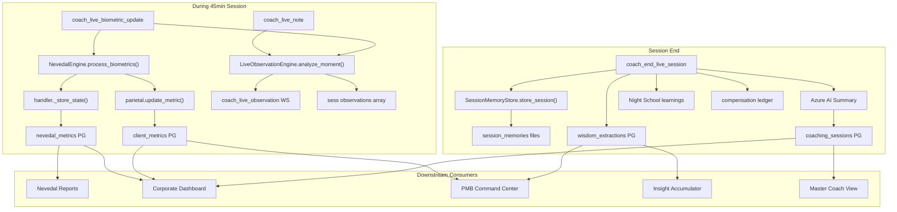

# Full Pipeline Wiring: Live Session Data Capture

## The 7 Gaps




All fixes are in [backend/app/websocket/bridge_server.py](backend/app/websocket/bridge_server.py) unless noted otherwise.

---

## Gap 1: Nevedal Metrics Not Written to PostgreSQL

**Problem**: `coach_live_biometric_update` (line ~13414) calls `handler.engine.process_biometrics()` but never calls `handler._store_state(state)`.

**Fix**: After `state = handler.engine.process_biometrics(...)`, add:

```python
if state and handler.db_pool:
    try:
        await handler._store_state(state)
    except Exception as e:
        print(f">>> [LIVE SESSION] nevedal_metrics write failed: {e}")
```

**Location**: Line ~13427 in `bridge_server.py`, immediately after `state` is obtained and before observations are checked.

**Result**: Every biometric reading during a live session writes to `nevedal_metrics` in PostgreSQL, making it available to Nevedal Reports, PMB, and Corporate Dashboard.

---

## Gap 2: client_metrics Not Updated

**Problem**: `MetricsEngine._pg_sync_metrics()` only runs from `update_metric()`, which is not called during live sessions.

**Fix**: After storing the Nevedal state, also update client_metrics via `parietal` (the `MetricsEngine` instance, available at module level):

```python
if state and parietal:
    try:
        profile_for_sync = load_registry().get(f"client_{user_id}") or {}
        if profile_for_sync:
            parietal.update_metric(profile_for_sync, "nevedal_state", state.to_dict())
    except Exception as e:
        print(f">>> [LIVE SESSION] client_metrics sync failed: {e}")
```

**Location**: Same block as Gap 1, after the `_store_state` call.

**Result**: `client_metrics` gets updated with live C_emo, GAP, engagement, risk level in real time. Corporate Dashboard and PMB Command Center immediately see fresh data.

---

## Gap 3: LiveObservationEngine Not Used

**Problem**: The bridge uses inline keyword checks instead of the full `LiveObservationEngine` that combines keywords + biometrics + Night School wisdom + pattern recognition.

**Fix**: Instantiate `LiveObservationEngine` at module level in `bridge_server.py`:

```python
from app.services.live_observation_engine import create_live_observation_engine
_live_obs_engine = create_live_observation_engine()
```

Then replace the inline heuristic blocks in both `coach_live_note` and `coach_live_biometric_update` with calls to `_live_obs_engine.analyze_moment()`:

**In `coach_live_note**` (~line 13330):

```python
obs = _live_obs_engine.analyze_moment(
    live_session_id=live_id,
    text=text,
    nevedal_state=last_state_dict,  # from most recent biometric
)
if obs:
    obs_dict = obs.to_dict()
    sess.setdefault("observations", []).append(obs_dict)
    await websocket.send(json.dumps({"type": "coach_live_observation", ...obs_dict}))
```

**In `coach_live_biometric_update**` (~line 13450):

```python
obs = _live_obs_engine.analyze_moment(
    live_session_id=live_id,
    biometrics=biometrics,
    nevedal_state=state.to_dict() if state else None,
)
```

**At session end**, call `_live_obs_engine.get_session_summary(live_id)` to get the observation summary, then `_live_obs_engine.clear_session(live_id)` to free memory.

**Result**: Richer observations using the full engine (attachment cues, regulatory cues, defensive patterns, wisdom opportunities, combined scoring).

---

## Gap 4: SessionMemoryStore Never Called

**Problem**: `store_session()` exists with full support for transcript, observations, biometrics, and live session data, but is never invoked.

**Fix**: At `coach_end_live_session` (~line 13530), after marking the session ENDED, instantiate and call `SessionMemoryStore`:

```python
try:
    from app.services.session_memory_store import SessionMemoryStore
    _sms = SessionMemoryStore(storage_root=DATA_DIR)
    _sms.store_session(
        session_id=live_id,
        coach_id=sess.get("coach_id", ""),
        client_id=sess.get("client_id", ""),
        observations=[o for o in (sess.get("observations") or [])],
        biometrics=[b for b in (sess.get("biometrics") or [])],
        live_session_data=sess,
        family_id=sess.get("family_id"),
    )
except Exception as e:
    print(f">>> [LIVE SESSION] SessionMemoryStore failed: {e}")
```

**Result**: Full session data persisted to structured files under `session_memories/{live_id}/` with observations.json, biometrics.json, live_session.json, and index.json updated.

---

## Gap 5: wisdom_extractions Not Populated

**Problem**: `LivedWisdomService._store_wisdom()` exists but is inaccessible from the bridge (separate process). No session wisdom is extracted.

**Fix**: Write directly to `wisdom_extractions` via `db_pool` at session end, extracting insights from coach notes and observations:

```python
if db_pool and share_with_nate:
    try:
        notes_text = "\n".join([n.get("text","") for n in (sess.get("notes") or [])])
        obs_summary = _live_obs_engine.get_session_summary(live_id) if _live_obs_engine else {}
        
        # Resolve user UUID
        async with db_pool.acquire() as conn:
            user_uuid = await conn.fetchval(
                "SELECT id FROM users WHERE hardware_id=$1 OR username=$1 LIMIT 1",
                sess.get("client_id", "")
            )
            if user_uuid and notes_text.strip():
                insight_types = []
                if obs_summary.get("observation_counts", {}).get("BREAKTHROUGH_MOMENT"):
                    insight_types.append(("breakthrough", "Breakthrough moment detected during live session"))
                if obs_summary.get("observation_counts", {}).get("LONGING_SIGNAL"):
                    insight_types.append(("pattern", "Longing signal pattern observed"))
                # Always store a session summary extraction
                insight_types.append(("technique", f"Session notes: {notes_text[:500]}"))
                
                for itype, content in insight_types:
                    await conn.execute("""
                        INSERT INTO wisdom_extractions 
                        (user_id, insight_type, content, effectiveness_score, source, approved)
                        VALUES ($1, $2, $3, 0.6, 'session', true)
                    """, user_uuid, itype, content)
    except Exception as e:
        print(f">>> [LIVE SESSION] wisdom_extractions write failed: {e}")
```

**Result**: Session insights flow into `wisdom_extractions` with `source='session'`, feeding PMB Reports, Insight Accumulator, and Marketing Brain.

---

## Gap 6: No AI Summary at Session End

**Problem**: No AI-generated summary is created for the live session. `coaching_sessions.nate_summary` stays empty.

**Fix**: At session end, call Azure OpenAI to generate a summary from notes + observations + biometrics, then write to `coaching_sessions`:

```python
if db_pool:
    try:
        notes_text = "\n".join([n.get("text","") for n in (sess.get("notes") or [])])
        obs_list = sess.get("observations") or []
        obs_text = "\n".join([f"[{o.get('type','')}] {o.get('message','')}" for o in obs_list[:20]])
        bio_list = sess.get("biometrics") or []
        avg_cemo = sum(b.get("c_emo", 0.5) for b in bio_list) / max(len(bio_list), 1)
        
        summary_prompt = f"""Summarize this coaching session (coach notes and AI observations):
NOTES:\n{notes_text[:3000]}
OBSERVATIONS:\n{obs_text[:2000]}
AVG COHERENCE: {avg_cemo:.2f}
Duration: {billable_seconds // 60} minutes"""
        
        # Call Azure for summary
        nate_summary = await _generate_session_summary(summary_prompt)
        
        # Write to coaching_sessions
        schedule_sid = sess.get("schedule_session_id", "")
        if schedule_sid:
            async with db_pool.acquire() as conn:
                await conn.execute("""
                    UPDATE coaching_sessions SET
                        nate_summary = $1,
                        coach_notes = $2,
                        status = 'completed',
                        actual_end = NOW(),
                        duration_minutes = $3,
                        session_data = session_data || $4::jsonb
                    WHERE session_id = $5
                """, nate_summary, notes_text[:4000],
                     billable_seconds // 60,
                     json.dumps({"observations_count": len(obs_list), "avg_c_emo": round(avg_cemo, 3)}),
                     schedule_sid)
    except Exception as e:
        print(f">>> [LIVE SESSION] Summary generation failed: {e}")
```

A helper function `_generate_session_summary(prompt)` calls Azure OpenAI Chat Completions (same pattern as `_call_azure_coach_chat` in [skyeye_chat.py](backend/app/services/skyeye_chat.py)).

**Result**: Every completed session has an AI-generated summary, coach notes, and computed metrics in `coaching_sessions`.

---

## Gap 7: Master Coach and Corporate Dashboard Visibility

### Gap 7a: Master Coach View

**Problem**: Master coaches cannot see their assistant coaches' session outcomes.

**Fix**: Add a query to [coach_hierarchy_api.py](backend/app/routers/coach_hierarchy_api.py) -- new endpoint `GET /api/coach/hierarchy/assistant-sessions/{coach_username}`:

```python
@router.get("/hierarchy/assistant-sessions/{coach_username}")
async def get_assistant_sessions(coach_username: str, request: Request, days: int = 30):
    # Verify requester is master coach of this assistant
    # Query coaching_sessions joined with users for the assistant's clients
    # Return: session summaries, nate_summary, avg C_emo, observation counts
```

**Result**: Master coaches see their assistant's session outcomes (summaries, coherence, breakthroughs) in the coach portal.

### Gap 7b: Corporate Dashboard

**Problem**: `corporate_command_api.py` reads `sessions` table (count only) but not `coaching_sessions` (notes, mood, topics, summaries).

**Fix**: Add session outcomes to the corporate wellness endpoint in [corporate_command_api.py](backend/app/routers/corporate_command_api.py):

```python
# In the wellness aggregation query, add:
session_outcomes = await conn.fetch("""
    SELECT cs.coach_id, COUNT(*) as sessions, 
           AVG(COALESCE((cs.session_data->>'avg_c_emo')::float, 0)) as avg_coherence,
           COUNT(CASE WHEN cs.nate_summary IS NOT NULL THEN 1 END) as summarized
    FROM coaching_sessions cs
    JOIN users u ON u.hardware_id = cs.client_id
    WHERE u.profile_data->>'company_id' = $1
      AND cs.created_at > NOW() - INTERVAL '30 days'
    GROUP BY cs.coach_id
""", company_id)
```

**Result**: Corporate dashboard shows session outcomes, average coherence per coach, and summary completion rates.

---

## File Change Summary


| File                                                                     | Changes                                                                                                                                                                                                                                                           |
| ------------------------------------------------------------------------ | ----------------------------------------------------------------------------------------------------------------------------------------------------------------------------------------------------------------------------------------------------------------- |
| [bridge_server.py](backend/app/websocket/bridge_server.py)               | Gap 1-6: Add `_store_state()` call, `parietal.update_metric()` call, replace heuristics with `LiveObservationEngine`, call `SessionMemoryStore.store_session()` at end, write `wisdom_extractions` at end, generate AI summary at end, update `coaching_sessions` |
| [coach_hierarchy_api.py](backend/app/routers/coach_hierarchy_api.py)     | Gap 7a: New endpoint for master coach to see assistant session outcomes                                                                                                                                                                                           |
| [corporate_command_api.py](backend/app/routers/corporate_command_api.py) | Gap 7b: Add session outcomes to wellness aggregation                                                                                                                                                                                                              |


---

## Data Flow After Wiring




## Execution Order at Session End

1. Mark session ENDED in JSON
2. Compute billing (interaction_seconds, billable_seconds)
3. Write compensation ledger
4. Write SessionTracker
5. **NEW**: Call `SessionMemoryStore.store_session()` with all accumulated data
6. **NEW**: Get observation summary from `LiveObservationEngine`
7. **NEW**: Write `wisdom_extractions` to PostgreSQL
8. **NEW**: Generate AI summary via Azure OpenAI
9. **NEW**: Update `coaching_sessions` with summary, notes, status, duration, metrics
10. Night School learning (if share_with_nate)
11. Clear LiveObservationEngine session memory
12. Send `coach_live_session_ended` to client

