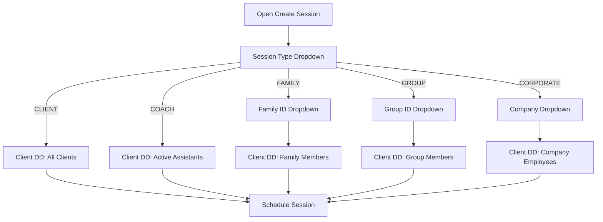

# Session Dialog Dynamic Dropdowns

## Current State

The `_openCreateSessionDialog()` in `[mobile/lib/updated_screens.dart](mobile/lib/updated_screens.dart)` (lines 4304-4562) has:

- **3 session types**: COACH, FAMILY, GROUP
- **Client dropdown**: shows all `_clients` (from `coach_get_clients`)
- **Family ID**: plain `TextFormField` (not a dropdown)
- **No Corporate ID or Group ID** dropdowns

Data already available in state:

- `_clients` -- all coach's clients, each with `family_id`, `company_id`, `company_name` fields
- `_assistantMetrics` -- assistant coaches with `assistant_id`, `username`, `display_name`

## Changes

### 1. Backend: Add `group_id` to coach_get_clients response

**File**: `[backend/app/websocket/bridge_server.py](backend/app/websocket/bridge_server.py)` ~line 13800

Add `"group_id": p.get("group_id") or ""` to the per-client dict in the `coach_get_clients` handler, alongside existing `family_id` and `company_id`.

### 2. Flutter: Rewrite Create Session dialog with cascading dropdowns

**File**: `[mobile/lib/updated_screens.dart](mobile/lib/updated_screens.dart)` -- `_openCreateSessionDialog()` (lines 4304-4562)

#### 2a. Add 5 session types

Replace the 3-item dropdown with:

- `CLIENT` -- standard 1:1 coaching session
- `COACH` -- consultation with assistant coach
- `FAMILY` -- family session
- `GROUP` -- group session
- `CORPORATE` -- corporate employee session

#### 2b. Add new state variables inside the dialog's `StatefulBuilder`

- `selectedCompanyId` / `selectedGroupId` -- secondary dropdown selections
- `filteredClients` -- the client list filtered by the current type + secondary selection

#### 2c. Build derived lookup lists from `_clients`

```dart
// Unique family IDs (non-empty)
final familyIds = _clients
    .map((c) => (c['family_id'] ?? '').toString().trim())
    .where((f) => f.isNotEmpty)
    .toSet().toList()..sort();

// Unique company entries (id + name)
final companyMap = <String, String>{};
for (final c in _clients) {
  final cid = (c['company_id'] ?? '').toString().trim();
  final cname = (c['company_name'] ?? cid).toString().trim();
  if (cid.isNotEmpty) companyMap[cid] = cname;
}

// Unique group IDs (from profile_data->>'group_id')
final groupIds = _clients
    .map((c) => (c['group_id'] ?? '').toString().trim())
    .where((g) => g.isNotEmpty)
    .toSet().toList()..sort();

// Assistant coaches for COACH type
final assistants = _assistantMetrics
    .where((a) => a['status'] == 'active')
    .toList();
```

#### 2d. Conditional secondary dropdown row (replaces the current Type + Family ID row)

```
if sessionType == FAMILY  --> show Family ID dropdown (from familyIds)
if sessionType == GROUP    --> show Group ID dropdown (from groupIds)
if sessionType == CORPORATE --> show Company dropdown (from companyMap)
if sessionType == COACH or CLIENT --> no secondary dropdown
```

#### 2e. Client dropdown population logic

```
COACH type:
  -> Show assistants from _assistantMetrics (display_name, assistant_id)
  -> No secondary dropdown

CLIENT type:
  -> Show all clients from _clients (default behavior)
  -> No secondary dropdown

FAMILY type:
  -> After picking Family ID, filter _clients by matching family_id
  -> Client dropdown shows only family members

GROUP type:
  -> After picking Group ID, filter _clients by matching group_id
  -> Client dropdown shows only group members

CORPORATE type:
  -> After picking Company ID, filter _clients by matching company_id
  -> Client dropdown shows only company employees
```

#### 2f. Dialog flow diagram




### 3. Wire secondary IDs into the schedule payload

In `_scheduleSessionViaApi()`, the `family_id` param already exists. Extend the payload to also pass the secondary identifier contextually:

- FAMILY: `family_id` = selected family ID
- GROUP: `family_id` = selected group ID (reuse field for grouping context)
- CORPORATE: `family_id` = selected company ID (reuse field for grouping context)

No backend API changes needed -- `session_type` already distinguishes the context.

### 4. Build and deploy

- `flutter build web --release`
- Deploy to production (rsync without --delete to both web roots)
- Deploy `bridge_server.py` via scp, restart bridge container

