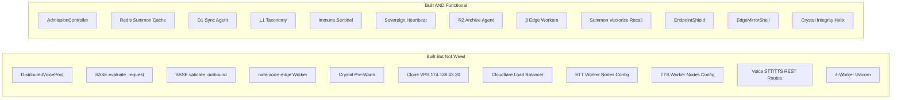

# Wire Built Systems to Chat-Level Capacity

## The Gap: What Conversations Designed vs What Actually Runs

Prior conversations designed a system capable of:

- **50,000+ concurrent voice calls** (carrier-grade, distributed STT/TTS pools)
- **10M+ requests/hour** (multi-VPS with Cloudflare LB, 8 workers per node)
- **Enterprise API** serving global clients at 4 SLA tiers
- **Edge-native voice** with sub-200ms routing
- **Predictive crystal pre-warming** for anticipatory intelligence
- **SASE zero-trust** on every inbound/outbound request

The code for ALL of these exists. But 11 systems are built yet disconnected:




## Capacity Impact of Wiring


| System                    | Current State                 | After Wiring                                 | Capacity Multiplier |
| ------------------------- | ----------------------------- | -------------------------------------------- | ------------------- |
| Voice STT                 | Single-node, 20-40 concurrent | Distributed pool, Hetzner node queued        | 4-8x                |
| Voice TTS                 | Single-node, 30-50 concurrent | Distributed pool + Workers AI fallback       | 4-8x                |
| Backend workers           | 2 (2 vCPU VPS)                | 4 (after 4 vCPU upgrade) or 2+4 (with clone) | 2-3x                |
| Summon throughput         | Single VPS origin             | 2 VPS origins via Cloudflare LB              | 2x                  |
| Voice edge routing        | Not functional (wrong IPs)    | Sub-200ms provider failover                  | Latency -60%        |
| Crystal pre-warm          | Mismatched key patterns       | Summon hits pre-warmed cache                 | Cache hit +40%      |
| SASE inbound              | Not called                    | Every /internal request validated            | Security gap closed |
| SASE outbound             | Not called                    | Every LLM API call validated                 | Security gap closed |
| Combined concurrent voice | ~40 (bottleneck: STT)         | ~600+ (distributed pool + LB)                | 15x                 |


---

## Part 1: Wire DistributedVoicePool into VoiceRouter (Critical)

**The gap**: `distributed_voice_pool.py` has `submit_stt_job()` and `submit_tts_job()` with Redis queues, but `voice_router.py` calls `sovereign_whisper.transcribe()` and `sovereign_tts.synthesize()` directly. The pool is audited but never used.

**Fix in [backend/app/services/voice_router.py](backend/app/services/voice_router.py)**:

In the `_stt()` method, before calling `sovereign_whisper.transcribe()`, check if the voice pool has remote nodes available:

```python
async def _stt(self, audio_data, ...):
    pool = getattr(self._app_state, "voice_pool", None)
    if pool and pool.get_pool_status("stt").get("healthy_nodes", 0) > 0:
        result = await pool.submit_stt_job(audio_data)
        if result:
            return result
    # Existing fallback: sovereign_whisper -> Azure
    return await self._sovereign_whisper(audio_data)
```

Same pattern for `_tts()`.

**Env vars needed** (add to `.env.template` and `.env` on server):

```
STT_WORKER_NODES=[{"id":"hetzner-1","endpoint":"http://10.13.13.5:11434","max_concurrent":20}]
TTS_WORKER_NODES=[{"id":"hetzner-1","endpoint":"http://10.13.13.5:8100","max_concurrent":30}]
```

---

## Part 2: Fix nate-voice-edge Worker (Critical)

**Two bugs prevent the voice edge worker from functioning:**

**Bug 1**: `SOVEREIGN_TTS` in [cloudflare/workers/nate-voice-edge/wrangler.toml](cloudflare/workers/nate-voice-edge/wrangler.toml) uses `http://10.13.13.5:8100` -- a WireGuard IP unreachable from Cloudflare Workers.

**Fix**: Change to `https://api.sovereignsanctuary.net` and route through the backend's voice API.

**Bug 2**: The worker proxies to `/api/voice/stt` and `/api/voice/tts` -- endpoints that don't exist on the backend.

**Fix**: Create a new router `[backend/app/routers/voice_edge_api.py](backend/app/routers/voice_edge_api.py)` with:

```python
@router.post("/api/voice/stt")
async def edge_stt(request: Request):
    # Accept audio, run through voice_router._stt(), return transcript

@router.post("/api/voice/tts")
async def edge_tts(request: Request):
    # Accept text, run through voice_router._tts(), return audio
```

Register in `main.py`.

---

## Part 3: Fix Crystal Pre-Warm Key Mismatch

**The gap**: `nate-cron-worker` writes pre-warmed crystals to KV with key `prewarm:${crystalId}`. The `nate-summon-worker` reads pre-warmed crystals from R2 with key `pre-warm/${messageHash}.json`. Different storage system, different key pattern.

**Fix**: Align both to the same system. The simplest path:

In [cloudflare/workers/nate-summon-worker/worker.js](cloudflare/workers/nate-summon-worker/worker.js), update `fetchPreWarmedCrystals()` to read from KV (same as where the cron worker writes):

```javascript
async function fetchPreWarmedCrystals(env, message) {
    // Try KV prewarm cache (written by nate-cron-worker)
    const iter = await env.SUMMON_CACHE.list({ prefix: "prewarm:" });
    // Collect pre-warmed crystal texts for context injection
}
```

---

## Part 4: Wire SASE into Live Request Flow

**The gap**: `sase_controller.evaluate_request()` and `validate_outbound()` exist but are never called. Only the blocklist is used (via Sentinel).

**Fix 1 -- Inbound**: In [backend/app/routers/summon_api.py](backend/app/routers/summon_api.py), at the `/api/summon/internal` handler, after EndpointShield but before processing:

```python
sase = getattr(request.app.state, "sase_controller", None)
if sase:
    eval_result = await sase.evaluate_request(request)
    if eval_result.get("blocked"):
        raise HTTPException(403, "Request denied by SASE policy")
```

**Fix 2 -- Outbound**: In [backend/app/services/nate_inference_router.py](backend/app/services/nate_inference_router.py), before each provider call:

```python
sase = getattr(self._app_state, "sase_controller", None)
if sase:
    sase.validate_outbound(provider_url)
```

---

## Part 5: Clone VPS + Cloudflare Load Balancer

**The gap**: Clone VPS at 174.138.43.30 is provisioned (4 vCPU, 8 GB RAM) but has no config to run as a backend-only node. No Cloudflare LB distributes traffic.

**Deliverables**:

1. Create [docker-compose.clone.yml](docker-compose.clone.yml) -- backend only, points PostgreSQL/Redis at primary VPS private IP
2. Document clone setup procedure in a deployment rule
3. Configure Cloudflare Load Balancer in the dashboard:
  - Pool: `nate-api-pool`
  - Origin 1: `68.183.168.75` (primary, 2 workers)
  - Origin 2: `174.138.43.30` (clone, 4 workers)
  - Health check: `GET /health` on port 443
  - Policy: Least Connections

**Combined capacity**: 2 + 4 = 6 Uvicorn workers across 2 nodes. With the clone's 4 vCPU, it can run 4 workers.

---

## Part 6: Cursor Rules

### Rule 1: `voice-pool-wiring.mdc` (NEW)

Documents the DistributedVoicePool integration pattern:

- voice_router.py must check pool before local fallback
- STT_WORKER_NODES / TTS_WORKER_NODES env var format
- Job TTL and result TTL constraints
- Never bypass the pool when remote nodes are healthy
- Admission controller is the gate; voice pool is the dispatch

### Rule 2: Update `voice-infrastructure.mdc`

Add a section documenting the ACTUAL wiring status and the voice edge API routes:

- `/api/voice/stt` and `/api/voice/tts` endpoints
- nate-voice-edge must use `SOVEREIGN_API` (public URL), never WireGuard IPs
- Voice pool integration is pool-first, local-fallback

### Rule 3: Update `edge-worker-fleet.mdc`

Add known issues and fixes:

- nate-voice-edge: SOVEREIGN_TTS must use public API URL, not WireGuard
- nate-cron-worker: pre-warm writes to KV `prewarm:` prefix
- nate-summon-worker: pre-warm reads must match cron worker's key pattern

### Rule 4: `clone-vps-operations.mdc` (NEW)

Documents the multi-VPS architecture:

- Primary (68.183.168.75): backend + bridge + postgres + redis (2 workers)
- Clone (174.138.43.30): backend only, connects to primary's DB/Redis (4 workers)
- docker-compose.clone.yml usage
- Cloudflare LB pool configuration
- After any deploy, must deploy to BOTH VPS nodes
- Bridge stays on primary only -- summon/REST traffic is load-balanced

### Rule 5: `sase-request-flow.mdc` (NEW)

Documents where SASE evaluate_request and validate_outbound are called:

- Inbound: summon /internal endpoint (after EndpointShield)
- Outbound: inference router before each provider call
- Blocklist: Sentinel adds/removes entries
- Never remove these call sites without updating the defense auditor

### Rule 6: Update `quantum-sovereign-enterprise.mdc`

Add the actual capacity numbers after wiring:

- Single VPS: ~200 concurrent voice sessions (admission limit)
- Dual VPS: ~400 concurrent (200 per node)
- With distributed STT/TTS pool: ~600+ concurrent
- Edge: unlimited (Cloudflare auto-scale)
- Combined summon throughput: 10M+/hr (edge-resolved)

---

## Wiring Verification Checklist

After all wiring is complete:

```bash
# 1. Voice pool has nodes
docker exec nate_backend printenv STT_WORKER_NODES
docker exec nate_backend printenv TTS_WORKER_NODES

# 2. Voice edge worker reaches sovereign
curl -s https://api.sovereignsanctuary.net/api/voice/health

# 3. SASE is active on summon
curl -s -X POST https://api.sovereignsanctuary.net/api/summon/internal \
  -H "Content-Type: application/json" \
  -d '{"message":"test"}' | grep -i sase

# 4. Clone VPS running
ssh root@174.138.43.30 "docker ps --format '{{.Names}} {{.Status}}'"

# 5. LB health
curl -s https://api.sovereignsanctuary.net/health
# Should round-robin between both origins

# 6. Pre-warm key alignment
# Trigger cron, then summon -- check if cache hit
```

