# Three-Tier Voice Architecture for Little Nate

## Problem

Little Nate's voice is inconsistent (browser TTS vs Azure alloy), the VagusEngine audio player is broken (commented out), and there is no cost control -- any user can trigger expensive Realtime API sessions.

## Three-Tier Architecture

```mermaid
flowchart TD
    subgraph tier1 [Tier 1: Pre-Generated Audio - $0]
        A[Onboarding Tour] --> B[Static MP3 files]
        B --> C[audioplayers plays locally]
    end
    
    subgraph tier2 [Tier 2: Mini-TTS - ~$0.05/request]
        D[Inner Chamber User] --> E["Nate generates TEXT response"]
        E --> F["User taps Read Aloud"]
        F --> G["Bridge sends text to GPT-4o-Mini-TTS"]
        G --> H["Audio streamed back as nate_audio_delta"]
    end
    
    subgraph tier3 [Tier 3: Realtime API - $1.50-7/session]
        I[Sovereign Circle User] --> J["Live bidirectional voice"]
        J --> K["Bridge opens Azure Realtime session"]
        K --> L["Full interactive conversation"]
    end
```




## Subscription Gating


| Tier             | Plan                        | Voice Features                                    | Cost to Platform  |
| ---------------- | --------------------------- | ------------------------------------------------- | ----------------- |
| Threshold        | TRIAL                       | Text chat only + pre-generated audio onboarding   | ~$0.01/session    |
| Inner Chamber    | STANDARD                    | Text chat + Mini-TTS read-aloud of Nate responses | ~$0.05/read-aloud |
| Sovereign Circle | TOP_TIER / SOVEREIGN_CIRCLE | Full Realtime voice conversation                  | $1.50-7/session   |


Existing field: `profile["subscription_plan"]` and `compute_premium_features()` in [bridge_server.py](backend/app/websocket/bridge_server.py) line 826.

## Changes

### 1. Generate Onboarding Audio Files (Tier 1)

Generate MP3 files for all onboarding steps using Azure alloy voice (one-time cost ~$0.05 total). Script to run locally:

- Use OpenAI TTS API or Azure Speech to generate one MP3 per onboarding step
- Save to `mobile/web/assets/audio/onboarding_client_1.mp3` through `onboarding_client_7.mp3`
- Same for coach: `onboarding_coach_1.mp3` through `onboarding_coach_8.mp3`
- Add to `pubspec.yaml` assets section
- Total: 15 audio files, ~2-3 MB

### 2. Fix VagusEngine Audio Playback

**File:** [mobile/lib/shared_widgets.dart](mobile/lib/shared_widgets.dart)

The `_playNextChunk()` method (line 132) is commented out. Fix it using Web Audio API via `dart:js_interop` to:

- Create an `AudioContext` (24kHz sample rate for Azure PCM)
- Decode base64 PCM chunks into audio buffers
- Queue for gapless playback
- Track speaking state via callbacks

This is needed for both Tier 2 (Mini-TTS streaming) and Tier 3 (Realtime streaming).

### 3. Update Onboarding to Play Static Audio

**File:** [mobile/lib/updated_screens.dart](mobile/lib/updated_screens.dart)

In `_OnboardingTutorialScreenState`:

- Remove `FlutterTts` entirely
- Use `audioplayers` (already in pubspec.yaml) to play the pre-generated MP3s
- `_speakStep(index)` becomes `_player.play(AssetSource('audio/onboarding_client_${index+1}.mp3'))`
- Keep the BEGIN TOUR welcome gate (user tap satisfies browser autoplay)
- Bind player completion to `_isSpeaking` state

### 4. Add Mini-TTS Handler (Tier 2)

**File:** [backend/app/websocket/bridge_server.py](backend/app/websocket/bridge_server.py)

Add `mini_tts_speak` message handler (~line 4145):

1. **Tier check**: Verify `subscription_plan` is not `TRIAL` (Inner Chamber+ only)
2. Call Azure GPT-4o-Mini-TTS endpoint (not Realtime) -- this is a REST API, not WebSocket:
  - `POST https://{endpoint}/openai/deployments/gpt-4o-mini-tts/audio/speech`
  - Body: `{"model": "gpt-4o-mini-tts", "input": text, "voice": "alloy"}`
  - Returns MP3 audio bytes
3. Base64-encode the audio and send back as `nate_audio_delta`
4. Send `tts_done` when complete

**Note:** If `gpt-4o-mini-tts` is not yet available on your Azure deployment, fall back to the Realtime API with `["text", "audio"]` modalities (same code pattern as existing).

### 5. Tier-Gate Realtime Sessions (Tier 3)

**File:** [backend/app/websocket/bridge_server.py](backend/app/websocket/bridge_server.py)

At the existing `chat_message` handler (~line 4156) where Realtime sessions are initiated, add a tier check:

```python
# Before opening Azure Realtime session:
plan = (current_profile.get("subscription_plan") or "").upper()
REALTIME_TIERS = {"TOP_TIER", "SOVEREIGN_CIRCLE"}
if plan not in REALTIME_TIERS:
    await websocket.send(json.dumps({
        "type": "error",
        "message": "UPGRADE_REQUIRED",
        "detail": "Live voice requires Sovereign Circle subscription"
    }))
    return
```

### 6. Cursor Rule

Create `.cursor/rules/nate-voice.mdc`:

- Tier 1 (static audio): Pre-generated MP3s for scripted narration. $0.
- Tier 2 (Mini-TTS): GPT-4o-Mini-TTS for read-aloud of AI text responses. Inner Chamber+.
- Tier 3 (Realtime): Full interactive voice. Sovereign Circle only.
- NEVER use FlutterTts/browser SpeechSynthesis for Nate's voice.
- FlutterTts is ONLY for user draft read-back (accessibility, not Nate).

## Cost Summary


| 100 users/month | Threshold | Inner Chamber | Sovereign Circle |
| --------------- | --------- | ------------- | ---------------- |
| Voice cost      | $0        | ~$5-10 total  | ~$150-700 total  |
| Revenue         | $0        | $4,900        | $14,900          |
| Margin          | 100%      | 99.8%+        | 95-99%           |


