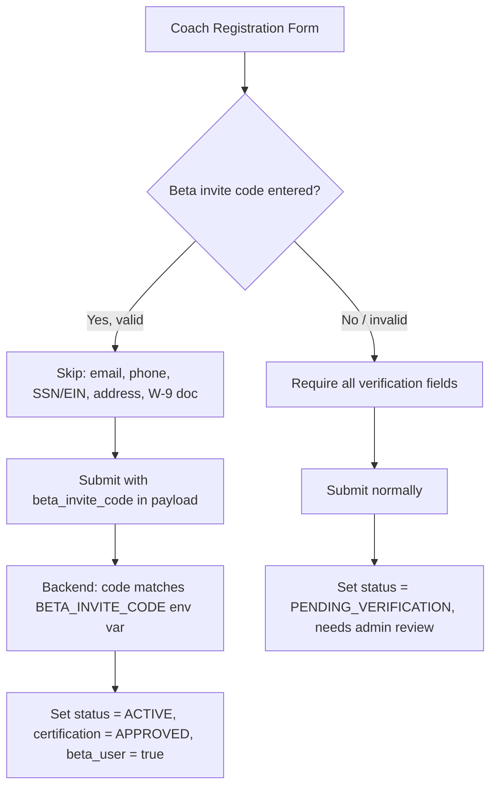

# Beta Invite Code -- Skip Verification for Beta Users

## How It Works

## Changes

### 1. Backend: Add env var and auto-approve logic

**File:** [backend/app/websocket/bridge_server.py](backend/app/websocket/bridge_server.py)

- Read `BETA_INVITE_CODE` from env (near line 129 where other env vars are loaded)
- In `register_new_user()` (line ~1228): if `data.get("beta_invite_code")` matches the env var and role is `COACH`, set:
  - `subscription_status = "ACTIVE"` instead of `"PENDING_VERIFICATION"`
  - `certification_status = "APPROVED"`
  - `beta_user = True` (profile flag for record-keeping)
- Skip USPS address validation call in the `register_request` handler (line ~4498) when `beta_invite_code` is valid

**File:** [.env.template](.env.template)

- Add `BETA_INVITE_CODE=` entry

### 2. Frontend: Beta invite code field + skip validation

**File:** [mobile/lib/main.dart](mobile/lib/main.dart)

- Add `_betaCodeCtrl` TextEditingController (near line ~4654 with other controllers)
- Add a `bool get _isBetaCodeEntered` getter that checks `_betaCodeCtrl.text.trim().isNotEmpty`
- Add a "Beta Invite Code" text field at the top of the Coach registration form (in `_buildForm()`, just before the Contact Information section at line ~5556). Styled with a purple/research accent to stand out.
- In `_submitRegistration()` (line ~4735): wrap the coach-specific validation block (email, phone, SSN/EIN checks) in `if (!_isBetaCodeEntered)` so those validations are skipped when a beta code is provided
- Add `"beta_invite_code": _betaCodeCtrl.text.trim()` to the registration payload (line ~4764)
- The Contact Information section, W-9 section, and W-9 document upload remain **visible** but become **optional** when a beta code is entered (so testers can still fill them in if they want to test the flow)

### 3. No admin portal changes needed

Beta coach registrations are auto-approved on the backend, so they never appear in the admin pending queue. No changes to `updated_screens.dart` are required.