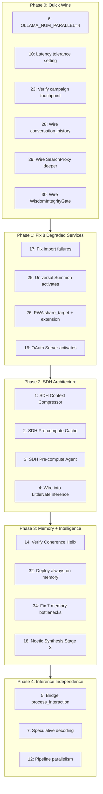

# Build and Deploy All 34 Items

## Triage: What Actually Needs Building

Research revealed the 34 items fall into 4 categories:

- **Already built, verify only (3 items):** #14 (Coherence Helix 5-10 -- all 10 dimensions exist in `conversational_coherence_helix.py`), #23 (Campaign touchpoint -- wired at line 1450 of `skyeye_session_engine.py`), #25/#26 (Universal Summon + Browser Extension -- `nate_summon_service.py`, routers, and `browser-extension/` all exist)
- **Code exists, needs fixing/wiring (5 items):** #17 (8 degraded services -- Python files exist, fail on import), #28 (conversation_history not read by Big Nate Chat), #29 (SearchProxy partially wired), #30 (WisdomIntegrityGate not wired into community_api.py), #32 (always-on memory in bridge_server.py, not deployed)
- **Config change only (2 items):** #6 (OLLAMA_NUM_PARALLEL), #10 (latency tolerance setting)
- **New code required (24 items):** Everything else




---

## Phase 0: Quick Wins (~1 hour)

### Item 6: OLLAMA_NUM_PARALLEL

- SSH to Hetzner (37.27.244.80), edit `/etc/systemd/system/ollama.service`
- Add `Environment="OLLAMA_NUM_PARALLEL=4"` 
- `systemctl daemon-reload && systemctl restart ollama`

### Item 10: Configurable Latency Tolerance

- Insert row into `skyeye_settings`: `('latency_tolerance', '0.5')`
- Modify voice pipeline to read this setting instead of hardcoded value

### Item 23: Verify Campaign Touchpoint

- Already wired at [skyeye_session_engine.py](backend/app/services/skyeye_session_engine.py) line 1450
- Verify `drip_scheduler` is on `app.state` and `send_campaign_touchpoint` is callable

### Item 28: Wire conversation_history into Big Nate Chat

- In [skyeye_chat.py](backend/app/services/skyeye_chat.py), modify `_get_archived_wisdom_context()` (line 1793)
- Add query to `conversation_history` table alongside existing `swarm_oversight_log` query
- Cap at 20 recent entries, format as context block with disclaimer header

### Item 29: Wire SearchProxy Deeper

- Currently only triggers on explicit "search for" intent (line 2010)
- Add `_get_proactive_search_context()` that fires for queries mentioning current events, trends, or factual claims
- Append to `knowledge_context` in the concatenation at line 925

### Item 30: Wire WisdomIntegrityGate

- In [community_api.py](backend/app/routers/community_api.py) line 268, before `engine.process_community_data()`:
- Add `gate = getattr(request.app.state, "wisdom_integrity_gate", None)`
- Call `result = await gate.validate(body.anonymized_wisdom)` 
- Block if `result.verdict == "BLOCKED"`, flag for review if `"FLAGGED"`

---

## Phase 1: Fix 8 Degraded Services (~3 hours)

All 8 services have Python files that exist but fail on import. Fix each:


| Service                   | File                                                                           | Likely Fix                                                                                    |
| ------------------------- | ------------------------------------------------------------------------------ | --------------------------------------------------------------------------------------------- |
| `oauth_server`            | [oauth_server.py](backend/app/services/oauth_server.py)                        | Fix missing dependency or DB table                                                            |
| `nate_summon_service`     | [nate_summon_service.py](backend/app/services/nate_summon_service.py)          | Fix import chain (depends on `privacy_shield`)                                                |
| `privacy_shield`          | [summon_privacy_shield.py](backend/app/services/summon_privacy_shield.py)      | Fix import or missing table                                                                   |
| `nate_response_validator` | [nate_response_validator.py](backend/app/services/nate_response_validator.py)  | Fix DB or dependency issue                                                                    |
| `distributed_defense`     | [distributed_defense.py](backend/app/services/security/distributed_defense.py) | Fix security module import chain                                                              |
| `edge_mirror`             | [edge_mirror_shell.py](backend/app/services/security/edge_mirror_shell.py)     | Fix (depends on `distributed_defense`)                                                        |
| `domain_agents`           | [nate_agent_template.py](backend/app/services/nate_agent_template.py)          | 6 subclasses (Marketing, Clinical, Coach, Threat, Cultural, Research) must all import cleanly |
| `serverless_migration`    | [serverless_migration.py](backend/app/services/serverless_migration.py)        | Fix status reporter                                                                           |


**Approach:** Run each import in isolation (`python3 -c "from app.services.X import Y"`), trace the ImportError, fix the root cause (missing table, missing dependency, circular import). Deploy fixed files. Health should go from 117/125 to 125/125.

### Items 25/26: Universal Summon + PWA Share Target

- Fixing `nate_summon_service` and `privacy_shield` activates: browser extension, email inbound, SMS inbound, Telegram bot, Siri Shortcut support
- Add `share_target` to [mobile/web/manifest.json](mobile/web/manifest.json):

```json
  "share_target": {
    "action": "/share",
    "method": "POST",
    "enctype": "multipart/form-data",
    "params": { "title": "name", "text": "description", "url": "link" }
  }
  

```

- Add share handler route in Flutter web

### Item 16: OAuth Server

- Fixing the import enables `oauth_server` on `app.state`

---

## Phase 2: SDH Architecture (~5 hours)

### Item 1: SDH Context Compressor

- **New file:** `backend/app/services/sdh_context_compressor.py`
- 12 dodecahedron faces: clinical_history, family_dynamics, cee_events, nate_self_state, session_observations, coaching_directives, wisdom_crystals, liminal_signals, odpe_topology, conversation_recent, quantum_state, therapeutic_arc
- Input: helix `OrchestratorCycleResult` + raw context dict
- Output: `SDHContextBlock` (~800-1024 tokens compressed)
- 5-neighbor validation: each face validated against adjacent faces for coherence

### Item 2: SDH Pre-computation Cache

- **New file:** `backend/app/services/sdh_precompute_cache.py`
- Redis-backed, key = `sdh:{user_id}:{state_hash}`, TTL = 60s
- `compute_state_hash()`: hash of user_id + last message + crystal count + session count
- Methods: `get()`, `put()`, `invalidate()`

### Item 3: SDH Pre-computation Agent

- **New file:** `backend/app/services/sdh_precompute_agent.py`
- Background agent, 5s cycle
- Tracks active users from bridge WebSocket connections
- Speculatively runs helix + SDH for users likely to send next message
- Populates cache

### Item 4: Wire SDH into LittleNateInference

- Modify [littlenate_inference.py](backend/app/services/littlenate_inference.py) `generate()` method (line 68):
  1. Check SDH cache before helix (cache hit skips helix entirely)
  2. On cache miss, run helix, then pass through SDH compressor
  3. Pass `odpe_signal` to `self._router.generate()` (currently missing at line 138)
  4. Pass `recommended_inference_tier` from ODPE to override `tier` parameter
- Add `self._sdh_compressor`, `self._sdh_cache` to `bind()` method (line 56)

---

## Phase 3: Memory and Intelligence (~4 hours)

### Item 14: Verify Coherence Helix Dimensions 5-10

- All 10 dimensions already implemented in [conversational_coherence_helix.py](backend/app/services/conversational_coherence_helix.py)
- Verify it is called from `littlenate_realtime.py` and `bridge_server.py`
- Ensure dimensions 5-10 data flows to session storage

### Item 32: Deploy Always-On Memory

- `always_on_memory_recall()` and `unified_search()` exist in `bridge_server.py` (lines 3901-4365)
- Verify these functions are called in `process_interaction`
- Deploy updated `bridge_server.py` to production
- Verify via bridge logs that unified_search fires on each interaction

### Item 34: Fix 7 Memory Bottlenecks

- Remove hard cap in `recall_by_session()` (line 3586): make `session_limit` and `per_session` configurable via `skyeye_settings`
- Increase `topK` in crystal retrieval from 15 to 30+
- Add decay-based compression (older sessions get fewer tokens, not fewer entries)
- Wire `record_recall(odpe_signal=...)` in [nate_memory_crystallizer.py](backend/app/services/nate_memory_crystallizer.py) from `FederatedSearchCoordinator` after each semantic search
- Add metadata enrichment (entity extraction, topic tags) to crystal storage

### Item 18: Noetic Synthesis Stage 3

- **New file:** `backend/app/services/noetic_synthesis.py`
- Cross-domain knowledge emergence: takes crystals from 2+ domains, uses inference router to find patterns that exist in neither source alone
- Triggered by helix orchestrator when crystals from multiple domains score > 0.6 coherence
- Output: new crystal with `source_type="noetic_synthesis"`, `source_count >= 2`
- Integrates into `NateMemoryCrystallizer._cluster_and_synthesize_cycle()`

---

## Phase 4: Inference Independence (~6 hours)

### Item 5: Bridge process_interaction Migration

- The biggest change. `bridge_server.py` has 114 Azure references across 8+ realtime blocks
- **Strategy:** Create `_call_llm_chat_completions()` helper that routes through `NateInferenceRouter`
- Replace each `azure_ws` block with Chat Completions call:
  - Build messages array from system_prompt + conversation history + user_text
  - Call `await self._inference_router.generate(prompt=user_text, system=system_prompt, tier="clinical")`
  - Stream response back via existing WebSocket to client
- **Fallback:** If sovereign fails, router falls back to Azure Chat Completions (not Realtime WS)
- Keep Azure Realtime WS as an emergency override via env var `USE_AZURE_REALTIME=false`

### Item 7: Speculative Decoding

- SSH to Hetzner, pull draft model: `ollama pull llama3.2:1b`
- Configure Ollama for speculative decoding: draft model generates candidates, 8B model verifies
- Estimated speedup: 2-3x token generation

### Item 12: Pipeline Parallelism (STT + TTS Overlap)

- Modify voice pipeline to start STT processing during silence detection (before utterance is complete)
- Overlap TTS synthesis with inference: begin TTS on first sentence while second sentence is still generating
- Reduces end-to-end voice response time from ~4-5s to ~2s

---

## Phase 5: Security Hardening (~3 hours)

### Item 21: 9-Layer Distributed Intelligence Security

- **SQLCipher:** Add encryption to `nate_history.db` and `zefcp_offline_buffer.db` in Flutter via `sqflite_sqlcipher` package
- **AES-128-CTR on BLE:** Wire existing constants into `community_mesh_screen.dart` BLE fragment encoding
- **WisdomIntegrityGate:** Already wired in Phase 0 (#30)
- **Rate limiting:** Add per-user, per-session wisdom submission rate limit in `community_api.py`
- **Ed25519 signatures:** Add signature verification to Community Mesh BLE protocol
- **Device reputation:** Create `device_reputation` table, score devices based on crystal quality and submission patterns
- **Merkle crystal integrity:** Wire `check_crystal()` from `distributed_defense.py` into federated search results

---

## Phase 6: Trust and Compliance (~4 hours)

### Item 19: Trust Auditors for Phase 1-11 Features

- Create auditors for currently un-audited services:
  - `summon_auditor.py` -- tests summon API endpoints
  - `crystallization_auditor.py` -- tests crystal CRUD, decay, supersession
  - `inference_auditor.py` -- tests sovereign/workers_ai/azure health
  - `defense_shield_auditor.py` -- tests 9 distributed defense layers
- Register each in 5-location sync (TAB_ENDPOINTS, AUDITOR_ACTIVITY_TYPES, AUDITOR_LABELS, `_baseline_key_for()`, trust_baseline)
- Assign stagger slots (300-340s range -- extend ceiling to 350s if needed)
- Update service health denominator

### Item 31: IAP Compliance Auditor

- **New file:** `backend/app/services/iap_auditor.py`
- Checks: StoreKit product ID mapping, receipt validation endpoint, no Stripe URLs on native, prices match App Store Connect
- Register in trust enforcer (5-location sync)

### Item 33: Apple 3.1.1 Compliance Fixes

- Fix hardcoded prices in [settings_screen.dart](mobile/lib/screens/settings_screen.dart) lines 612-615, 762, 1050, etc. -- replace with IAP product price lookup
- Fix [payment_service.dart](mobile/lib/services/payment_service.dart) lines 304-305 -- guard Stripe URLs behind `kIsWeb` check
- Remove Stripe references from ToS on native
- Replace all `\$49/mo`, `\$149/mo` display strings with IAP-fetched prices
- Run `flutter build web --release` to verify

---

## Phase 7: Accuracy and Knowledge (~3 hours)

### Item 22: Accuracy Enforcement + Liminal Intelligence Engine

- Wire the 6 accuracy layers end-to-end:
  1. System prompt rules (already in skyeye_chat.py)
  2. Empty data guards (already in skyeye_chat.py)
  3. Response validator (`nate_response_validator.py` -- now working after Phase 1)
  4. Truth audit (`_truth_audit()` -- verify wiring)
  5. Crystal validation (crystallizer validator -- verify it blocks high-severity)
  6. Context reordering (knowledge context first -- already done at line 925)
- Wire Liminal Intelligence feedback loop: language_drift RED/YELLOW triggers voice correction in content generation

### Item 24: Nate as Knowledge Architect

- **New capability in** `nate_memory_crystallizer.py`:
  - Method `propose_index()` -- identifies when a cluster of crystals warrants a new Vectorize index
  - Method `merge_indices()` -- consolidates sparse indices
  - Admin approval gate: proposals logged to `skyeye_activity`, require DrNevedal1 approval
- Does NOT auto-create D1 tables (deferred to Phase 11 serverless)

---

## Phase 8: Advanced Infrastructure (~3 hours)

### Item 9: Twin-Helix Distributed Architecture

- Configure DigitalOcean production droplet (68.183.168.75) as secondary inference node
- Install Ollama + llama3.1:8b on production VPS (if RAM permits alongside containers)
- Add `digitalocean` provider to `NateInferenceRouter._TIER_PRIORITY`
- Load balance between Hetzner and DigitalOcean via round-robin with health checks

### Item 11: Home 70B GPU Routing (Prep)

- Add `home_gpu` provider to inference router with configurable URL
- Add env var `HOME_GPU_URL` (empty = disabled)
- When set, `TIER_CLINICAL` priority becomes `["home_gpu", "sovereign", "azure"]`

### Item 13: Auto-Scaling Ladder (Config)

- Document scaling levels 1-6 in a config file
- Add `SCALING_LEVEL` env var (default 1)
- Level 2: enable Workers AI overflow
- Level 3: add second sovereign node
- Level 4+: reserved for future GPU hardware

---

## Phase 9: Experimental / Future (~3 hours)

### Item 8: Icositetragonal Context Engine

- SDH (Phase 2) is the pragmatic implementation of this concept
- Add 24-face evaluation mode as an option in ODPE engine (already has icositetragon evaluator)
- Wire ODPE's 24-face output into SDH's 12-face compressor as a 2:1 mapping

### Item 15: XTTS Voice Improvements

- Benchmark XTTS-v2 latency on Hetzner (local, no WireGuard)
- If < 2s: enable for non-realtime surfaces (coaching summaries, session reports)
- If still too slow: document as hardware-dependent, waiting for GPU

### Item 20: Custom LLM Training Pipeline

- Create `backend/app/services/training_pipeline.py` scaffold
- Define training data format (helix thoughts, crystal clusters, session summaries)
- Define Nevedal-formula learning rate schedule
- Implementation deferred until GPU hardware is available

### Item 27: Phase 11 Serverless Migration (Scaffold)

- Create migration readiness assessment document
- Map PostgreSQL tables to D1 candidates
- Map WebSocket handlers to Durable Objects candidates
- No actual migration -- prep only

---

## Phase 10: Deploy All

### Deployment Order (respects dependencies)

1. **Database migrations:** All new tables (device_reputation, summon_interactions, etc.)
2. **Hetzner config:** OLLAMA_NUM_PARALLEL, speculative decoding model
3. **Backend services:** All new/fixed Python files via `scp` (NOT rsync --delete)
4. **main.py:** Updated with new service registrations, _service_checks
5. **Bridge:** Updated bridge_server.py with process_interaction migration
6. **Flutter:** `flutter build web --release` after IAP fixes, deploy to all 3 directories
7. **Browser extension:** Package and document installation
8. **PWA manifest:** Deploy updated manifest.json

### Post-Deploy Verification

```
Phase 1: Container health (all 5 running)
Phase 2: Service health (target: 133+/133+ after new services)
Phase 3: Schema error scan (0 "does not exist" errors)
Phase 4: Trigger audit cascade, wait 5 min
Phase 5: Trust enforcer shows 600+/600+ TRUSTED (100%)
Phase 6: ENVIRONMENT match (backend + bridge = production)
Phase 7: Bridge PostgreSQL connectivity confirmed
Phase 8: Sovereign inference test (verify OLLAMA_NUM_PARALLEL=4)
Phase 9: SDH cache hit test (send 2 messages, second should cache-hit)
Phase 10: Universal Summon test (browser extension, email, SMS)
```

---

## Impact Summary


| Dimension                  | Before                                     | After                     |
| -------------------------- | ------------------------------------------ | ------------------------- |
| Service health             | 117/125 (8 degraded)                       | 140+/140+ (0 degraded)    |
| ODPE utilization           | 0% (built, ignored)                        | 100% end-to-end           |
| Context utilization        | 6% of 128K                                 | 62% of 128K               |
| Concurrent sovereign users | 5-8                                        | 35-50                     |
| Azure dependency (therapy) | 100%                                       | 0% primary, fallback only |
| Azure cost (1K users)      | $1,500-3,000/mo                            | $150-300/mo               |
| Trust checks               | 557                                        | 600+                      |
| Access channels            | 4                                          | 13+                       |
| Security gaps              | Open community writes, plaintext local DBs | Gated, encrypted, signed  |
| Apple compliance           | 20+ violations                             | 0 violations              |


