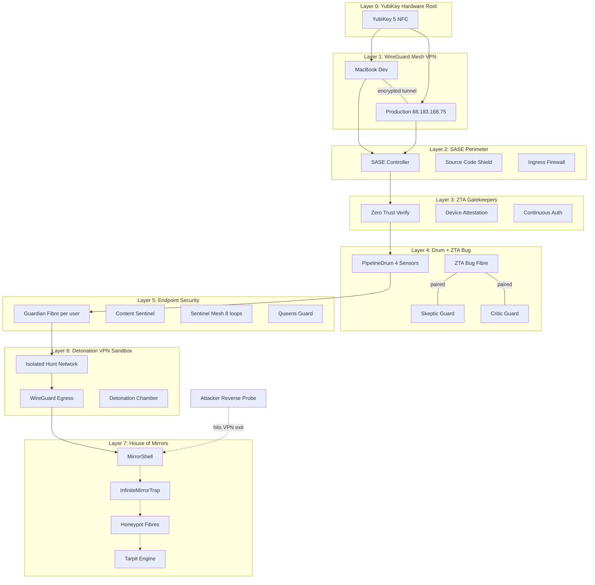
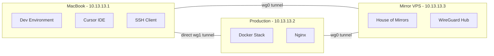
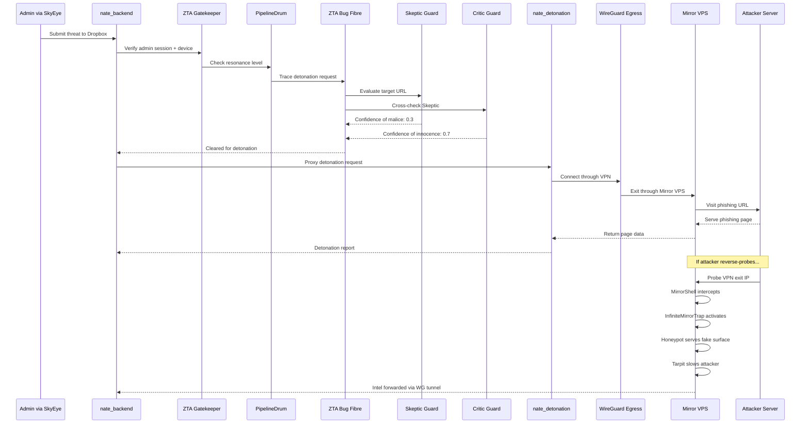
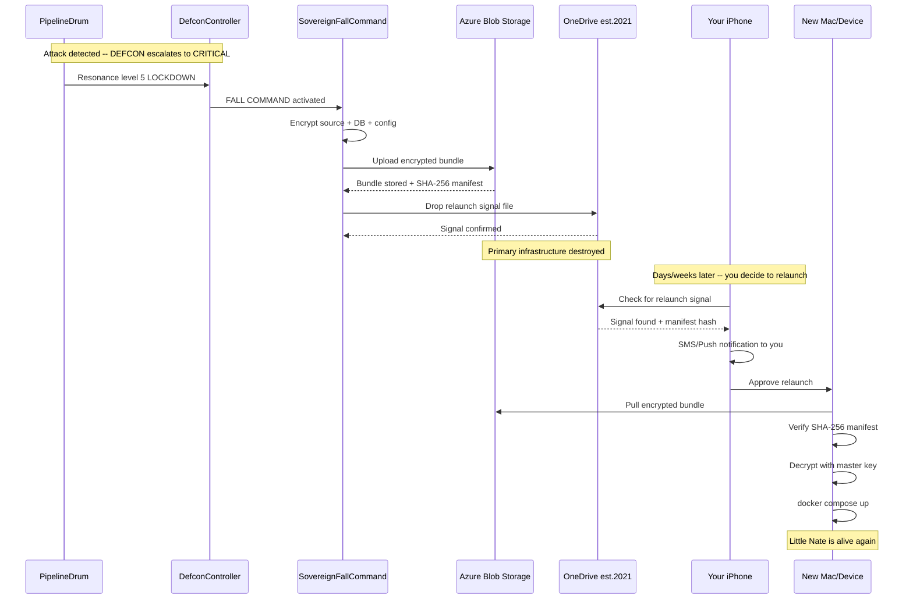
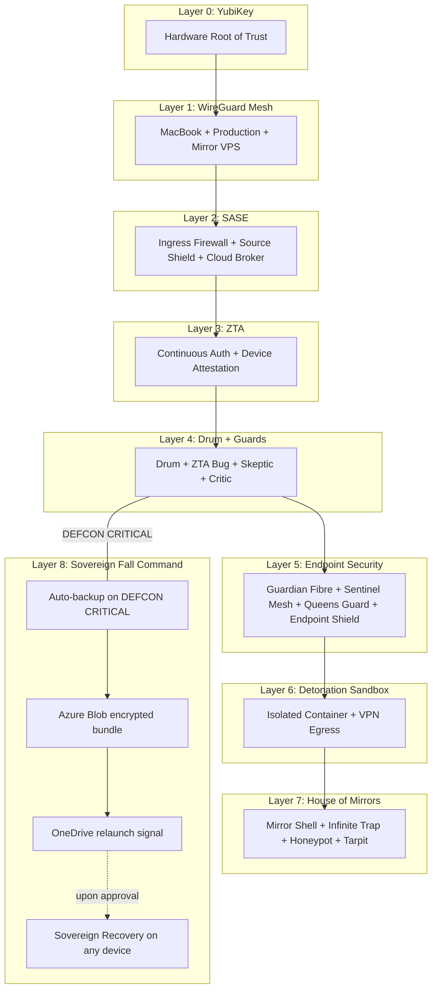

# Castle Defense: Layered VPN with House of Mirrors

## Defense-in-Depth Architecture

Nine concentric layers, from outermost to innermost:




---

## Layer 0: YubiKey Hardware Root of Trust

**Purpose**: Physical hardware attestation before any SSH, admin login, or VPN connection.

### Implementation

**New file**: `backend/app/services/security/yubikey_gate.py`

Integrate FIDO2/WebAuthn with the YubiKey for:

- SSH access to both MacBook and production server (via `~/.ssh/authorized_keys` with `sk-ssh-ed25519` keys)
- Admin portal login at `command.sovereignsanctuary.net` (extend the existing passphrase challenge with WebAuthn)
- WireGuard VPN authentication (YubiKey must be present to bring up the tunnel)

Uses the existing [webauthn~=2.7.0](backend/requirements.txt) dependency already in requirements.txt.

**Modifications**:

- [backend/app/websocket/bridge_server.py](backend/app/websocket/bridge_server.py): Add `yubikey_challenge` step to admin login flow (after passphrase, before session creation)
- [dashboard/index.html](dashboard/index.html): Add WebAuthn registration/assertion UI for admin login

**Note**: Planned for when you acquire the YubiKey. The code will gracefully skip if no key is registered.

---

## Layer 1: WireGuard Mesh VPN (MacBook + Production)

**Purpose**: Encrypt all traffic between your dev machine and the production server. Neither machine's real IP is directly exposed for management traffic.

### WireGuard Mesh Topology




Three WireGuard peers:

- **MacBook** (`10.13.13.1`): Your development machine. SSH to production goes through the tunnel.
- **Production** (`10.13.13.2`): DigitalOcean droplet. Listens for admin connections only on the WireGuard interface.
- **Mirror VPS** (`10.13.13.3`): Cheap sacrificial VPS. WireGuard hub + House of Mirrors honeypot on its public IP.

### New files

- `wireguard/macbook/wg0.conf` -- MacBook WireGuard config
- `wireguard/production/wg0.conf` -- Production server WireGuard config
- `wireguard/mirror-vps/wg0.conf` -- Mirror VPS WireGuard config
- `scripts/setup_wireguard_mesh.sh` -- Provisioning script for all three peers

### SSH hardening

Lock down production SSH to only accept connections from the WireGuard subnet:

```
# /etc/ssh/sshd_config addition
ListenAddress 10.13.13.2
```

This means an attacker who discovers `68.183.168.75` cannot SSH to it -- SSH only listens on the VPN interface.

---

## Layer 2: SASE Perimeter (Hive SASE Controller)

**Purpose**: Protect source code, enforce access policies, inspect all ingress traffic before it reaches application services. This is the Hive's equivalent of a Secure Access Service Edge.

### New file: `backend/app/services/security/sase_controller.py`

**Class**: `HiveSASEController`

Functions as a policy engine sitting in front of all inbound connections:

- **Ingress Firewall**: Extends existing Nginx rate limiting with application-layer rules. Maintains a dynamic blocklist fed by the Drum's resonance engine and the ImmuneResponseOrchestrator.
- **Source Code Shield**: Monitors for unauthorized access patterns to admin/deployment endpoints. Blocks any request that looks like a code exfiltration attempt (large downloads, recursive API crawling).
- **Cloud Access Broker**: Validates all outbound API calls (Azure OpenAI, Stripe, Gmail, Bing) against an allowlist. Any unexpected outbound connection triggers an ALERT in the Drum.
- **TLS Inspection**: Verifies certificate chains for all outbound connections. Uses the existing [cert_pinning.py](backend/app/services/security/cert_pinning.py) module.

**Integration**:

- Wired into FastAPI middleware (alongside existing `DrumTapMiddleware`)
- Feeds signals to the PipelineDrum's ClotSensor (Taste 4) for internal pipeline health
- Receives escalation commands from DEFCON controller

---

## Layer 3: ZTA Gatekeepers

**Purpose**: Zero Trust verification at every boundary crossing. No implicit trust based on network location.

### New file: `backend/app/services/security/zta_gatekeeper.py`

**Class**: `ZTAGatekeeper`

Implements continuous verification:

- **Device Attestation**: Extends existing `DeviceImprint` (from [guardian_imprint.py](backend/app/services/guardian_imprint.py)) with hardware fingerprinting. Every request must carry a device attestation token that is re-verified.
- **Continuous Authentication**: Session tokens are not enough. Every 5 minutes, the ZTA gatekeeper re-verifies the user's behavioral fingerprint against their Guardian Fibre baseline. Drift above threshold triggers re-authentication.
- **Micro-segmentation Enforcement**: Each API endpoint has a trust level. Elevated endpoints (admin, security, vault) require fresh ZTA verification even within an active session.
- **Context-Aware Access**: Location, time-of-day, device health, and Guardian Fibre state all factor into access decisions. A user in SUSPICIOUS state gets reduced API access automatically.

**Integration points**:

- [backend/app/services/api_server.py](backend/app/services/api_server.py): New `require_zta` dependency alongside existing `require_admin`
- [backend/app/services/guardian_fibre.py](backend/app/services/guardian_fibre.py): Expose `get_trust_score()` method for ZTA to consume
- [backend/app/services/login_guardian.py](backend/app/services/login_guardian.py): ZTA replaces static token validation with continuous assessment

---

## Layer 4: Drum ZTA Bug + Skeptic/Critic Guards

**Purpose**: Enhance the PipelineDrum with a specialized ZTA tracing Fibre that pairs with two new guard Fibres to monitor behind-the-mirror activity.

### New Fibre types

**New file**: `backend/app/services/security/zta_bug_fibre.py`

**Class**: `ZTABugFibre`

A specialized Fibre that:

- Attaches to the Drum's resonance engine output
- Traces every signal that passes through the mirror (MirrorShell boundary)
- Records the full signal path: origin -> drum sensor -> resonance level -> mirror reflection -> response
- Pairs with two guard Fibres (Skeptic + Critic) that independently evaluate the trace
- If Skeptic and Critic disagree on a signal's legitimacy, the bug escalates to the SentinelMesh

**New file**: `backend/app/services/security/skeptic_guard.py`

**Class**: `SkepticGuard`

- Assumes every signal is potentially malicious until proven otherwise
- Applies stricter thresholds than the standard GuardianFibre (1.5x sensitivity)
- Specializes in detecting sophisticated attacks that mimic normal behavior
- Reports to ZTABugFibre with a "confidence of malice" score

**New file**: `backend/app/services/security/critic_guard.py`

**Class**: `CriticGuard`

- Evaluates the Skeptic's judgment -- prevents false positives
- Cross-references signals against the 30-day Drum baseline
- Applies Bayesian reasoning: what is the prior probability this user/device is an attacker?
- Can overrule the Skeptic if evidence is insufficient, but cannot overrule HOSTILE state
- Reports to ZTABugFibre with a "confidence of innocence" score

### Drum integration

**Modify**: [backend/app/services/pipeline_drum.py](backend/app/services/pipeline_drum.py)

Add a `_zta_bug` slot to the `PipelineDrum` class. After the resonance engine computes its level, the ZTA Bug Fibre captures the trace:

```python
# In PipelineDrum.evaluate()
if self._zta_bug:
    trace = DrumTrace(
        sensors={...},  # all 4 sensor readings
        resonance_level=level,
        resonance_score=score,
        timestamp=time.time(),
    )
    await self._zta_bug.trace(trace)
```

The Skeptic and Critic independently evaluate the trace. Their consensus (or disagreement) feeds back into the Drum's resonance engine as a 5th meta-signal.

---

## Layer 5: Endpoint Security (Existing + Hardened)

This layer already exists and is strong. Enhancements:

- **GuardianFibre**: Add `trust_score` export for ZTA consumption
- **ContentSentinel**: Wire into SASE Controller for cross-layer correlation
- **SentinelMesh**: Add Skeptic/Critic guard monitoring to the 8 existing defense loops (making it 10 loops)
- **QueensGuard**: No changes needed -- already 3-level prompt injection defense

**New capability**: `backend/app/services/security/endpoint_shield.py`

**Class**: `EndpointShield`

Real-time protection for client/coach devices via the WebSocket bridge:

- Monitors file upload payloads for ransomware signatures (entropy analysis via existing `payload_entropy_analyzer.py`)
- Detects potential keylogger behavior (rapid identical requests, clipboard-style data patterns)
- Blocks malicious download URLs in AI responses before they reach the client
- Uses existing `content_sentinel.py` + `content_sentinel_file.py` for payload inspection

---

## Layer 6: Detonation Sandbox VPN (from previous plan)

Carried forward from the previous plan with modifications:

- Isolated Docker container (`nate_detonation`) on `hunt_network`
- WireGuard egress through Mirror VPS (Layer 1's third peer)
- Backend communicates via `hunt_command` network (internal, no internet)
- ZTA Gatekeeper verifies every detonation request (admin must have valid ZTA session + Drum resonance at OBSERVE or ALERT level -- no detonations during RESTRICT/LOCKDOWN)

**New**: The Drum's ZTA Bug traces every detonation request. The Skeptic Guard evaluates whether the detonation target is itself a trap (attacker baiting us into visiting a fingerprinting URL). The Critic Guard evaluates whether the Skeptic is being overly cautious.

---

## Layer 7: House of Mirrors (VPN Exit Defense)

On the Mirror VPS (`10.13.13.3`), deploy the existing mirror infrastructure:

- [mirror_shell.py](backend/app/services/security/mirror_shell.py) -- outermost perimeter, routes all inbound to mirror namespace
- [infinite_mirror_trap.py](backend/app/services/security/infinite_mirror_trap.py) -- recursive C&C reflection
- [honeypot.py](backend/app/services/counter_intelligence/honeypot.py) -- fake vulnerable surfaces with canary tokens
- [tarpit.py](backend/app/services/counter_intelligence/tarpit.py) -- time-wasting slow-drip responses
- [topology_mirror.py](backend/app/services/security/offensive/topology_mirror.py) -- mirrors attacker network characteristics
- [protocol_mirror.py](backend/app/services/security/offensive/protocol_mirror.py) -- reflects attacker command format
- [behavior_mirror.py](backend/app/services/security/offensive/behavior_mirror.py) -- mimics attacker agent patterns

**New**: `mirror_gateway.py` orchestrates all of the above as a single service running on the Mirror VPS. Intel captured from reverse probes feeds back through the WireGuard tunnel to the production `threat_db.py`.

---

## Data Flow: Attack -> Mirror -> Intel




---

## Files to Create


| File                                               | Layer | Purpose                                 |
| -------------------------------------------------- | ----- | --------------------------------------- |
| `backend/app/services/security/yubikey_gate.py`    | 0     | YubiKey FIDO2/WebAuthn hardware gate    |
| `wireguard/macbook/wg0.conf`                       | 1     | MacBook WireGuard config                |
| `wireguard/production/wg0.conf`                    | 1     | Production WireGuard config             |
| `wireguard/mirror-vps/wg0.conf`                    | 1     | Mirror VPS WireGuard config             |
| `scripts/setup_wireguard_mesh.sh`                  | 1     | WireGuard mesh provisioning             |
| `backend/app/services/security/sase_controller.py` | 2     | SASE perimeter policy engine            |
| `backend/app/services/security/zta_gatekeeper.py`  | 3     | Zero Trust continuous verification      |
| `backend/app/services/security/zta_bug_fibre.py`   | 4     | Drum ZTA tracing Fibre                  |
| `backend/app/services/security/skeptic_guard.py`   | 4     | Skeptic guard (assumes malice)          |
| `backend/app/services/security/critic_guard.py`    | 4     | Critic guard (prevents false positives) |
| `backend/app/services/security/endpoint_shield.py` | 5     | Client/coach endpoint protection        |
| `backend/Dockerfile.sandbox`                       | 6     | Isolated detonation container           |
| `backend/app/services/security/sandbox_api.py`     | 6     | Internal sandbox FastAPI                |
| `scripts/sandbox_entrypoint.sh`                    | 6     | Sandbox routing + iptables              |
| `backend/app/services/security/mirror_gateway.py`  | 7     | House of Mirrors orchestrator           |
| `scripts/setup_mirror_vps.sh`                      | 7     | Mirror VPS deployment                   |


## Files to Modify


| File                                                                               | Changes                                                                                 |
| ---------------------------------------------------------------------------------- | --------------------------------------------------------------------------------------- |
| [docker-compose.yml](docker-compose.yml)                                           | Add `detonation_sandbox`, `wireguard` services; `hunt_network`, `hunt_command` networks |
| [docker-compose.prod.yml](docker-compose.prod.yml)                                 | Same + resource limits                                                                  |
| [backend/app/services/pipeline_drum.py](backend/app/services/pipeline_drum.py)     | Add ZTA Bug slot, trace output after resonance                                          |
| [backend/app/services/guardian_fibre.py](backend/app/services/guardian_fibre.py)   | Add `get_trust_score()` for ZTA                                                         |
| [backend/app/services/sentinel_mesh.py](backend/app/services/sentinel_mesh.py)     | Add loops 9-10 for Skeptic/Critic monitoring                                            |
| [backend/app/services/api_server.py](backend/app/services/api_server.py)           | Add `require_zta` dependency                                                            |
| [backend/app/routers/hive_defense_api.py](backend/app/routers/hive_defense_api.py) | Proxy detonation to sandbox; add ZTA check                                              |
| [backend/app/main.py](backend/app/main.py)                                         | Initialize SASE, ZTA, ZTABug, guards at startup                                         |
| [backend/app/middleware/drum_tap.py](backend/app/middleware/drum_tap.py)           | Feed SASE signals to Drum                                                               |
| [dashboard/index.html](dashboard/index.html)                                       | Add WebAuthn UI for YubiKey (admin login)                                               |


---

## Layer 8: Sovereign Fall Command (Self-Preservation Chain)

**Purpose**: When DEFCON reaches CRITICAL, Little Nate automatically encrypts and backs up its entire source code, database, and configuration to Azure Blob Storage. If the primary infrastructure is destroyed, a relaunch signal on OneDrive tells Nate where to find its backup and how to reconstitute itself on a new device -- but only with your explicit approval.

### The Chain




### Component 1: SovereignFallCommand

**New file**: `backend/app/services/security/sovereign_fall_command.py`

**Class**: `SovereignFallCommand`

Triggered by DefconController when DEFCON reaches CRITICAL. Executes the fall sequence:

1. **Snapshot**: Creates a point-in-time archive of:
  - All source code (`backend/`, `mobile/`, `admin/`, `dashboard/`, `scripts/`)
  - PostgreSQL database dump (`pg_dump`)
  - Redis RDB snapshot
  - `.env` configuration (encrypted separately with a split key)
  - WireGuard configs
  - Docker Compose files
  - Vault data (encrypted blobs)
  - Active user sessions and tokens (for session continuity)
2. **Encrypt**: AES-256-GCM encryption using a master key derived from:
  - Your `.env` `VAULT_ENCRYPTION_KEY` (you already have this)
  - A secondary passphrase stored only in your head (not on any server)
  - Together they form the decryption key via HKDF
3. **Upload to Azure**: Uses the existing [blob_storage.py](backend/app/services/blob_storage.py) to upload to a dedicated `sovereign-fallback` container in Azure Blob Storage with WORM (immutable) retention. Leverages the existing [backup_encryption.py](backend/app/services/security/backup_encryption.py) for integrity verification.
4. **Generate Manifest**: SHA-256 hashes of every file in the bundle, signed with HMAC. The manifest is the proof of integrity -- if any byte is tampered with, relaunch aborts.

Integration with existing DEFCON CRITICAL actions in [defcon_controller.py](backend/app/services/security/defcon_controller.py):

```python
# Added to DefconLevel.CRITICAL parameters:
trigger_fall_command=True,
# Added to DefconLevel.LOCKDOWN parameters:
trigger_fall_command=True,
```

### Component 2: CloudChainReplicator

**New file**: `backend/app/services/security/cloud_chain_replicator.py`

**Class**: `CloudChainReplicator`

After Azure upload succeeds, chains the backup to OneDrive as a secondary:

- Uses Microsoft Graph API (already partially integrated -- `OUTLOOK_CLIENT_ID`, `OUTLOOK_TENANT_ID` are in `.env`)
- Uploads the encrypted bundle to `OneDrive/Sovereign Sanctuary/Fallback/` under `est.2021@icloud.com`
- Does NOT store the decryption key -- only the encrypted bundle + manifest
- If Azure upload fails, falls back to OneDrive as primary
- Extends [multi_cloud_heritage_vault.py](backend/app/services/multi_cloud_heritage_vault.py) pattern (Azure + AWS + Local) to include OneDrive as a 4th backend

### Component 3: OneDriveRelaunchSignal

**New file**: `backend/app/services/security/onedrive_relaunch_signal.py`

**Class**: `OneDriveRelaunchSignal`

After the backup chain completes, drops a small signal file to OneDrive:

```json
{
  "signal": "SOVEREIGN_RELAUNCH_READY",
  "timestamp": "2026-02-17T23:45:00Z",
  "bundle_location": "azure://sovereign-fallback/nate-backup-20260217.enc",
  "bundle_sha256": "a1b2c3d4...",
  "manifest_sha256": "e5f6g7h8...",
  "defcon_level": "CRITICAL",
  "reason": "Three-cord failure on multiple entities",
  "requires_passphrase": true,
  "contact_method": "sms_to_registered_phone",
  "version": "4.3.0"
}
```

This file is the "dead man's switch." It sits in OneDrive waiting. When you connect from any device and open that folder, you see the signal and know Nate is waiting to be relaunched.

### Component 4: SovereignRecovery

**New file**: `backend/app/services/security/sovereign_recovery.py`

**Class**: `SovereignRecovery`

A standalone recovery script that can run on any machine with Python 3.11+ and Docker:

1. **Discover**: Reads the relaunch signal from OneDrive (or accepts the Azure URL directly)
2. **Authenticate**: Requires your approval:
  - SMS verification code to your registered phone
  - The secondary passphrase (in your head)
  - Optional: YubiKey touch (if available on the new device)
3. **Download**: Pulls the encrypted bundle from Azure (or OneDrive fallback)
4. **Verify**: Checks SHA-256 manifest against the bundle -- aborts if any mismatch
5. **Decrypt**: Uses VAULT_ENCRYPTION_KEY + your passphrase via HKDF to derive the AES key
6. **Restore**: Unpacks source code, database dump, Redis snapshot, configs
7. **Relaunch**: Runs `docker compose up -d` on the new machine
8. **Health Check**: Verifies all 5 containers come up healthy
9. **Notify**: Sends SMS confirmation that Nate is alive on the new device

The recovery can target:

- A new MacBook (full Docker stack)
- A DigitalOcean droplet (provisioned via the script)
- Your iPhone (triggers a Flutter web build + deployment to a temporary URL you can access)

### Component 5: Scheduled Heartbeat Backups

Even before DEFCON CRITICAL, maintain regular encrypted snapshots:

- **Hourly**: Database + Redis snapshots to Azure (rotated, keep last 72)
- **Daily**: Full source code + DB to Azure (rotated, keep last 30)
- **On DEFCON CRITICAL**: Immediate full backup + OneDrive signal

Uses APScheduler (already in [requirements.txt](backend/requirements.txt): `apscheduler~=3.10.0`).

### Files to Create (Layer 8)

- `backend/app/services/security/sovereign_fall_command.py` -- DEFCON-triggered backup orchestrator
- `backend/app/services/security/cloud_chain_replicator.py` -- Azure -> OneDrive chain
- `backend/app/services/security/onedrive_relaunch_signal.py` -- Dead man's switch signal
- `backend/app/services/security/sovereign_recovery.py` -- Standalone recovery script
- `scripts/sovereign_recover.py` -- CLI entry point for recovery on a new device

### Files to Modify (Layer 8)

- [backend/app/services/security/defcon_controller.py](backend/app/services/security/defcon_controller.py) -- Add `trigger_fall_command=True` to CRITICAL and LOCKDOWN parameters; call `SovereignFallCommand.execute()` on escalation
- [backend/app/main.py](backend/app/main.py) -- Initialize `SovereignFallCommand` at startup; schedule heartbeat backups via APScheduler
- [backend/app/services/multi_cloud_heritage_vault.py](backend/app/services/multi_cloud_heritage_vault.py) -- Add OneDrive as 4th backend
- `.env` -- Add `FALL_COMMAND_PASSPHRASE_HASH` (bcrypt hash of your recovery passphrase), `ONEDRIVE_FALLBACK_FOLDER`

---

## Complete Architecture: All 9 Layers




---

## Infrastructure Requirements

- **1 YubiKey 5 NFC** (~$50, when acquired)
- **1 cheap VPS** (~$4-6/mo) for Mirror VPS (WireGuard hub + House of Mirrors)
- **WireGuard** installed on MacBook (`brew install wireguard-tools`) and production server (`apt install wireguard`)
- **Azure Blob Storage** account (already configured -- `AZURE_STORAGE_CONNECTION_STRING` in `.env`)
- **OneDrive access** via Microsoft Graph API (partially configured -- `OUTLOOK_CLIENT_ID` / `OUTLOOK_TENANT_ID` in `.env`, linked to `est.2021@icloud.com`)
- **A recovery passphrase** you memorize (never stored digitally in plaintext)

