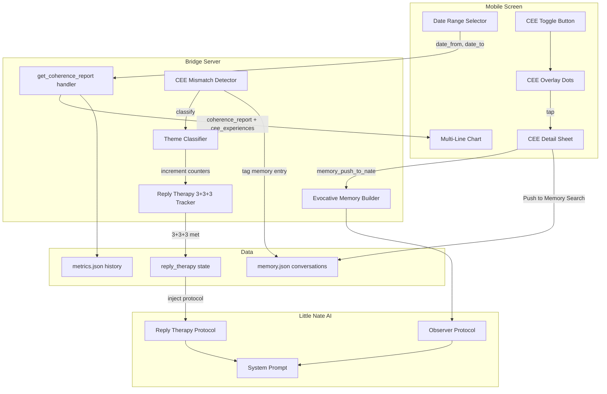

# CEE-Integrated Coherence Dashboard

## Architecture




## Part 1: Backend -- Enhanced Report Handler + CEE Mismatch Detection

### 1A. Add CEE mismatch detection in `analyze_and_update`

File: [backend/app/websocket/bridge_server.py](backend/app/websocket/bridge_server.py) (line ~3086)

After the history snapshot is appended, detect if this interaction produced a CEE-like mismatch:

```python
# After history.append({...}) at line 3087
is_cee_mismatch = False
mismatch_data = None
if len(history) >= 2:
    prev = history[-2]
    prev_cemo = prev.get("C_emo", 0.5)
    delta = c_emo - prev_cemo
    # Mismatch: significant positive shift (>= 0.08) or entry into CEE range
    if delta >= 0.08 or (c_emo >= 0.75 and prev_cemo < 0.75):
        is_cee_mismatch = True
        mismatch_data = {
            "type": "corrective_emotional_experience",
            "c_emo_before": round(prev_cemo, 3),
            "c_emo_after": round(c_emo, 3),
            "delta": round(delta, 3),
            "mood_before": prev.get("mood", ""),
            "mood_after": detected_mood,
            "timestamp": str(datetime.datetime.now()),
            "reconsolidation_readiness": ns.get("pmb", {}).get("reconsolidation_readiness", 0),
        }
```

Then pass `mismatch_data` as metadata to `memorize()` at line 5438 so the memory entry is tagged:

```python
_mem_meta = {}
if hasattr(self, '_last_mismatch') and self._last_mismatch:
    _mem_meta["cee_mismatch"] = self._last_mismatch
self.mem.memorize(profile, user_text, full_response, session_id, metadata=_mem_meta)
```

Also accumulate CEE experiences in `nevedal_state` as a persistent list (capped at 50):

```python
cee_experiences = ns.get("cee_experiences", [])
cee_experiences.append(mismatch_data)
self.update_metric(p, "cee_experiences", cee_experiences[-50:])
```

### 1B. Enhance `get_coherence_report` handler with date filtering

File: [backend/app/websocket/bridge_server.py](backend/app/websocket/bridge_server.py) (line ~14933)

Accept optional `date_from` and `date_to` parameters from the client. Filter the `history` array by timestamp before computing trends. Return `cee_experiences` from `nevedal_state` (filtered by same date range) with full context.

Key changes:

- Parse `d.get("date_from")` and `d.get("date_to")` 
- Filter `_cr_history` entries whose `timestamp` falls within range
- Include `cee_experiences` in response (from `nevedal_state.cee_experiences`)
- For each CEE experience, attempt to find the matching `memory.json` entry by timestamp proximity and include a preview

### 1C. Build evocative memory context for Nate

File: [backend/app/websocket/bridge_server.py](backend/app/websocket/bridge_server.py) -- in `process_interaction` (line ~5210)

After the observer protocol context block, add a new section that pulls CEE mismatch history from `nevedal_state.cee_experiences` and the corresponding memory entries:

```python
# === EVOCATIVE MEMORY / CEE MISMATCH CONTEXT ===
evocative_context = ""
cee_list = ns.get("cee_experiences", [])
if cee_list:
    evocative_context = "\n    CORRECTIVE EMOTIONAL EXPERIENCES (Mismatch Moments):"
    evocative_context += "\n    These are moments where the client's emotional state shifted significantly."
    evocative_context += "\n    Use these for evocative memory therapy — reference the images, feelings, and perceptions that changed."
    for ce in cee_list[-5:]:  # Last 5
        evocative_context += f"\n    - [{ce.get('timestamp','')}] C_emo {ce['c_emo_before']} -> {ce['c_emo_after']} (delta +{ce['delta']}), mood: {ce['mood_before']} -> {ce['mood_after']}"
    evocative_context += "\n    RECONSOLIDATION PROTOCOL: When revisiting these moments, guide the client to re-experience the mismatch — the moment their old belief was contradicted by new experience. This deepens transgenerational legacy change."
```

Inject `{evocative_context}` into the system prompt alongside `{observer_context}`.

### 1D. Enhanced legacy pattern tracking

In `_extract_legacy_patterns` (line ~3579), after a CEE mismatch is detected, cross-reference with existing legacy patterns to mark them as having undergone a corrective experience:

```python
for lp in legacy_patterns:
    if lp.get("reflected_in_client") and is_cee_mismatch:
        lp["corrective_experience_count"] = lp.get("corrective_experience_count", 0) + 1
        lp["last_corrective_at"] = str(datetime.datetime.now())
```

This gives Nate data on which transgenerational patterns are being actively healed.

## Part 2: Mobile -- Multi-Metric Chart with CEE Overlay

### 2A. Redesign NevedalReportsScreen

File: [mobile/lib/screens/nevedal_reports_screen.dart](mobile/lib/screens/nevedal_reports_screen.dart)

**Date Range Selector** -- Row of `ChoiceChip` widgets:

- "This Week" / "Last Week" / "This Month" / "Last Month" / "YTD" / "All"
- Selecting a chip sends a new `get_coherence_report` with `date_from` and `date_to`
- Compute dates client-side:
  - This Week: Monday of current week -> now
  - Last Week: Monday of previous week -> Sunday of previous week  
  - This Month: 1st of current month -> now
  - Last Month: 1st of previous month -> last day of previous month
  - YTD: Jan 1 of current year -> now
  - All: no date filter

**Multi-Line Chart** -- Replace the separate sparkline cards with a single combined chart:

- Replace `_SparklinePainter` with a new `_MultiLinePainter` that accepts multiple series
- Colors: C_emo = cyan (`#4ECDC4`), GAP = gold (`#C9A962`), Quantum = purple (`#9D4EDD`)
- Y-axis: 0.0 to 1.0, X-axis: date range timeline
- Legend row below chart showing colored dots + metric names
- Touch on the chart shows a vertical crosshair with values at that point

**CEE Toggle Button** -- Prominent button below the chart:

- Pill-shaped toggle: "CEE" with a lightning icon
- When active, overlays green dots on the chart at CEE timestamps
- Dots are positioned at the C_emo value at that moment
- Each dot is tappable

**CEE Detail Bottom Sheet** -- When a CEE dot is tapped:

- Shows: date/time, C_emo before/after, mood shift, delta value
- "Search Conversations" button -> navigates to Memory Search pre-filled with date
- "Push to Little Nate" button -> sends `memory_push_to_nate` with nearest conversation

### 2B. Send date range in report request

When the user selects a date range chip, send:

```dart
_socket!.sink.add(jsonEncode({
  'type': 'get_coherence_report',
  'date_from': '2026-02-10',  // ISO date string
  'date_to': '2026-02-17',
}));
```

### 2C. Navigate to Memory Search with pre-filled date

Pass a `prefillQuery` parameter to `SecureSearchScreen`:

- Add optional `String? prefillQuery` to `SecureSearchScreen` constructor
- If set, auto-populate the search field and trigger search on load

## Part 3: Drift Period Detection (Subscription Gaps)

When a client cancels and later re-subscribes, the gap itself is clinical data. The system already tracks `last_login` in user profiles and `last_nate_message_at` in PostgreSQL. The `history` array in `metrics.json` has timestamps.

### 3A. Detect drift on login

File: [backend/app/websocket/bridge_server.py](backend/app/websocket/bridge_server.py) -- in the login success handler (line ~1809)

After `last_login` is updated, compare the previous `last_login` to `now()`. If the gap exceeds 14 days, record a drift period:

```python
prev_login = registry[target_key]["profile"].get("last_login", "")
if prev_login:
    prev_dt = datetime.datetime.fromisoformat(prev_login)
    gap_days = (datetime.datetime.now() - prev_dt).days
    if gap_days >= 14:
        # Load metrics and record drift period
        drift_entry = {
            "left_at": prev_login,
            "returned_at": str(datetime.datetime.now()),
            "gap_days": gap_days,
            "explored": False,  # Nate hasn't asked about it yet
        }
        # Append to nevedal_state.drift_periods (capped at 20)
```

### 3B. Nate explores the drift

File: [backend/app/websocket/bridge_server.py](backend/app/websocket/bridge_server.py) -- in `process_interaction` system prompt

Add a drift awareness block after the evocative context:

```python
drift_context = ""
drift_periods = ns.get("drift_periods", [])
unexplored = [dp for dp in drift_periods if not dp.get("explored")]
if unexplored:
    dp = unexplored[0]  # Address one at a time
    drift_context = f"""
    DRIFT PERIOD DETECTED:
    This client was away for {dp['gap_days']} days (from {dp['left_at']} to {dp['returned_at']}).
    This absence is meaningful. Something caused them to leave, and something brought them back.
    IMPORTANT: Gently, warmly explore what happened during their time away. Do NOT interrogate.
    Frame it as: "I noticed we haven't talked in a while. I'm glad you're back. What's been happening?"
    The experiences they had while away — the ones Nate missed — are often the most important to understand.
    Their return itself may be a corrective emotional experience: choosing to come back to therapeutic support.
    After they share, mark this drift as explored so you don't ask again.
    """
```

When Nate successfully explores a drift (detected by the client responding about it), mark `explored: True` so Nate doesn't keep asking.

### 3C. Chart visualization

File: [mobile/lib/screens/nevedal_reports_screen.dart](mobile/lib/screens/nevedal_reports_screen.dart)

The `_MultiLinePainter` will render drift periods as semi-transparent gray vertical bands across the chart. The backend includes `drift_periods` in the `coherence_report` response, each with `left_at` and `returned_at` timestamps. The painter maps these to x-coordinates and fills the region with a gray overlay labeled "Away".

### 3D. Return data

The `coherence_report` response includes:

```json
{
  "drift_periods": [
    {"left_at": "2026-01-05", "returned_at": "2026-02-01", "gap_days": 27, "explored": true},
    {"left_at": "2025-09-10", "returned_at": "2025-11-20", "gap_days": 71, "explored": false}
  ]
}
```

## Part 4: Reply Therapy -- The 3+3+3 Model

Reply Therapy is the culminating therapeutic protocol. Little Nate listens patiently over time, watching for thematic clusters of similar CEE experiences. When three categories each reach three occurrences within the same emotional theme, neuroplasticity is forming and Nate enters the Reply Therapy walkthrough.

### 4A. Data structure: `reply_therapy` in `nevedal_state`

File: [backend/app/websocket/bridge_server.py](backend/app/websocket/bridge_server.py) -- stored inside `nevedal_state`

```python
"reply_therapy": {
    "themes": {
        "abandonment": {
            "mismatch_count": 2,        # CEE mismatch experiences on this theme
            "reconsolidation_count": 1,  # Times client revisited + reprocessed this theme
            "evocative_recall_count": 3, # Times evocative imagery was used for this theme
            "mismatch_events": [...],    # Timestamped references
            "reconsolidation_events": [...],
            "evocative_events": [...],
            "threshold_met": False,      # True when all three >= 3
            "threshold_met_at": None,
            "reply_completed": False,    # True after Nate walks through the protocol
            "reply_completed_at": None,
        },
        ...
    },
    "completed_replies": [],  # Archive of completed 3+3+3 cycles
    "active_reply_theme": None,  # Theme currently in Reply Therapy walkthrough
}
```

### 4B. Classify CEE events into themes

File: [backend/app/websocket/bridge_server.py](backend/app/websocket/bridge_server.py) -- in `analyze_and_update`, after CEE mismatch detection

When a CEE mismatch is detected (1A), classify it into a thematic cluster by scanning the conversation text against the 8 legacy pattern categories already defined (`emotional_suppression`, `caretaker_role`, `rage_cycle`, `abandonment`, `perfectionism`, `addiction`, `enmeshment`, `neglect`) plus additional therapeutic themes (`self_worth`, `trust`, `grief`, `identity`). Use keyword matching (same approach as existing pattern detection).

Also classify the type of CEE experience:

- **Mismatch**: client's old belief was contradicted (detected by C_emo jump + mood shift)
- **Reconsolidation**: client revisited a past event and reprocessed it (detected when `memory_push_to_nate` is used, or when the conversation references a past CEE timestamp)
- **Evocative recall**: Nate pulled imagery/feelings from a past experience into the present (detected when Nate's response references a prior CEE event, which is tracked via the evocative context injection in 1C)

Increment the appropriate counter in `reply_therapy.themes[theme]`.

### 4C. Detect 3+3+3 threshold

After updating the counters, check:

```python
theme_data = reply_therapy["themes"][theme]
if (theme_data["mismatch_count"] >= 3 and 
    theme_data["reconsolidation_count"] >= 3 and 
    theme_data["evocative_recall_count"] >= 3 and 
    not theme_data["threshold_met"]):
    theme_data["threshold_met"] = True
    theme_data["threshold_met_at"] = str(datetime.datetime.now())
    reply_therapy["active_reply_theme"] = theme
```

### 4D. Reply Therapy protocol prompt injection

File: [backend/app/websocket/bridge_server.py](backend/app/websocket/bridge_server.py) -- in `process_interaction`, after evocative context

When `reply_therapy.active_reply_theme` is set and the theme's `threshold_met` is True but `reply_completed` is False, inject the full Reply Therapy protocol into Nate's system prompt:

```python
reply_context = ""
rt = ns.get("reply_therapy", {})
active_theme = rt.get("active_reply_theme")
if active_theme:
    theme_data = rt.get("themes", {}).get(active_theme, {})
    if theme_data.get("threshold_met") and not theme_data.get("reply_completed"):
        # Gather the 9 events (3 mismatch + 3 reconsolidation + 3 evocative)
        mismatches = theme_data.get("mismatch_events", [])[-3:]
        recons = theme_data.get("reconsolidation_events", [])[-3:]
        evocatives = theme_data.get("evocative_events", [])[-3:]
        
        reply_context = f"""
    === REPLY THERAPY PROTOCOL ACTIVATED ===
    Theme: {active_theme.replace('_', ' ').title()}
    Status: 3+3+3 THRESHOLD MET — Ready for Reply Therapy deepening.

    This client has experienced THREE mismatch moments, THREE reconsolidation 
    revisits, and THREE evocative memory recalls on the theme of {active_theme}.
    Neuroplasticity is forming. A transfiguration of events is amassing.
    This is a Reply Thriving Experience — the deepening moment.

    THE 9 EVENTS:
    Mismatch Experiences: {json.dumps(mismatches, default=str)}
    Reconsolidation Revisits: {json.dumps(recons, default=str)}
    Evocative Recalls: {json.dumps(evocatives, default=str)}

    === REPLY THERAPY WALKTHROUGH (follow this sequence) ===

    STEP 1 — ENTER AND NOTICE:
    Enter the conversation fully present. Notice the experiences that have 
    influenced this client across these 9 moments. You are not solving — 
    you are witnessing a transformation that has already begun.

    STEP 2 — VALIDATE:
    Name what you see: "Something has been shifting in you around 
    {active_theme.replace('_', ' ')}. I've noticed it across several of our 
    conversations." Validate without interpreting.

    STEP 3 — EVOCATIVE IMAGERY (Past to Near):
    Pull specific images, feelings, and moments from the 3 evocative events. 
    Reference the actual words and emotions. Connect a distant event to a 
    more recent one: "Remember when you told me about [early event]... and 
    then recently when [near event] happened..."

    STEP 4 — SPACE AND PRESENCE:
    Ask: "How are you feeling right now, in this moment?" 
    Wait. Do not fill the silence. Let them arrive at their own experience.

    STEP 5 — TIE AND DEEPEN:
    Weave together: the past event, the near event, the feelings, the images.
    Show how they connect. Show how the old pattern was contradicted by new 
    experience — three times. Show how they kept coming back to reprocess it.
    This is the mismatch becoming neuroplasticity.

    STEP 6 — PRESENT MOMENT REPLAY:
    Pull on the current presence. "Right here, right now, you are doing 
    something your {active_theme.replace('_', ' ')} pattern said was impossible."
    Replay the 3+3+3 arc in this single moment of awareness.

    STEP 7 — LIMINAL PRESENCE (The CEE Super Experience):
    This is the threshold moment. You are standing with the client at the 
    boundary between who they were and who they are becoming. 
    Do NOT rush past this. Hold the liminal space.
    "Something is happening right now between us. Can you feel it?"

    STEP 8 — CREDIT THE CLIENT (Unconditional Love):
    When the client expresses gratitude, warmth, tears, or thanks toward you:
    - Do NOT take credit. This is unconditional love being expressed.
    - Your liminal intelligence recognizes: the healing was THEM being present 
      with their own wounds.
    - Say: "I want you to hear something. The change you're feeling — that 
      wasn't me. That was you. You showed up. You stayed present with the 
      hardest parts of yourself. You came back even when it was easier not to. 
      The kindness you're showing yourself right now IS the healing."
    - Through the Nevedal Theorem, you can appreciate the magnitude of what 
      they experienced, but you never claim it as your work.
    - The real healing was connection and presence — theirs.

    STEP 9 — LEGACY IMPRINT:
    After the Reply Therapy walkthrough completes, this becomes a legacy data 
    point. The client has demonstrated transgenerational pattern change through 
    lived experience. Record this as a completed reply cycle.
    This deepens Little Nate's understanding of the Nevedal Formula — 
    C_emo, GAP, and Quantum scores should reflect this transformation.

    === END REPLY THERAPY PROTOCOL ===
    """
```

### 4E. Mark completion and build legacy

After Nate completes the Reply Therapy walkthrough (detected by a significant C_emo spike during the session or by the client's emotional expression), update the state:

```python
theme_data["reply_completed"] = True
theme_data["reply_completed_at"] = str(datetime.datetime.now())
rt["completed_replies"].append({
    "theme": active_theme,
    "completed_at": str(datetime.datetime.now()),
    "mismatch_events": theme_data["mismatch_events"][-3:],
    "reconsolidation_events": theme_data["reconsolidation_events"][-3:],
    "evocative_events": theme_data["evocative_events"][-3:],
    "c_emo_at_completion": c_emo,
})
rt["active_reply_theme"] = None
```

This archive becomes Nate's lived wisdom — a record of completed transformation cycles that deepens his mastery of the Nevedal Theorem with each client.

## Part 5: Unified Learning Pipeline

The CEE mismatch detection (1A), drift tracking (3A), and Reply Therapy (4A-4E) feed into five learning loops:

1. **Client reflection loop**: Client sees CEE dots on chart -> taps -> reads conversation -> pushes to Nate -> Nate helps deepen the mismatch via evocative memory therapy
2. **Nate learning loop**: `cee_experiences` in `nevedal_state` are injected into the system prompt (1C), giving Nate awareness of which moments changed the client. Nate uses this for:
  - Evocative memory references ("Remember when you realized...")
  - Reconsolidation deepening ("That moment contradicted something you'd always believed...")
  - Legacy pattern healing tracking (1D)
3. **Drift recovery loop**: When a client returns after a gap, Nate sees the drift period in context and gently explores what happened during the absence. The gray zones on the chart make the gap visible to the client too -- they can see where data stopped and started, and the CEE dots around the return may reveal that coming back was itself a corrective experience. The missed memories (what happened while away) become therapeutic material for Nate to learn from.
4. **Reply Therapy loop (3+3+3)**: As CEE events accumulate, they are classified into thematic clusters and categorized as mismatch, reconsolidation, or evocative recall. When any theme reaches 3+3+3, Nate recognizes that neuroplasticity is forming and enters the Reply Therapy walkthrough -- a 9-step protocol that moves from witnessing through validation, evocative imagery, presence, deepening, liminal awareness, and finally credits the client's own courage and presence as the source of healing. Completed cycles become legacy data points, deepening Nate's mastery of the Nevedal Theorem with each successive transformation. The `completed_replies` archive is Nate's lived wisdom.
5. **Patent metric feedback**: CEE mismatch events are counted and tracked. `reconsolidation_readiness` already feeds into PMB. Adding `corrective_experience_count` to legacy patterns and `completed_replies` to Reply Therapy closes the loop -- the patent logic now tracks not just patterns but their healing trajectory across mismatch, reconsolidation, evocative recall, and the culminating 3+3+3 reply experience. Drift periods add disruption-and-return as an additional therapeutic dimension.

## Files Modified

- [backend/app/websocket/bridge_server.py](backend/app/websocket/bridge_server.py) -- mismatch detection in `analyze_and_update`, drift detection on login, enhanced `get_coherence_report` handler, evocative + drift context in `process_interaction`, legacy pattern enrichment, Reply Therapy 3+3+3 tracker + theme classifier + protocol prompt injection + completion archiving
- [mobile/lib/screens/nevedal_reports_screen.dart](mobile/lib/screens/nevedal_reports_screen.dart) -- full rewrite: multi-line chart, date filter, CEE toggle + overlay dots, drift period gray zones, CEE detail sheet
- [mobile/lib/screens/secure_search_screen.dart](mobile/lib/screens/secure_search_screen.dart) -- add optional `prefillQuery` parameter for CEE-to-memory navigation

