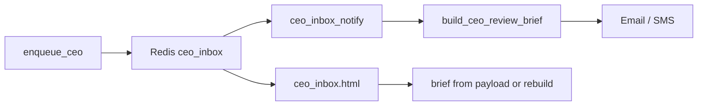
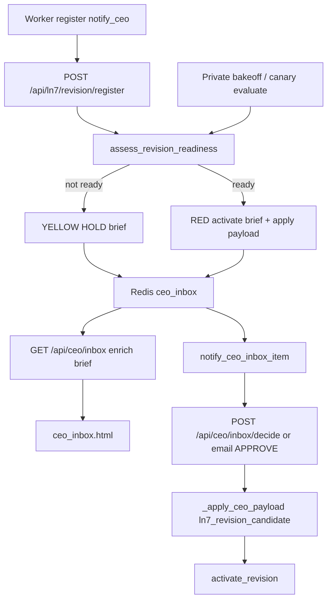

# Dual-COO CEO notification decision briefs

## Problem

CEO inbox items (especially LN7) arrive as vague titles + one-line `detail` (e.g. “Awaiting Dual-COO peer review + CEO APPROVE…”). Email/SMS already run through [`build_ceo_review_brief`](backend/app/services/ceo_inbox_notify.py), but:

- Sections are **WHAT HAPPENED / WHY IT MATTERS / WHAT I NEED** — not the decision framing you want.
- LN7 has **no origin template**; it falls through to the generic fallback.
- [`notify_revision_candidate`](backend/app/services/ln7_revision.py) passes almost no payload.
- [`dashboard/ceo_inbox.html`](dashboard/ceo_inbox.html) renders only `title` + `detail`, not the brief.

## Chosen approach

1. **All Dual-COO CEO notifications** (every `enqueue_ceo` → Redis → email/SMS/dashboard) use one canonical brief schema.
2. **LN7 revision candidates** get a rich template + live readiness snapshot; **do not send RED “activate” asks when readiness fails** — send a YELLOW “premature / blocked” brief instead (or skip notify if `LN7_CEO_NOTIFY_ONLY_WHEN_READY=true`, default **false** so you still see premature with a clear HOLD bottom line).
3. Call sites keep using `enqueue_ceo`; central formatter owns English structure so patent/trust/LN7 stay consistent.



## Canonical brief schema

Extend `payload` (and `build_ceo_review_brief` return) with:

| Field | Purpose |
|---|---|
| `what_it_should_do` | Bullet/short list: effect of APPROVE / intended outcome |
| `what_it_should_not_be` | Bullet/short list: common misreads / non-effects |
| `bottom_line` | One-line CEO lean |
| Keep | `objective` / `reasoning` / `action_steps` for reply instructions |

Update [`_format_summary_block`](backend/app/services/ceo_inbox_notify.py) to emit:

```text
=== WHAT HAPPENED (RISK) ===
...
=== WHAT IT SHOULD DO ===
...
=== WHAT IT SHOULD NOT BE ===
...
=== BOTTOM LINE ===
...
=== WHAT I NEED FROM YOU ===
1. ...
```

SMS: short form = **Bottom line** + reply verbs (ACK/APPROVE/REJECT/HOLD), max ~320 chars.

## Implementation

### 1) Central formatter — [`ceo_inbox_notify.py`](backend/app/services/ceo_inbox_notify.py)

- Add `_format_decision_brief(...)` replacing/extending `_format_summary_block`.
- Prefer payload keys `what_it_should_do`, `what_it_should_not_be`, `bottom_line` when present.
- For every branch (trust, six-quotient, clinical, patent, **generic**), fill those three fields with origin-appropriate defaults (never leave blank — generic defaults OK).
- Add **`LN7 revision candidate`** branch (title match or `payload.kind == "ln7_revision_candidate"`):
  - Summarize revision id, status, base/adapter/serve from payload.
  - Include readiness table lines (pass/fail).
  - `what_it_should_do`: activate → default Sanctuary CLI LN7 brain if APPROVE.
  - `what_it_should_not_be`: not AGI; not auto-clinical; APPROVE does not invent missing adapter.
  - `bottom_line`: HOLD if not ready; APPROVE only if readiness green.

### 2) LN7 notify path — [`ln7_revision.py`](backend/app/services/ln7_revision.py) + small readiness helper

- New [`backend/app/services/ln7_revision_readiness.py`](backend/app/services/ln7_revision_readiness.py): `async def assess_revision_readiness(db_pool, revision_id) -> dict` checking (best-effort, no GREEN GPU train):
  - model card exists
  - adapter path / PEFT URL present in revision notes or harness_config
  - PEFT or Ollama health probe (timeout short)
  - private pack outcomes for revision `n >= 3` (or canary gate ok)
  - canary not `hold_shadow` / `insufficient_tasks`
  - base/serve label consistency flags from notes JSON
- Change `notify_revision_candidate` to:
  - run readiness
  - build full payload (`kind`, checklist, the three summary fields)
  - `risk=YELLOW` if not ready; `risk=RED` if ready and promote still needs CEO
  - `detail` = compact bottom_line + checklist one-liner (dashboard fallback)
- Keep worker `notify_ceo: true` but notifications become honest about prematurity.

### 3) Dashboard — [`dashboard/ceo_inbox.html`](dashboard/ceo_inbox.html)

- For each item, render structured sections from `payload` (or call existing API if brief is only on email path — prefer **persist brief on the Redis item** at enqueue time so dashboard and email match).
- Persist: in `enqueue_ceo`, after building item, optionally call a sync helper `attach_ceo_brief(item)` that mutates `payload` with the brief fields before `lpush` (import from `ceo_inbox_notify` carefully to avoid cycles — put shared schema helpers in a tiny `ceo_brief_schema.py` if needed).

### 4) Tests

- Offline unit tests for `build_ceo_review_brief` / LN7 branch: premature → YELLOW + HOLD bottom_line; ready → RED + activate language.
- Assert summary_block contains the three new section headers.
- No GREEN deploy required for CI.

### 5) Docs

- Short note in [`docs/ln7/RUNBOOK.md`](docs/ln7/RUNBOOK.md) or [`docs/ln7/CONTINUOUS_GATED_SELF_IMPROVEMENT.md`](docs/ln7/CONTINUOUS_GATED_SELF_IMPROVEMENT.md): CEO LN7 asks include readiness brief; premature ≠ activate.

## Pipeline / endpoint wiring gaps (must close in v1)

These are real codepath holes, not just product framing:

| Hole | Where | Fix |
|---|---|---|
| **No LN7 apply on APPROVE** | [`_apply_ceo_payload`](backend/app/services/ceo_inbox_notify.py) handles clinical shadows, patent tags, six_quotient, `ln_rule_lifecycle` — **not** LN7 | Add `kind == "ln7_revision_candidate"` → `activate_revision(db, revision_id, promoted_by=ceo, ceo_decision_id=...)` only when `payload.readiness.ready` and `payload.apply.action == "activate"`. REJECT/HOLD = no activate. |
| **`notify_revision_candidate` has no db_pool** | [`ln7_revision.py`](backend/app/services/ln7_revision.py) signature is `(revision_id)` only | Change to `async def notify_revision_candidate(db_pool, revision_id)`; update [`ln7_api.post_register_revision`](backend/app/routers/ln7_api.py) to pass `_pool(request)`. |
| **READY renotify not wired** | [`POST /api/ln7/canary/evaluate`](backend/app/routers/ln7_api.py) and [`Ln7ContinuousAgent._cycle`](backend/app/services/ln7_continuous_agent.py) call `evaluate_canary` but never notify | On `action == "await_ceo"` and gate.ok, call `notify_revision_candidate(..., force_ready=True)` with title/dedup class READY. |
| **Bakeoff → notify missing** | Private bakeoff records outcomes but does not re-assess readiness | After [`run_private_pack_bakeoff`](backend/app/services/ln7_bakeoff_engine.py) (or scorecard API), if revision_id in shadow, trigger readiness + optional READY notify. |
| **GET inbox does not enrich brief** | [`GET /api/ceo/inbox`](backend/app/routers/ceo_dual_coo_api.py) returns raw Redis JSON | Enrich each item with `brief` via `build_ceo_review_brief` (lazy backfill) before return so dashboard need not guess. |
| **Worker HTTP register** | [`ln7_micro_qlora_worker`](backend/scripts/ln7_micro_qlora_worker.py) posts `notify_ceo: true` | Keep flag; backend path must do readiness. Ensure worker still works if notify becomes YELLOW. |
| **strategy_proposals metadata** | Email/SMS path stores `ceo_payload` on proposal at notify time | Attach full readiness + apply block into that payload at insert so email APPROVE and dashboard `/inbox/decide` both hit `_apply_ceo_payload`. Re-notify READY must update or create a new proposal (new item id). |
| **No dedicated readiness API** | Ops cannot inspect without CEO ping | Add `GET /api/ln7/revision/{id}/readiness` (admin) for Command/debug; used by notify and tests. |
| **Activate still dual-gated** | `LN7_PROMOTE_REQUIRES_CEO` + activate endpoint | CEO APPROVE apply is sufficient; do not also require a second manual `POST /revision/activate` if apply hook lands. Document in brief. |
| **External notify env** | `ceo_external_notify_enabled()` may suppress email in non-prod | Brief still on Redis/dashboard; tests should not require SendGrid. |



## Other gaps in this plan (and mitigations)

| Gap | Risk | Mitigation in scope |
|---|---|---|
| **Stale inbox items** | Existing Redis/email items (`…T054529Z`) stay vague until acked; plan only improves *new* notifies | Add one-shot: on dashboard load or `GET /api/.../ceo-inbox`, rebuild brief via `build_ceo_review_brief(item)` if payload missing the three fields (lazy backfill). Optional CEO ACK of old LN7 RED without re-notify. |
| **Notify before readiness is async** | Worker calls `register`+`notify_ceo` immediately after train; bakeoff may not have run yet → always YELLOW first wave | After private bakeoff / canary `await_ceo`, call `notify_revision_candidate` again (or `notify_revision_ready`) with dedup key that allows READY supersede; document that first ping may be HOLD. |
| **Double ping / dedup** | `enqueue_ceo` dedup is title+origin+task_id (1h). Premature then READY may be skipped | Dedup key for LN7 must include readiness class (`premature` vs `ready`) or bump title suffix ` [READY]` so second notify lands. |
| **APPROVE reply vs activate** | Brief says APPROVE activates; today APPROVE may only ack inbox unless payload has apply hooks | Wire LN7 READY payload `apply` action → `activate_revision` on APPROVE (or explicit “reply APPROVE does not activate — use Activate in Command” in what_it_should_not_be until wired). **Chosen default:** document honestly in brief that APPROVE alone does not flip serving unless `payload.apply.kind=ln7_activate` is implemented in same PR. |
| **Call-site sprawl** | Many `enqueue_ceo` sites pass thin detail; generic defaults may still feel vague for patent/crystal/task-bus | Prioritize LN7 + generic; add thin templates for top origins (patent_reflect already has fields — map them to the three sections). No requirement to rewrite every caller in v1. |
| **Import cycles** | `cli_dual_coo.enqueue_ceo` → `ceo_inbox_notify` → dual_coo | Keep `ceo_brief_schema.py` free of Redis/dual_coo; attach brief inside `enqueue_ceo` via that module only. |
| **SMS length** | Full five sections won’t fit | SMS = Bottom line + risk + reply verbs only; email/dashboard get full brief. |
| **Readiness false confidence** | Health probe green + n&lt;3 still YELLOW; path string present ≠ adapter loads | Readiness `ready=true` only if adapter path *and* PEFT smoke generate *and* pack n≥min *and* canary gate ok. Path-only = not ready. |
| **Dashboard deploy** | `ceo_inbox.html` must hit all three nginx roots per deployment-safety | Note in todos: deploy dashboard to Command doc roots after change. |
| **GREEN vs bridge** | `notify_revision_candidate` may run from backend API without db_pool in some paths | Readiness must no-op gracefully (`ready=false`, reason=`no_db`) rather than crash notify. |
| **Broader reviewer checklist** | Plan covers LN7 promote readiness, not full “reviewer of everything Dual-COO” (CWE, contestant yardstick, forgetting every N) | v1 = LN7 promote checklist + universal brief format. Defer contestant/CWE/replay to a follow-up “LN7 revision reviewer v2” todo (listed below, not blocking). |

## Follow-up (explicitly not v1)

- Contestant bakeoff vs Grok in CEO brief
- CWE/secret scan on sample diffs
- Auto-suppress premature notify entirely (`LN7_CEO_NOTIFY_ONLY_WHEN_READY=true` as opt-in later)
- Full Dual-COO peer “reviewer agent” beyond readiness dict

## Out of scope

- Auto-promote policy changes
- Full continual-learning / public-bench competitive CLIs
- Changing patent claim text apply behavior

## Success criteria

- LN7 overnight-style register produces a CEO message with **What it should do / What it should not be / Bottom line**, plus readiness facts.
- Vague one-liner-only LN7 RED activate asks no longer appear when readiness fails (YELLOW HOLD brief instead).
- Dashboard shows the same structure as email (including lazy backfill for old items).
- Other Dual-COO origins also get the three sections via generic/branch defaults.
- Brief text never claims APPROVE activates LN7 unless apply hook is shipped in the same change.
