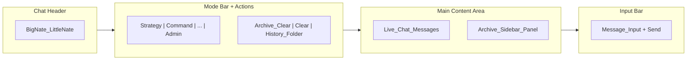
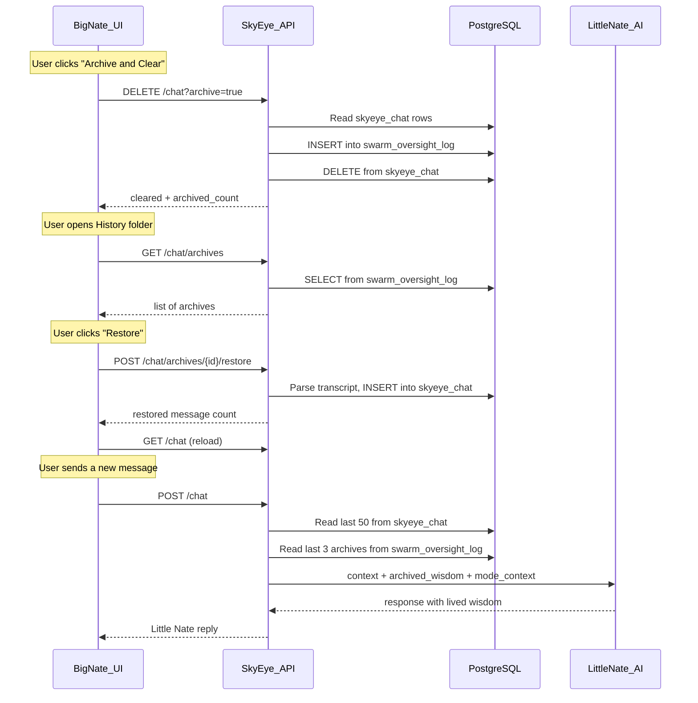

# Chat Archive History System

## Current State

- Archives are stored in `swarm_oversight_log` table with `event_type = 'chat_archive'`, containing the full transcript in the `details` JSONB column and timestamps in `metadata`
- The clear/archive buttons exist in the chat header ([skyeye.html:559-562](dashboard/skyeye.html)) but are positioned above the mode bar, away from where the user expects them
- Conversation context is built in [skyeye_chat.py:459-472](backend/app/services/skyeye_chat.py) by pulling the last 50 messages from `skyeye_chat` table, then appending mode context and marketing context before sending to Azure OpenAI
- The system prompt in `LITTLE_NATE_SYSTEM_PROMPT` already tells Little Nate he has "lived wisdom" but there is no mechanism to inject archived conversation knowledge into his context window

## Changes

### 1. Backend: New API endpoints for archive browsing and restoration

File: [backend/app/routers/skyeye_api.py](backend/app/routers/skyeye_api.py)

- `**GET /api/skyeye/chat/archives**` -- List all archived conversations from `swarm_oversight_log WHERE event_type = 'chat_archive'`. Return: `id`, `entry_id`, `created_at`, `message_count` (from details JSON), a preview (first 200 chars of transcript). Ordered by `created_at DESC`.
- `**GET /api/skyeye/chat/archives/{entry_id}**` -- Return the full transcript for a specific archive entry.
- `**POST /api/skyeye/chat/archives/{entry_id}/restore**` -- Parse the archived transcript back into individual `skyeye_chat` rows (splitting on the `[timestamp] Big Nate:` / `[timestamp] Little Nate:` pattern) and re-insert them into `skyeye_chat`. This makes the conversation active again.

### 2. Backend: Inject archived wisdom into Little Nate's context

File: [backend/app/services/skyeye_chat.py](backend/app/services/skyeye_chat.py)

- Add a new method `_get_archived_wisdom_context()` that queries the last 3-5 archived transcripts from `swarm_oversight_log WHERE event_type = 'chat_archive'`, extracts a summary/excerpt (last ~2000 chars from each), and returns them formatted as:
  ```
  === ARCHIVED WISDOM (past conversations) ===
  [Session from 2026-02-18]: ...excerpt...
  [Session from 2026-02-15]: ...excerpt...
  === END ARCHIVED WISDOM ===
  ```
- Inject this into the conversation context in `send_message()` (around line 472), appending it alongside `mode_context` and `marketing_context`. This way Little Nate always has memory of past archived sessions.

### 3. Frontend: Archive drawer inside Big Nate Chat

File: [dashboard/skyeye.html](dashboard/skyeye.html)

**Move buttons and add archive toggle** -- Relocate the "Archive and Clear" and "Clear Chat" buttons to sit inside the mode bar row (line 565-574) alongside the 8 mode buttons, and add a new "History" toggle button (styled like a folder icon) that opens/closes an archive sidebar panel.

**Archive sidebar panel** -- Add a collapsible panel (right side or overlay) inside `tab-big-nate-chat` that:

- Fetches `GET /api/skyeye/chat/archives` on open
- Displays a list of archived sessions with date and message count
- Clicking an archive shows the full transcript in a read-only viewer
- Each archive has a "Restore" button that calls `POST /api/skyeye/chat/archives/{id}/restore` and then reloads chat
- Styled to match the existing SkyEye dark theme (glass panels, gold accents)

**Layout** (conceptual):




### 4. React Admin Console (secondary)

File: [admin/src/components/BigNateChat.jsx](admin/src/components/BigNateChat.jsx)

- Add matching archive browsing UI to the React component's side panel (where quick actions currently live), so the admin console also has access to archived conversations.

## Data Flow




