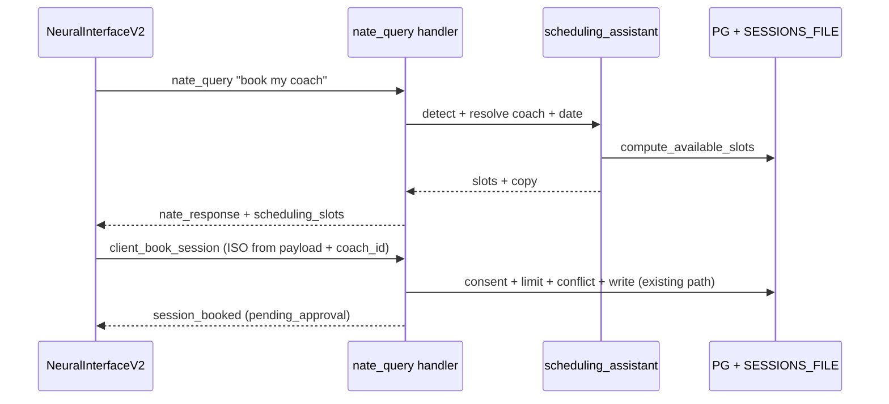

# Main-Chat Scheduling: Gap Analysis + Implementation Outline

## Corrections to the prior investigation (verified)

- **Interception layer was wrong.** Hook the **`nate_query` handler** in [backend/app/websocket/bridge_server.py](backend/app/websocket/bridge_server.py) (~13126), NOT inside `process_interaction`. The handler has `websocket` in scope and already emits structured payloads directly (export flow, ~13186). `cortex._send` (~11212) only emits `{"type":"nate_response","text":...}` and is a protected method — it cannot carry slot data.
- **Coach resolution gap is in the bridge, not just the schedule screen.** Both `client_get_coach_availability` (~13219) and `client_book_session` (~13413) read `assigned_coach_id or d.get("coach_id")` — they never read the profile `coach_id` field that Settings uses. Any chat path must pass an explicit `coach_id` in the booking payload to be safe.

## Gaps and solutions

- **Gap: structured payload path.** `process_interaction` cannot send slot chips.
  - Solution: intercept at `nate_query` handler; `await websocket.send(json.dumps({...}))` for new types, exactly like export (~13186). Short-circuit before `cortex.process_interaction` when scheduling intent is handled.
- **Gap: hallucinated slots.** Model invents times.
  - Solution: never let the LLM produce times. Slots come only from the shared slot computation. Inject a one-line "slots are system-provided" rule into the client prompt; Flutter booking uses ISO from the payload, never parsed from Nate text.
- **Gap: slot logic is inline + duplicated.** Live generator is inline in the availability handler (~13228+); REST `GET /api/sessions/available-slots/{coach_id}` ([backend/app/routers/sessions.py](backend/app/routers/sessions.py):1599) is a second implementation -> drift risk.
  - Solution: extract one importable `compute_available_slots(db_pool, coach_id, date)` and call it from the availability handler, the REST endpoint, and the chat assistant.
- **Gap: dual storage desync.** book/cancel/upcoming use `SESSIONS_FILE`; limit check uses PG `sessions`; PG upsert is best-effort (~13558).
  - Solution: chat booking MUST reuse the existing `client_book_session` code path (one writer), not a parallel one. No second booking implementation.
- **Gap: `coaching_sessions.coach_id` type mismatch** (doc 16 sec 7): booked-mask may return 0 rows -> over-show free slots.
  - Solution: verify column type during the slot-helper extraction; fix the mask once, in the shared helper.
- **Gap: no consent gate on booking.** Onboarding copy requires Sovereign Covenant before booking; `client_book_session` does not check it.
  - Solution: add consent check in the shared booking path (covers chat AND schedule screen), surface a "accept covenant first" message in chat.
- **Gap: hub broadcast.** `session_booked` / slot payloads arrive on the shared `_ClientWsHub`; lobby + chat both see frames.
  - Solution: tag chat-scheduling payloads with a `surface`/`request_id` and ignore unmatched frames in each screen's `_handleMessage`.
- **Gap: chat has no scheduling handlers.** `NeuralInterfaceV2` only handles `nate_response` (~1988).
  - Solution: add `_handleMessage` branches for new inbound types plus existing `session_booked`, `SESSION_LIMIT_REACHED`, conflict `error`.
- **Gap: tier/limit/no-coach/pending UX.** STANDARD 4 / TOP 8 limit (~13424); `pending_approval` not "booked"; unassigned coach.
  - Solution: surface each as chat SnackBar/system line; Nate says "requested" until `session_booked`/approval.
- **Gap: no E2E coverage** in chat path. `verify_client_settings.py` and WS auditors do not cover it.
  - Solution: add intent->slots and confirm->book tests; optionally a WS-flow auditor check if new inbound types are added.
- **Gap: protected file 50-line cap** on `bridge_server.py`.
  - Solution: keep the handler hook thin (call into new module), put logic in `client_scheduling_assistant.py`; feature-flag `ENABLE_CHAT_SCHEDULING`; multi-commit.

## How the chat code would be implemented

### Server
- New `backend/app/services/client_scheduling_assistant.py`: `detect_intent(text)`, `resolve_coach(profile)` (`coach_id` then `assigned_coach_id`), `handle_turn(profile, text, db_pool) -> {handled, response, payload}` returning machine-readable slots from the shared helper.
- New shared helper `compute_available_slots(db_pool, coach_id, date)` extracted from the availability handler; called by handler, REST, and assistant.
- Thin hook in the `nate_query` handler (~13126), gated by `ENABLE_CHAT_SCHEDULING`, before export/normal-chat fallthrough:
  - `handled` + slots -> `websocket.send({type:"scheduling_slots", date, slots, coach_name, surface:"chat"})` and a `nate_response` copy.
  - `needs_date` -> `nate_response` asking which day.
  - else fall through to `cortex.process_interaction` unchanged.
- Booking stays on existing `client_book_session` (no new writer). Add consent gate + explicit `coach_id` resolution there once.
- Add any new read-only prefetch type to the auth allow-list and `_SENTINEL_SKIP` (`nate_query` already skipped, ~11872).

### Flutter ([mobile/lib/updated_screens.dart](mobile/lib/updated_screens.dart))
- `_handleMessage`: branches for `scheduling_slots` (render slot chips/bottom sheet), `session_booked`, `SESSION_LIMIT_REACHED`, conflict `error`; ignore frames whose `surface != "chat"`.
- Slot tap -> send `client_book_session` with ISO `scheduled_start`/`scheduled_end` straight from the payload, plus explicit `coach_id` (`coach_id ?? assigned_coach_id`).
- Optional "Open full calendar" deep-link to `ClientScheduleScreen` (reuse hub).

### Prompt/policy ([backend/app/websocket/bridge_server.py](backend/app/websocket/bridge_server.py) ~9115)
- Additive block: Nate may offer scheduling; times are only from the system-injected slot list; never claim a booking until `session_booked`; say "requested" while `pending_approval`.

### Flow

## Sequencing (multi-commit, protected file)
1. Extract `compute_available_slots` + fix booked-mask type; verify availability/REST unchanged.
2. Add consent gate + explicit coach resolution in `client_book_session`.
3. Add `client_scheduling_assistant.py` + thin flagged hook in `nate_query`.
4. Flutter `_handleMessage` branches + slot UI + book on tap.
5. Prompt block, tests (intent/confirm/limit/conflict/no-coach), docs (`16_client_schedule.md`, UX flow tree).