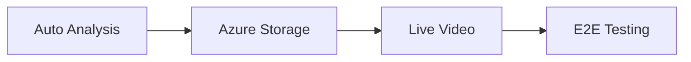

# Classroom Enhancement Suite

## Phase A: Automatic Transcript Analysis

When a coach archives a Zoom transcript from the Schedule tab, Little Nate should automatically analyze it and store insights without requiring manual action.

### Implementation

1. **Hook into archive endpoint** (`bridge_server.py`)
  - After `archive_transcript` saves the VTT file, trigger `classroom_analyzer.analyze_transcript()`
  - Run analysis asynchronously so archive completes quickly
  - Store results in `classroom_sessions.json`
2. **Background AI analysis**
  - Queue the AI analysis portion (Azure OpenAI call) as a background task
  - Update session record when complete
  - Notify coach via WebSocket when analysis is ready
3. **Files to modify:**
  - `backend/app/websocket/bridge_server.py` - Add auto-analyze after archive
  - `backend/app/services/classroom_analyzer.py` - Add async analysis method

---

## Phase B: Azure Blob Storage Integration

Move transcript storage from local filesystem to Azure Blob Storage to prevent storage waste and enable cloud-based access.

### Implementation

1. **Create Azure Blob service** (`azure_storage.py`)
  - Upload VTT transcripts to blob container
  - Download transcripts on demand for analysis
  - Delete local copies after successful upload
2. **Update archive flow**
  - Save to Azure instead of local `archives/` directory
  - Store blob URL in session record
  - Update `classroom_analyzer` to fetch from blob
3. **Environment variables needed:**
  - `AZURE_STORAGE_CONNECTION_STRING`
  - `AZURE_STORAGE_CONTAINER_NAME`
4. **Files to modify/create:**
  - `backend/app/services/azure_storage.py` (new)
  - `backend/app/websocket/bridge_server.py` - Update archive handler
  - `backend/app/services/classroom_analyzer.py` - Add blob fetch support

---

## Phase C: Live Video Analysis

Enable real-time session observation within the 30-day Zoom recording window, before recordings are deleted.

### Implementation

1. **Zoom recording access**
  - Use Zoom API to check if recording is available
  - Stream or download recording for analysis
  - Respect 30-day retention limit
2. **Live session indicators**
  - Show which sessions have live recordings available
  - Add "Analyze Live" button for sessions within 30 days
  - Fall back to transcript-only after 30 days
3. **Optional audio biometrics**
  - If audio is available, run through existing `VoiceBiometricExtractor`
  - Extract pitch, energy, speech rate for enhanced analysis
4. **Files to modify:**
  - `backend/app/websocket/bridge_server.py` - Add live recording fetch
  - `backend/app/services/classroom_analyzer.py` - Add audio analysis option
  - `mobile/lib/updated_screens.dart` - Add "Analyze Live" UI option

---

## Phase D: End-to-End Testing

Verify the complete Classroom feature works correctly.

### Test Scenarios

1. **Session selection flow**
  - Load sessions with transcripts
  - Select a session
  - Verify analysis options appear
2. **Transcript analysis**
  - Trigger analysis on a session
  - Verify metrics extraction (talk-time, questions, techniques)
  - Verify AI insights generation
3. **Client identification**
  - Confirm client is identified from schedule
  - Confirm family members are detected
  - Verify privacy boundaries (no cross-contamination)
4. **Metrics updates**
  - Verify client insights are saved
  - Verify Little Nate gets coaching context
  - Verify client profile metrics update
5. **Assignment workflow**
  - Verify reflection questions appear
  - Submit reflections
  - Verify Dojo scenarios link correctly

---

## Execution Order

Each phase builds on the previous, with testing at the end to verify all components work together.