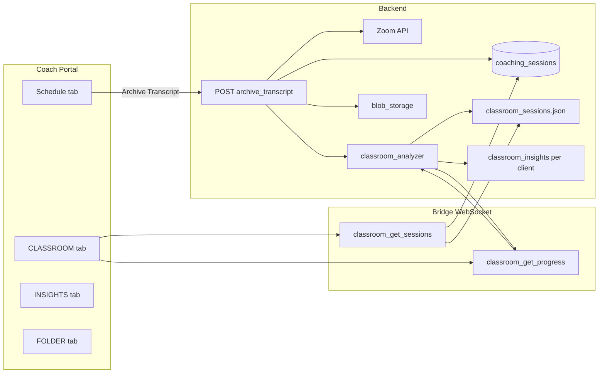
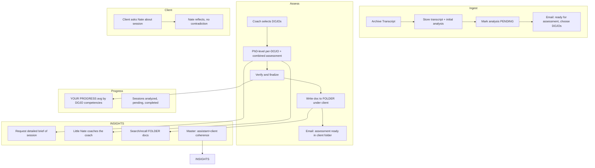

# Classroom: Full Trace and PhD Assessment + Lived Wisdom Plan

## Part 1 — Current Flow (Trace)

**Key files**

- **Archive trigger:** Coach, assistant, or master can trigger "Archive Transcript" from the Schedule tab (whoever has access to that session). [mobile/lib/updated_screens.dart](mobile/lib/updated_screens.dart) — Schedule tab `PopupMenuButton` "Archive Transcript" → `_archiveZoomTranscriptForSession(sessionId)` → `POST /api/sessions/{sessionId}/zoom/archive_transcript` (query `delete_recordings=true`, `delete_meeting=false`).
- **Notifications after archive:** (1) Coach (or assistant who ran the session) gets "Session ready for assessment — open CLASSROOM and choose DOJOs." (2) Master (if the session was run by an assistant under that master) gets an email that **analysis is pending**.
- **Archive handler:** [backend/app/routers/sessions.py](backend/app/routers/sessions.py) `archive_zoom_transcript` (lines 807–1133): loads session (PG then JSON), downloads transcript via ZoomClient, runs `_classroom_analyzer.analyze_transcript()` (sync) and `queue_ai_analysis()` (async), uploads transcript via blob_storage to `sessions/{session_id}/{meeting_id}/transcript.{ext}`, updates session in PG + JSON.
- **Analysis storage:** [backend/app/services/classroom_analyzer.py](backend/app/services/classroom_analyzer.py) — `analyze_transcript()` writes one record per session into `classroom_sessions.json` (and client insights into `classroom_insights/{client_id}.json`). `get_coach_progress(coach_id)` reads `classroom_sessions.json` and returns `total_sessions_reviewed`, `average_presence_score`, `assignments_completed`/`pending`.
- **CLASSROOM tab data:** [mobile/lib/updated_screens.dart](mobile/lib/updated_screens.dart) — `_requestClassroomSessions()` sends WebSocket `classroom_get_sessions`, `_requestClassroomProgress()` sends `classroom_get_progress`. Renders from `_classroomSessions` and `_classroomProgress`.
- **Bridge bug (fixed):** [backend/app/websocket/bridge_server.py](backend/app/websocket/bridge_server.py) previously called `load_sessions()` with no object. Now uses `load_sessions_pg(db_pool)` (or `session_tracker.load_sessions()` when no db_pool) for `classroom_get_sessions` and `classroom_analyze_session`.

**Gaps today**

- No DOJO selection before assessment; no per-DOJO or combined assessment.
- No “pending until DOJOs chosen” or email “ready for assessment / choose DOJOs.”
- No placement of final assessment document into FOLDER (client folder under coach).
- YOUR PROGRESS is a single avg and counts; not DOJO-competency-scoped.
- INSIGHTS chat does not receive FOLDER contents or Classroom session analyses; no “detailed brief” or “search/recall folder docs.”
- No client-facing Nate flow that reflects on the live session (without contradicting coach).
- No master-coach-only INSIGHTS view of assistant + client coherence (client–coach, client–Nate, coach–client–Nate).

---

## Part 2 — Target Architecture (High Level)

**Notifications (UX decisions):** (1) Coach/assistant: "Session ready for assessment." (2) Master: "Analysis pending" when a session under their oversight is archived. (3) Coach/assistant/master: "Assessment ready for [Client] in FOLDER." (4) Coach/assistant/master: "Client engaged with session takeaways" when the client has chatted with Nate about the session.

**Client:** The client does **not** get an in-app or email notification when a transcript is archived. Little Nate uses the archived transcript and lived wisdom to guide the client through the coach's goals and between live sessions; the client experiences this only via conversation with Nate. Client never sees the raw assessment doc; the coach remains the human connection for the depth of assessment.

**CLASSROOM / INSIGHTS:** Coach, assistant, or master can use CLASSROOM (sessions list, choose DOJOs, YOUR PROGRESS, View in FOLDER) and INSIGHTS brief and FOLDER recall. Master-only: asking about assistant + client coherence in INSIGHTS. INSIGHTS FOLDER recall: coach invokes by chat (e.g. "Search FOLDER for [client name] and [date of session]"); backend resolves client name + date to FOLDER contents.

---

## Part 3 — Implementation Plan

### Phase A — Fix and Extend Data Model

**A1. Fix `classroom_get_sessions` in bridge**

- In [bridge_server.py](backend/app/websocket/bridge_server.py) (around 16680): replace `load_sessions()` with loading sessions that have transcripts from the same source the rest of the app uses. Use `load_sessions_pg(db_pool, coach_id=coach_id)` (and merge with any JSON fallback if needed), then filter by `transcript_location` or `transcript_archived_at`. If no PG, use `session_tracker.load_sessions()` and filter; ensure session_tracker is in scope.
- Ensure `scheduled_time` (or equivalent) exists on session objects for sorting.

**A2. Classroom analysis state and DOJO selection**

- Add analysis lifecycle states, e.g. `pending_dojo_selection` | `assessing` | `completed`.
- **Storage:** Extend `classroom_sessions.json` (or add a small PG table if preferred for querying) so each analyzed session has: `session_id`, `coach_id`, `client_id`, `status` (e.g. `pending_dojo_selection` / `assessing` / `completed`), `selected_dojos` (list of DOJO keys, e.g. THERAPIST, BUSINESS, TEACHER), `assessments` (per-DOJO + combined), `final_assessment_doc_id` (FOLDER file id when placed), `completed_at`, `therapeutic_presence_score` / DOJO-scoped scores.
- **Coach DOJO list:** Resolve coach’s DOJOs from `profile_data.dojo_subscriptions` or equivalent (see [admin.py](backend/app/routers/admin.py) ~5139, [night_school_director.py](backend/app/services/night_school_director.py) DojoMode enum: THERAPIST, BUSINESS, TEACHER, JUDGE, etc.).

**A3. YOUR PROGRESS (Classroom tab)**

- **Metrics to expose:** (1) Avg score — computed from completed assessments, weighted by DOJO competencies the coach is signed up for. (2) Sessions analyzed (completed). (3) Pending — sessions with transcript and analysis record but `status == pending_dojo_selection`. (4) Completed — count of analyses in `completed` with a FOLDER doc.
- **Scoring:** Define DOJO-competency dimensions (or reuse Night School / DOJO rubric dimensions). Per completed assessment, compute a score per selected DOJO and a combined score; aggregate into coach-level averages in `get_coach_progress()` (or new helper). Expose in existing `classroom_get_progress` payload so Flutter can show “YOUR PROGRESS: X.X/10 avg”, “Sessions analyzed: N”, “Pending (choose DOJOs): M”, “Completed: P”.

---

### Phase B — DOJO Selection and PhD Assessment

**B1. “Select DOJOs for this session” flow**

- **UI (CLASSROOM tab):** For a session in “pending” state, show a control “Choose DOJOs for assessment” that opens a multi-select of the coach’s DOJOs (from profile/subscriptions). On submit, send WebSocket (e.g. `classroom_select_dojos`) with `session_id` and `dojo_keys: ["THERAPIST","BUSINESS"]`.
- **Bridge:** New handler `classroom_select_dojos`: validate coach, load analysis record for `session_id`, set `selected_dojos` and set status to `assessing`, trigger async assessment job (or queue).

**B2. PhD-level assessment generation**

- **Inputs:** Session transcript (or path), `selected_dojos`, existing metrics from `analyze_transcript` (techniques, talk time, etc.).
- **Outputs:** For each selected DOJO: structured assessment (rubric dimensions, evidence from transcript, strengths, growth areas, score). Plus one “combined” assessment (integration across DOJOs). Stored in the analysis record (e.g. `assessments: { "THERAPIST": {...}, "BUSINESS": {...}, "combined": {...} }`).
- **Implementation:** Extend [classroom_analyzer.py](backend/app/services/classroom_analyzer.py) (or a dedicated assessment module) to call an AI pipeline (e.g. Azure OpenAI) with DOJO-specific prompts and rubric; parse into the structure above. Reuse existing `queue_ai_analysis` pattern but with DOJO-scoped prompts and output schema. Persist result and set status to `completed`.

**B3. Final assessment document and FOLDER placement**

- **Document:** Generate a single “PhD-level” summary document (e.g. Markdown or HTML) containing: session meta, per-DOJO assessment summary, combined assessment, scores, growth suggestions, goals for next session. Optionally include coach-facing and (redacted) client-facing bullets.
- **FOLDER:** Use [folder_api.py](backend/app/routers/folder_api.py) — resolve coach’s client folder for `client_id` (entity_id = client username), then `POST /api/coach/folders/upload-metadata` or equivalent to create a file record (e.g. `file_type='classroom_assessment'`, `metadata={ session_id, completed_at, dojos }`) and store the document content (e.g. via blob_storage and store URL in `coach_folder_files.storage_url` / `azure_blob_url`). Link analysis record to this file via `final_assessment_doc_id`.
- **Notifications:** After FOLDER placement, send email to coach: “Assessment ready for [Client Name] in FOLDER tab.”

---

### Phase C — Notifications and Pending UX

**C1. Email when transcript is ready for assessment**

- After archive completes and initial analysis is written with status `pending_dojo_selection`, trigger email to coach: “A session is ready for assessment. Open CLASSROOM and choose DOJOs for this session.”
- Use existing notification path (e.g. notification_system or SendGrid) and coach email from profile.

**C2. CLASSROOM tab UX**

- List “Sessions with transcripts” with status badge: Pending (choose DOJOs) | Assessing | Completed.
- For pending, show “Choose DOJOs” and list coach’s DOJOs (from API or profile).
- For completed, show “View in FOLDER” link (e.g. deep link to FOLDER tab with client folder and file selected).

---

### Phase D — INSIGHTS Tab: Brief, Folder Recall, and Nate Coaching

**D1. Detailed brief of selected session**

- **UI:** In INSIGHTS (or from CLASSROOM “Ask about this session”), coach can request “Give me a detailed brief of [session id / client name + date].” Send to backend with session identifier.
- **Backend:** Resolve session and load full analysis (and if available, assessment doc). Return or stream a “brief” (summary) to the chat. Alternatively, inject into Nate context so the next user message is answered with that brief.
- **Integration:** Extend [skyeye_chat.py](backend/app/services/skyeye_chat.py) `send_coach_message()` to accept optional `session_for_brief`; when present, load from classroom_analyzer (and FOLDER doc if needed), build a brief, and include in context so Nate can “go deep” and coach the coach.

**D2. Little Nate coaches the coach**

- **Context:** Include in coach INSIGHTS context: session brief, techniques used, DOJO assessments (strengths, growth areas), goals for next session. System prompt addition: Nate can advise on techniques, suggest alternatives, and give growth suggestions; can discuss client suggestions and store them for client-facing Nate.
- **Persistence:** When coach discusses “suggestions for the client” or “what to drive the client toward,” store in a structured way (e.g. in session analysis metadata or a small table `coach_client_suggestions`: session_id, client_id, coach_id, suggestions text, stored_at) so client-facing Nate can “reflect without contradicting” and consider those suggestions.

**D3. FOLDER search/recall in INSIGHTS**

- **Backend:** New helper or endpoint: given coach_id, return list of FOLDER file metadata (and optionally snippets) for files in the coach’s folders (e.g. from `coach_folder_files` joined with `coach_folders`). Filter by `file_type='classroom_assessment'` if needed, or allow general search by filename/metadata.
- **INSIGHTS context:** In `send_coach_message()`, optionally load “recent FOLDER documents” or run a search (e.g. by client name or session id) and inject titles + links or short summaries into context so Nate can “search, recall, and view” and answer questions about “what’s in my folders.”

---

### Phase E — Client-Facing Nate and Master-Coach Coherence

**E1. Client asks Nate about the live session**

- **Context for Nate:** When a client chats with Nate, inject context from [classroom_analyzer.get_client_context_for_nate(client_id)](backend/app/services/classroom_analyzer.py) (already used in bridge for `classroom_get_client_context`). Extend that context to include: high-level session takeaways, growth themes, and “coach suggestions for you” (from stored coach_client_suggestions) so Nate can reflect and support without contradicting the coach.
- **Rules in prompt:** Nate must not contradict the coach’s framing; may reflect and validate; may consider coach’s suggested directions when responding.

**E2. Master-coach-only: assistant + client coherence in INSIGHTS**

- **Eligibility:** In INSIGHTS, if the current user is a **master coach** (e.g. has assistants in `coach_hierarchy` with status active), allow questions about “assistant coach X and client Y” and “what has Little Nate assessed about this coach and client.”
- **Data:** For a given assistant and client: (1) List completed Classroom assessments for sessions where coach_id = assistant and client_id = client. (2) Compute or retrieve “coherency” style metrics: e.g. client–coach (from session metrics), client–Nate (from client engagement if available), and coach–client–Nate (triad). Store or compute these in a way similar to Coherence Network / Explorer (e.g. [nevedal_lab_family.html](dashboard/nevedal_lab_family.html) relationship metrics). Expose via API or bridge message (e.g. `insights_assistant_client_coherence`) only when caller is master.
- **INSIGHTS context:** When `is_master_coach` and the coach asks about an assistant or “assistant + client,” inject the above coherence stats and assessment summary so Nate can answer. Restrict: assistant coaches cannot ask for this; they can only ask their master (who can then coach them on dynamics).

---

### Phase F — Schema and API Summary

**New or extended storage**

- **classroom_sessions.json (or PG):** Add `status`, `selected_dojos`, `assessments` (per-DOJO + combined), `final_assessment_doc_id`, `completed_at`; keep existing metrics and AI insights.
- **coach_folder_files:** Store assessment document; `file_type='classroom_assessment'`, `metadata` with session_id, client_id, dojos, completed_at.
- **Optional:** `coach_client_suggestions` (session_id, client_id, coach_id, suggestions, stored_at) for INSIGHTS → client-facing Nate handoff.

**New or extended endpoints / WebSockets**

- **Bridge:** `classroom_select_dojos` (session_id, dojo_keys); fix `classroom_get_sessions` (use PG/session_tracker).
- **REST (optional):** `GET /api/coach/classroom/progress` (if you want REST in addition to WebSocket); `GET /api/coach/folders/search?q=...` or include in existing folders list for INSIGHTS recall.
- **Internal:** Assessment job (sync or async) that reads transcript, runs DOJO-scoped AI, writes assessment doc, uploads to FOLDER, updates analysis record, sends email.

**Emails**

- “Session ready for assessment — please choose DOJOs” (after archive).
- “Assessment ready for [Client Name] — view in FOLDER” (after FOLDER placement).

---

## Part 4 — Order of Work (Suggested)

1. **Fix bridge `classroom_get_sessions`** so the CLASSROOM tab reliably shows sessions with transcripts.
2. **Extend analysis model** (status, selected_dojos, assessments, final_assessment_doc_id) and persist in classroom_sessions.json (or PG).
3. **Implement DOJO selection** (UI + bridge handler) and “pending” vs “completed” UX in CLASSROOM.
4. **Implement PhD assessment generation** (per-DOJO + combined) and write assessment doc into FOLDER under client; send “assessment ready” email.
5. **YOUR PROGRESS:** Add pending/completed counts and DOJO-weighted avg score; expose in `classroom_get_progress`.
6. **INSIGHTS:** Add session brief and FOLDER recall into coach Nate context; add “coach the coach” and store coach suggestions for client.
7. **Client Nate:** Extend `get_client_context_for_nate` and client chat context with session takeaways and coach suggestions; add reflection rules.
8. **Master-only coherence:** Add coherence metrics for assistant+client and expose in INSIGHTS for master coach only.

This plan keeps the existing archive → analysis → storage flow, fixes the bridge bug, then layers DOJO selection, PhD assessment, FOLDER placement, progress, INSIGHTS depth, client reflection, and master-coach oversight on top.