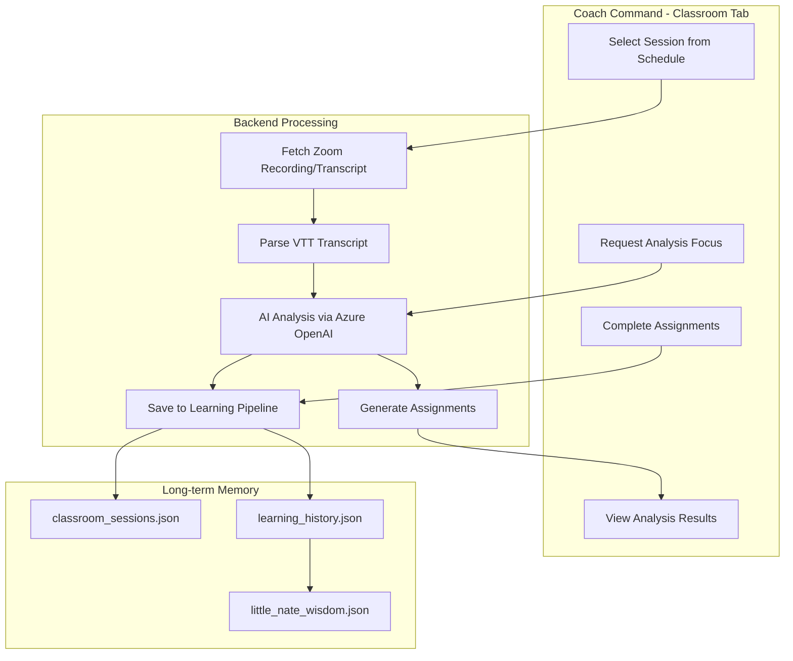

# Classroom Tab Implementation Plan

## Architecture Overview

## Key Considerations

### 1. Video/Transcript Source

- **Recommended**: Pull from existing Zoom recordings in Schedule tab
- Leverage existing `archive_transcript` endpoint that downloads VTT files
- Coaches select a completed session → system fetches transcript automatically
- Fallback: Manual Zoom meeting ID entry for external sessions

### 2. What Nate Analyzes

- **Primary**: VTT transcript text (already implemented for archival)
- **Metrics to extract**:
  - Therapeutic technique identification (EFT, IFS, CBT patterns)
  - Talk-time ratio (coach vs client)
  - Question types (open vs closed)
  - Reflection frequency
  - Emotional attunement moments
  - Missed opportunities for deeper exploration
- **Optional future enhancement**: Audio biometrics via existing `VoiceBiometricExtractor`

### 3. Learning Focus Options

Coach selects what they want to learn about:

- "Therapeutic presence & attunement"
- "Questioning techniques"
- "Handling resistance"
- "Emotional validation"
- "Session pacing & structure"
- "Specific modality (EFT/IFS/CBT)"
- "Custom focus" (free text)

### 4. Assignment Types Generated

- **Reflection Questions**: 3-5 prompts about the session
- **Dojo Drills**: Specific scenarios to practice (links to Dojo tab)
- **Workbook Reading**: Relevant sections from PDF workbooks
- **Skill Tracking**: Progress on identified growth areas

### 5. Long-term Memory Storage

- Transcripts saved to `classroom_sessions.json` with metadata
- Key insights flow to `learning_history.json` (same pipeline as Dojo)
- Coach progress tracked across sessions
- Nate references past Classroom feedback in future sessions

## Files to Modify

### Frontend (Flutter)

- [mobile/lib/updated_screens.dart](mobile/lib/updated_screens.dart)
  - Add `_buildClassroomTab()` method (tab already defined in TabBar)
  - Add state variables for classroom data
  - Add WebSocket message handlers for classroom events

### Backend (Python)

- [backend/app/websocket/bridge_server.py](backend/app/websocket/bridge_server.py)
  - Add message handlers:
    - `classroom_get_sessions` - List eligible sessions with recordings
    - `classroom_analyze_session` - Trigger AI analysis
    - `classroom_get_analysis` - Retrieve completed analysis
    - `classroom_submit_reflection` - Coach submits assignment responses
  - Add `ClassroomAnalyzer` class for transcript parsing and AI analysis
- [backend/app/services/classroom_analyzer.py](backend/app/services/classroom_analyzer.py) (new file)
  - VTT transcript parser
  - Metrics extraction (talk-time, question types, etc.)
  - AI prompt construction for analysis
  - Assignment generation logic

### Data Storage

- `classroom_sessions.json` - Analyzed sessions with metrics, insights, assignments
- Integrate with existing `learning_history.json` for wisdom synthesis

## Implementation Phases

### Phase 1: Core UI + Session Selection

- Build Classroom tab UI with session picker
- Filter Schedule sessions to those with archived transcripts
- Display session metadata and recording status

### Phase 2: Transcript Analysis Engine

- VTT parser for Zoom transcripts
- Basic metrics extraction (talk-time ratio, question count)
- AI-powered insight generation via Azure OpenAI

### Phase 3: Assignment System

- Generate personalized assignments based on analysis
- Link to Dojo for practice scenarios
- Link to Workbooks for relevant reading

### Phase 4: Learning Integration

- Save insights to Night School pipeline
- Track coach progress over time
- Nate references past Classroom work in coaching interactions

## Technical Considerations

- **Transcript Format**: Zoom exports VTT (WebVTT) format - need parser
- **AI Token Usage**: Full transcript can be large; may need chunking or summarization
- **Privacy**: Transcripts contain client info - ensure proper access controls
- **Storage**: Transcripts can be large; consider compression or summary-only storage
- **Zoom API Limits**: Rate limits on recording downloads

## Open Questions for You

1. Should analysis happen automatically when a session ends, or only on-demand? answer Little Nate should automatically analyze trsanscripts and store them. Live videos analysis is only upon request and within 30 days otherwise live video is deleted in Zoom and only analysis can be done by transcripts. Azure blob storage should host data so storage does not become wasteful
2. Should assignments have due dates or deadlines? answer: coach should request a due date
3. Should admin see/approve Classroom insights before they enter Nate's wisdom? answer: no, Little Nate can analyze and store information without approval. However, upon request provide classroom insights client specific for a coach, but for an admin either client ot coach specific.
4. Want coach-to-coach session sharing for peer learning? answer: no

