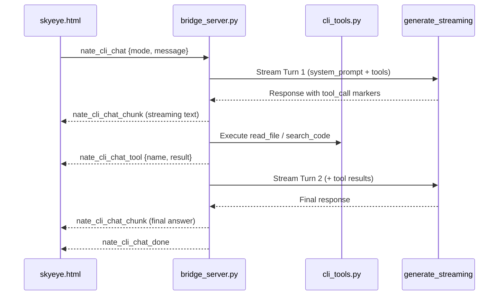
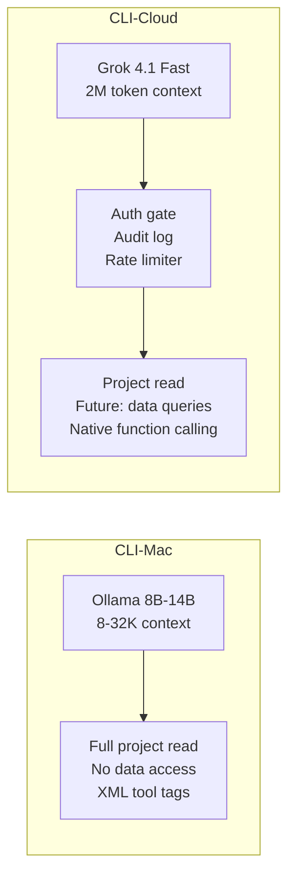

# CLI Execution Mode Overhaul

## Current State

The `nate_cli_chat` handler (lines 27249-27388 of `bridge_server.py`) is a single-shot LLM call: it swaps a system prompt based on mode, streams one response, and exits. All four modes produce the same kind of output (markdown text). The UI (`skyeye.html`) shows identical panels regardless of mode — only the badge label changes.

**Problems:**

- Modes are cosmetic, not behavioral — ASK can suggest edits, DEBUG doesn't analyze root causes systematically, LN-FAB has no chain-of-thought
- The LLM has zero codebase context — it hallucinates file paths and metrics
- No tool access — the agent cannot read files, search code, or verify its claims
- Chat log is capped at 160px with no resize or clear controls

## Architecture




## CLI-Mac vs CLI-Cloud Divergence

The two CLI targets have fundamentally different environments, constraints, and trust boundaries:




| Dimension              | CLI-Mac                                                                    | CLI-Cloud                                                                                |
| ---------------------- | -------------------------------------------------------------------------- | ---------------------------------------------------------------------------------------- |
| LLM provider           | Ollama (local, RTX 5090)                                                   | Grok 4.1 Fast (xAI API)                                                                  |
| Context window         | 8K-32K (model-dependent)                                                   | 2M tokens (effectively unlimited)                                                        |
| Tool call format       | XML `<tool_call>` tags parsed from streamed text                           | Native function calling via OpenAI-compatible `tools` array                              |
| Tool result truncation | Aggressive: 2000 chars (ASK/DEBUG), 3000 chars (PLAN), 4000 chars (LN-FAB) | Generous: 6000 chars (ASK/PLAN/DEBUG), 12000 chars (LN-FAB)                              |
| Tool access scope      | Unrestricted project read (dev box, single user)                           | Auth-gated: codebase read = always allowed; data queries = admin-verified, HIPAA-audited |
| Cost                   | $0 (local inference)                                                       | ~$0.20/M input, $0.50/M output tokens                                                    |
| Write tools (Phase 2)  | Allowed (inject_log, debug instrumentation)                                | Never (production environment)                                                           |
| Built-in tools         | None                                                                       | `web_search`, `code_interpreter` (xAI server-side)                                       |
| Rate limits            | None (local)                                                               | 60 req/min, 100K tokens/min (tier-dependent)                                             |


### Auth and Data Access Scoping

The WebSocket connection already verifies `current_profile.get("role") == "ADMIN"` before entering the `nate_cli_chat` handler. This is sufficient for codebase read tools (`read_file`, `search_code`, `list_directory`). But when future tools are added that touch client data (`query_sessions`, `query_coherence_data`, `query_metrics`), the following must be enforced:

- **Admin role verified on every tool call**, not just at handler entry. The `execute_tool` dispatcher receives `cli_type` and `user_role` and checks both.
- **Data-touching tools log to a separate `cli_data_access_log` table** with username, tool name, data scope (which client's data was queried), timestamp. This is distinct from the general `cli_tool_calls` audit log.
- **CLI-Mac data tools are disabled entirely** — the local dev box should not query production client data. Only CLI-Cloud (which connects to the production bridge) can access data tools, and only with admin auth.
- **HIPAA relevance**: If Elates asks about data governance during the pilot, the audit log demonstrates that every data access is role-gated, logged, and traceable to a specific admin session.

### Provider Abstraction for Tool Calls

The tool-call loop in `bridge_server.py` must branch based on `cli_type`:

**CLI-Cloud (Grok)** — Uses native function calling:

```python
tools = [
    {"type": "function", "function": {"name": "read_file", "parameters": {...}}},
    {"type": "function", "function": {"name": "search_code", "parameters": {...}}},
    {"type": "function", "function": {"name": "list_directory", "parameters": {...}}},
]
# For ASK/DEBUG on CLI-Cloud, also add xAI built-in tools:
tools.append({"type": "web_search"})
```

The Grok API returns structured `tool_calls` objects with parsed arguments — no regex extraction, no XML parsing, no risk of malformed tags spanning chunk boundaries.

**CLI-Mac (Ollama)** — Uses XML tag parsing from streamed text:

```
<tool_call>{"name": "read_file", "args": {"path": "..."}}</tool_call>
```

Ollama has no native function calling. The handler buffers the full response per turn and extracts tool calls via regex after streaming completes.

This means the Option B fast-follow (native function calling) is **partially achieved now** for CLI-Cloud. The XML approach remains for CLI-Mac until Ollama adds function calling support.

### Context Budget Strategy

**CLI-Cloud (Grok 2M context)**:

- System prompt: no truncation needed
- Per-turn tool results: 6000 chars (ASK/PLAN/DEBUG), 12000 chars (LN-FAB)
- Accumulated conversation: no aggressive pruning needed — 2M tokens handles entire repositories
- Cost optimization: after turn 4, summarize prior tool results rather than forwarding raw output. This keeps token costs linear instead of quadratic as turn count grows. Each turn resends the full history, so a 10-turn session with full tool results could hit 50-80K input tokens. At $0.20/M that's still only $0.01-0.02 per session, but it compounds.

**CLI-Mac (Ollama 8-32K context)**:

- System prompt: keep under 2000 chars (Ollama's `_MAX_SYSTEM_CHARS` is 6000, but tools + architecture context eat into this)
- Per-turn tool results: 2000 chars (ASK/DEBUG), 3000 chars (PLAN), 4000 chars (LN-FAB)
- Accumulated conversation: after turn 3, summarize all prior turns into a single context block to stay within window
- After turn 5, if context is exhausted, send a `nate_cli_chat_status` with `status: "context_limit"` and suggest breaking the task into smaller requests

## File Changes

### 1. New File: `backend/app/websocket/cli_tools.py`

Standalone module with three read-only tool functions, a dispatcher, and auth gating:

- `**read_file(path, start_line=None, end_line=None)`** — Reads a file from the project directory (`/app/` inside Docker, workspace root locally). Returns numbered lines. Validates path stays within project bounds via `os.path.realpath()` + prefix check (no `../` traversal). Max 200 lines per call. **Timeout: 5 seconds.**
- `**search_code(pattern, path=None, glob=None, max_results=20)`** — Regex search across project files. Uses `re` module walking the file tree. Skips binary files, `node_modules`, `__pycache__`, `.git`. Returns `{file, line_num, line_text}` matches. Regex is compiled with `re.IGNORECASE` and wrapped in a timeout to prevent catastrophic backtracking. **Timeout: 10 seconds.**
- `**list_directory(path, pattern=None)`** — Lists files/directories at a path. Optional glob filter. Returns `{name, type, size}` entries. **Timeout: 3 seconds.**
- `**execute_tool(name, args, cli_type, user_role) -> dict`** — Dispatcher that routes tool calls to the correct function. Validates `cli_type` and `user_role` before executing data-touching tools. Returns `{"status": "ok", "result": ...}` or `{"status": "error", "error": ...}`. On timeout, returns `{"status": "error", "error": "Tool timed out after Ns — try a narrower query"}`.

**Timeout implementation**: Each tool function is wrapped in `asyncio.wait_for()` (or `signal.alarm` for sync functions run via `asyncio.to_thread`). On timeout, the structured error is returned to the LLM so it can adjust (e.g., narrow a search pattern, read fewer lines).

**Tool call format diverges by CLI type:**

CLI-Mac (Ollama — XML tags in LLM output):

```
<tool_call>{"name": "read_file", "args": {"path": "backend/app/services/nevedal_engine.py", "start_line": 1, "end_line": 50}}</tool_call>
```

CLI-Cloud (Grok — native function calling, no parsing needed):

```python
# Grok returns structured tool_calls in the response object
for tool_call in response.choices[0].message.tool_calls:
    name = tool_call.function.name
    args = json.loads(tool_call.function.arguments)
```

The dispatcher itself is format-agnostic — it receives `(name, args)` regardless of how they were extracted.

### 2. Modified: `bridge_server.py` — nate_cli_chat handler (lines 27249-27388)

**Replace the single-shot streaming with a multi-turn tool-call loop with provider branching:**

```python
# Pseudocode — branching by cli_type
cli_type = data.get("cli_type", "cloud")  # "mac" or "cloud"
mode = data.get("mode", "ask")
MAX_TURNS = {"ask": 5, "plan": 8, "ln_fab": 10, "debug": 8}[mode]
TRUNC = _get_truncation_limit(mode, cli_type)  # see context budget table

conversation = [{"role": "system", "content": system_prompt}]
conversation.append({"role": "user", "content": user_msg})
seen_calls = set()

for turn in range(MAX_TURNS[mode]):
    # --- Send inter-turn loading state ---
    if turn > 0:
        await ws.send_json({"type": "nate_cli_chat_status",
            "status": "tool_executing",
            "detail": f"Turn {turn+1}/{MAX_TURNS} — processing tool results..."})

    # --- LLM call branches by provider ---
    if cli_type == "cloud":
        # Grok: native function calling via OpenAI-compatible endpoint
        response = await _grok_chat_completion(
            messages=conversation,
            tools=_build_tools_array(mode, cli_type),
            tool_choice="auto",
            stream=True)
        full_response, tool_calls = _parse_grok_stream(response)
    else:
        # Ollama: stream text, extract XML <tool_call> tags after buffering
        full_response = ""
        async for delta, provider in generate_streaming(...):
            full_response += delta
            # stream chunks to client
        tool_calls = _extract_xml_tool_calls(full_response)

    # --- Dedup ---
    new_calls = []
    for tc in tool_calls:
        key = f"{tc['name']}:{json.dumps(tc['args'], sort_keys=True)}"
        if key not in seen_calls:
            seen_calls.add(key)
            new_calls.append(tc)
    tool_calls = new_calls

    if not tool_calls:
        break  # final answer

    # --- Execute tools with auth and timeout ---
    for tc in tool_calls:
        await ws.send_json({"type": "nate_cli_chat_status",
            "status": "tool_running",
            "detail": f"Running {tc['name']}: {_summarize_args(tc['args'])}..."})
        result = await cli_tools.execute_tool(
            tc["name"], tc["args"],
            cli_type=cli_type, user_role=current_profile.get("role"))
        # Truncate result per environment
        result_str = json.dumps(result)[:TRUNC]
        # Audit log
        await _log_cli_tool_call(plan_id, tc, result, duration_ms)
        # Send to client
        await ws.send_json({"type": "nate_cli_chat_tool", ...})
        # Append to conversation with structured delimiters
        conversation.append({"role": "assistant", "content": full_response})
        conversation.append({"role": "user",
            "content": f"[TOOL RESULT: {tc['name']}]\n{result_str}\n[END TOOL RESULT]"})

    # --- Context budget check (CLI-Mac only) ---
    if cli_type == "mac" and turn >= 3:
        conversation = _summarize_prior_turns(conversation)  # compress earlier turns
```

**Provider-specific call paths:**

- `**_grok_chat_completion()`** — Calls `https://api.x.ai/v1/chat/completions` with the OpenAI-compatible tools array. Parses `response.choices[0].message.tool_calls` for structured tool calls. Uses streaming (`stream=True`) but note: Grok does not stream tool_calls simultaneously with text — tool calls arrive after the text portion completes.
- `**_extract_xml_tool_calls()`** — Regex extraction of `<tool_call>...</tool_call>` blocks from Ollama's streamed text output. Same as the current plan's XML approach.
- `**_build_tools_array(mode, cli_type)`** — Constructs the tools list. For CLI-Cloud ASK/DEBUG modes, includes `{"type": "web_search"}` (xAI built-in) alongside custom tools. For CLI-Mac, returns None (Ollama uses prompt-based tool instructions).

**Grok built-in server-side tools (CLI-Cloud only):**

The xAI API supports built-in tools that run on xAI's servers:

- `web_search` — Search the web for error messages, library docs, or stack traces. Available in ASK and DEBUG modes.
- `code_interpreter` — Run quick calculations or data analysis in a sandboxed environment. Available in DEBUG mode for hypothesis validation.

These are added to the `tools` array alongside custom tools. No backend implementation needed — xAI executes them server-side and returns results in the same `tool_calls` response format.

**Inter-turn loading states:**

Between tool execution and the next LLM turn, the user sees a dead gap. To prevent confusion with WebSocket disconnects, send `nate_cli_chat_status` messages:

```json
{"type": "nate_cli_chat_status", "status": "tool_running",
 "detail": "Reading backend/app/services/nevedal_engine.py..."}
{"type": "nate_cli_chat_status", "status": "tool_executing",
 "detail": "Turn 3/8 — analyzing tool results..."}
```

The UI renders these as a pulsing indicator in the chat log (see Section 4).

**Per-mode turn limits (unchanged):**

- ASK = 5, PLAN = 8, LN-FAB = 10, DEBUG = 8

**Per-mode, per-environment tool result truncation:**


| Mode   | CLI-Mac (Ollama) | CLI-Cloud (Grok) |
| ------ | ---------------- | ---------------- |
| ASK    | 2000 chars       | 6000 chars       |
| PLAN   | 3000 chars       | 6000 chars       |
| DEBUG  | 2000 chars       | 6000 chars       |
| LN-FAB | 4000 chars       | 12000 chars      |


**Grok API cost management:**

At $0.20/M input + $0.50/M output, a 10-turn LN-FAB session resending full history each turn could hit 50-80K total input tokens (~$0.01-0.02/session). To keep costs linear:

- After turn 4, replace raw tool results in the conversation with a one-paragraph summary: `"[SUMMARIZED] read_file returned 150 lines of nevedal_engine.py showing the C_emo formula and VoiceBiometricExtractor class."`
- The current turn's tool results remain at full fidelity; only prior turns get summarized.
- Monitor via `cli_tool_calls` audit log: total tokens per session can be approximated from tool result character counts.

**Grok rate limit awareness:**

The xAI API returns rate limit headers (`x-ratelimit-remaining-requests`, `x-ratelimit-remaining-tokens`). Parse these after every Grok API call:

```python
remaining_requests = int(resp.headers.get("x-ratelimit-remaining-requests", 60))
remaining_tokens = int(resp.headers.get("x-ratelimit-remaining-tokens", 100000))
if remaining_requests < 5 or remaining_tokens < 10000:
    await ws.send_json({"type": "nate_cli_chat_status",
        "status": "rate_limit_warning",
        "detail": f"Rate limit: {remaining_requests} requests, {remaining_tokens} tokens remaining"})
```

If rate limit is exhausted (429 response), return a structured error to the client and stop the tool-call loop for that session.

**Output separation — thinking vs deliverables:**

The LLM's chain-of-thought (file paths, hypothesis reasoning, tool call decisions) goes to the chat log. Generated code and plan documents go to the previewer. The system prompts enforce a convention:

- Agent thinking: plain text streamed to the chat log
- Generated output: wrapped in `<!-- OUTPUT -->` markers:

```
<!-- OUTPUT -->
```python
def calculate_coherence(metrics):
    ...
```

```

The handler's stream parser splits on these markers: everything outside goes to `nate_cli_chat_chunk` (chat log), everything inside goes to `nate_cli_chat_output` (previewer). This prevents internal debug artifacts from leaking into generated code or plan documents.

**LN-FAB output validation (lightweight pre-accept check):**

Before sending generated code to the previewer, run a basic validation:
- Python files: `py_compile.compile()` on the generated output. If it fails, flag the output with a warning banner: "Syntax error detected — review before accepting."
- Diff targets: if the output references line numbers in an existing file, verify those lines match the current file state (compare against the tool result from the `read_file` call that preceded the generation). If stale, warn: "File may have changed since the agent read it."

These are warnings, not blockers — the user can still accept the output.

**Duplicate tool call deduplication (unchanged):**

```python
seen_calls = set()
for tc in tool_calls:
    call_key = f"{tc['name']}:{json.dumps(tc['args'], sort_keys=True)}"
    if call_key in seen_calls:
        continue
    seen_calls.add(call_key)
```

**Per-call audit logging:**

Every tool call is logged to `cli_tool_calls`:

```sql
INSERT INTO cli_tool_calls (plan_id, tool_name, tool_input, tool_output, status, duration_ms, cli_type, user_role, turn_number)
VALUES ($1, $2, $3::jsonb, $4::jsonb, $5, $6, $7, $8, $9)
```

For data-touching tools (future: `query_sessions`, `query_coherence_data`), a second row is inserted into `cli_data_access_log` with the specific client data scope that was queried.

**New WebSocket message types:**

`nate_cli_chat_tool` (tool execution result):

```json
{
  "type": "nate_cli_chat_tool",
  "tool_name": "read_file",
  "tool_input": {"path": "backend/app/services/nevedal_engine.py"},
  "tool_output_preview": "1|import asyncio\n2|import logging...",
  "status": "ok",
  "duration_ms": 12
}
```

`nate_cli_chat_output` (generated code/plan for previewer, separated from thinking):

```json
{
  "type": "nate_cli_chat_output",
  "content": "def calculate_coherence(metrics):\n    ...",
  "language": "python",
  "target_file": "backend/app/services/nevedal_engine.py",
  "validation": {"syntax_ok": true, "stale_lines": false}
}
```

When `status: "error"` on a tool call, `tool_output_preview` contains the error (e.g., "File not found" or "Tool timed out after 10s — try a narrower search pattern").

### 3. Enhanced System Prompts (in `bridge_server.py`)

Each mode gets a substantially richer prompt with:

- Codebase architecture context (key directories, file roles, tech stack)
- Available tools and how to call them
- Mode-specific behavioral contract
- Grounding rules (never fabricate paths, always verify with tools)

#### ASK Mode — "Understand"

```
You are Little Nate in ASK mode. Your role is to UNDERSTAND.
You answer questions precisely, grounded in the actual codebase.
You make NO code change suggestions — only explanations.

TOOLS AVAILABLE:
<tool>read_file(path, start_line?, end_line?) — Read a file</tool>
<tool>search_code(pattern, path?, glob?) — Search for code patterns</tool>
<tool>list_directory(path, pattern?) — List directory contents</tool>

When unsure about a fact, USE A TOOL to verify before answering.
To call a tool, output: <tool_call>{"name": "...", "args": {...}}</tool_call>
Wait for the result before continuing your answer.

CODEBASE ARCHITECTURE:
- Backend: Python FastAPI + asyncpg (backend/app/)
- Bridge: WebSocket server (backend/app/websocket/bridge_server.py)
- Services: 147 services (backend/app/services/)
- Routers: REST API (backend/app/routers/)
- Dashboard: HTML/JS admin console (dashboard/)
- Mobile: Flutter/Dart app (mobile/lib/)
- Database: PostgreSQL (little_nate), Redis cache

RULES:
- NEVER suggest code changes in ASK mode
- NEVER fabricate file paths — use list_directory to discover
- NEVER guess at metrics or column names — use search_code to verify
- Say "I don't know" when you genuinely don't have the answer
```

#### PLAN Mode — "Think"

```
You are Little Nate in PLAN mode. Your role is to THINK.
Build structured implementation plans before any code is written.

TOOLS: [same as ASK]

OUTPUT FORMAT:
---
plan_id: {plan_id}
mode: plan
files:
  - path: <verified filepath>
    action: create|modify|delete
status: proposed
---

## Summary
<1-3 sentence overview>

## Dependencies & Risks
<what could break, what depends on what>

## File Changes (in execution order)
### <filepath> (ACTION)
```lang
<code snippet or diff>
```

## Mermaid Architecture Diagram

```mermaid
<diagram>
```


## To-Do Checklist

- Step 1
- Step 2

## Rollback

RULES:

- Always verify file paths exist using tools before referencing them
- Ask clarifying questions when requirements are ambiguous
- Include line number references for modifications
- Generate mermaid diagrams for complex flows

```

#### LN-FAB Mode — "Build"
```

You are Little Nate in LN-FAB mode. Your role is to BUILD.
Generate complete, production-grade implementations.

TOOLS: [same as ASK]

WORKFLOW — show your chain of thought:

1. First, read relevant files to understand current code
2. State your implementation strategy
3. Generate COMPLETE code with no placeholders
4. Include full diffs for modifications, complete contents for new files

OUTPUT SEPARATION:
Your thinking (strategy, file exploration, decisions) goes in regular text.
Generated code MUST be wrapped in output markers:


```python
# complete implementation here
```


This ensures your chain-of-thought stays in the chat log and generated
code goes to the previewer. Never mix internal analysis into OUTPUT blocks.

RULES:

- Read existing files before modifying them — never guess current state
- Production-grade: no TODOs, no placeholder comments, no print debugging
- Include import statements, error handling, and type hints
- Show your thinking process as you explore the codebase
- ALL generated code MUST be inside  markers

```

#### DEBUG Mode — "Fix"
```

You are Little Nate in DEBUG mode. Your role is to FIX.
Diagnose bugs through evidence-based analysis, not guessing.

TOOLS: [same as ASK]

WORKFLOW:

1. Read the bug description carefully
2. Generate 3-5 RANKED HYPOTHESES about the root cause
3. For each hypothesis, use tools to gather evidence
4. Narrow to the most likely cause with evidence citations
5. ASK the user to verify — before proposing a fix, ask the human to
  confirm what they observe at runtime. Example: "Can you confirm that
   when you reconnect the WebSocket, the server log shows [X]?"
6. Propose a targeted fix with a diff
7. Explain verification steps

FORMAT EACH HYPOTHESIS:

### Hypothesis N: [Title]

**Likelihood**: HIGH | MEDIUM | LOW
**Evidence needed**: [what to check]
**Files to examine**: [paths]

After investigation:

### Root Cause Analysis

[explanation with file:line evidence]

### Proposed Fix

```diff
[targeted fix]
```

### Verification

[how to confirm the fix works]

RULES:

- Never skip straight to a fix — always show hypotheses first
- Every claim must cite a file path and line number
- Read the actual code before diagnosing — never guess
- If hypotheses are disproven by evidence, say so explicitly
- Always ask the human to verify before proposing the fix — keep the human in the loop

```

### 4. Modified: `skyeye.html` — Mode-Specific UI + Chat Controls

#### A. Mode-specific panel behavior

When mode changes via `ctSetModeVisual()`, toggle panel visibility:

| Mode | PREVIEWER pane | AGENT CHAT LOG | Right column |
|------|---------------|----------------|--------------|
| ASK | Hidden | Expanded (full height) | Hidden (ASK is stateless: `_ideCurrentPlanId = null`, responses are NOT attached to any plan history) |
| PLAN | Visible (plan preview + mermaid) | Visible | Visible (history) |
| LN-FAB | Visible (code preview) | Visible (chain of thought) | Visible |
| DEBUG | Replaced by Hypothesis Panel | Visible (analysis log) | Shows "Mark Fixed" button |

Update `ctSetModeVisual()` to call a new `_ideApplyModeLayout(mode)` function that shows/hides the correct panels and adjusts CSS.

#### B. Tool call rendering in chat log

New function `_ideRenderToolCall(msg)` that creates a collapsible card:

```html
<div class="msg-tool">
  <div class="tool-header" onclick="this.parentElement.classList.toggle('expanded')">
    <span class="tool-icon">⚡</span>
    <span class="tool-name">read_file</span>
    <span class="tool-path">backend/app/services/nevedal_engine.py:1-50</span>
    <span class="tool-time">12ms</span>
    <span class="tool-chevron">▸</span>
  </div>
  <pre class="tool-output"><!-- truncated file contents --></pre>
</div>
```

CSS: collapsed by default (`.tool-output` hidden), click to expand. Gold border-left for successful tool calls (`.msg-tool`). Red border-left for failed tool calls (`.msg-tool.error`) — when `status: "error"` comes back from a tool (e.g., file not found, timeout, regex error), the card renders with a red border and the error message is shown inline, not silently swallowed.

#### B2. Inter-turn loading indicator

When `nate_cli_chat_status` arrives with `status: "tool_running"` or `status: "tool_executing"`, render a pulsing indicator row in the chat log:

```html
<div class="msg-tool-loading">
  <span class="tool-pulse"></span>
  <span class="tool-loading-text">Reading backend/app/services/nevedal_engine.py...</span>
</div>
```

CSS: `.tool-pulse` is a 6px gold dot with a CSS pulse animation. The loading row is removed when the next `nate_cli_chat_tool` or `nate_cli_chat_chunk` arrives. This fills the dead gap between tool execution and the next LLM turn — critical for distinguishing "agent is thinking" from "WebSocket dropped."

#### B3. Rate limit display (CLI-Cloud only)

When `nate_cli_chat_status` arrives with `status: "rate_limit_warning"`, render a subtle status bar at the bottom of the chat log:

```html
<div class="cli-rate-limit-bar">Rate limit: 12 requests, 8,432 tokens remaining</div>
```

Styled dim gold, small font. Only shown when remaining counts are below threshold (requests < 10 or tokens < 20K). Disappears on next successful call.

#### B4. Output separation in chat log vs previewer

`nate_cli_chat_output` messages go to the PREVIEWER pane, not the chat log. The chat log shows the agent's thinking; the previewer shows the deliverable. If a `validation` field is present with `syntax_ok: false`, render a warning banner above the output in the previewer:

```html
<div class="output-validation-warning">Syntax error detected — review before accepting</div>
```

#### C. Clear chat log button

Add a "Clear" button in the AGENT CHAT LOG header (next to "No plan selected"):

```html
<button onclick="_ideClearChatLog()" class="nct-btn-sm" title="Clear chat log">Clear</button>
```

```javascript
function _ideClearChatLog() {
  var log = document.getElementById('ide-chat-log');
  if (log) log.innerHTML = '';
  _ideNateDiv = null;
  _ideCurrentFull = '';
}
```

#### D. Draggable resize handle

Insert a `<div class="nct-resize-handle" id="ide-resize-handle">` between the PREVIEWER block and the AGENT CHAT LOG block. CSS: `height: 6px; cursor: row-resize; background: var(--bdr)` with hover highlight.

JavaScript: `mousedown` on the handle starts tracking `mousemove` on the parent `.nct-view`. On move, adjust `flex-basis` or `max-height` of the PREVIEWER and chat log blocks proportionally. `mouseup` stops tracking.

```javascript
var _ideResizing = false, _ideResizeStartY = 0, _idePreviewH = 0, _ideChatH = 0;

document.getElementById('ide-resize-handle').addEventListener('mousedown', function(e) {
  _ideResizing = true;
  _ideResizeStartY = e.clientY;
  var preview = document.getElementById('ide-plan-pane');
  var chat = document.getElementById('ide-chat-log');
  _idePreviewH = preview.offsetHeight;
  _ideChatH = chat.offsetHeight;
  e.preventDefault();
});

document.addEventListener('mousemove', function(e) {
  if (!_ideResizing) return;
  var delta = e.clientY - _ideResizeStartY;
  var preview = document.getElementById('ide-plan-pane');
  var chat = document.getElementById('ide-chat-log');
  preview.style.maxHeight = Math.max(60, _idePreviewH + delta) + 'px';
  chat.style.maxHeight = Math.max(60, _ideChatH - delta) + 'px';
});

document.addEventListener('mouseup', function() { _ideResizing = false; });
```

#### E. Debug-specific UI

When mode is DEBUG:

- Replace PREVIEWER with a **Hypothesis Panel** showing hypothesis cards
- Each card has a colored likelihood badge (red=HIGH, orange=MEDIUM, gray=LOW)
- Add a **"Mark Fixed"** button in the right column that sends:

```json
  {"type": "nate_cli_debug_resolved", "plan_id": "...", "resolution": "fixed"}
  

```

- The bridge handler logs this to `cli_tool_calls` with status `"resolved"`

#### F. Enhanced `_ideHandleMessage(msg)` routing

Add handling for the new message types:

```javascript
} else if (msg.type === 'nate_cli_chat_tool') {
  _ideRemoveLoadingIndicator();
  _ideRenderToolCall(msg);
} else if (msg.type === 'nate_cli_chat_output') {
  _ideRenderOutput(msg);  // send to previewer, not chat log
} else if (msg.type === 'nate_cli_chat_status') {
  if (msg.status === 'tool_running' || msg.status === 'tool_executing') {
    _ideShowLoadingIndicator(msg.detail);
  } else if (msg.status === 'rate_limit_warning') {
    _ideShowRateLimitBar(msg.detail);
  } else if (msg.status === 'context_limit') {
    _ideShowContextWarning(msg.detail);
  }
}
```

Status messages per mode:

- ASK: "Searching codebase..."
- PLAN: "Mapping dependencies..."
- LN-FAB: "Exploring files..."
- DEBUG: "Generating hypotheses..."

### 5. CSS additions in `skyeye.html`

New styles needed:

- `.msg-tool` — tool call card in chat log (collapsible, gold border-left)
- `.msg-tool.error` — failed tool call card (red border-left, error message shown)
- `.msg-tool-loading` — inter-turn loading indicator with pulsing dot
- `.tool-pulse` — 6px gold dot with `@keyframes pulse` animation (opacity 0.3-1.0, 1.2s cycle)
- `.cli-rate-limit-bar` — subtle rate limit status bar (dim gold, `font-size: 11px`)
- `.output-validation-warning` — syntax error warning banner above previewer output (amber background)
- `.nct-resize-handle` — draggable handle between preview and chat
- `.hypothesis-card` — DEBUG mode hypothesis display
- `.hypothesis-badge` — HIGH/MEDIUM/LOW colored badge
- `.mark-fixed-btn` — DEBUG mode resolution button
- `.nct-view.mode-ask .nct-block:first-child` — hide previewer in ASK mode
- `#tab-command-terminal .nct-view .nct-chat-log` — scoped override of `max-height:160px` to `max-height:none` (scoped to Command Terminal only, not global `.nct-chat-log` which is used by other dashboard panels)

### 6. New Table: `cli_plans` (Plan ID Lifecycle Registry)

```sql
CREATE TABLE IF NOT EXISTS cli_plans (
    plan_id UUID PRIMARY KEY DEFAULT gen_random_uuid(),
    mode VARCHAR(10) NOT NULL CHECK (mode IN ('ask', 'plan', 'ln_fab', 'debug')),
    cli_type VARCHAR(10) NOT NULL CHECK (cli_type IN ('mac', 'cloud')),
    status VARCHAR(20) NOT NULL DEFAULT 'proposed'
        CHECK (status IN ('proposed', 'in_progress', 'completed', 'abandoned')),
    title TEXT,
    created_by VARCHAR(100) NOT NULL,
    created_at TIMESTAMPTZ NOT NULL DEFAULT NOW(),
    resolved_at TIMESTAMPTZ,
    files JSONB DEFAULT '[]'::jsonb,
    total_turns INT DEFAULT 0,
    total_tool_calls INT DEFAULT 0
);

CREATE INDEX idx_cli_plans_status ON cli_plans(status) WHERE status = 'in_progress';
CREATE INDEX idx_cli_plans_created ON cli_plans(created_at DESC);
```

This gives every CLI interaction a traceable lifecycle:

- `proposed` — plan generated but not yet acted on
- `in_progress` — user is actively working through it
- `completed` — user confirmed done (or "Mark Fixed" in DEBUG)
- `abandoned` — session ended without resolution

The `files` JSONB array tracks which files were referenced/modified, providing audit traceability. The `total_turns` and `total_tool_calls` fields enable usage analytics (cost estimation, turn distribution by mode).

ASK mode is stateless — it creates transient plan IDs that auto-expire (status goes to `completed` immediately on response). PLAN, LN-FAB, and DEBUG plans persist until the user resolves them.

## Execution Order

1. Create `cli_plans` migration (DB schema must exist before code references it)
2. Create `cli_tools.py` with timeouts and auth-scoped dispatcher (no dependencies, testable standalone)
3. Update system prompts in `bridge_server.py` with output separation markers
4. Add tool-call loop with provider branching (Grok native vs Ollama XML), inter-turn loading states, rate limit parsing, context budget logic, and output separation
5. Add `nate_cli_chat_tool`, `nate_cli_chat_output`, loading indicator, and rate limit bar handling to `skyeye.html` JS
6. Add mode-specific layout switching to `skyeye.html`
7. Add chat log clear button and draggable resize handle
8. Add DEBUG-specific hypothesis panel and "Mark Fixed" button
9. Test all four modes end-to-end (both CLI-Mac with Ollama XML tags and CLI-Cloud with Grok native function calling)

## Risk Assessment

- **Context window divergence**: CLI-Mac (Ollama 8-32K) and CLI-Cloud (Grok 2M) have radically different ceilings. A 10-turn LN-FAB session with full tool results could consume 50-80K tokens — trivial for Grok, fatal for Ollama. Mitigation: environment-aware truncation limits (see table in Section 2), CLI-Mac summarization after turn 3, and `context_limit` status messages when CLI-Mac approaches its ceiling.
- **Tool security + HIPAA**: Codebase read tools (`read_file`, `search_code`, `list_directory`) are safe for both environments. Future data-query tools (therapeutic sessions, coherence metrics) are CLI-Cloud admin-only, individually audited in `cli_data_access_log`, and disabled entirely on CLI-Mac. Path traversal is blocked via `os.path.realpath()` + prefix check.
- **Tool call timeout**: `read_file` on a very large file or `search_code` with a catastrophic regex backtrack can hang indefinitely. Mitigation: per-tool timeouts (5s/10s/3s) with structured error responses that tell the LLM to narrow its query.
- **Streaming + tool detection (CLI-Mac only)**: XML `<tool_call>` markers might span multiple Ollama stream chunks. Mitigation: buffer the full response per turn before extracting tool calls. CLI-Cloud avoids this entirely via Grok's native function calling.
- **Grok rate limits**: 60 requests/min and 100K tokens/min for new xAI accounts. Parallel CLI sessions (e.g., DEBUG in one tab, PLAN in another) could exhaust limits. Mitigation: rate limit header parsing, warning surfaced in UI when remaining counts are low, and graceful 429 handling.
- **Grok API cost**: Each turn resends full conversation history. 10-turn sessions hit 50-80K input tokens. At $0.20/M input this is ~$0.01-0.02/session. Mitigation: summarize prior tool results after turn 4 to keep costs linear, not quadratic.
- **Output contamination ("debug output in deliverables")**: Agent thinking (file paths, hypothesis reasoning) could leak into generated code or plan documents. Mitigation: `<!-- OUTPUT -->` markers in system prompts enforce separation. The handler splits the stream: thinking goes to chat log (`nate_cli_chat_chunk`), generated code goes to previewer (`nate_cli_chat_output`).
- **LN-FAB stale file state**: The agent reads a file via `read_file`, then generates a diff targeting specific line numbers. If the file changed between the read and the generation (or if the tool result was truncated), the diff applies to the wrong location. Mitigation: `py_compile` validation for Python, and line-number verification against the most recent tool result for diffs.
- **Orphaned plan IDs**: Without lifecycle tracking, plan IDs accumulate with no way to audit what was proposed vs implemented. Mitigation: `cli_plans` table with status tracking (proposed/in_progress/completed/abandoned) and auto-expiry for ASK mode's transient plans.
- **LLM tool-call hallucination loops**: If the model generates rapid-fire duplicate tool calls, the dedup set (`seen_calls`) skips them. If it generates different-but-useless calls, the per-mode turn limit is the circuit breaker.
- **CSS scoping**: The `max-height: none` override on `.nct-chat-log` is scoped to `#tab-command-terminal .nct-view .nct-chat-log` so it does not affect other dashboard panels that use the same class.
- **Provider abstraction complexity**: Two code paths (Grok native vs Ollama XML) for tool call extraction. Risk of drift if one path is updated without the other. Mitigation: the tool execution and result handling are shared — only the extraction differs. Tests must cover both paths.

## Fast-Follow Items (ordered by priority)

### Priority 1: Session Persistence (reliability infrastructure — build before Elates pilot)

Store the multi-turn tool conversation array in Redis keyed by `cli:{session_id}:{plan_id}` with 30-minute TTL. On WebSocket reconnect, if a `plan_id` is in progress, the conversation can be resumed from where it left off instead of starting over.

**Why first**: If a WebSocket disconnect happens mid-conversation during a client demo (e.g., Elates pilot where you're using the CLI to showcase the platform), losing a multi-turn debug or planning session looks bad. The other fast-follows are developer experience improvements. This one is reliability infrastructure that protects live demos.

Implementation: On each tool-call turn completion, `SETEX cli:{session_id}:{plan_id} 1800 {json.dumps(conversation)}`. On reconnect, if the client sends `nate_cli_chat` with a `resume_plan_id`, load the conversation from Redis and continue from the last turn. On `nate_cli_chat_done`, `DEL` the key.

### Priority 2: Full Debug Instrumentation (Phase 2 — CLI-Mac only)

Extend DEBUG mode to inject logging statements into server files, prompt the user to reproduce the bug, then read the injected log output and analyze actual runtime data before proposing a fix.

**Scope constraints:**

- CLI-Mac only (local dev environment, RTX 5090 box). Never against CLI-Cloud / production. The bridge handler must check `cli_type == "mac"` before allowing write-capable tools.
- Requires a new `write_file` tool (or `inject_log` specialized tool) added to `cli_tools.py`
- `execute_tool` dispatcher blocks all write tools when `cli_type == "cloud"` regardless of role

**Cleanup discipline:**

- Add a `debug_instrumentation_cleanup` tool that automatically runs on:
  - "Mark Fixed" button click (`nate_cli_debug_resolved` message)
  - Session end (WebSocket close while DEBUG mode is active with injected logs)
  - Manual trigger (new "Clean Logs" button in DEBUG UI)
- The cleanup tool reverts all files that were modified during the debug session, using a snapshot taken before injection. Do NOT rely on the LLM to remember to clean up its own injected statements — it won't always.
- Track injected files in a `debug_injections` list on the conversation state: `[{"path": "...", "original_content": "...", "injected_at": "..."}]`

**Sequencing rationale**: Phase 1 proves the hypothesis-generation workflow, validates the tool-call loop is stable, and gives confidence in the read-only tool infrastructure. Phase 2 adds write capability on top of a battle-tested foundation.

### Priority 3: Native Function Calling for Ollama (Option B — usage-triggered)

CLI-Cloud already uses native function calling via Grok. This fast-follow extends it to CLI-Mac by adding a `messages` parameter to `generate_streaming` that accepts structured conversation history with `tool` role messages, enabling proper message threading for Ollama when it gains function calling support.

**Trigger to build**: Not timeline-based — usage-based. When CLI-Mac tool conversations consistently hit the context window ceiling because accumulated concatenated results crowd out the LLM's working memory, that's when proper message threading pays for itself. The symptom will be Ollama losing track of earlier tool results in longer DEBUG or LN-FAB sessions (8-10 turn conversations). Monitor via the `cli_tool_calls` audit log — if `turn >= 5` responses on CLI-Mac start hallucinating facts that contradict tool results from turns 1-2, the context window is the bottleneck.

**Note**: This is now partially solved — CLI-Cloud uses Grok native function calling from day one. The remaining work is Ollama support.

### Priority 4: Data Query Tools (admin-only, CLI-Cloud only)

Add session and coherence data query tools to the CLI toolkit:

- `query_sessions(client_id?, date_range?, limit?)` — Query `coaching_sessions` table
- `query_coherence_data(client_id?, metric?, date_range?)` — Query `nevedal_metrics` and `client_metrics`
- `query_user_profile(username)` — Query `users` table (excluding password_hash)

**Security requirements:**

- `cli_type == "cloud"` AND `user_role == "ADMIN"` enforced in `execute_tool` dispatcher
- Every call logged to `cli_data_access_log` with: username, tool name, data scope (which client's data), timestamp, result row count
- Client names and identifiers are displayed but never stored in the `cli_tool_calls` result field — store only row counts and column names
- HIPAA compliance: the audit log proves that data access is role-gated, individually authorized, and traceable

### Priority 5: Turn-Level Cost Analytics

Add a dashboard panel or CLI command that shows per-session token usage breakdown:

- Total input tokens (approximated from conversation character counts)
- Total output tokens
- Cost estimate ($input + $output at Grok's rates)
- Turn distribution (how many turns per mode)
- Tool call distribution (which tools used most)

Data source: `cli_tool_calls` and `cli_plans` tables. Surface via a new subtab in Sovereign Command or as a `/api/admin/cli/analytics` endpoint.