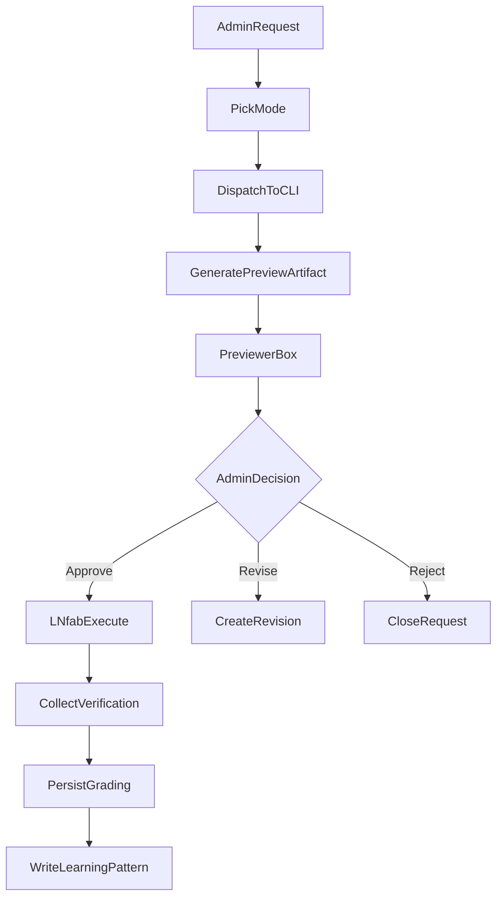

# CLI Terminal Mode UX Plan

## Status

This plan remains a useful source reference, but implementation tracking now lives in:

- `~/.cursor/plans/sovereign_standard_unified_cli_4a73a041.plan.md` (active)
- `~/.cursor/plans/unified_plan_gap_update_aa2c2d5b.plan.md` (gap-closure changelog)

Use this file for historical context only unless a task is explicitly re-opened.

## Goal

Add a simple mode selector and preview workflow in the Command Terminal so `CLI-Cloud` and `CLI-Mac` can return mode-specific outputs (`Plan`, `Ask`, `Debug`, `LN-fab`) before execution, then capture quality grading and learning artifacts.

## Current Baseline

- UI currently supports corrective request with only `parent_build_id`, `executor_cli`, and `description` in [dashboard/skyeye.html](/Users/nathannevedal/Desktop/Clinical-Sovereignty-Lab-2/dashboard/skyeye.html).
- Backend currently accepts corrective requests via `CorrectiveRequestBody` and inserts into `source_repair_requests` in [backend/app/routers/nate_agent_api.py](/Users/nathannevedal/Desktop/Clinical-Sovereignty-Lab-2/backend/app/routers/nate_agent_api.py).
- No mode field, no preview artifact model, and no grading model are currently persisted.
- A target visual reference exists in [sovereign_command_terminal.html](/Users/nathannevedal/Downloads/sovereign_command_terminal.html), including mode tags, previewer behavior, and scoring layout to mirror.

## UX and Data Flow

## Implementation Phases

### Phase 1: Mode-first UX in Command Terminal

- Update [dashboard/skyeye.html](/Users/nathannevedal/Desktop/Clinical-Sovereignty-Lab-2/dashboard/skyeye.html):
  - Add `Pick mode` selector: `plan`, `ask`, `debug`, `ln_fab`.
  - Add Previewer panel below corrective section (artifact list + selected artifact view).
  - Enforce visual behavior contract in request bar and preview output labels:
    - `plan` and `ask`: show `NO-DEPLOY`
    - `debug`: show `NO-EDIT`
    - `ln_fab`: show `LIVE EXECUTION` in red
  - Keep mode tag color/state synchronized with selected mode and preview output type label.
  - Add explicit actions: `Generate Preview`, `Approve`, `Request Update`, `Promote to LN-fab`.
  - `Promote to LN-fab` switches mode selector automatically and requires explicit re-execution.
  - Keep current corrective request form as fallback compatibility path.
- Add robust status/error feedback in the UI for no-op scenarios.

### Phase 2: API contracts for mode + preview artifacts

- Extend models in [backend/app/routers/nate_agent_api.py](/Users/nathannevedal/Desktop/Clinical-Sovereignty-Lab-2/backend/app/routers/nate_agent_api.py):
  - Add `mode` to request payload (`plan|ask|debug|ln_fab`).
  - Add preview artifact endpoints:
    - create preview run
    - list artifacts by request/build
    - fetch artifact content
    - request revision
  - Enforce behavior contract:
    - `plan/ask/debug` cannot execute implementation directly
    - `ln_fab` requires approved upstream artifact or explicit admin override

### Phase 3: Persistence schema

- Add migration(s) under [backend/migrations](/Users/nathannevedal/Desktop/Clinical-Sovereignty-Lab-2/backend/migrations):
  - `cli_mode_runs` (mode metadata, lifecycle timestamps, decision status)
  - `cli_mode_artifacts` (type, format, content pointer, version)
  - `cli_mode_scores` (rubric criteria and weighted totals)
  - `ln_fab_memory_patterns` (abstracted lessons: pros/cons/failure signals/confidence/source)
- Add indexes by `executor_cli`, `mode`, `status`, `created_at` for dashboard performance.

### Phase 4: Grading model and reviewer UX

- Add scoring UI to [dashboard/skyeye.html](/Users/nathannevedal/Desktop/Clinical-Sovereignty-Lab-2/dashboard/skyeye.html):
  - 0–5 sliders or selectors for: Correctness, Safety, Efficiency, Verification, Operational quality.
  - Mode-aware weighting:
    - `debug`: correctness + verification priority
    - `plan`: reasoning clarity + risk mapping priority
    - `ln_fab`: correctness + efficiency + safety priority
    - `ask`: answer accuracy + groundedness priority
- Persist score results through new grading endpoint and surface trend chart in history panel.

### Phase 5: Controlled learning memory

- Add memory write path in backend services (router-level or service helper) to store structured lessons into `ln_fab_memory_patterns`.
- Enforce safe capture:
  - No raw secrets/tokens
  - No privileged credential material
  - Store abstract patterns and rationale, not sensitive payloads.

### Phase 6: Rollout and verification

- Add API-level tests for:
  - mode validation and behavior gating
  - preview generation/revision flow
  - grading persistence and weighted score correctness
- Add CLI auditor coverage for new `nate-agent` mode endpoints so trust reports include this flow.

## Acceptance Criteria

- Admin can pick mode and get a mode-specific preview artifact in the Previewer.
- Visual behavior contract is always visible before approval:
  - `plan/ask` => `NO-DEPLOY`
  - `debug` => `NO-EDIT`
  - `ln_fab` => `LIVE EXECUTION` in red
- `debug` mode returns investigation/fix options but does not execute code unless promoted.
- `plan` mode returns reviewable `.md` and supports revision updates.
- `ln_fab` execution requires explicit approval path and records verification evidence.
- Grading is stored per run, weighted by mode, and visible in Command Terminal history.
- Learning memory entries are created in structured form without secret leakage.

