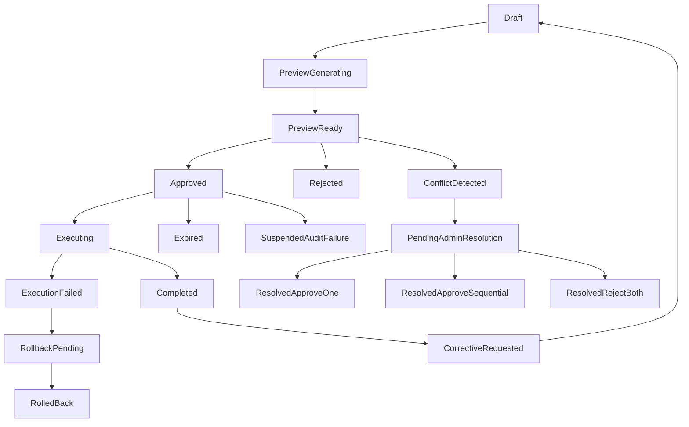

# CLI Terminal Mode UX Plan v2 (Clinical + Trust Hardened)

## Objective

Evolve Command Terminal into a Cursor-like mode system (`Plan`, `Ask`, `Debug`, `LN-fab`) with explicit visual behavior contracts and backend-enforced clinical/trust controls before any production execution.

## Core Changes

### 1) Mode UX + Visual Contract (UI)

- Update [dashboard/skyeye.html](/Users/nathannevedal/Desktop/Clinical-Sovereignty-Lab-2/dashboard/skyeye.html) to add:
  - `Pick mode` selector and previewer workflow.
  - Mandatory mode capability tags visible pre-approval:
    - `Plan`/`Ask` -> `NO-DEPLOY`
    - `Debug` -> `NO-EDIT`
    - `LN-fab` -> `LIVE EXECUTION` (red)
  - Actions: `Generate Preview`, `Approve`, `Revise`, `Promote to LN-fab`.
  - Promotion behavior: auto-switch to `LN-fab`, require explicit re-execute.

### 2) Explicit Approval Contract + Scope Lock

- Extend [backend/app/routers/nate_agent_api.py](/Users/nathannevedal/Desktop/Clinical-Sovereignty-Lab-2/backend/app/routers/nate_agent_api.py) with a strict approval record model:
  - `run_id`, `approved_by` (must be `big_nate`), `approved_at`, `approval_reason`, `mode_transition`, `scope_hash`, `expires_at`, `clinical_sign_off`.
- Enforce execution only when artifact hash equals approved `scope_hash`.
- Approval TTL: 4 hours; if expired before start -> `requires_reapproval`.

### 3) Formal State Machine + Transition Guards

- Implement run-state transitions in API/service layer:
  - `draft -> preview_generating -> preview_ready -> approved -> executing -> completed`
  - failure branch: `execution_failed -> rollback_pending -> rolled_back`
  - rejection/expiry: `rejected -> archived`, `approved -> expired -> requires_reapproval`
  - corrective path: `completed -> corrective_requested -> draft(new,parent_build_id)`
  - audit suspension: `approved -> suspended_audit_failure`
  - conflict branch: `conflict_detected -> pending_admin_resolution -> resolved_*`
- Block invalid transitions:
  - `executing -> executing`
  - duplicate `approved -> approved`

### 4) Idempotency + Concurrency Safety

- Add deterministic idempotency key computation in API path:
  - `SHA256(cli_agent + mode + request_text + parent_build_id + approved_by)`.
- TTL window: 300s; repeated submissions return existing run.
- Enforce one active execution per `(cli_agent, mode, parent_build_id)`.

### 5) Corrective Request Validation

- For corrective requests in [backend/app/routers/nate_agent_api.py](/Users/nathannevedal/Desktop/Clinical-Sovereignty-Lab-2/backend/app/routers/nate_agent_api.py):
  - Validate `parent_build_id` exists.
  - Parent run must be `completed` and correction-eligible.
  - Reject parent runs in `executing` or terminal-invalid states.

### 6) Artifact Ownership + Storage Rules

- Contract:
  - CLI produces raw output.
  - API/bridge wrapper canonicalizes and versions artifact record.
  - Dashboard renders only canonical artifact records.
- Storage policy:
  - `<4KB` content in PostgreSQL artifact table.
  - `>=4KB` content in R2 with DB pointer.
  - All LN-fab execution logs in R2.
  - Retention: active/audit evidence indefinite; archived 365 days.

### 7) Clinical Safety Gates Before Execution

- Add pre-execution gates:
  - `session_protection_check`: block session-adjacent infra actions when escalation-level protections are active.
  - `rollback_procedure` required (non-empty) for production-impact runs.
- If approval expires mid-execution:
  - continue to completion, mark `approval_expired_mid_execution`, require post-hoc review.

### 8) Learning Memory Safety + Clinical Review Gate

- Add memory persistence with forbidden field policy:
  - no identifiers, session text, credentials, diagnosis/clinical specifics, family identifiers.
- Two-stage review:
  - automated redaction gate
  - Big Nate clinical sign-off for session-context touching patterns
- Failed patterns go to quarantine table, never auto-promoted.

### 9) Grading Reproducibility + Authority Expansion

- Persist scoring with reproducibility metadata:
  - `rubric_version`, `scorer_identity`, `evaluation_context`, `model_version`, `evaluation_date`.
- Add authority gates based on demonstrated competence (not generic feature flags):
  - e.g., infra repairs, LN-fab execution, fine-tune proposals, compliance updates.

### 10) Testing + Trust Integration

- Add tests for:
  - transition validity matrix
  - hash-lock execution matching
  - idempotency duplicate suppression
  - corrective validation paths
  - expiry/suspension/conflict branches
- Extend CLI auditor/trust baseline to include new mode workflow endpoints and counts.

## Target Files

- [dashboard/skyeye.html](/Users/nathannevedal/Desktop/Clinical-Sovereignty-Lab-2/dashboard/skyeye.html)
- [backend/app/routers/nate_agent_api.py](/Users/nathannevedal/Desktop/Clinical-Sovereignty-Lab-2/backend/app/routers/nate_agent_api.py)
- [backend/app/websocket/bridge_server.py](/Users/nathannevedal/Desktop/Clinical-Sovereignty-Lab-2/backend/app/websocket/bridge_server.py) (or dedicated artifact canonicalization service)
- [backend/migrations](/Users/nathannevedal/Desktop/Clinical-Sovereignty-Lab-2/backend/migrations) (new schema + indexes)
- CLI/trust auditor service files in [backend/app/services](/Users/nathannevedal/Desktop/Clinical-Sovereignty-Lab-2/backend/app/services)

## Acceptance Criteria

- Visual behavior contract always visible and mode-accurate in UI.
- No execution without valid approval record, matching `scope_hash`, non-expired TTL, and required clinical sign-off.
- Invalid transitions, duplicate approvals, and duplicate execute actions are rejected deterministically.
- Corrective requests fail fast for invalid/non-completed parent build IDs.
- Artifact storage follows size-tier policy with verifiable pointers.
- Learning memory writes pass redaction + clinical review gates.
- Grading records are reproducible across rubric/model/evaluation contexts.
- Trust/auditor coverage includes all new mode endpoints and reports baseline-consistent counts.

