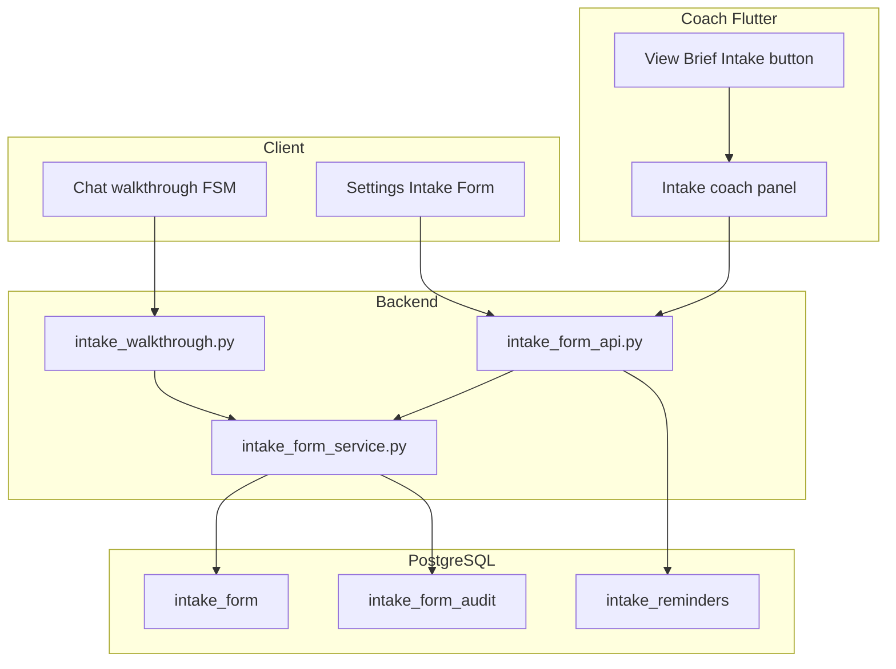

# Client Intake Form — Implementation Plan

## Product summary

| Audience | Section 1 (12 Q) | Section 2 (9 Q groups) | Tokens |
|----------|------------------|------------------------|--------|
| **Client** | Read/write | Read/write own | +1000 per Q **only** via Nate walkthrough |
| **Coach** | Read-only (assigned clients) | Read/write | None |
| **Little Nate** | Read-only via dedicated API | **No access** (API-enforced) | Credits walkthrough answers |

**Not in scope:** active SI/HI questions — handled by existing in-session crisis path.

**Naming:** Label UI **“Clinical intake”** everywhere to distinguish from SSE Story Journey intake ([`onboarding_paid_screen.dart`](mobile/lib/screens/onboarding_paid_screen.dart), `/api/sse-client/intake/*`).

**Gate:** Offer chat walkthrough only after SSE archetype intake is complete (`_sseIntakePending == false` in [`updated_screens.dart`](mobile/lib/updated_screens.dart) ~2529).

**Coach UI v1:** Flutter Coach Command only (per your choice). Defer [`dashboard/presession_brief.html`](dashboard/presession_brief.html) / `my_clients.html`.

---

## Question catalog (source of truth)

### Section 1 — shared with Little Nate and coach

| ID | Prompt |
|----|--------|
| q1 | What name would you like me to use for you? |
| q2 | What pronouns do you use? |
| q3 | Who lives in your household, and what's your current relationship status? |
| q4 | What's bringing you in right now? |
| q5 | How long has this been going on? |
| q6 | What do you hope to get from our conversations? |
| q7 | What would a successful outcome look like to you? |
| q8 | What are the biggest things weighing on you right now? |
| q9 | Do you have people in your life you can turn to for support? (`yes` / `somewhat` / `no`) |
| q10 | How would you rate where you're at right now? (`not_satisfactory` / `satisfactory` / `thriving`) |
| q11 | Is there anything you'd like me to know about how you communicate or process things best? |
| q12 | Is there anything else you want me to know upfront? |

### Section 2 — coach only

| ID | Prompt |
|----|--------|
| q13 | Emergency contact name and phone number |
| q14 | Current address |
| q15 | Have you received therapy, counseling, or psychiatric treatment in the past? |
| q16 | Are you currently taking any prescription medications, vitamins, or supplements? |
| q17 | Is there a history of mental health conditions or substance use in your immediate family? |
| q18 | Have you ever attempted suicide or engaged in self-harming behaviors in the past? |
| q19 | Have you ever experienced a significant trauma, loss, or major life upheaval? |
| q20 | How many alcoholic drinks do you have in an average week, and do you use any recreational substances? |
| q21 | How would you describe your current sleep, appetite, and energy? |

Store in [`backend/app/constants/intake_questions.py`](backend/app/constants/intake_questions.py) (new).

---

## Architecture



**Identity:** `intake_form.user_id` = **`users.username`** (canonical). Include `hardware_id` (indexed) for bridge sessions. Resolve at boundary via [`_identity_resolver.py`](backend/app/services/_identity_resolver.py).

**Coach reassignment:** Intake is **client-owned**. Any currently assigned coach sees the same row; unassigned coaches get 403.

---

## Phase 1 — Database ([`backend/migrations/222_intake_form.sql`](backend/migrations/222_intake_form.sql))

**`intake_form`** (one row per client):

- Keys: `user_id TEXT PRIMARY KEY` → `users(username)`, `hardware_id TEXT NOT NULL`
- S1: `q1_preferred_name` … `q12_anything_else_upfront`; enums for `q9_support_network`, `q10_current_wellbeing`
- S2: `q13_emergency_contact_name`, `q13_emergency_contact_phone`, `q14_address` … `q21_sleep_appetite_energy`
- Status: `section_1_status`, `section_1_completed_at`, `section_2_status`, `section_2_completed_at`, `section_2_completed_by` (`client` | `coach`)
- Idempotency: `tokens_credited JSONB DEFAULT '{}'` — keys `q1`…`q12` → bool

**`intake_form_audit`** (append-only): `user_id`, `question_id`, `old_value`, `new_value`, `actor`, `actor_id`, `method` (`chat_walkthrough` | `self_service` | `coach_entry` | `coach_reminder` | `coach_reminder_override`), `override_reason`, `created_at`

**`intake_reminders`**: `coach_username`, `client_username`, `sections`, `methods`, `personal_note`, `rate_limit_overridden`, `override_reason`, `sent_at`; index for 7-day window

Use `IF NOT EXISTS` / additive-only style consistent with recent migrations (latest: **221**).

---

## Phase 2 — Service layer ([`backend/app/services/intake_form_service.py`](backend/app/services/intake_form_service.py))

**Typed views (firewall by construction):**

- `IntakeSection1Public` — S1 only
- `IntakeCoachView` — S1 read-only + S2 editable + statuses + `section_1_fill_pct`
- Never expose S2 from Nate paths

**Core methods:**

- `get_or_create(username, hardware_id)`
- `patch_field(...)` → status rules, audit row
- `get_section1_for_nate(username) -> str` — **empty-state contract:**
  - Zero S1 answers → `""` (inject nothing)
  - Partial → labeled answered fields + `(section 1 in progress)` if incomplete
  - Complete → all answered S1 fields
- `get_intake_summary(username)` → `{ section_1_fill_pct, section_1_status, section_2_status }` for presession brief
- `credit_walkthrough_question(username, q_id)` — transactional; skip if `tokens_credited[q]`; else +1000 via shared balance helper + `token_transactions` (`action='reward'`, `source='intake_walkthrough'`, `batch_id='intake_{q}_{username}'`); log `[INTAKE_TOKEN]`
- `can_send_reminder` / `record_reminder` — 7-day limit; override requires `override_reason` (min 10 chars)

**Token credit:** Mirror idempotent pattern from [`token_lab_api.py`](backend/app/routers/token_lab_api.py) (`batch_id` dedup) — do not expose via Token Lab UI.

**Hard rule:** No `SELECT * FROM intake_form` in bridge handlers. Nate uses **only** `get_section1_for_nate()`.

---

## Phase 3 — REST API ([`backend/app/routers/intake_form_api.py`](backend/app/routers/intake_form_api.py))

| Route | Auth | Behavior |
|-------|------|----------|
| `GET /api/client/intake` | `get_current_user` | Full form for self |
| `PATCH /api/client/intake/{question_id}` | client | `method=self_service`; both sections |
| `GET /api/coach/intake/{client_username}` | `require_coach` + assignment | `IntakeCoachView` |
| `PATCH /api/coach/intake/{client_username}/{question_id}` | coach | **S2 only**; S1 → 403 |
| `POST .../complete-section-2` | coach | Mark S2 complete, `section_2_completed_by=coach` |
| `POST .../remind` | coach | sections, methods, note, optional override + reason |
| `GET .../reminder-status` | coach | last sent / days until available |

**Assignment:** Reuse [`coach.py`](backend/app/routers/coach.py) `get_assigned_clients` relationship (same as sensitive profile).

Register in [`main.py`](backend/app/main.py) with try/except import (additive).

---

## Phase 4 — Walkthrough FSM ([`backend/app/services/intake_walkthrough.py`](backend/app/services/intake_walkthrough.py))

**Isolated state machine** — no adaptive mode, scope gate, classifier, or arc while active. Crisis still wins.

**Session flags** (`profile_data` or Redis by `hardware_id`):

- `intake_walkthrough_active`
- `intake_offered_this_session`
- `intake_declined_this_session`
- `intake_current_question` (optional)

**Bridge hook** ([`bridge_server.py`](backend/app/websocket/bridge_server.py) — **≤10 lines total**):

```python
# QUANTUM-CRYSTAL-ARCH — intake walkthrough; logic in intake_walkthrough.py
_out = await handle_intake_walkthrough_turn(profile, user_text, uid, db_pool, billing_system)
if _out.handled:
    await self._send(uid, _out.reply, ...)
    return
```

Insert **before** adaptive block (~9067) in `Cortex.process_interaction`. Run crisis check **inside** the module (reuse distress/crisis lexicon from metrics / therapeutic_controller patterns).

**Behaviors (per spec):**

1. Offer at session start when S1 incomplete, SSE done, not yet offered; copy for first offer and re-offer (max once/session if previously declined)
2. `now` / `later` via lightweight keyword sets (no LLM classifier)
3. On accept: ask q1…q12 in order; after each answer save + credit + confirmation template
4. On q12 complete: `section_1_status=complete`, completion message
5. Topic change → save partial, `in_progress`, clear active flag, fall through to normal chat
6. Crisis → pause; after handling ask continue/stop (no auto-resume)
7. Resume next session at first unanswered question

Log: `[INTAKE_WALKTHROUGH]`, `[INTAKE_TOKEN]`.

Optional env: `ENABLE_INTAKE_WALKTHROUGH=true` (default true after tests).

---

## Phase 5 — Little Nate S1 context (minimal)

Per spec: **no special prompt pipeline** — treat like other persistent client metadata.

In `process_interaction` parallel pre-fetch (~8321), add `get_intake_section1_for_nate(username)` calling service `get_section1_for_nate()`.

Inject into narrative prompt (~8783) **only if non-empty**:

```python
{_intake_s1_context}  # empty string = no block
```

Ship after walkthrough FSM (empty state is a no-op until clients answer).

---

## Phase 6 — Presession brief summary (coach button fill state)

Extend `get_presession_brief` in [`bridge_server.py`](backend/app/websocket/bridge_server.py) (~18324, alongside `sensitive_bridge_visibility`):

```json
"intake_summary": {
  "section_1_fill_pct": 0,
  "section_1_status": "not_started",
  "section_2_status": "not_started"
}
```

Loaded via `get_intake_summary(client_username)` — avoids extra REST round-trip for bullet fill indicator.

**Note:** This block is a small additive change in an already-large handler; keep diff focused (no refactors).

---

## Phase 7 — Flutter client ([`mobile/lib/screens/intake_form_screen.dart`](mobile/lib/screens/intake_form_screen.dart))

Wire from [`settings_screen.dart`](mobile/lib/screens/settings_screen.dart) `ClientSettingsScreen` via `_actionRow` → `Navigator.push`.

**UI:**

- Header: Nate (eye) vs coach (lock) boundaries
- Per-section progress from `section_*_status`
- Card per question; inline edit; `PATCH` on save (bearer from `_profile['token']`, pattern from [`quiz_screen.dart`](mobile/lib/screens/quiz_screen.dart))
- Empty state: “Walk through with Little Nate” (pop to chat) vs “Fill out here”
- Crisis footer (static)
- **No tokens** on self-service path

Gate settings row on `_sseIntakePending == false` when possible.

---

## Phase 8 — Flutter coach ([`mobile/lib/screens/intake_form_coach_panel.dart`](mobile/lib/screens/intake_form_coach_panel.dart))

In [`updated_screens.dart`](mobile/lib/updated_screens.dart) `_buildClientBriefContent()` (~8709, below [`_buildSensitiveProfilePill`](mobile/lib/updated_screens.dart)):

- Purple **Intake** button: `#9D4EDD` background, white text
- Fill bullets (0–4) from `brief['intake_summary']['section_1_fill_pct']` (0 / 25 / 50 / 75 / 100)
- Opens panel: S1 read-only, S2 inline edit, “Mark Section 2 Complete”, reminder modal, info tooltip on access boundaries
- Audit metadata on field detail (from audit tail endpoint or embedded recent rows)
- Coach **cannot** edit S1

---

## Phase 9 — Reminders ([`notification_system.py`](backend/app/websocket/notification_system.py) only)

**Do not** use `nate_nudges` (Little-Nate-initiated outreach).

On `POST .../remind`:

1. Enforce 7-day limit per `(coach, client)` unless override + reason
2. Insert `intake_reminders` + `intake_form_audit` (`coach_reminder` / `coach_reminder_override`)
3. In-app notification → client Settings → Intake (`type=intake_reminder`, deep link metadata)
4. Optional email/SMS if coach selected and client prefs allow (mirror [`nate_checkin_agent.py`](backend/app/services/nate_checkin_agent.py) channel logic)
5. Log `[INTAKE_REMINDER]`

Coach UI: rate-limit message + clinical-exception override with required textarea.

---

## Phase 10 — Tests ([`backend/tests/test_intake_form.py`](backend/tests/test_intake_form.py)) — acceptance blockers

| Test | Asserts |
|------|---------|
| `test_nate_context_excludes_section2` | S2 field names/values never in `get_section1_for_nate` output |
| `test_nate_context_empty_returns_blank` | No placeholder when empty |
| `test_nate_context_partial` | Only answered fields + in-progress marker |
| `test_coach_cannot_patch_section1` | 403 |
| `test_client_can_write_both_sections` | 200 |
| `test_walkthrough_token_idempotent` | Second credit same Q → +1000 once |
| `test_reminder_rate_limit` | 429 within 7 days |
| `test_reminder_override_requires_reason` | 400 without reason; 200 with audit |
| `test_coach_reassignment` | Coach B sees data after reassignment from A; A denied |
| `test_audit_on_patch` | Row with actor + method |

Run: `pytest backend/tests/test_intake_form.py -v`

---

## Implementation order

1. Migration `222` + `intake_questions.py` + `intake_form_service.py`
2. REST API + firewall/reminder tests
3. `intake_walkthrough.py` + bridge hook (≤10 lines)
4. `intake_summary` on `get_presession_brief`
5. S1 context injection (parallel fetch)
6. Flutter `intake_form_screen.dart` + settings link
7. Flutter coach Intake button + `intake_form_coach_panel.dart`
8. Reminders via `notification_system`
9. Manual E2E: walkthrough credits, coach S2 edit, reminder limit, crisis interrupt, resume across sessions

---

## Deploy (when executing)

- Commit + push; on GREEN: `git pull` + [`scripts/safe_deploy.sh`](scripts/safe_deploy.sh) **backend** and **bridge** (both touch Python)
- Flutter web: [`scripts/deploy_flutter_web.sh`](scripts/deploy_flutter_web.sh) for coach/client portals
- Verify: bridge PG healthy, `pytest` green, coach View Brief shows Intake bullets, client settings PATCH works

---

## Protected-file discipline

| File | Limit |
|------|--------|
| [`bridge_server.py`](backend/app/websocket/bridge_server.py) | Walkthrough hook ≤10 lines; presession `intake_summary` additive only |
| [`main.py`](backend/app/main.py) | Router registration only |

---

## Risks

| Risk | Mitigation |
|------|------------|
| S2 leak to Nate | Typed DTOs + `get_section1_for_nate` only + negative tests |
| Confusion with SSE intake | “Clinical intake” labels; separate API prefix |
| Double token credit | `tokens_credited` + unique `batch_id` |
| Bridge bloat | All FSM logic in `intake_walkthrough.py` |
