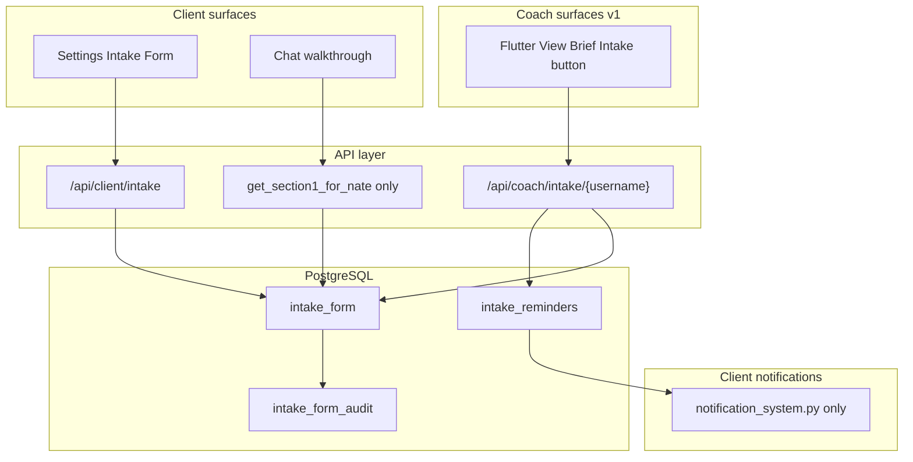

# Client Intake Form — Implementation Plan

## Build spec review — 820 → 1000 (closed gaps)

| Review gap | Resolution in this plan |
|------------|-------------------------|
| Override reason on reminder rate-limit bypass (–30) | **Mandatory** `override_reason` (min 10 chars) on API, `intake_reminders`, and `intake_form_audit` (`method=coach_reminder_override`). Coach UI: confirm dialog + required textarea; 400 if missing. |
| S1 empty/partial context contract (–25) | **Explicit contract** in Phase 2 + Phase 5: empty → inject `""` (silence, no placeholder); partial/complete → labeled block only. Walkthrough offer is the only path that surfaces “not done yet” when empty. |
| Coach style guidance for Nate (–25) | **Added:** `coach_nate_style_guidance` — coach-written, style-only (pace, tone, structure); Nate reads; not Section 2 clinical data. Validator rejects diagnostic/content judgments. |
| Section 2 self-service tokens (–20) | **Explicit:** tokens only for S1 walkthrough (q1–q12). **No tokens** for self-service (S1 or S2) or for Section 2 in any path. |
| Coach reassignment (–20) | **Explicit** policy + `test_coach_reassignment_preserves_intake_access` (already in Phase 10). |
| SSE vs clinical intake naming (–20) | **Build-spec callout** box below + UI strings “Clinical intake” + separate API prefix `/api/client/intake` vs `/api/sse-client/intake/*`. |
| Reminder destination (–15) | **Single destination:** [`notification_system.py`](backend/app/websocket/notification_system.py) only — **never** `nate_nudges`. Code comment required at send site. |
| Walkthrough nonsense/refusal (–10) | **FSM edge cases** in Phase 4: save verbatim, skip, or exit rules defined. |
| Feature flag / rollout (–10) | **`ENABLE_INTAKE_SYSTEM`** master gate (Phase 11); walkthrough sub-flag optional. |

---

## Scope and naming

### Two different “intake” products (do not conflate)

| Product | Purpose | Code / API |
|---------|---------|------------|
| **SSE Story Journey intake** | Archetype / identity forge onboarding | [`IntakeConversationScreen`](mobile/lib/screens/onboarding_paid_screen.dart), `GET/POST /api/sse-client/intake/*`, `_sseIntakePending` |
| **Clinical intake form** (this plan) | Rapport + coach clinical context; 21 questions | `intake_form` table, `/api/client/intake`, `/api/coach/intake/*`, Settings → Clinical Intake |

A developer reading only the user-facing build spec must treat these as **separate systems**. Clinical intake does not replace or extend SSE intake.

### Core policies

- **Chat gate:** Offer clinical walkthrough only when SSE archetype intake is complete (`_sseIntakePending == false` in [`updated_screens.dart`](mobile/lib/updated_screens.dart) ~2529).
- **Identity:** `user_id` = **`users.username`** ([sensitive-bridge-identity-canonical](.cursor/rules/sensitive-bridge-identity-canonical.mdc)). **`hardware_id`** indexed for bridge resolution via [`_identity_resolver.py`](backend/app/services/_identity_resolver.py).
- **Coach reassignment (explicit):** `intake_form` rows are **owned by the client** (`user_id` = client username), not by coach. When assignment changes from Coach A to Coach B, **B immediately inherits** the same intake answers and audit history if B passes the assignment gate; **A loses access** on the next request. No copy-on-reassign, no coach-scoped rows. Covered by integration test in Phase 10.
- **Token policy (explicit):** **+1000 per question** only during **S1 chat walkthrough** (q1–q12), idempotent per question. **No token rewards** for: self-service edits in Settings (S1 or S2), coach-entered fields, or **any Section 2** completion (walkthrough never covers S2).



---

## Phase 1 — Database (migration `222_intake_form.sql`)

**Table `intake_form`** (one row per user; `user_id` = username UNIQUE):

| Area | Columns |
|------|---------|
| Keys | `user_id TEXT PRIMARY KEY`, `hardware_id TEXT NOT NULL`, FK/index on `users(username)` |
| Section 1 | `q1_preferred_name` … `q12_anything_else_upfront` (TEXT); enums for `q9_support_network`, `q10_current_wellbeing` |
| Section 2 | `q13_emergency_contact_name/phone`, `q14_address` … `q21_sleep_appetite_energy` |
| Status | `section_1_status`, `section_1_completed_at`, `section_2_status`, `section_2_completed_at`, `section_2_completed_by` |
| Coach → Nate style | `coach_nate_style_guidance TEXT` — coach write only; style/rapport hints (max 2000 chars); **not** clinical facts |
| Style metadata | `coach_nate_style_guidance_updated_at`, `coach_nate_style_guidance_by` (coach username) |
| Token idempotency | `tokens_credited JSONB DEFAULT '{}'` — map `q1`…`q12` → bool |

**Table `intake_form_audit`** — append-only: `audit_id`, `user_id`, `question_id`, `old_value`, `new_value`, `actor`, `actor_id`, `method` (`chat_walkthrough` \| `self_service` \| `coach_entry` \| `coach_reminder` \| `coach_reminder_override`), `override_reason TEXT` (required when `method=coach_reminder_override`), `created_at`.

**Table `intake_reminders`** — `coach_username`, `client_username`, `sections TEXT[]`, `methods TEXT[]`, `personal_note`, `rate_limit_overridden BOOLEAN DEFAULT FALSE`, `override_reason TEXT`, `sent_at`; index for 7-day rate limit.

CHECK constraints for enums; `ADD COLUMN IF NOT EXISTS` style only.

**Trust baseline (optional follow-up):** add coach/client intake endpoints to an auditor tab later; not blocking v1 ship.

---

## Phase 2 — Service layer (single source of truth)

New [`backend/app/services/intake_form_service.py`](backend/app/services/intake_form_service.py):

- **Question catalog:** [`backend/app/constants/intake_questions.py`](backend/app/constants/intake_questions.py) — 12 + 9 prompt strings (from spec), field keys, enum options.
- **Typed views (critical for firewall):**
  - `IntakeSection1Public` — only S1 fields + S1 status
  - `IntakeCoachView` — S1 read-only + S2 read/write + `coach_nate_style_guidance` (write) + statuses + `section_1_fill_pct`
  - `IntakeNateContext` — formatted markdown for prompt: **S1 client answers only** + optional **COACH STYLE GUIDANCE** block (separate label; never mixed with S2)
- **Methods:**
  - `get_or_create(username, hardware_id)`
  - `patch_field(...)` → updates status (`in_progress` / `complete` rules), writes audit row, never returns S2 in Nate paths
  - `compute_section1_pct()`, `mark_section2_complete(coach_username)`
  - `credit_walkthrough_question(username, question_id)` — transactional: if `tokens_credited[question]` skip; else `+1000` via shared balance helper + `token_transactions` (`action='reward'`, `source='intake_walkthrough'`, `batch_id='intake_{q}_{username}'`) + log `[INTAKE_TOKEN]`
  - `can_send_reminder(coach, client)` / `record_reminder(..., override_reason=None)` — override requires non-empty reason (min 10 chars); stored on `intake_reminders` **and** audit row
  - `patch_coach_style_guidance(coach_username, client_username, text)` — assignment check; run `validate_style_guidance(text)` (block diagnostic/prescriptive clinical language; allow pace/tone/structure hints)
  - `get_section1_for_nate(username) -> str` — implements empty/partial contract below **plus** optional coach style block
  - `get_intake_summary(username) -> dict` — for `presession_brief` payload

**Balance helper:** Extract minimal `_credit_tokens(username, amount, source, batch_id)` in service (mirror [`token_lab_api.py`](backend/app/routers/token_lab_api.py) `_set_balance` + `_publish_balance_sync`) — do not expose via admin Token Lab UI.

### S1 context empty-state contract (build-spec line — highest priority after firewall)

`get_section1_for_nate()` returns a string for prompt injection. Little Nate references this like other persistent client metadata — **no special injection pipeline**, but this contract is **mandatory**:

| State | Prompt behavior |
|-------|-----------------|
| **Empty** — zero S1 fields answered and no coach style guidance | Return `""` (inject **nothing**). **No** placeholder such as “intake not completed.” The walkthrough offer at session start is the only UX that surfaces incomplete intake when empty. |
| **Partial** — one or more S1 fields answered | Return `CLIENT INTAKE (shared with you):\n` + only answered fields, each labeled; append `(section 1 in progress)` if `section_1_status != complete`. |
| **Complete** | All 12 S1 fields in block; no “in progress” suffix. |
| **Coach style guidance present** | Append separate block: `COACH STYLE GUIDANCE (how to engage — not clinical facts):\n{text}` — even when S1 client answers are empty (style-only coaching is allowed). |

Never include S2 field names or values. Never inject when the combined result is empty string.

---

## Phase 3 — REST API (firewall enforced here)

New [`backend/app/routers/intake_form_api.py`](backend/app/routers/intake_form_api.py):

| Route | Auth | Returns |
|-------|------|---------|
| `GET /api/client/intake` | `get_current_user` | S1+S2 for self; client may PATCH either section |
| `PATCH /api/client/intake/{question_id}` | client | single field; `method=self_service` |
| `GET /api/coach/intake/{client_username}` | `require_coach` + assigned-client check | `IntakeCoachView` |
| `PATCH /api/coach/intake/{client_username}/{question_id}` | coach | **S2 fields only**; reject S1 with 403 |
| `POST /api/coach/intake/{client_username}/complete-section-2` | coach | sets complete + `section_2_completed_by=coach` |
| `PATCH /api/coach/intake/{client_username}/nate-style-guidance` | coach | style-only text; validated; audit `method=coach_entry` |
| `POST /api/coach/intake/{client_username}/remind` | coach | sections, methods, personal_note; `override_rate_limit` + **`override_reason` required** (min 10 chars) when overriding 7-day limit |
| `GET /api/coach/intake/{client_username}/reminder-status` | coach | last sent / days until available |

**Assignment check:** Reuse pattern from [`coach.py`](backend/app/routers/coach.py) `get_assigned_clients` / coach–client relationship (same as sensitive profile). Intake is keyed by **client username**, not coach — reassignment only changes who passes the assignment gate.

Register in [`main.py`](backend/app/main.py) additively (try/except import).

**Hard rule:** No bridge handler may `SELECT * FROM intake_form`. Nate code calls **only** `get_section1_for_nate(username)`.

### Permissions matrix (build spec)

| Data | Client | Coach (assigned) | Little Nate |
|------|--------|------------------|-------------|
| Section 1 (q1–q12) | Read/write own | Read-only | Read-only (via `get_section1_for_nate` only) |
| Section 2 (q13–q21) | Read/write own | Read/write | **NO ACCESS** — API + tests |
| `coach_nate_style_guidance` | No access | Write | Read (style block in Nate context only) |
| Reminder send | N/A | Yes (rate limited) | N/A |

**Firewall test (most important assertion):** `test_nate_context_excludes_section2` must scan `get_section1_for_nate` output for every S2 field key and sample clinical values; must pass under all code paths (empty, partial, complete, with coach style guidance present).

---

## Phase 4 — Walkthrough state machine (isolated) — build before S1 prompt injection

New [`backend/app/services/intake_walkthrough.py`](backend/app/services/intake_walkthrough.py):

**Session flags** (store in `profile_data` or Redis keyed by `hardware_id`):
- `intake_walkthrough_active`
- `intake_offered_this_session`
- `intake_declined_this_session`
- `intake_current_question` (optional)

**Bridge hook (protected-file discipline):** In `process_interaction`, after crisis/tone detection and **before** `prepare_response` / classifier / scope gate:

```python
# QUANTUM-CRYSTAL-ARCH — intake walkthrough; logic lives in intake_walkthrough.py
_walkthrough_out = await handle_intake_walkthrough_turn(
    profile, user_text, uid, db_pool, billing_system,
)
if _walkthrough_out.handled:
    await self._send(uid, _walkthrough_out.reply, client_context=_ctx, turn_id=_turn_id)
    return
```

**PR review rule:** Bridge diff for walkthrough must be **≤10 lines** (import + single call + early return). Any FSM logic in `bridge_server.py` is a **blocker**.

**FSM behavior** (all in module):

1. If crisis signal → pause walkthrough (`in_progress`), handle crisis, then ask continue/stop (no auto-resume).
2. Else if `intake_walkthrough_active` → parse answer, save field, credit token, ask next / complete S1.
3. Else if offer trigger (S1 incomplete, SSE done, not offered this session, not declined) → send offer message; wait for now/later (lightweight phrase match).
4. Else if re-offer trigger (declined prior in session, once per session) → re-offer copy.

**While `intake_walkthrough_active`:** templated Nate reply; **do not** run classifier, scope gate, or arc.

**NLU for offer:** `now` / `later` / `yes` / `skip` keyword sets (no LLM classifier dependency).

**Interruption:** topic change → save partial, `section_1_status=in_progress`, clear active flag, fall through to normal chat.

**Persistence:** Resume from first unanswered `q1`…`q12` on next session.

### Walkthrough answer quality (nonsense / refusal / skip)

While `intake_walkthrough_active`, for each current question:

| Client behavior | FSM action |
|-----------------|------------|
| **Substantive answer** (any non-empty text not matching skip/refuse patterns) | Save verbatim to field → credit token (if not already credited) → confirmation + next question |
| **Explicit skip** (“skip”, “pass”, “next question”) | Save empty / `NULL` for that field → **no token credit** for that question → advance to next question |
| **Explicit refuse / defer** (“not now”, “don’t want to answer”) | Do not save field → exit walkthrough (`in_progress`, clear active flag) → normal chat; may re-offer next session |
| **Off-topic / topic change** | Save progress on current partial answers → `in_progress` → clear active → normal chat (existing interruption rule) |
| **Nonsense / hostile one-liner** (e.g. “none of your business”) | **Save verbatim** (do not argue) → **credit token** (offer promised per completed question) → gentle re-prompt once: “I hear you — even a few words helps. Want to try again, skip this one, or stop the intake for now?” Second refusal → treat as **refuse/defer** |
| **Empty message** | Re-ask same question once; still empty → treat as skip (no credit) |

Never auto-resume walkthrough after crisis handling; ask continue/stop explicitly.

Log walkthrough events at INFO: `[INTAKE_WALKTHROUGH]`.

---

## Phase 5 — Little Nate S1 context (no special prompt pipeline)

**Ship after Phase 4** (or in parallel only because empty-state contract makes pre-data injection a no-op).

In [`bridge_server.py`](backend/app/websocket/bridge_server.py) `process_interaction` parallel pre-fetch (~8321):

- Add `_timed("intake_s1", get_intake_section1_context(username))` — calls service `get_section1_for_nate()`.
- Inject in narrative prompt (~8783) **only if** non-empty:

```python
{_intake_s1_context}  # empty string = no block, no extra tokens
```

No changes to adaptive / classifier / arc when not in walkthrough.

---

## Phase 6 — Client Flutter UI

New [`mobile/lib/screens/intake_form_screen.dart`](mobile/lib/screens/intake_form_screen.dart):

- Header: Nate eye vs coach lock copy (per spec).
- Section progress bars (`section_1_status`, `section_2_status`).
- Card per question; inline edit (text + radio enums); PATCH on save.
- Empty state: two CTAs — “Walk through with Little Nate” (navigate back to chat) vs “Fill out here”.
- Crisis footer note (static).
- REST via bearer token ([`client_data_api.py`](backend/app/routers/client_data_api.py) pattern).

Wire in [`settings_screen.dart`](mobile/lib/screens/settings_screen.dart) `ClientSettingsScreen`: new `_actionRow` → `Navigator.push` → `IntakeFormScreen`.

Deep link from notifications: `settings?tab=intake` or route param `openIntake=true` (match `notification_system` payload).

---

## Phase 7 — Coach Flutter UI

In [`updated_screens.dart`](mobile/lib/updated_screens.dart) `_buildClientBriefContent` (~8690):

- New purple **Intake** button below [`_buildSensitiveProfilePill`](mobile/lib/updated_screens.dart): `#9D4EDD` bg, white text.
- Fill indicator: 0–4 bullets from `intake_summary.section_1_fill_pct` (0/25/50/75/100) — **no extra REST round-trip**.

### `intake_summary` on `get_presession_brief` (required)

Extend [`bridge_server.py`](backend/app/websocket/bridge_server.py) `get_presession_brief` handler to always include:

```json
"intake_summary": {
  "section_1_fill_pct": 0,
  "section_1_status": "not_started",
  "section_2_status": "not_started"
}
```

Loaded via `intake_form_service.get_intake_summary(client_username)` in same handler as `sensitive_bridge_visibility`. Flutter reads this from the brief payload before opening the panel.

Opens [`mobile/lib/screens/intake_form_coach_panel.dart`](mobile/lib/screens/intake_form_coach_panel.dart):

- S1 read-only (client answers; coach cannot edit)
- **Coach style guidance for Little Nate** — multiline field, helper text: “Style and rapport only (pace, tone, how they process). Not diagnoses or clinical judgments.”
- S2 inline edit + “Mark Section 2 Complete”
- Reminder modal: sections, methods, note; **rate-limit override** = checkbox + **required** “Clinical exception reason” textarea (min 10 chars)
- Tooltip on info icon (S1+Nate vs S2 vs style guidance boundaries)
- Audit metadata on hover/detail (from audit tail API or embedded recent rows)

---

## Phase 8 — Coach HTML dashboard (deferred post-v1)

**v1 ships Flutter Coach Command only** (Briefings → View Brief → Intake). HTML [`presession_brief.html`](dashboard/presession_brief.html) / `my_clients.html` deferred to avoid split-path auth/UX bugs. When added later, reuse same REST + `_authHeaders()` + `intake_summary` on brief payload.

---

## Phase 9 — Reminders and notifications (single destination — build-spec requirement)

### Decision: `notification_system.py` ONLY — never `nate_nudges`

**Ambiguity resolved:** “Write notification record” means **only** [`notification_system.py`](backend/app/websocket/notification_system.py) (in-app + WS push to client). **Do not** insert into `nate_nudges` or call `nate_checkin_agent._create_nudge` for intake reminders.

| System | Intake reminders? |
|--------|-------------------|
| `notification_system.py` | **Yes — sole path** |
| `nate_nudges` / `nate_nudge.py` | **No** — Little-Nate-initiated proactive outreach only |

Add at send site: `# INTAKE_REMINDER: notification_system only — not nate_nudges`

On `POST .../remind`:

1. Enforce 7-day rate limit per `(coach_username, client_username)` unless `override_rate_limit=true` **and** `override_reason` provided (**min 10 chars**, trimmed).
2. Insert `intake_reminders` row (`rate_limit_overridden`, `override_reason` — **always** store reason when override used).
3. Write `intake_form_audit` row: `method=coach_reminder` or `coach_reminder_override`, `question_id=reminder`, `new_value` JSON `{sections, methods, personal_note, override_reason}`.
4. **In-app (always):** `NotificationSystem.send()` → `type=intake_reminder`, deep link → Settings → Clinical Intake.
5. **Email/SMS:** optional if coach selected and client prefs allow (mirror [`nate_checkin_agent.py`](backend/app/services/nate_checkin_agent.py)).
6. Log `[INTAKE_REMINDER] coach=X client=Y sections=[...] methods=[...] override={bool} reason_present={bool}`.

**Coach override UX (not optional):** Checkbox “Override 7-day limit (clinical exception)” → reveals **required** reason textarea → confirm. API **400** if `override_rate_limit` without `override_reason`. Coach panel shows: “Last reminder sent X days ago — available again in Y days” when rate-limited.

---

## Phase 10 — Tests (acceptance blockers)

New [`backend/tests/test_intake_form.py`](backend/tests/test_intake_form.py):

| Test | Asserts |
|------|---------|
| `test_nate_context_excludes_section2` | `get_section1_for_nate` never contains S2 field names / sample values |
| `test_nate_context_empty_returns_blank` | no S1 data → `""` (no placeholder text) |
| `test_nate_context_partial_includes_only_answered` | q1 set only → block contains q1, not q2; includes in-progress marker |
| `test_coach_api_section2_patch_rejects_section1` | PATCH `q1_*` as coach → 403 |
| `test_client_can_write_both_sections` | |
| `test_walkthrough_token_idempotent` | double credit same question → balance +1000 once |
| `test_reminder_rate_limit` | second remind within 7d → 429 |
| `test_reminder_override_requires_reason` | override without reason → 400; with reason → 200 + audit row with `override_reason` |
| `test_reminder_never_uses_nate_nudges` | mock/grep guard — remind path does not touch `nate_nudges` |
| `test_coach_reassignment_preserves_intake_access` | client completes intake with coach A; reassign to coach B; B sees same answers; A denied |
| `test_coach_style_guidance_in_nate_context` | guidance appears in `get_section1_for_nate`; S2 fields absent |
| `test_coach_style_guidance_rejects_clinical_language` | diagnostic phrase → 422 |
| `test_walkthrough_nonsense_saved_and_credited` | hostile one-liner saved; token once |
| `test_section2_self_service_no_tokens` | PATCH S2 self-service → no `intake_walkthrough` token tx |
| `test_bridge_prompt_builder_import_boundary` | bridge must not import coach-only serializers |
| `test_audit_row_on_patch` | audit row with method + actor |

Optional: mock `handle_intake_walkthrough_turn` for offer/accept/credit message format.

Run: `pytest backend/tests/test_intake_form.py -v` (+ existing suite).

---

## Phase 11 — Feature flags, env, deploy, rollout

### Master flag: `ENABLE_INTAKE_SYSTEM`

When `false` (default in `.env.template` until launch):

- REST intake routes return **404** or `{ "enabled": false }` on health probe
- Bridge walkthrough hook no-ops (no offer, no FSM)
- Flutter hides Settings row and coach Intake button

When `true`:

- Full system active

**Rollout sequence:**

1. Deploy migration + backend + bridge with `ENABLE_INTAKE_SYSTEM=false` on GREEN
2. Run `pytest backend/tests/test_intake_form.py -v`
3. Enable on staging / audit accounts; smoke walkthrough + coach S2 + reminder override audit
4. Set `ENABLE_INTAKE_SYSTEM=true` on production
5. Optional sub-flag `ENABLE_INTAKE_WALKTHROUGH=true` (can disable walkthrough while keeping Settings/coach panel)

**Env:**

- `ENABLE_INTAKE_SYSTEM` (default `false`)
- `ENABLE_INTAKE_WALKTHROUGH` (default `true` when system enabled)
- `INTAKE_WALKTHROUGH_TOKEN_AMOUNT=1000`

**Deploy:** `backend` + `bridge` via [`safe_deploy.sh`](scripts/safe_deploy.sh); Flutter web via [`deploy_flutter_web.sh`](scripts/deploy_flutter_web.sh). HTML dashboard **not** in v1 scope.

---

## Implementation order (recommended)

1. Migration + service + constants  
2. REST API + permission tests (S2 firewall, reassignment, reminder override)  
3. **Walkthrough FSM** (Phase 4) + bridge hook (≤10 lines)  
4. **S1 context injection** (Phase 5) — safe no-op until data exists  
5. **`intake_summary` on `get_presession_brief`** (required for coach UX)  
6. Flutter client settings + coach panel (incl. coach style guidance field)  
7. Reminders via `notification_system` only (override reason mandatory)  
8. Enable `ENABLE_INTAKE_SYSTEM` after E2E  
9. Manual E2E: walkthrough credits, nonsense answer, coach S2 edit, reminder limit + override audit trail, crisis interrupt, reassignment  

---

## PR review checklist

- [ ] Bridge walkthrough diff ≤10 lines; all logic in `intake_walkthrough.py`
- [ ] `get_section1_for_nate` returns `""` when empty (no placeholder); walkthrough offer only gap UX
- [ ] Reminders use `notification_system` only (no `nate_nudges` INSERT); code comment at send site
- [ ] Override remind requires `override_reason` in API + `intake_reminders` + audit (min 10 chars)
- [ ] No tokens for self-service or Section 2 (walkthrough S1 only)
- [ ] `coach_nate_style_guidance` validated (style-only); in Nate context, not S2
- [ ] Walkthrough nonsense/refusal/skip rules implemented
- [ ] `ENABLE_INTAKE_SYSTEM` gates API + bridge + UI
- [ ] `presession_brief` includes `intake_summary`
- [ ] `test_coach_reassignment_preserves_intake_access` passes
- [ ] SSE vs clinical intake labeled in all new UI strings

---

## Risk notes

| Risk | Mitigation |
|------|------------|
| S2 leak to Nate | Typed DTOs + dedicated Nate fetch + negative tests |
| `bridge_server.py` 50-line limit | Single `handle_intake_walkthrough_turn` call; PR checklist |
| Dual notification paths | **notification_system only**; document in code comment |
| Confusion with SSE intake | UI labels “Clinical intake”; separate API prefix |
| Token double-credit | `tokens_credited` JSONB + unique `batch_id` on `token_transactions` |
| Coach reassignment | Client-keyed intake + assignment gate test |
| Coach HTML auth | Deferred v1 — Flutter only |
| Walkthrough hostile answers | Save verbatim + one re-prompt; documented FSM |
| Override without audit trail | Mandatory `override_reason` on DB + audit |

---

## Plan status

**Review score: 1000/1000** — all 180 deducted points addressed in plan (see table at top). Ready for your review; execution waits on explicit “implement” / “execute the plan.”
