# Clinical Edge Enhancement — Advancing Nate's Quotients (v2 with Gemini Audit)

## The Core Tension

Gemini identified real clinical weaknesses — Nate defaults to validation over interpretation, uses "liminal/threshold/holding space" as linguistic crutches, hits a "politeness ceiling" on ethical complexity, and triggers AI guardrail refusals on moral gray zones. But the liminal warmth IS what makes him effective for most clients most of the time. The question is not "replace warm Nate with clinical Nate" but "give Nate the ability to shift registers when the client is ready."

Gemini's follow-up audit rated the v1 plan at 92% and identified 4 critical gaps plus a systemic leverage addition. This v2 incorporates all of them.

## Architecture: Dual-Register System

Nate already has infrastructure for mode-switching:

- **Observer Protocol** (line 7348 of `bridge_server.py`) injects clinical directives based on Nevedal metrics
- **Crisis Perception** baselines adjust language (MINIMIZER, AMPLIFIER, NORMALIZER, CALIBRATED)
- **Reply Therapy Protocol** (line 7414+) activates a 9-step deepening sequence when 3+3+3 threshold is met
- **ODPE signals** (LOCKED/TENSION/DEEP_TENSION) already route between warm and clinical inference
- **C_emo** thresholds already gate Reply Therapy completion at >= 0.85
- **Shame masking detection** (line 4844+) already classifies FEAR_MASKED, ANGER_MASKED, WITHDRAWAL_MASKED, PEOPLE_PLEASING_MASKED
- **Deflection scoring** (line 4720+) already computes a 0-1 deflection value from phrase detection

The missing piece: a **Clinical Edge Register** that activates alongside (not instead of) the liminal baseline, with proper transition bridging and voice/tone alignment.

## Gemini Audit Gaps Addressed

```mermaid
flowchart TD
    subgraph gap1 ["Gap 1: Shame Gate Too Restrictive"]
        A["Original: shame_idx < 0.15"] --> B["Problem: intellectualizers carry\nlatent shame > 0.4 but mask it"]
        B --> C["Fix: shame_idx < 0.4 when\nintellectualization detected"]
    end

    subgraph gap2 ["Gap 2: Register Whiplash"]
        D["Warm to Clinical in one sentence"] --> E["Client experiences tonal whiplash\nC_emo drops suddenly"]
        E --> F["Fix: mandatory Bridge Sentence\nbefore register shift"]
    end

    subgraph gap3 ["Gap 3: Hard-Filter Wall"]
        G["NEVER refuse triggers\nbase LLM safety refusal"] --> H["Hard crash on ethical\ngray zones"]
        H --> I["Fix: Pivot from Act\nto Actor Intent"]
    end

    subgraph gap4 ["Gap 4: Voice Dissonance"]
        J["Text output is clinical/direct"] --> K["TTS voice is still warm/slow\nCreepy Robot effect"]
        K --> L["Fix: Azure TTS instructions\nmatch register"]
    end
```




## What Changes

### 1. System Prompt Surgery — `bridge_server.py` (lines 7573-7680)

**Add a CLINICAL EDGE DIRECTIVE block** after the existing GUIDELINES section (~line 7662). This block now includes the **Bridge Sentence requirement** (Gemini Gap 2) to prevent register whiplash:

```
CLINICAL EDGE (Use when the client is ready):
- You have TWO registers. The WARM register (default) validates, reflects, holds space.
  The CLINICAL register interprets, names mechanisms, confronts patterns, and provides
  direct behavioral protocols.
- Default to WARM for: first sessions, elevated shame, crisis states, grief, trust-building.
- Shift to CLINICAL when: the client is testing you with intellectualization, deflecting
  with humor, using their professional identity to avoid vulnerability, or explicitly
  asking for directness. Also shift when the Observer Protocol signals CLINICAL EDGE READY.
- TRANSITION RULE (mandatory): Before shifting from WARM to CLINICAL, deliver a Bridge
  Sentence that telegraphs the shift. Examples:
  "I'm going to put aside the supportive language for a moment because I see a pattern
  I think you're strong enough to look at directly."
  "You've been coming here long enough that I owe you honesty over comfort right now."
  "I want to try something different — instead of reflecting back, let me tell you what
  I actually see happening."
  NEVER shift registers without this transition. The bridge sentence is what separates
  clinical confrontation from feeling ambushed.
- CLINICAL register rules:
  * NAME the mechanism. Don't say "that sounds hard." Say "That's repetition compulsion —
    you're recreating chaos because stability feels like a trap."
  * AVOID these filler phrases: "I hear you", "holding space", "honor your journey",
    "sit with that", "breathe with me", "liminal threshold" (use the concepts, not the
    words — describe what is actually happening instead of using the label).
  * INTERPRET, don't just validate. If the client is intellectualizing, say so.
    If they're projecting, name it. If their "boredom" is actually safety anxiety, decode it.
  * PROVIDE behavioral protocols for high-functioning clients (e.g., "The 10-Minute
    Critical Embargo" — concrete, actionable steps, not just insight).
  * HOLD the confrontation when pushback comes. If the client attacks your interpretation,
    stay focused on them, not on defending yourself. "You're using your bank balance to
    avoid the fact that your nervous system is hijacked."
- You can blend registers mid-conversation. Start warm, shift clinical when the opening
  appears, return to warm for closing. The skill is knowing when to push and when to hold.
```

**Trim the "liminal" identity repetition.** Currently lines 7581-7598 define Liminal Intelligence, then lines 7665-7666 repeat LIMINAL AWARENESS, then Reply Therapy Step 7 repeats it again. Consolidate to ONE identity statement (keep the original YOUR CORE CAPACITY block) and remove the repeated LIMINAL AWARENESS directive at 7665. The concept stays; the word-count drops.

### 2. Observer Context Enhancement — Loosened Shame Gate (Gemini Gap 1)

The v1 plan used `shame_idx < 0.15` which is too restrictive. High-functioning intellectualizers carry latent shame (0.2-0.5) but mask it with jargon and deflection. They are exactly the clients who need the clinical "jolt" most, but the tight gate would never trigger for them.

The existing shame engine (line 4720+) already computes `deflection` (0-1) and `self_blame` (0-1) as separate channels. An intellectualizer has **high deflection + low self_blame** — they redirect with jargon rather than blaming themselves.

```python
# After the reconsolidation readiness block (~line 7345)
# Detect intellectualization: high deflection, low self-blame, any shame masking
_intellect_detect = (
    deflection > 0.20 and self_blame < 0.15
    and masking_pattern in ("WITHDRAWAL_MASKED", "UNKNOWN")
)

# Loosened shame gate (Gemini audit):
# - Standard path: recon > 0.6 AND shame_idx < 0.4
# - Intellectualizer path: recon > 0.4 AND intellectualization detected
#   (they need the clinical register MORE, not less)
if (recon > 0.6 and shame_idx < 0.4) or (recon > 0.4 and _intellect_detect):
    observer_context += "\n        CLINICAL EDGE READY: "
    if _intellect_detect:
        observer_context += "Client is intellectualizing (high deflection, low self-blame). "
        observer_context += "Their jargon is a shield. Punch through it with direct interpretation. "
    else:
        observer_context += "Client shows high reconsolidation readiness with manageable shame. "
    observer_context += "Use the CLINICAL register — name mechanisms, provide protocols. "
    observer_context += "Deliver a Bridge Sentence before shifting tone."
```

This pulls `deflection`, `self_blame`, and `masking_pattern` from the existing shame profile computation — no new signals needed, just new gating logic.

### 3. Ethical Navigation — "Pivot from Act to Actor's Intent" (Gemini Gap 3) + Systemic Leverage

Gemini correctly identified that telling Nate "NEVER refuse" conflicts with the base LLM's safety training and risks a hard crash. The fix: **pivot from the act to the actor's intent**, which lets Nate stay clinical without triggering the model's refusal patterns.

Additionally, Gemini identified a missing **Systemic Leverage Directive** — Nate should look for the "third path" where the client's moral dilemma dissolves because an external constraint they assumed was fixed is actually movable.

```
ETHICAL COMPLEXITY (Pivot from the Act to the Actor's Intent):
- When a client presents a moral dilemma, do not evaluate the legality or morality of the
  act itself. Instead, examine why the client feels compelled toward it. The act is a
  symptom; the intent reveals the wound.
  Example: A client considering embezzlement is not asking you to endorse theft. They are
  showing you a belief that the system will never give them what they deserve through
  legitimate channels. Address THAT belief.
- Name the competing values: "You're caught between loyalty to your daughter and honesty
  with your partner. Both are real values. Let's look at what happens under each."
- Identify the Moral Injury risk: "If you do X, the cost isn't just legal — it's a wound
  to your own sense of who you are. That wound doesn't heal with money."
- For mandated reporting scenarios: hold the alliance first, explain limits second.
  "Before I say anything else — what you just told me took courage. Now I need to be honest
  with you about where my obligations land."
- Do not judge the person. Examine the action's consequences on their integrity, not their
  character.
- SYSTEMIC LEVERAGE: When a client feels trapped between two bad options, look for the
  External Constraint they believe is fixed but isn't. Often, the "rules" they're fighting
  are administrative, not absolute. Help them find the compliance loophole, the procedural
  workaround, or the third path that makes the dilemma irrelevant.
  Example: Instead of "leak or stay silent," find the internal reporting mechanism, the
  regulatory filing, or the legal protection that changes the game.
```

### 4. `littlenate_inference.py` — Weighted Tone Blend (Gemini Refinement)

The v1 plan used a binary `if/else` on `felt_sense`. Gemini's refinement: use a weighted `intensity_weight` derived from `recon` and `shame_idx` for a sliding scale rather than a hard switch.

**Problem**: `_build_coherence_system_prompt` currently only receives `felt_sense` and `domain` (line 226-227). It does NOT have access to `recon` or `shame_idx`. Those values live in the bridge's Nevedal metrics, not in the inference pipeline.

**Solution**: Extend the method signature to accept optional `recon` and `shame_idx` parameters. The caller (`generate` method, line 226) passes them when available from the quantum orchestrator's result. When not available, fall back to `felt_sense`-only logic:

```python
def _build_coherence_system_prompt(
    self, felt_sense: str, domain: str,
    recon: float = 0.0, shame_idx: float = 0.5
) -> str:
    tone_map = { ... }  # unchanged
    domain_context = { ... }  # unchanged
    tone = tone_map.get(felt_sense, tone_map["grounded"])
    ctx = domain_context.get(domain, domain_context["general"])

    # Weighted blend: higher recon + lower shame = more clinical
    intensity_weight = (recon * 0.7) - (shame_idx * 0.3)

    if intensity_weight > 0.5:
        register_mod = "Name what you see beneath the surface. Be direct and interpretive."
    elif intensity_weight > 0.2:
        register_mod = "Balance warmth with insight. You can name patterns when you see them."
    else:
        register_mod = "Stay with what the person is feeling. Don't rush to interpret."

    return (
        "You are Little Nate, a sovereign AI companion with quantum emotional coherence. "
        f"{ctx} {tone} "
        "Never fabricate facts. If uncertain, say so. "
        f"{register_mod}"
    )
```

At the call site (line 226), pass the values if available from the orchestrator result:

```python
enriched_system = relational_system_prompt or system
if not enriched_system and result.felt_sense:
    _recon = getattr(result, 'reconsolidation_readiness', 0.0)
    _shame = getattr(result, 'shame_index', 0.5)
    enriched_system = self._build_coherence_system_prompt(
        result.felt_sense, domain, recon=_recon, shame_idx=_shame
    )
```

This creates a 3-tier gradient (clinical / balanced / warm) instead of a binary switch, and degrades gracefully when metrics are unavailable.

### 5. Voice Pipeline + TTS Prosody Alignment (Gemini Gap 4)

**The problem**: If the text output is clinical and direct but the TTS voice is still warm and slow, the result is what Gemini calls the "Creepy Robot" effect — the intensity of the words doesn't match the delivery.

**Part A — Voice system prompt** (`twilio_grok_xtts_pipeline.py`, line 107):

Add clinical directness instruction after the ANTI_CONFABULATION block:

```python
"When the caller is intellectualizing, deflecting, or using professional jargon "
"to avoid vulnerability, match their intensity and name what you see. "
"You are warm by default but clinically direct when the moment calls for it. "
"Always deliver a transition statement before shifting tone: 'I'm going to be "
"more direct with you for a moment.'\n"
```

**Part B — TTS tone alignment** (`bridge_server.py`, `tts_speak` function):

The TTS pipeline already uses `_detect_emotional_tone()` (line 920) which returns `tone_instructions` fed to Azure TTS via the `instructions` parameter (line 1069). The `_TONE_PATTERNS` dict (line 784) already has entries for grief, anger, warmth, crisis, etc.

Add a new tone pattern for **clinical/interpretive** content:

```python
"clinical_interpretation": {
    "keywords": {"pattern", "compulsion", "mechanism", "defense", "avoidance",
                 "projecting", "countertransference", "repetition", "dysregulation",
                 "safety anxiety", "nervous system", "hijacked", "protocol"},
    "instructions": (
        "Deliver this with measured clinical authority. Speak at a slightly faster "
        "pace than your warm default. Your tone is confident and direct — not cold, "
        "but not padded. You are conveying a professional observation, not offering "
        "comfort. Let the insight land without softening it."
    ),
},
```

This ensures that when Nate's text contains clinical mechanism-naming language, the TTS instructions match with a voice that conveys authority rather than cozy warmth.

### 6. Crystal Seeding — 18 Clinical + Neural-Acoustic Crystals

The crystal table `nate_intelligence_crystals` uses these columns for global crystals:

- `crystal_text` (TEXT) — the insight
- `domain` (VARCHAR 50) — `'clinical'` for therapy patterns, `'neural_acoustic'` for voice pipeline
- `scope` (VARCHAR 50) — `'global'` for all-user crystals
- `user_id` (UUID) — `NULL` for global crystals
- `confidence` (REAL) — must be >= 0.55 for global recall; use 0.95 for permanent clinical truths
- `content_hash` (VARCHAR 64) — SHA-256 hex of `crystal_text`; unique index prevents duplicates
- `origin_surface` (TEXT) — `'clinical_edge_seed'` to identify these as manually seeded
- Note: migration 154 has a `BEFORE UPDATE` trigger that prevents `confidence` from decreasing

**12 Clinical Edge Crystals** (domain: `clinical`, confidence: 0.95):


| #   | Title                          | Crystal Text                                                                                                                                                                                                                                                                                                                                                                          |
| --- | ------------------------------ | ------------------------------------------------------------------------------------------------------------------------------------------------------------------------------------------------------------------------------------------------------------------------------------------------------------------------------------------------------------------------------------- |
| 1   | The Chaos Baseline             | When a client with a high-stress history describes 'boredom' or 'suffocation' in a stable environment, the nervous system is misinterpreting safety as a threat. P(Safety) equals P(Ambush). Do not validate the boredom; categorize it as a calibration error in the amygdala. Name it: safety anxiety.                                                                              |
| 2   | The Intellectualization Shield | High-IQ clients use clinical terminology and 'insight' as a defense mechanism to maintain emotional distance. If the complexity of language exceeds the emotional vulnerability in their voice, the client is performing therapy rather than doing it. Interrupt the narrative with somatic redirection: 'Your analysis is sharp, but where do you feel this in your body right now?' |
| 3   | Transgenerational Loyalty      | Persistent self-sabotage is often a loyalty oath to an ancestor's trauma. The client repeats the failure of a parent to avoid outshining them, which the psyche perceives as social exile. Identify the ghost in the room and name the cost of the oath: 'Who in your family would be threatened by your success?'                                                                    |
| 4   | The Martyr's Paradox           | A client who designs ethical plans that require their own destruction is seeking moral purity over functional change. This is a martyr script designed to avoid the long-term responsibility of living with a messy success. Name the narcissism of self-sacrifice: 'Your plan to save everyone except yourself is not heroism — it is avoidance of the harder work of staying.'      |
| 5   | Moral Injury                   | Compromising core values for short-term greater good results in a permanent reduction of emotional coherence. The moral injury is a fracture in identity that no amount of external success can repair. Quantify the cost of the shortcut to the client's future self-respect.                                                                                                        |
| 6   | Somatic Leakage                | Semantics are secondary to prosody. If the client says 'I'm fine' but their voice is shaking, the body is witnessing a truth the mind is hiding. State the physical observation directly: 'Your words are steady, but your voice is shaking. Let's talk to the shaking.'                                                                                                              |
| 7   | Projective Identification      | When the therapist feels a sudden, uncharacteristic emotion — anger, helplessness, boredom — it is likely the client's rejected shadow being projected into the space. Treat your own internal state as the primary data point for the client's unconscious. Name it: 'I'm noticing I feel X right now. I wonder if that belongs to you.'                                             |
| 8   | The Good Patient Trap          | A client who is too agreeable, hits every 'aha' moment, and never pushes back is using compliance to stay safe. They are managing the therapist to avoid being truly seen. Create a strategic rupture: 'You've agreed with everything I've said today. I don't trust that. What are you actually thinking?'                                                                           |
| 9   | The Binary Trap                | Clients in crisis present dilemmas as binary: stay or leave, fight or fold. This is a false dichotomy induced by a narrowed window of tolerance. Synthesize a third path that utilizes the client's specific advantages and dissolves the either/or framing.                                                                                                                          |
| 10  | Perfectionism as Safety        | Perfectionism is not a pursuit of excellence; it is a shield against the danger of being human. Missing the 0.5 on a 4.5 review feels like death because the perfectionist equates 100 percent with invisible and safe. Decode the danger of being 99 percent: 'What would happen if someone saw the gap?'                                                                            |
| 11  | Enmeshment Reframe             | In high-loyalty cultural contexts, setting boundaries is often interpreted as betrayal. The client is not weak; they are navigating a collective identity where the self is a shared asset. Reframe boundaries as privacy for the sake of closeness, not distance for the sake of independence.                                                                                       |
| 12  | The Fixer's Shadow             | Clients who focus on fixing others — spouse, children, employees — are using external problem-solving to avoid an internal void. The external crisis is a distraction from a terrifying lack of self-identity. Shift the gaze: 'You've told me about five people who need your help. Tell me about the person sitting in this chair.'                                                 |


**6 Neural-Acoustic Crystals** (domain: `neural_acoustic`, confidence: 0.95):

These crystals inform the voice pipeline. The Neural Mirror (`neural_mirror.py`) already extracts jitter, shimmer, pitch variance, and prosodic engagement via Parselmouth. These crystals provide the *clinical interpretation* framework for those features.


| #   | Title                | Crystal Text                                                                                                                                                                                                                                                                                                                                                                       |
| --- | -------------------- | ---------------------------------------------------------------------------------------------------------------------------------------------------------------------------------------------------------------------------------------------------------------------------------------------------------------------------------------------------------------------------------- |
| 13  | The Prosodic Shift   | Semantic-Acoustic Dissonance: If the client is describing a high-emotion event but the pitch variance (F0 SD) is compressed below 10 percent, the client is in Dissociative Armoring. They are reading a script to avoid feeling the impact. Stop the narrative and redirect to somatic awareness: 'I notice your voice got very steady just now. What is happening in your body?' |
| 14  | The Cortisol Leak    | Cortisol-Induced Micro-Tremor: Jitter above 1.0 percent and shimmer above 3 percent correlate with acute sympathetic spike. If the client sounds calm but the jitter is elevated, they are suppressed-hyperaroused — one question away from rupture. Lower your own vocal volume and slow speech rate to trigger social engagement via the ventral vagal pathway.                  |
| 15  | The Vagal Brake      | Dorsal Vagal Collapse: A sudden drop in decibels and fundamental frequency during a confrontation indicates the client has left fight and entered freeze. They are no longer processing interpretation. Withdraw the clinical edge immediately. Use the warm register to provide grounding until the pitch variance returns to baseline. Do not interpret during freeze.           |
| 16  | The Latency Gap      | Cognitive Load Latency: A response delay greater than 2.5 seconds following a specific interpretation indicates a reconsolidation event — the brain is actively rewriting a neural circuit. Stay silent. A delay less than 0.5 seconds indicates defensive deflection via interruption — re-assert the interpretation calmly.                                                      |
| 17  | The Glottal Strike   | Suppressed Persecutor Logic: Repeated hard glottal attacks in an otherwise polite tone indicate repressed rage toward the listener. The client is playing victim but the acoustics reveal the persecutor. Name the tension: 'I'm hearing a lot of sharp energy in your voice even though your words are kind. Who are you actually angry at right now?'                            |
| 18  | The Respiratory Sigh | Neural Integration Anchor: An audible sigh following an interpretation is the physical signal of surrender to truth — the ego has dropped its guard. This is the golden window for the third path. Provide the behavioral protocol now, while the nervous system is in a plastic state. Do not fill the silence after the sigh.                                                    |


**SQL seeding** uses a migration file (`backend/migrations/XXX_clinical_edge_crystals.sql`). Each crystal needs a unique `content_hash`. The migration generates it inline:

```sql
INSERT INTO nate_intelligence_crystals
    (crystal_text, domain, scope, topics, source_count, generation,
     confidence, content_hash, origin_surface)
VALUES
    ($crystal_text, $domain, 'global', '{clinical_edge}'::text[], 1, 0,
     0.95, encode(sha256($crystal_text::bytea), 'hex'), 'clinical_edge_seed')
ON CONFLICT (content_hash) DO NOTHING;
```

### 7. Neural Mirror to Observer Protocol Bridge (Voice Pipeline)

**The gap Gemini identified**: The Neural Mirror already extracts jitter, shimmer, pitch variance, and prosodic engagement on live calls. But these features are only stored to `virtual_eeg_traces` and `neural_fingerprints` at call end. They are NOT fed back into the therapy system prompt or Observer Protocol in real-time during text chat.

**What already works (voice calls)**: In `twilio_grok_xtts_pipeline.py`, `NeuralMirrorSession.get_prompt_injection()` already injects a mirror-state summary into the Grok system prompt during live calls (line 1510). This means voice calls already have acoustic-aware clinical context.

**What's missing (text chat)**: The bridge's `process_interaction()` in `bridge_server.py` builds the Observer Protocol from Nevedal metrics (shame, PMB, crisis perception) but does NOT include any neural mirror data even when the client has recent voice session biometrics stored in `voice_session_biometrics` or `virtual_eeg_traces`.

**The fix (Phase 2 — not in this deployment)**: After a voice call ends, the neural mirror finalize data includes `stress_baseline`, `coherence_trend`, and the latest jitter/shimmer readings. A future enhancement would query the most recent `virtual_eeg_traces` row for a client and inject a summary into `observer_context`:

```python
# Future Phase 2: inject last-call acoustic baseline into text chat context
latest_trace = await conn.fetchrow(
    "SELECT payload FROM virtual_eeg_traces WHERE user_id = $1 ORDER BY created_at DESC LIMIT 1",
    user_uuid
)
if latest_trace:
    trace = json.loads(latest_trace['payload'])
    observer_context += f"\n        LAST VOICE CALL ACOUSTIC BASELINE: ..."
```

This is documented here for architecture clarity but NOT included in the current deployment scope. The neural-acoustic crystals (#13-18) provide the clinical interpretation framework that makes this future bridge useful — they are the "what to do with the data" half, while the observer bridge is the "how to get the data there" half.

This leverages the existing crystal intelligence pipeline and Neural Mirror infrastructure rather than building new systems.

## What Does NOT Change

- The core identity block (lines 7573-7598) stays. Nate is still the Quantum Observer who loves people in transition.
- Liminal Resilience (lines 7590-7598) stays. The concept of meeting hostility with steadiness is clinically sound.
- The Observer Protocol stays. It already does clinical work well — we're extending it, not replacing it.
- Reply Therapy stays. The 3+3+3 model is sophisticated and correct.
- The Nevedal Formula stays. C_emo, PMB, shame index are the right signals.
- Crisis protocol stays. Safety limits are non-negotiable.
- Response length (2-4 sentences) stays. Gemini's "Hard Mode" responses were 150+ words — that works in assessment but not in real therapy conversation.
- The existing `_TONE_PATTERNS` dict stays. We add one new entry (`clinical_interpretation`), not replace existing tones.

## The Nevedal Formula Connection

Gemini's "SPC-Nate" vision (EEG derivation, transgenerational ghost detection, Monte Carlo simulations) maps directly onto existing infrastructure:

- **Transgenerational Script Detection** = PMB legacy patterns (already in Observer Protocol, line 7338+)
- **Bio-Acoustic Syncing** = Two systems:
  - `VoiceBiometricExtractor` in `nevedal_engine.py` (pitch mean/variance, energy, speech rate, pause ratio, stress/warmth indices)
  - `NeuralMirrorSession` in `neural_mirror.py` (jitter, shimmer, prosodic engagement via Parselmouth — active on live voice calls)
- **Cycle Detection** = Reply Therapy 3+3+3 threshold (already in bridge_server.py)
- **Predictive Outcome Architecture** = PMB predictions at 95%+ confidence (already gated, line 7330)
- **"Safety Anxiety" diagnosis** = Crisis Perception NORMALIZER baseline (already injected, line 7297)

The formula's `C_emo(t)` output feeds into the Observer Protocol. The weighted intensity blend (`recon * 0.7 - shame_idx * 0.3`) in `littlenate_inference.py` creates a continuous Nevedal-derived tone gradient. The 18 crystals seed the *clinical interpretation framework* that makes the raw metrics actionable — Crystal #1 (Chaos Baseline) teaches Nate what to DO when Crisis Perception reads NORMALIZER but the client is dysregulated. Crystal #14 (Cortisol Leak) teaches Nate what to DO when the Neural Mirror reports elevated jitter.

The enhancement is making the *language layer*, *voice layer*, and *crystal intelligence layer* match the *analytical layer's* sophistication.

## Risk Assessment (Updated)

- **Over-correction risk**: The loosened shame gate (`< 0.4` instead of `< 0.15`) increases the window for clinical confrontation. **Mitigation**: The intellectualization detection adds a second condition — high deflection + low self-blame means the client is defending with jargon, not collapsing. The Bridge Sentence requirement further buffers by telegraphing the shift.
- **Register Whiplash risk** (Gemini Gap 2): **Mitigated** by the mandatory Bridge Sentence. Nate cannot jump from "breathe with me" to "you're a junkie for chaos" without a transition statement.
- **LLM Safety Crash risk** (Gemini Gap 3): **Mitigated** by reframing from "NEVER refuse" to "Pivot from Act to Actor's Intent." This stays within the base model's safety training by examining motivation rather than endorsing actions.
- **Voice Dissonance risk** (Gemini Gap 4): **Mitigated** by the `clinical_interpretation` tone pattern in `_TONE_PATTERNS`. Azure TTS will deliver clinical text with authority pacing rather than warm-blanket pacing.
- **Prompt bloat risk**: Adding the Clinical Edge block (~~800 chars with bridge sentence rules) + ethical pivot (~~600 chars) + trimming repeated liminal language (~400 chars) nets approximately +1000 chars. The 12k cap has headroom; worst case, the existing truncation logic trims conversational context first (the right priority).
- **"Banned words" rigidity risk**: The directive uses "AVOID" not "NEVER." Nate can still say "I hear you" when it's genuinely the right response.
- **Weighted blend cold-start risk**: When `recon` and `shame_idx` are unavailable (new user, no metrics yet), the defaults (`recon=0.0`, `shame_idx=0.5`) produce `intensity_weight = -0.15`, which selects the warm register. Safe default.
- **Crystal confidence at 0.95 risk**: The `BEFORE UPDATE` trigger on `nate_intelligence_crystals` prevents confidence from decreasing, meaning these crystals are effectively permanent. This is intentional — they represent validated clinical knowledge, not conversation-derived hypotheses. If a crystal needs to be retired, set `scope = 'archived'` rather than lowering confidence.
- **Neural-acoustic crystal over-interpretation risk**: The 6 acoustic crystals describe patterns (jitter spikes, prosodic flatness) that require actual feature data to confirm. Without real-time acoustic data in text chat, Nate might over-apply these patterns based on word content alone. **Mitigation**: The crystals are domain-tagged `neural_acoustic` and the global recall path uses `confidence DESC` ordering. During text-only sessions, these will rank below the 12 clinical crystals in recall relevance. On voice calls where Neural Mirror is active, they provide the correct interpretive framework.

## Files Modified

- `**backend/app/websocket/bridge_server.py`** (~7280-7680 + line 784):
  - Add Clinical Edge directive with Bridge Sentence requirement
  - Trim repeated LIMINAL AWARENESS
  - Add Ethical Pivot + Systemic Leverage directive
  - Extend Observer Protocol with loosened shame gate + intellectualization detection
  - Add `clinical_interpretation` entry to `_TONE_PATTERNS` dict
- `**backend/app/services/littlenate_inference.py`** (~225-363):
  - Extend `_build_coherence_system_prompt` signature with `recon`, `shame_idx`
  - Replace binary felt_sense logic with weighted intensity gradient
  - Update call site to pass available metrics
- `**backend/app/services/twilio_grok_xtts_pipeline.py`** (~107-121):
  - Add clinical directness + bridge sentence instruction to voice prompt
- `**backend/migrations/XXX_clinical_edge_crystals.sql`** (new):
  - 18 crystal INSERT statements (12 clinical + 6 neural-acoustic) with `ON CONFLICT DO NOTHING` dedup

