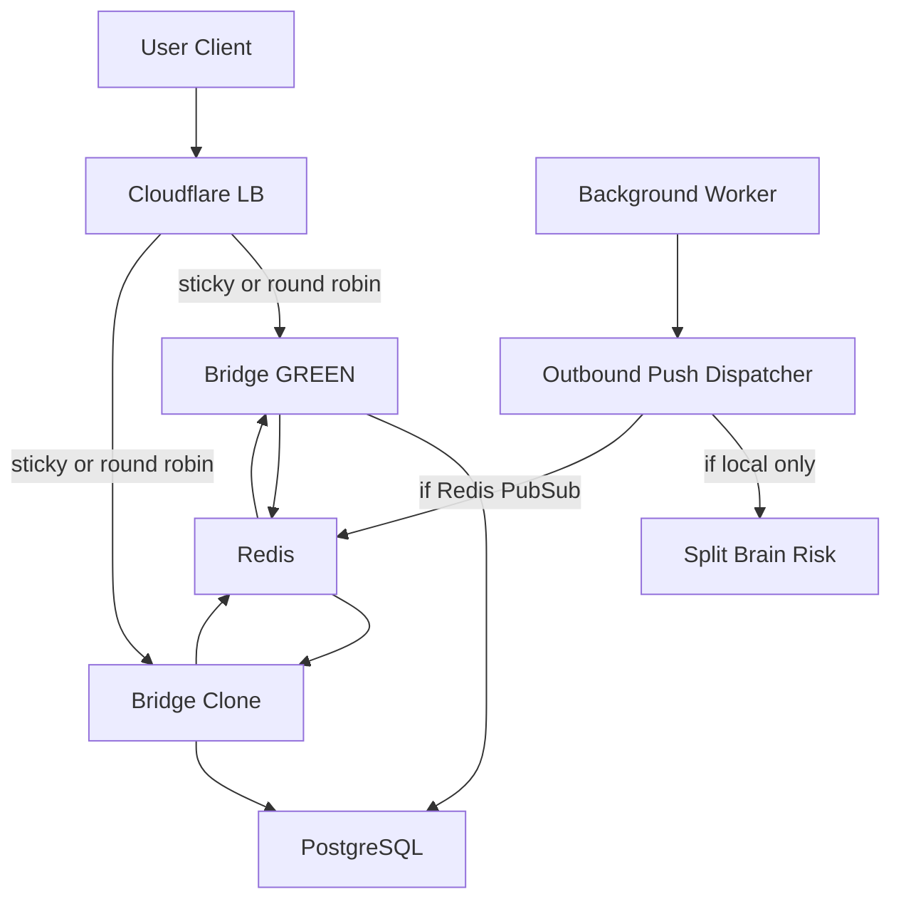

# Clone Bridge Horizontal Scaling Plan

## Changelog
- Added Cloudflare WebSocket sticky behavior verification so sticky routing is proven across mobile-style reconnects before Phase 2.
- Added clone host resource headroom analysis so the bridge is not colocated with REST workload blindly.
- Upgraded the pool heartbeat requirement from size/idle snapshots to acquire-latency telemetry with warning thresholds.
- Added Phase 0 framing that this build provisions for statewide contract launch obligations rather than responding to current GREEN load pressure.
- Promoted ENVIRONMENT parity, background-agent duplication, Sentinel cross-node state, and Redis Pub/Sub fanout (Family Sanctuary, Group Coaching, DOJO, Coach Command) to Tier 1 Phase 2 blockers.
- Added Tier 2 Phase 1 audit and Phase 2 deploy items: Redis reach from clone, drain semantics, native-mobile sticky reconnect test, acquire-latency wrapper via asyncpg pool subclass, WireGuard reach for inference.
- Added Tier 3 Phase 1 checklist: NTP, LB healthcheck endpoint, ISO date filename, CF LB billing/quota state, trust-auditor impact, bridge version-drift verification surface.

## Phase 0: Justification
Current GREEN load does not yet require horizontal scaling. This build is provisioning for statewide contract launch obligations, not responding to current pressure. Trade-off accepted: provisioning before demand to avoid scrambling during launch. Phase 1 and Phase 2 proceed under this framing, with the understanding that operational complexity is being added before its load justification.

## Goal
Add a second `nate_bridge` instance on the clone host and route WebSocket traffic across GREEN plus clone without split-brain state loss, silent outbound push drops, or PostgreSQL saturation.

## Phase 1: Read-Only Discovery
Produce `audit/clone_bridge_plan_YYYY-MM-DD.md` (ISO date). Lead with the recommended routing strategy: sticky session hash, stateless round-robin, or stop-before-build.

Key files and systems to inspect:
- `docker-compose.prod.yml`: current backend, bridge, PostgreSQL, Redis, PgBouncer, and clone assumptions.
- `backend/app/websocket/bridge_server.py`: in-memory connection state, chat routing, socket dispatch, pools, and WebSocket handlers.
- `.cursor/rules/cloudflare-load-balancer.mdc`: current Cloudflare LB posture, especially WebSocket-to-primary rule.
- `.cursor/rules/bridge-postgres-connectivity.mdc`: bridge direct PostgreSQL requirements.
- `.cursor/rules/safe-deploy-script-mandatory.mdc` and `.cursor/rules/vault-bind-mount-protection.mdc`: production deploy constraints.

Discovery sections, organized by tier of must-resolve before Phase 2.

### Tier 1: Must resolve before any Phase 2 work
- ENVIRONMENT env-var parity: confirm `ENVIRONMENT=production` is set on the clone bridge container exactly as on GREEN bridge and on both backends, so the Redis auth-key prefix `nate:production:auth:*` resolves identically from clone. Verify in-container with `docker exec <name> printenv ENVIRONMENT` and by reading a known token from both sides. Acceptance: matches verbatim or clone deployment is blocked. Reference: `.cursor/rules/endpoint-websocket-sustainability.mdc`, `old-code-hygiene.mdc`.
- Background agent duplication: enumerate every `asyncio.create_task` and startup loop in `bridge_server.py` (token_redis_sync, vault bridge, session sync, eviction, agent status digest, heartbeat, etc.). Classify each as single-leader-required, idempotent-on-both, or local-only. For single-leader items, document the leader-election plan (env flag `BRIDGE_ROLE=primary|replica`, Redis lock, or DB advisory lock) before Phase 2 begins.
- Sentinel cross-node state: audit Sentinel anomaly accumulation, freeze threshold logic, and `sentinel_frozen` propagation. A user split across two bridges must not bypass freeze by accumulating sub-threshold anomalies on each node, and a freeze written by Node 1 must be honored by Node 2 within one gate check. Require an authoritative DB read on every Sentinel gate, not only the in-memory cache. Acceptance: design is two-bridge safe, or routing must be sticky and pinned for the user's session lifetime.
- Redis Pub/Sub fanout for outbound pushes (concretely enumerated): locate every backend/background path that initiates downstream communication to a live user outside the user's direct inbound WebSocket request. Explicitly enumerate and design test cases for these broadcast paths: Family Sanctuary multi-member broadcast (one member's message reaching every other member in the family), Group Coaching session messages (coach prompt reaching every group member), DOJO mentored-session broadcasts (mentor and participant cross-talk), and Coach Command outbound notifications. For each path, determine whether it currently sends through the local bridge only, Redis, REST, database polling, or another dispatch layer. If a worker on Node 2 can silently miss User A connected to Node 1, mark Redis Pub/Sub or equivalent cross-bridge signaling as required before multi-node routing.

### Tier 2: Phase 1 audit and Phase 2 deploy considerations
- Redis connectivity from clone: confirm clone can reach Redis at the same address the GREEN bridge uses, with the same password and ACL. Verify `ACTIVE_TOKENS` reads, voice-slot acquisition (`acquire_voice_slot`), Sentinel state writes, and audit-log writes all succeed cross-node. Measure latency from clone to Redis and compare against GREEN.
- Drain semantics: define how clone is removed from rotation without abruptly closing live WebSockets mid-conversation. Phase 2 must include a drain script that removes clone from the CF LB pool first, waits until active WebSocket count falls below a documented threshold or a max-drain timeout elapses, then stops the container. Rollback uses the same primitive.
- Native mobile client reconnect testing: extend the Cloudflare sticky reconnect verification to use the native Flutter mobile client over a real carrier-network path, not only a browser `wss://` session. Cookie persistence and reconnect behavior in native WebSocket clients differs from browser behavior. If the native client does not preserve the sticky cookie across reconnects, sticky routing is not safe for production mobile traffic and the architecture gate fires.
- Acquire-latency wrapper mechanism: implement acquire-latency telemetry via an asyncpg pool subclass or proxy applied once at construction time. Do not edit the ~100 existing `pool.acquire()` call sites in `bridge_server.py` (protected file, 50-line limit). The subclass wraps `acquire()` to record wait duration into a rolling 5-minute window for both `chat_db_pool` and main `db_pool`. The heartbeat reads from that window; warnings emit immediately at 50ms (chat) / 100ms (main).
- WireGuard reach from clone: if the clone bridge will route any inference (sovereign Ollama on Hetzner via `10.13.13.5`, XTTS, Mac twin via VPC `overseer-manifold`), confirm WireGuard interface presence, peer config, and reachability. If no inference path is in scope for clone, document that explicitly so it cannot silently be added later without WG provisioning.

### Tier 3: Phase 1 checklist, low risk
- NTP / clock skew: confirm both bridges run synced NTP. `conversation_history`, `sessions`, `nevedal_metrics` ordering depend on consistent timestamps across nodes.
- Cloudflare LB healthcheck endpoint: define the exact bridge healthcheck path used by CF LB (e.g., `GET /healthz`), its expected status code, and that it does not require auth. Confirm the endpoint exists on the bridge today or specify the additive endpoint needed.
- Audit filename ISO date: the Phase 1 report path is `audit/clone_bridge_plan_YYYY-MM-DD.md`. No alternate formats.
- Cloudflare LB billing and quota state: confirm origin-pool capacity, session-affinity feature availability, and current spend against plan limit before adding clone to the pool.
- Trust auditor impact: the SkyEye, Login, and WS Flow auditors today assume a single bridge. Document how two bridges affect the 580/580 audit cascade. If auditors must round-robin or pin to a single bridge for tests, note it as Phase 2 work, not Phase 1.
- Bridge version drift verification surface: add or confirm a `GET /version` (or equivalent) endpoint on the bridge returning the deployed git SHA. Both bridges must report the same SHA at all times during cutover. Document the check command and its acceptance criterion.

### Existing discovery sections (retained)
- Clone host facts: IP, VPC membership, specs, running containers, compose layout, current REST role, and latency to GREEN PostgreSQL. Include current REST workload resource consumption on the clone: peak CPU, peak RAM, and sustained averages over the last 7 days from existing observability, host monitoring, or available container metrics. Compare that with the current `nate_bridge` CPU/RAM baseline on GREEN under production load, then project combined REST + bridge load with growth headroom. If clone resources are marginal, recommend resizing the clone, moving REST off the clone, or accepting the risk with explicit monitoring.
- Bridge state externalization: enumerate module-level dicts and caches in `bridge_server.py`, including `connected_clients`, `connected_coaches`, `ACTIVE_WEBSOCKETS`, `ACTIVE_TOKENS`, `cortex.sockets`, session maps, eviction contexts, and any per-user transient state.
- Routing decision: verify the Cloudflare WebSocket rule currently forcing `/ws*` to GREEN and decide between sticky session hash and stateless routing based on discovered state, outbound push risk, and verified sticky reconnect behavior (including the native-mobile result from Tier 2).
- Cloudflare sticky WebSocket verification: document current WebSocket session affinity configuration, including cookie name, TTL, scope, and fallback behavior. Define and run a read-only reconnect test plan before Phase 2 in both browser and native Flutter clients: immediate reconnect, reconnect after 30 seconds, and reconnect after cookie TTL expiry if the TTL is short enough to test. Confirm whether reconnects land on the same node. If sticky reconnects are not reliable, mark clone bridge deployment as blocked until state is externalized through Redis/Pub/Sub or routing is redesigned.
- PostgreSQL headroom: confirm clone can reach `10.120.0.2:5432`; calculate bridge direct connections as `(40 main + 8 chat) * N bridges`; compare against `max_connections=400`, existing backend/PgBouncer/background usage, and `pg_stat_activity` source counts.
- Deploy mechanics: determine whether clone should use existing `docker-compose.clone.yml`, a bridge-only override, or a clone-specific compose file; identify exact env vars, bind mounts, secrets, ports, nginx/LB changes, and log locations.
- Rollback: define the one-command rollback path to remove clone from the WebSocket pool and revert all traffic to GREEN.

Phase 1 acceptance criteria:
- No production state changed.
- The report clearly says whether clone bridge is safe with sticky routing today.
- All Tier 1 items are resolved safe or the Phase 2 gate is held: `ENVIRONMENT` parity confirmed, every background loop in `bridge_server.py` is classified with a leader-election plan for non-idempotent ones, Sentinel cross-node behavior is two-bridge safe, and every enumerated outbound push (Family Sanctuary, Group Coaching, DOJO, Coach Command) has a documented cross-bridge dispatch design.
- Any outbound push split-brain risk is explicitly classified as safe, unsafe, or unknown.
- Cloudflare WebSocket sticky reconnect behavior is verified or explicitly marked as a blocker, with results from both browser and native Flutter mobile client over a carrier network.
- Clone resource headroom is supported by observed CPU/RAM data, not only capacity assumptions.
- Clone Redis reach is verified with a cross-node token, voice-slot, and Sentinel state probe.
- WireGuard reach from clone is verified for every inference target the clone bridge will use, or those inference paths are documented as out of scope for clone.
- PostgreSQL headroom is supported by live read-only evidence, not only arithmetic.
- All Tier 3 checklist items have a documented answer in the report.

## Phase 2: Build And Verify
Proceed only after Phase 1 review confirms the routing strategy.

Implementation outline:
- Prepare clone bridge service using the same commit as GREEN, with `POSTGRES_HOST` targeting primary PostgreSQL directly unless Phase 1 requires PgBouncer. Set `ENVIRONMENT=production` explicitly in the clone bridge environment block and verify with `docker exec`.
- Apply the background-agent leader-election plan from Phase 1: any single-leader-required loop runs only on the bridge with `BRIDGE_ROLE=primary` (or whichever gate Phase 1 selected).
- Apply the Sentinel cross-node design from Phase 1: every gate check reads the authoritative DB state; in-memory cache only accelerates reads.
- Implement the Redis Pub/Sub fanout if Phase 1 required it. Suggested channel shape `sanctuary:user:{username}`; each bridge subscribes and dispatches to its own `connected_clients` only.
- Implement acquire-latency telemetry via an asyncpg pool subclass or proxy applied once at pool construction. Do not edit the ~100 existing `pool.acquire()` call sites in `bridge_server.py`. The subclass records wait duration into a rolling 5-minute window for both `chat_db_pool` and main `db_pool`.
- Add the pool heartbeat loop so every bridge logs in-use, idle counts, and p50/p95/p99 acquire latency every 5 minutes for both pools. Emit an immediate warning if `chat_db_pool` acquire latency exceeds 50ms or main `db_pool` acquire latency exceeds 100ms.
- Deploy via approved safe deployment flow. Do not use `--force-recreate`, `rsync --delete`, or manual data-volume operations.
- Start bridge on clone without adding it to public traffic first. Confirm startup, PostgreSQL registry, `chat_db_pool`, Redis token namespace, `/version` SHA parity with GREEN, and no tracebacks.
- Add clone to the Cloudflare WebSocket origin pool using the confirmed routing mode and the agreed CF LB healthcheck endpoint.
- Implement and dry-run the drain script: remove clone from the CF LB pool, wait for active WebSocket count to fall below threshold or max-drain timeout, then stop the container. Rollback uses the same primitive.
- Verify traffic split with synthetic WebSocket clients and real routing evidence from both bridge logs.
- Verify outbound push behavior across nodes using one controlled event from each Tier 1 enumerated category: Family Sanctuary, Group Coaching, DOJO, Coach Command.
- Monitor pool heartbeat, `pg_stat_activity`, bridge errors, WebSocket close rates, and provider 429s during soak.

Phase 2 acceptance criteria:
- Both bridges serve WebSocket traffic on the same git SHA, verified via the `/version` endpoint on both.
- `ENVIRONMENT=production` confirmed on both bridges and both backends.
- Background-agent leader-election is active: single-leader loops run on exactly one node.
- Sentinel gate reads authoritative DB state across both bridges.
- Users can log in and chat through both nodes.
- Outbound/background pushes reach users even when trigger and user connection land on different nodes, or routing is proven to prevent that mismatch. Verified for Family Sanctuary, Group Coaching, DOJO, and Coach Command.
- Sticky reconnect tests remain consistent after LB cutover for both browser and native Flutter mobile clients, including immediate and 30-second reconnect scenarios.
- Pool heartbeat logs include in-use, idle, and p50/p95/p99 acquire latency for both pools on both bridge nodes.
- Drain script is implemented and dry-run verified.
- PostgreSQL connections remain within planned headroom.
- Rollback command is documented and tested or dry-run verified.

## Architecture Gate
If Phase 1 finds any globally assumed bridge-local state or unsafe outbound push path that sticky routing does not cover, stop before Phase 2 and implement a Redis Pub/Sub bridge fanout design first.

## What Not To Do
- Do not add clone to WebSocket traffic before Phase 1 is reviewed.
- Do not assume sticky sessions solve background or autonomous outbound pushes.
- Do not raise `chat_db_pool` during this work.
- Do not route bridge through PgBouncer unless Phase 1 proves direct PostgreSQL headroom is insufficient or clone network requires it.