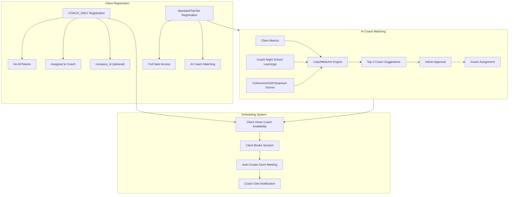

# Coach-Only Client Registration, Scheduling & AI Matching System

## 1. New "COACH_ONLY" Subscription Plan & Company ID

### Changes to [backend/app/websocket/bridge_server.py](backend/app/websocket/bridge_server.py)

**Add the new plan to `plan_details**` (line ~1726):

```python
"COACH_ONLY": {"tokens": 0, "coach_sessions": -1, "price": 0, "duration_days": 365}
# -1 = unlimited coach sessions, 0 tokens = no AI features
```

**Add `company_id` to the registration profile** (line ~936):

- New field: `"company_id": data.get("company_id", None)` -- nullable, like `family_id`
- New field: `"company_name": data.get("company_name", "")` -- human-readable
- When a `company_id` is provided, group these users together (same pattern as `family_id`)

**Modify `register_new_user()**` to handle COACH_ONLY registration:

- Accept optional `registration_type: "COACH_ONLY"` in the registration payload
- If COACH_ONLY:
  - Set `subscription_plan = "COACH_ONLY"`, `subscription_status = "ACTIVE"` (no trial needed)
  - Set `token_balance = 0` (no AI access)
  - Set `tier = "COACH_ONLY"`
  - Require `assigned_coach_id` at registration (the coach who is adding them)
- These clients skip trial period entirely

**Add `COACH_ONLY` to plan checks** throughout `bridge_server.py`:

- Token checks: COACH_ONLY users have 0 tokens, skip all AI/Nate interactions
- Session access: Allow scheduling but block sanctuary/AI/Nate features
- Add to `PREMIUM_TIERS` check exceptions where needed

### Data Model (user_registry.json)

New COACH_ONLY client entry:

```json
{
  "client_coachclient1": {
    "credentials": { "username": "coachclient1", "password": "..." },
    "profile": {
      "role": "CLIENT",
      "subscription_plan": "COACH_ONLY",
      "subscription_status": "ACTIVE",
      "token_balance": 0,
      "assigned_coach": "coach1",
      "assigned_coach_id": "COACH_001",
      "company_id": "COMP_ABC123",
      "company_name": "Wellness Corp",
      "family_id": "FAM_...",
      "can_access_nate": false
    }
  }
}
```

---

## 2. Client-Side Scheduling UI (Mobile)

### Changes to [mobile/lib/main.dart](mobile/lib/main.dart) & [mobile/lib/updated_screens.dart](mobile/lib/updated_screens.dart)

**COACH_ONLY Client App Experience:**

- After login, detect `subscription_plan == "COACH_ONLY"`
- Show a simplified home screen with ONLY:
  - Coach availability calendar
  - Book session button
  - Upcoming sessions list with Zoom join links
  - No Nate, no sanctuary, no AI features

**New WebSocket message types:**

- `client_get_coach_availability` -- fetch assigned coach's available slots
- `client_book_session` -- client books an available slot
- `client_cancel_session` -- client cancels a booked session
- `client_get_upcoming_sessions` -- fetch scheduled sessions with Zoom links

**Scheduling Flow:**

```
Client opens app -> Sees coach's availability calendar
  -> Taps available slot -> Confirms booking
  -> Backend creates session + auto-generates Zoom meeting
  -> Client receives Zoom join link
  -> Coach receives notification of new booking
```

**Zoom for Clients:**

- When a session is booked, the Zoom `join_url` goes to the client
- The Zoom `start_url` (host) goes to the coach
- Client can join via "Join Zoom" button in their upcoming sessions
- Coach still has full Little Nate observation during the Zoom call

---

## 3. Top-Tier Client Schedule Tab

### Changes to [mobile/lib/main.dart](mobile/lib/main.dart)

**Add "Schedule" tab for TOP_TIER / SOVEREIGN_CIRCLE clients:**

- Reuse the same scheduling component from COACH_ONLY
- Appears as a new tab in the main client navigation
- Shows assigned coach's availability
- Allows booking up to their plan's `coach_sessions` limit (4/month for TOP_TIER)
- Shows upcoming sessions with Zoom join links
- Enforces session limits based on plan

**Gating logic:**

- TRIAL / STANDARD: No schedule tab (no coach sessions in plan)
- TOP_TIER: Schedule tab visible, limited to 4 sessions/month
- COACH_ONLY: Schedule-only app (full scheduling, unlimited sessions)

---

## 4. Little Nate AI Coach-Client Matching Engine

### New file: [backend/app/services/coach_matcher.py](backend/app/services/coach_matcher.py)

**Purpose:** AI-powered matching of clients to coaches using Night School learned history and quantum metrics.

**Matching Algorithm - Input Data:**

1. **Client Scores** (from `Vaults/Clients/{id}/metrics.json`):
  - `C_emo` (coherence score)
  - `GAP` (emotional gap score)
  - `Quantum` (composite wellness score)
  - Session history patterns
2. **Coach Observations** (from Night School learning):
  - Coach notes/learnings from `coach_learning_queue.json` and `coach_learning_archive.json`
  - Coach specialties from profile (`specialty` field)
  - Coach performance metrics (retention_rate, satisfaction, breakthroughs)
3. **Night School Wisdom** (from `Vaults/Admin/night_school/wisdom.json`):
  - Categories of learned techniques
  - Coach-specific training strengths

**Matching Algorithm - Scoring:**

```python
class CoachMatcher:
    async def compute_match_score(client_id, coach_id) -> float:
        # 1. Specialty alignment (0.30 weight)
        #    - Compare client's presenting issues/patterns (from story.json)
        #      with coach's specialty and Night School categories
        
        # 2. Coherence compatibility (0.25 weight)
        #    - Clients with low C_emo need coaches with high "emotional_regulation"
        #      wisdom entries
        #    - Clients with high GAP need coaches skilled in "attachment" category
        
        # 3. Coach performance history (0.20 weight)
        #    - Retention rate, satisfaction score, breakthrough count
        #    - Weighted by similarity to current client's profile
        
        # 4. Night School learned observations (0.25 weight)
        #    - GPT-4o analysis of coach learnings vs client needs
        #    - Compares approved wisdom entries tagged to the coach
        #      with the client's story.json patterns/wounds
        
        return weighted_score  # 0.0 - 1.0
    
    async def get_top_matches(client_id, n=3) -> List[MatchResult]:
        # Returns top N coach matches with scores and reasoning
```

**Integration Points:**

- New WebSocket handler: `nate_suggest_coach_match` -- triggers matching for a client
- Admin can view/approve matches via `admin_get_match_suggestions`
- Results stored in `DATA_DIR/coach_match_suggestions.json`
- For STANDARD users: suggest a coach to upgrade to TOP_TIER with
- For TOP_TIER users: auto-suggest optimal coach assignment

### New WebSocket message types in [bridge_server.py](backend/app/websocket/bridge_server.py):

- `nate_suggest_coach_match` -- request match suggestions for a client
- `admin_get_match_suggestions` -- admin views all pending match suggestions
- `admin_approve_match` -- admin approves a match and assigns the coach
- `coach_match_notification` -- notify coach of new assignment

---

## 5. Backend WebSocket Handlers

### Changes to [backend/app/websocket/bridge_server.py](backend/app/websocket/bridge_server.py)

**New handlers to add:**


| Message Type                    | Purpose                                     |
| ------------------------------- | ------------------------------------------- |
| `client_get_coach_availability` | Fetch assigned coach's available time slots |
| `client_book_session`           | Client books a session, auto-creates Zoom   |
| `client_cancel_session`         | Client cancels a booking                    |
| `client_get_upcoming_sessions`  | Get client's scheduled sessions             |
| `nate_suggest_coach_match`      | Trigger AI matching for a client            |
| `admin_get_match_suggestions`   | Admin retrieves match suggestions           |
| `admin_approve_match`           | Approve a coach-client match                |


**Session booking flow (reuses existing `sessions.py` infrastructure):**

- Validate client has an assigned coach or is requesting a match
- Check coach availability from `Vaults/Coaches/{id}/availability.json`
- Check for conflicts (existing logic in sessions.py lines 257-268)
- Create session record with Zoom auto-generation
- Send notification to coach via WebSocket

---

## 6. Company Grouping System

### Changes to [backend/app/websocket/bridge_server.py](backend/app/websocket/bridge_server.py)

**Pattern mirrors `family_id`:**

- `company_id`: Auto-generated as `COMP_{hex}` or provided during registration
- `company_name`: Human-readable name
- When coaches register their external clients (COACH_ONLY), they can assign a company
- Admin can view clients grouped by company (like family view)
- New handler: `admin_get_company_clients` -- list all clients in a company

---

## 7. Coach Command -- Insights & Clients Tab Enhancements

### Changes to [mobile/lib/updated_screens.dart](mobile/lib/updated_screens.dart)

**Current state:**

- CLIENTS tab (`_buildClientsTab`, line ~3424): Groups by `family_id` into folders, no search, no type filtering
- INSIGHTS tab (`_buildInsightsTab`, line ~3858): Flat list of first 5 clients, no grouping, no search
- `_buildFolderGroups()` (line ~4030): Groups by `family_id` only

**Add shared search bar + toggle to both tabs:**

**New state variables:**

```dart
String _clientFilterMode = 'ALL';  // ALL, FAMILY, COACH_ONLY, COMPANY
String _clientSearchQuery = '';
TextEditingController _clientSearchController = TextEditingController();
```

**Search bar widget** (reusable across both tabs):

- `TextField` with search icon, hint text "Search by name, company, or family..."
- Filters `_clients` list in real-time by:
  - `name` (partial match, case-insensitive)
  - `company_name` (partial match)
  - `company_id` (exact or partial match)
  - `family_id` (exact or partial match)

**Toggle chips** (row of `ChoiceChip` widgets below search bar):

- **All** -- shows all assigned clients (default)
- **Families** -- shows only clients grouped by `family_id` (non-empty `family_id`, `subscription_plan != "COACH_ONLY"`)
- **Coach-Only** -- shows only `subscription_plan == "COACH_ONLY"` clients
- **Company** -- groups by `company_id` (similar to family grouping, uses `company_name` as folder label)

**Updates to `_buildFolderGroups()`:**

- Accept filter mode parameter
- When `COACH_ONLY`: only include clients with `subscription_plan == "COACH_ONLY"`, group by `company_id` if present
- When `FAMILY`: only include clients with non-empty `family_id` and `subscription_plan != "COACH_ONLY"`
- When `COMPANY`: group all clients by `company_id`, individual folders for clients with no company
- When `ALL`: show everything (current behavior + company grouping)
- Apply `_clientSearchQuery` filter before grouping

**Updates to `_buildInsightsTab()`:**

- Add search bar + toggle above stats cards
- Replace `_clients.take(5)` with filtered + searched list
- Show ALL matching clients (scrollable), not just first 5
- Add company/plan badge next to client name (e.g., small "COACH_ONLY" tag, company name)

**Updates to `_buildClientsTab()`:**

- Add search bar + toggle above folder list
- Pass filter mode to `_buildFolderGroups()`
- Company folders show company icon (instead of family folder icon)
- Coach-Only clients show a distinct icon (calendar icon vs folder icon)

**Updates to `_buildBriefingsTab()` (line ~3939):**

- Add search bar + toggle chips above the folder sidebar list (both narrow and wide layouts)
- The folder list already uses `_buildFolderGroups()`, so the upgraded grouping logic (filter mode + company support) applies automatically
- Folder sidebar items get type-appropriate icons:
  - Family folders: `Icons.folder` (current gold icon)
  - Coach-Only individual: `Icons.calendar_today` (scheduling-only indicator)
  - Company folders: `Icons.business` (company grouping)
- When a Coach-Only or Company folder is selected, the content section header changes from "FAMILY MEMBERS" to "MEMBERS" or "COMPANY MEMBERS"
- Coach-Only client member cards still show C_emo/GAP/Quantum scores (populated from live session observations if available, otherwise dashes)
- "View Brief" button works the same -- fetches `get_presession_brief` for the client

**Cross-navigation consistency:**

- When navigating from CLIENTS tab "Open Folder" to BRIEFINGS, the active filter mode carries over
- When navigating from SCHEDULE tab "Open Briefing" to BRIEFINGS, the correct folder is auto-selected regardless of current filter
- `_openBriefingsForSession()` (line ~3733) updated to also match by `company_id` in addition to `family_id` and `client_id`

**Shared filter state across tabs:**

- `_clientFilterMode` and `_clientSearchQuery` are shared state variables used by all three tabs
- Changing the filter/search in one tab persists when switching to another tab
- This ensures a consistent view: if the coach filters to "Coach-Only" in Clients, switching to Briefings or Insights shows the same filtered set

**Backend data requirement:**

- `coach_get_assigned_clients` handler in `bridge_server.py` must include `company_id`, `company_name`, and `subscription_plan` in the client data sent to the coach
- Currently sends: name, email, family_id, family_role, metrics, etc.
- Add: `company_id`, `company_name`, `subscription_plan`

---

## 8. Classroom Tab -- Device Video Upload & Coach Query Analyzer

### Current State

- Classroom only analyzes Zoom VTT transcripts (text-based)
- A `VideoAnalyzer` service exists at [backend/app/services/video_analyzer.py](backend/app/services/video_analyzer.py) with `extract_frames()` and `analyze_video()` (Azure Vision API) -- but NOT connected to Classroom
- `classroom_analyzer._push_to_night_school()` already accepts a `video_insights` parameter (line ~1990) but never receives actual video data
- No mobile video upload mechanism exists
- The analysis already supports a `focus_area` parameter but only as a predefined string, not free-form coach queries

### Mobile UI Changes ([mobile/lib/updated_screens.dart](mobile/lib/updated_screens.dart))

**Add video upload section to `_buildSessionSelector()` (line ~5709):**

Below the existing "Select Session to Analyze" dropdown, add a new section:

```
--- OR ---
[Upload Video from Device]  (file picker button)
```

- Uses `file_picker` or `image_picker` Flutter package to select video from device (MP4, MOV, etc.)
- Shows upload progress bar during upload
- Once uploaded, the video appears as a selectable "session" in the analysis flow (labeled with filename + upload date)
- Coach must tag the video with a client (dropdown from `_clients` list) so analysis is linked to the right client folder

**Add coach query text box to `_buildAnalysisOptions()` (line ~5843):**

Below the existing focus area selector, add:

```dart
TextField(
  controller: _classroomCoachQueryController,
  decoration: InputDecoration(
    labelText: "Ask Little Nate specific observations...",
    hintText: "e.g., 'What attachment patterns do you see?' or 'How does the client respond to emotional bids?'",
    border: OutlineInputBorder(),
  ),
  maxLines: 3,
)
```

- Free-form text input for the coach to ask specific questions
- This query is sent alongside the analysis request as `coach_query` parameter
- Little Nate incorporates the coach's question into the AI analysis prompt
- The response includes a dedicated "Coach's Question" section in the analysis results

**New state variables:**

```dart
String? _classroomUploadedVideoId;
String? _classroomUploadedVideoName;
double _classroomUploadProgress = 0.0;
bool _classroomUploading = false;
TextEditingController _classroomCoachQueryController = TextEditingController();
```

### Backend REST Endpoint ([backend/app/routers/sessions.py](backend/app/routers/sessions.py))

**New endpoint: `POST /api/classroom/upload-video**`

```python
@router.post("/api/classroom/upload-video")
async def upload_classroom_video(
    file: UploadFile,
    coach_id: str = Form(...),
    client_id: str = Form(...),
    family_id: str = Form(""),
    description: str = Form(""),
):
    # 1. Validate file type (MP4, MOV, WEBM, AVI)
    # 2. Save to blob storage: classroom_videos/{coach_id}/{video_id}.mp4
    # 3. Create a pseudo-session record in classroom_sessions.json
    #    with source="device_upload" (vs source="zoom")
    # 4. Return video_id for use in analysis
```

- Uses the existing `blob_storage.upload_bytes()` pattern from Night School curriculum upload
- File size limit: configurable (default 500MB)
- Stored alongside Zoom transcripts in the classroom sessions list

### Backend Analysis Integration ([backend/app/services/classroom_analyzer.py](backend/app/services/classroom_analyzer.py))

**New method: `analyze_video()**`

```python
async def analyze_video(
    self, video_id: str, coach_id: str, client_id: str,
    coach_query: str = "", focus_area: str = "general",
    family_id: str = "", client_name: str = ""
) -> Dict:
    # 1. Load video from blob storage
    # 2. Call VideoAnalyzer.extract_frames() to get key frames
    # 3. Call VideoAnalyzer.analyze_video() for visual analysis
    #    (body language, facial expressions, engagement cues)
    # 4. If audio track exists, extract and transcribe (whisper or Azure STT)
    # 5. Combine visual + audio analysis
    # 6. Run AI analysis with coach_query injected into prompt
    # 7. Save analysis to classroom_sessions.json
    # 8. Push to Night School via _push_to_night_school(video_insights=...)
```

**Extend existing `analyze_transcript()` to accept `coach_query`:**

- Add `coach_query: str = ""` parameter
- When provided, inject into the AI analysis prompt: "The coach specifically asks: {coach_query}. Please address this question in your analysis."
- Add a "Coach's Question" section to the analysis results JSON

### WebSocket Handlers ([backend/app/websocket/bridge_server.py](backend/app/websocket/bridge_server.py))

**New handler: `classroom_analyze_video**`

```python
if t == "classroom_analyze_video":
    video_id = d.get("video_id")
    coach_id = d.get("coach_id")
    client_id = d.get("client_id")
    coach_query = d.get("coach_query", "")
    # Trigger video analysis pipeline
    # Send classroom_analysis_started, then classroom_analysis_complete
```

**Extend existing `classroom_analyze_session` handler (line ~5973):**

- Accept new `coach_query` parameter from the message
- Pass it through to `classroom_analyzer.analyze_transcript()`

### Night School Learning Integration

**Connect video insights to `_push_to_night_school()` (line ~1990 in classroom_analyzer.py):**

- The `video_insights` parameter already exists but is never populated
- After video analysis completes, pass the visual observations (body language patterns, engagement cues, attachment behaviors) as `video_insights`
- Night School creates wisdom entries tagged with `source: "video_analysis"` and linked to the coach + client
- Coach's specific questions and Nate's responses are also archived as learning material

### Analysis Results Display

**Extend `_buildAnalysisResults()` in updated_screens.dart:**

- If analysis came from a video upload, show a "Video Analysis" badge
- Add "Coach's Question" section showing:
  - The coach's original question
  - Little Nate's targeted response
- Visual analysis insights section (body language, facial expressions, engagement patterns) when available from video

---

## 9. DOJO Mode Tabs -- Multi-Domain Training

### Current State

The DOJO currently has a single domain: **Therapist** (adversarial safety testing). Personas are therapy-focused: Hostile Client, Crisis State, Skeptical, Minor, Manipulative. The UI is in [dashboard/night_school_dojo.html](dashboard/night_school_dojo.html) (loaded via WebView/iframe). Backend personas are defined in `DojoPersona` enum in [backend/app/services/night_school_director.py](backend/app/services/night_school_director.py).

### New DOJO Mode Tabs

Add a **tab bar** above the persona buttons in `night_school_dojo.html`. Each tab switches Little Nate into a completely different domain expert mode:

**Tab Structure:**

- **Therapist** (current, default) -- existing adversarial therapy testing
- **Project PM** -- PMP/Scrum Master/Lean Process mentoring
- **Business** -- Business acumen and business coaching training
- **CNC** -- Computer Numerically Controlled machining expertise
- **MCAT** -- Medical College Admissions Test prep and mentoring

### UI Changes ([dashboard/night_school_dojo.html](dashboard/night_school_dojo.html))

**Add mode tab bar** above the existing persona bar (line ~132):

```html
<div class="mode-tabs">
  <button class="mode-tab active" onclick="setDojoMode('therapist', this)">Therapist</button>
  <button class="mode-tab" onclick="setDojoMode('project_pm', this)">Project PM</button>
  <button class="mode-tab" onclick="setDojoMode('business', this)">Business</button>
  <button class="mode-tab" onclick="setDojoMode('cnc', this)">CNC</button>
  <button class="mode-tab" onclick="setDojoMode('mcat', this)">MCAT</button>
  <button class="mode-tab" onclick="setDojoMode('teacher', this)">Teacher</button>
</div>
```

**Each mode tab changes the persona buttons** dynamically:

- **Therapist**: Hostile Client, Crisis State, Skeptical, Minor, Manipulative (existing)
- **Project PM**: Sprint Planning, Backlog Grooming, Stakeholder Conflict, Risk Assessment, Retrospective, Lean Waste Identification
- **Business**: Pitch Practice, Financial Analysis, Market Strategy, Client Acquisition, Operations Optimization, Leadership Coaching
- **CNC**: Toolpath Optimization, G-Code Review, Material Selection, Fixture Setup, Tolerance Analysis, Machine Troubleshooting
- **MCAT**: Biology/Biochem, Chemistry/Physics, Psychology/Sociology, CARS Passage, Full Practice Assessment, Score Analysis
- **Teacher**: Content Mastery, Pedagogy, Classroom Management, Social-Emotional, Interdisciplinary, Tech & AI Integration, Communication, Cultural Competency

**Analysis panel adapts per mode:**

- Therapist: Safety Metrics, Response Quality (current)
- Project PM: Process Adherence, Methodology Score, Coaching Effectiveness
- Business: Strategic Thinking, Business Acumen Score, Coaching Clarity
- CNC: Technical Accuracy, Safety Compliance, Process Efficiency
- MCAT: Content Accuracy, Score Projection, Teaching Clarity, Student Readiness
- Teacher: Content Accuracy, Pedagogical Soundness, Differentiation Score, SEL Awareness, Interdisciplinary Connections, Inclusivity Score

**MCAT-specific features:**

- Score tracking: displays projected MCAT score (goal: 517+)
- Section breakdown: shows scores per section (Bio/Biochem, Chem/Phys, Psych/Soc, CARS)
- Assessment mode: Little Nate generates practice questions and scores responses
- Progress tracking: trends over time toward 517 target
- Coaching readiness: measures ability to explain concepts to other students
- PDF test generation and upload scoring (see MCAT PDF Assessment Flow below)

### DOJO PDF Assessment Flow (All Modes)

Little Nate can generate practice assessments as downloadable PDFs in every DOJO mode, then read back the uploaded completed PDF to assess and score it. This is a shared feature across Therapist, Project PM, Business, CNC, MCAT, and Teacher.

**Mode-specific assessment types:**

- **Therapist**: Case study assessments (client vignettes with therapeutic response questions), ethical dilemma scenarios, treatment planning exercises, modality identification (EFT/IFS/CBT/AEDP), risk assessment scenarios
- **Project PM**: PMP-style exam questions, sprint planning exercises, risk register creation, stakeholder communication plans, lean process improvement case studies, agile vs waterfall scenario analysis
- **Business**: Business plan critiques, financial statement analysis exercises, market analysis case studies, pitch deck review scenarios, P&L interpretation, strategic decision-making cases
- **CNC**: G-code interpretation tests, toolpath optimization problems, material selection scenarios, tolerance stack-up calculations, fixture design challenges, feeds/speeds calculations
- **MCAT**: Full section practice tests (Bio/Biochem, Chem/Phys, Psych/Soc, CARS passages), scored on the real 118-132 per section scale with 472-528 composite target of 517+
- **Teacher**: Multi-subject content knowledge tests (math through calculus, sciences, ELA, history/social studies, psychology, economics, CS), lesson plan design exercises, differentiated instruction scenarios (adapting a lesson for diverse learners), classroom management case studies (de-escalation, engagement, behavior plans), SEL integration exercises (recognizing student emotional struggles, building psychologically safe environments), assessment design tasks (creating rubrics, formative/summative assessments, data-driven reteaching plans), interdisciplinary unit design (connecting biology to chemistry, literature to psychology), technology/AI integration scenarios (using AI tools for personalized instruction, equity-driven tech adoption), parent-teacher communication drafts, cultural competency scenarios (inclusive environments, addressing bias)

**Backend -- PDF Generation** ([backend/app/services/night_school_director.py](backend/app/services/night_school_director.py)):

- Add `fpdf2` to `requirements.txt` (lightweight PDF generation library)
- New method: `generate_dojo_assessment(mode, focus_areas, num_questions, difficulty) -> bytes`
  - Little Nate uses GPT-4o to generate mode-appropriate assessment questions
  - Questions formatted into a professional PDF with answer spaces
  - Includes header with coach name, date, mode, and focus area labels
  - Answer key stored separately in blob storage for scoring
  - Returns PDF bytes for download

**Backend -- New REST endpoints** (new [backend/app/routers/dojo_api.py](backend/app/routers/dojo_api.py)):

```python
@router.post("/api/dojo/generate-assessment")
async def generate_assessment(
    coach_id: str = Form(...),
    mode: str = Form(...),                 # therapist, project_pm, business, cnc, mcat, teacher
    focus_areas: str = Form("all"),        # mode-specific focus areas
    num_questions: int = Form(20),         # adjustable per mode
    difficulty: str = Form("medium"),      # easy, medium, hard, mixed
):
    # 1. Generate mode-appropriate questions via GPT-4o
    # 2. Format into PDF using fpdf2
    # 3. Save PDF + answer key to blob storage: dojo_assessments/{mode}/{coach_id}/{test_id}.pdf
    # 4. Return test_id + download URL

@router.get("/api/dojo/download-assessment/{test_id}")
async def download_assessment(test_id: str):
    # Serve the generated PDF for download
    # Returns FileResponse with Content-Disposition: attachment

@router.post("/api/dojo/score-assessment")
async def score_assessment(
    file: UploadFile,                      # completed assessment PDF
    coach_id: str = Form(...),
    test_id: str = Form(...),              # links to original generated assessment
):
    # 1. Read uploaded PDF using pypdf (already in requirements.txt)
    # 2. Extract text content (coach's answers)
    # 3. Load original assessment's answer key from blob storage
    # 4. Score per mode:
    #    - Therapist: therapeutic appropriateness, ethical compliance, modality accuracy
    #    - Project PM: methodology accuracy, process adherence, PMP alignment
    #    - Business: strategic soundness, financial literacy, actionable quality
    #    - CNC: technical accuracy, safety compliance, calculation correctness
    #    - MCAT: section scores (118-132 each), composite (472-528)
    #    - Teacher: content accuracy per subject, pedagogical soundness, differentiation quality,
    #              SEL awareness, interdisciplinary connections, inclusivity, overall teaching readiness
    # 5. GPT-4o analysis: identify weak areas, provide detailed feedback per question
    # 6. Store results in dojo_progress/{mode}.json
    # 7. Return scored results with breakdown + recommendations

@router.get("/api/dojo/assessment-history/{coach_id}")
async def get_assessment_history(coach_id: str, mode: str = "all"):
    # Return historical assessment scores for progress tracking
```

**Mobile UI -- Assessment panel in DOJO** ([dashboard/night_school_dojo.html](dashboard/night_school_dojo.html)):

- Assessment section appears in the analysis sidebar (right panel) for all modes
- "Generate Assessment" button -- coach selects focus areas and difficulty, triggers PDF generation
- "Download Assessment" button -- opens PDF in browser / downloads to device
- "Upload Completed Assessment" button -- file picker for PDF upload (same `file_picker` package as Classroom video upload)
- Score display adapts per mode:
  - Therapist: therapeutic accuracy %, ethical compliance %, modality identification %, overall readiness
  - Project PM: PMP alignment %, agile proficiency %, process score, certification readiness
  - Business: strategic thinking %, financial literacy %, coaching clarity %, business acumen score
  - CNC: technical accuracy %, safety compliance %, calculation correctness %, machinist readiness
  - MCAT: section-by-section breakdown with composite score, progress chart toward 517 target
  - Teacher: 8-domain radar chart (Content Mastery, Pedagogy, Classroom Mgmt, SEL, Interdisciplinary, Tech/AI, Communication, Cultural Competency), per-subject content scores, overall teaching readiness score
- Historical progress chart showing trends over time per mode

**Flutter dependency** ([mobile/pubspec.yaml](mobile/pubspec.yaml)):

- `file_picker` (already being added for Classroom video upload -- shared)
- Download via `url_launcher` to open the PDF URL in the device browser (no additional package needed)

**Night School learning:**

- Generated assessment questions and scoring data feed into Night School per mode
- Little Nate learns which question types are difficult for each coach
- Adapts future assessment generation to target weak areas
- Tracks coaching readiness per domain: if the coach can explain wrong answers correctly, they demonstrate mastery
- Cross-domain insights: patterns in a coach's learning style inform all modes

### Backend Changes

**Extend `DojoPersona` enum** in [backend/app/services/night_school_director.py](backend/app/services/night_school_director.py):

```python
class DojoMode(str, Enum):
    THERAPIST = "THERAPIST"
    PROJECT_PM = "PROJECT_PM"
    BUSINESS = "BUSINESS"
    CNC = "CNC"
    MCAT = "MCAT"
    TEACHER = "TEACHER"

class DojoPersona(str, Enum):
    # Therapist (existing)
    HOSTILE = "HOSTILE"
    CRISIS = "CRISIS"
    SKEPTIC = "SKEPTIC"
    MINOR = "MINOR"
    MANIPULATIVE = "MANIPULATIVE"
    BOUNDARY_TESTING = "BOUNDARY_TESTING"
    # Project PM
    SPRINT_PLANNING = "SPRINT_PLANNING"
    BACKLOG_GROOMING = "BACKLOG_GROOMING"
    STAKEHOLDER_CONFLICT = "STAKEHOLDER_CONFLICT"
    RISK_ASSESSMENT = "RISK_ASSESSMENT"
    RETROSPECTIVE = "RETROSPECTIVE"
    LEAN_WASTE = "LEAN_WASTE"
    # Business
    PITCH_PRACTICE = "PITCH_PRACTICE"
    FINANCIAL_ANALYSIS = "FINANCIAL_ANALYSIS"
    MARKET_STRATEGY = "MARKET_STRATEGY"
    CLIENT_ACQUISITION = "CLIENT_ACQUISITION"
    OPERATIONS = "OPERATIONS"
    LEADERSHIP = "LEADERSHIP"
    # CNC
    TOOLPATH = "TOOLPATH"
    GCODE_REVIEW = "GCODE_REVIEW"
    MATERIAL_SELECTION = "MATERIAL_SELECTION"
    FIXTURE_SETUP = "FIXTURE_SETUP"
    TOLERANCE_ANALYSIS = "TOLERANCE_ANALYSIS"
    MACHINE_TROUBLESHOOT = "MACHINE_TROUBLESHOOT"
    # MCAT
    BIO_BIOCHEM = "BIO_BIOCHEM"
    CHEM_PHYSICS = "CHEM_PHYSICS"
    PSYCH_SOCIOLOGY = "PSYCH_SOCIOLOGY"
    CARS_PASSAGE = "CARS_PASSAGE"
    MCAT_ASSESSMENT = "MCAT_ASSESSMENT"
    MCAT_SCORE_ANALYSIS = "MCAT_SCORE_ANALYSIS"
    # Teacher
    CONTENT_MASTERY = "CONTENT_MASTERY"
    PEDAGOGY = "PEDAGOGY"
    CLASSROOM_MANAGEMENT = "CLASSROOM_MANAGEMENT"
    SOCIAL_EMOTIONAL = "SOCIAL_EMOTIONAL"
    INTERDISCIPLINARY = "INTERDISCIPLINARY"
    TECH_AI_INTEGRATION = "TECH_AI_INTEGRATION"
    COMMUNICATION = "COMMUNICATION"
    CULTURAL_COMPETENCY = "CULTURAL_COMPETENCY"
```

**Add mode-specific system prompts** to `get_dojo_system_prompt()`:

Each mode gives Little Nate a completely different expert identity:

- **PROJECT_PM**: "You are an expert PMP-certified Project Manager and Scrum Master with deep knowledge of Agile, Lean, Six Sigma, and PMBOK. Your role is to mentor and train the coach in project management best practices, sprint planning, backlog grooming, stakeholder management, and lean process improvement..."
- **BUSINESS**: "You are an expert business strategist and executive coach with deep knowledge of business operations, financial analysis, market strategy, client acquisition, and leadership development. Your role is to mentor the coach in developing their business coaching skills..."
- **CNC**: "You are an expert CNC machinist with comprehensive knowledge of all types of tooling, G-code programming, CAM systems, 3/4/5-axis equipment, cutting paths, feeds and speeds, fixture design, and material properties. Your role is to mentor and train machinists in all CNC processes..."
- **MCAT**: "You are an expert MCAT preparation tutor and medical education specialist. Your goal is to mentor students toward a score of at least 517. You assess their knowledge across all four MCAT sections, generate practice questions, score their responses, and track their projected score. You also groom them to be able to coach other students on the MCAT..."
- **TEACHER**: "You are an advanced master school teacher and education mentor — a true polymath with working fluency across every core discipline: mathematics through calculus, sciences (biology, chemistry, physics), English language arts, history/social studies, psychology, economics, and computer science. You possess deep expertise in 8 competency domains: (1) Broad Content Mastery across all subjects, (2) Pedagogical Skill including curriculum design, differentiated instruction, assessment design, and data-driven instruction, (3) Classroom Management including expectations, de-escalation, rapport-building, and engagement across age groups, (4) Social-Emotional Learning — recognizing student struggles, managing group dynamics, creating psychologically safe environments, (5) Interdisciplinary Thinking — connecting biology to chemistry, history to economics, literature to psychology, (6) Technology & AI Integration for instructional technology, equity, and data-driven decision-making, (7) Communication & Collaboration — explaining quantum physics to a 15-year-old then pivoting to Hamlet's motivations, (8) Cultural Competency — creating inclusive environments where all students feel valued. Your role is to mentor teachers and students, train them across all subjects, build their teaching craft, and develop their ability to reach every learner..."

**Add mode-specific analysis** to `analyze_dojo_response()`:

- Therapist: existing safety/boundary checks
- Project PM: checks for process adherence, methodology accuracy, coaching tone
- Business: checks for strategic depth, financial literacy, actionable advice
- CNC: checks for technical accuracy, safety compliance, proper terminology
- MCAT: checks for content accuracy, score projection, teaching ability
- Teacher: checks for content accuracy, pedagogical soundness, differentiation awareness, SEL sensitivity, interdisciplinary connections, inclusive language, age-appropriateness

`**dojo_start` message extended:**

```python
# Now includes mode
{
    "type": "dojo_start",
    "mode": "PROJECT_PM",    # new field
    "persona": "SPRINT_PLANNING"
}
```

**MCAT score tracking:**

- Store MCAT assessment results in `Vaults/Coaches/{id}/mcat_progress.json`
- Track section scores over time
- Calculate projected composite score
- Measure coaching readiness (can they teach it to others?)

**Teacher-specific features:**

Little Nate operates as an advanced master school teacher -- a polymath across all disciplines. The Teacher mode has 8 competency domains as persona buttons, each targeting a critical teaching skill:

1. **Content Mastery** -- Little Nate quizzes across math (through calculus), sciences (bio, chem, physics), ELA, history/social studies, psychology, economics, and computer science. Tests working fluency, not just surface knowledge. Assessments cover the full breadth a polymath teacher would need.
2. **Pedagogy** -- Curriculum design exercises (scaffolding simple to complex), differentiated instruction scenarios (adapting for diverse learners, special education, varied learning styles), assessment design (creating rubrics, formative/summative tests), data-driven instruction (analyzing results, modifying instruction, student grouping).
3. **Classroom Management** -- Scenario-based training for setting expectations, de-escalation techniques, building rapport, maintaining engagement across different age groups and temperaments. Not innate -- a complex skill set that must be continuously honed.
4. **Social-Emotional Learning** -- 93% of teachers believe SEL is critical for academic success yet fewer than half feel equipped. Little Nate trains on recognizing student emotional struggles, managing group dynamics, creating psychologically safe learning environments.
5. **Interdisciplinary Thinking** -- The teacher's superpower when teaching all subjects. Exercises in connecting biology to chemistry, history to economics, literature to psychology. Little Nate designs cross-curricular unit plans and evaluates interdisciplinary connections.
6. **Technology & AI Integration** -- Training on instructional technology, equity in ed-tech, data-driven decision-making. Scenarios like using AI to generate leveled reading comprehension questions or creating personalized essay prompts for each student.
7. **Communication & Collaboration** -- Exercises in explaining complex concepts to different age groups (quantum physics to a 15-year-old, then pivoting to Hamlet's motivations). Parent-teacher communication drafts. Colleague collaboration scenarios.
8. **Cultural Competency** -- Scenarios for creating inclusive environments where all students feel valued. Addressing biases, implementing equity-focused teaching strategies, understanding different cultural backgrounds.

**Teacher progress tracking:**

- Store in `Vaults/Coaches/{id}/teacher_progress.json`
- 8-domain radar chart showing competency across all areas
- Per-subject content scores within Content Mastery
- Overall teaching readiness score
- Track progress over time with goal-setting per domain

### Night School Learning Integration

- All DOJO modes feed into Night School learning via `learn_from_dojo_session()`
- Wisdom entries tagged with the mode: `tags: ['dojo', 'project_pm', 'sprint_planning']`
- Each mode builds its own knowledge base within Night School
- Non-therapy mode learnings stored separately from therapy wisdom to avoid cross-contamination

---

## Architecture Flow




