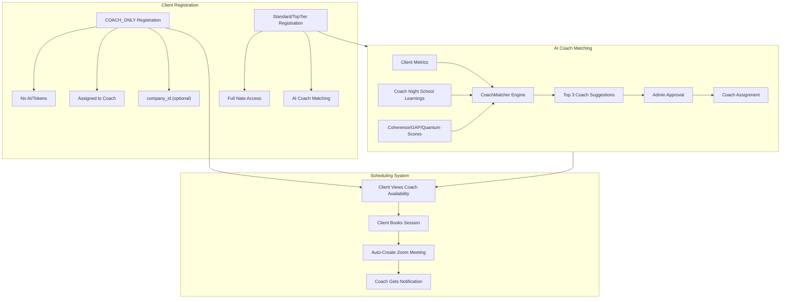

# Coach-Only Client Registration, Scheduling & AI Matching System

## 1. New "COACH_ONLY" Subscription Plan & Company ID

### Changes to [backend/app/websocket/bridge_server.py](backend/app/websocket/bridge_server.py)

**Add the new plan to `plan_details**` (line ~1726):

```python
"COACH_ONLY": {"tokens": 0, "coach_sessions": -1, "price": 0, "duration_days": 365}
# -1 = unlimited coach sessions, 0 tokens = no AI features
```

**Add `company_id` to the registration profile** (line ~936):

- New field: `"company_id": data.get("company_id", None)` -- nullable, like `family_id`
- New field: `"company_name": data.get("company_name", "")` -- human-readable
- When a `company_id` is provided, group these users together (same pattern as `family_id`)

**Modify `register_new_user()**` to handle COACH_ONLY registration:

- Accept optional `registration_type: "COACH_ONLY"` in the registration payload
- If COACH_ONLY:
  - Set `subscription_plan = "COACH_ONLY"`, `subscription_status = "ACTIVE"` (no trial needed)
  - Set `token_balance = 0` (no AI access)
  - Set `tier = "COACH_ONLY"`
  - Require `assigned_coach_id` at registration (the coach who is adding them)
- These clients skip trial period entirely

**Add `COACH_ONLY` to plan checks** throughout `bridge_server.py`:

- Token checks: COACH_ONLY users have 0 tokens, skip all AI/Nate interactions
- Session access: Allow scheduling but block sanctuary/AI/Nate features
- Add to `PREMIUM_TIERS` check exceptions where needed

### Data Model (user_registry.json)

New COACH_ONLY client entry:

```json
{
  "client_coachclient1": {
    "credentials": { "username": "coachclient1", "password": "..." },
    "profile": {
      "role": "CLIENT",
      "subscription_plan": "COACH_ONLY",
      "subscription_status": "ACTIVE",
      "token_balance": 0,
      "assigned_coach": "coach1",
      "assigned_coach_id": "COACH_001",
      "company_id": "COMP_ABC123",
      "company_name": "Wellness Corp",
      "family_id": "FAM_...",
      "can_access_nate": false
    }
  }
}
```

---

## 2. Client-Side Scheduling UI (Mobile)

### Changes to [mobile/lib/main.dart](mobile/lib/main.dart) & [mobile/lib/updated_screens.dart](mobile/lib/updated_screens.dart)

**COACH_ONLY Client App Experience:**

- After login, detect `subscription_plan == "COACH_ONLY"`
- Show a simplified home screen with ONLY:
  - Coach availability calendar
  - Book session button
  - Upcoming sessions list with Zoom join links
  - No Nate, no sanctuary, no AI features

**New WebSocket message types:**

- `client_get_coach_availability` -- fetch assigned coach's available slots
- `client_book_session` -- client books an available slot
- `client_cancel_session` -- client cancels a booked session
- `client_get_upcoming_sessions` -- fetch scheduled sessions with Zoom links

**Scheduling Flow:**

```
Client opens app -> Sees coach's availability calendar
  -> Taps available slot -> Confirms booking
  -> Backend creates session + auto-generates Zoom meeting
  -> Client receives Zoom join link
  -> Coach receives notification of new booking
```

**Zoom for Clients:**

- When a session is booked, the Zoom `join_url` goes to the client
- The Zoom `start_url` (host) goes to the coach
- Client can join via "Join Zoom" button in their upcoming sessions
- Coach still has full Little Nate observation during the Zoom call

---

## 3. Top-Tier Client Schedule Tab

### Changes to [mobile/lib/main.dart](mobile/lib/main.dart)

**Add "Schedule" tab for TOP_TIER / SOVEREIGN_CIRCLE clients:**

- Reuse the same scheduling component from COACH_ONLY
- Appears as a new tab in the main client navigation
- Shows assigned coach's availability
- Allows booking up to their plan's `coach_sessions` limit (4/month for TOP_TIER)
- Shows upcoming sessions with Zoom join links
- Enforces session limits based on plan

**Gating logic:**

- TRIAL / STANDARD: No schedule tab (no coach sessions in plan)
- TOP_TIER: Schedule tab visible, limited to 4 sessions/month
- COACH_ONLY: Schedule-only app (full scheduling, unlimited sessions)

---

## 4. Little Nate AI Coach-Client Matching Engine

### New file: [backend/app/services/coach_matcher.py](backend/app/services/coach_matcher.py)

**Purpose:** AI-powered matching of clients to coaches using Night School learned history and quantum metrics.

**Matching Algorithm - Input Data:**

1. **Client Scores** (from `Vaults/Clients/{id}/metrics.json`):
  - `C_emo` (coherence score)
  - `GAP` (emotional gap score)
  - `Quantum` (composite wellness score)
  - Session history patterns
2. **Coach Observations** (from Night School learning):
  - Coach notes/learnings from `coach_learning_queue.json` and `coach_learning_archive.json`
  - Coach specialties from profile (`specialty` field)
  - Coach performance metrics (retention_rate, satisfaction, breakthroughs)
3. **Night School Wisdom** (from `Vaults/Admin/night_school/wisdom.json`):
  - Categories of learned techniques
  - Coach-specific training strengths

**Matching Algorithm - Scoring:**

```python
class CoachMatcher:
    async def compute_match_score(client_id, coach_id) -> float:
        # 1. Specialty alignment (0.30 weight)
        #    - Compare client's presenting issues/patterns (from story.json)
        #      with coach's specialty and Night School categories
        
        # 2. Coherence compatibility (0.25 weight)
        #    - Clients with low C_emo need coaches with high "emotional_regulation"
        #      wisdom entries
        #    - Clients with high GAP need coaches skilled in "attachment" category
        
        # 3. Coach performance history (0.20 weight)
        #    - Retention rate, satisfaction score, breakthrough count
        #    - Weighted by similarity to current client's profile
        
        # 4. Night School learned observations (0.25 weight)
        #    - GPT-4o analysis of coach learnings vs client needs
        #    - Compares approved wisdom entries tagged to the coach
        #      with the client's story.json patterns/wounds
        
        return weighted_score  # 0.0 - 1.0
    
    async def get_top_matches(client_id, n=3) -> List[MatchResult]:
        # Returns top N coach matches with scores and reasoning
```

**Integration Points:**

- New WebSocket handler: `nate_suggest_coach_match` -- triggers matching for a client
- Admin can view/approve matches via `admin_get_match_suggestions`
- Results stored in `DATA_DIR/coach_match_suggestions.json`
- For STANDARD users: suggest a coach to upgrade to TOP_TIER with
- For TOP_TIER users: auto-suggest optimal coach assignment

### New WebSocket message types in [bridge_server.py](backend/app/websocket/bridge_server.py):

- `nate_suggest_coach_match` -- request match suggestions for a client
- `admin_get_match_suggestions` -- admin views all pending match suggestions
- `admin_approve_match` -- admin approves a match and assigns the coach
- `coach_match_notification` -- notify coach of new assignment

---

## 5. Backend WebSocket Handlers

### Changes to [backend/app/websocket/bridge_server.py](backend/app/websocket/bridge_server.py)

**New handlers to add:**


| Message Type                    | Purpose                                     |
| ------------------------------- | ------------------------------------------- |
| `client_get_coach_availability` | Fetch assigned coach's available time slots |
| `client_book_session`           | Client books a session, auto-creates Zoom   |
| `client_cancel_session`         | Client cancels a booking                    |
| `client_get_upcoming_sessions`  | Get client's scheduled sessions             |
| `nate_suggest_coach_match`      | Trigger AI matching for a client            |
| `admin_get_match_suggestions`   | Admin retrieves match suggestions           |
| `admin_approve_match`           | Approve a coach-client match                |


**Session booking flow (reuses existing `sessions.py` infrastructure):**

- Validate client has an assigned coach or is requesting a match
- Check coach availability from `Vaults/Coaches/{id}/availability.json`
- Check for conflicts (existing logic in sessions.py lines 257-268)
- Create session record with Zoom auto-generation
- Send notification to coach via WebSocket

---

## 6. Company Grouping System

### Changes to [backend/app/websocket/bridge_server.py](backend/app/websocket/bridge_server.py)

**Pattern mirrors `family_id`:**

- `company_id`: Auto-generated as `COMP_{hex}` or provided during registration
- `company_name`: Human-readable name
- When coaches register their external clients (COACH_ONLY), they can assign a company
- Admin can view clients grouped by company (like family view)
- New handler: `admin_get_company_clients` -- list all clients in a company

---

## Architecture Flow




