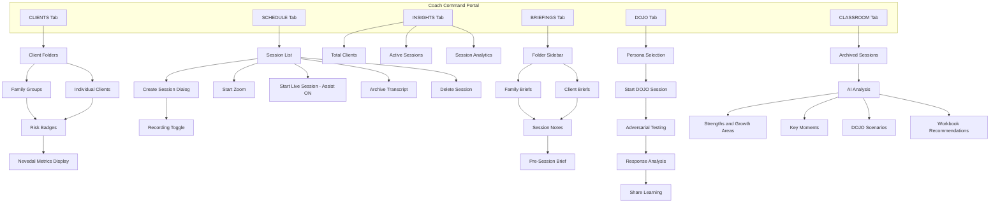
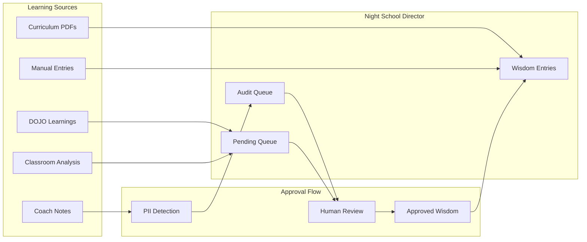
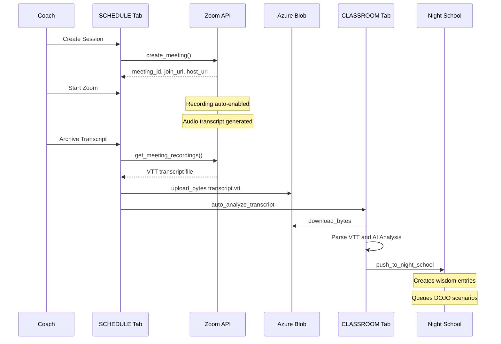
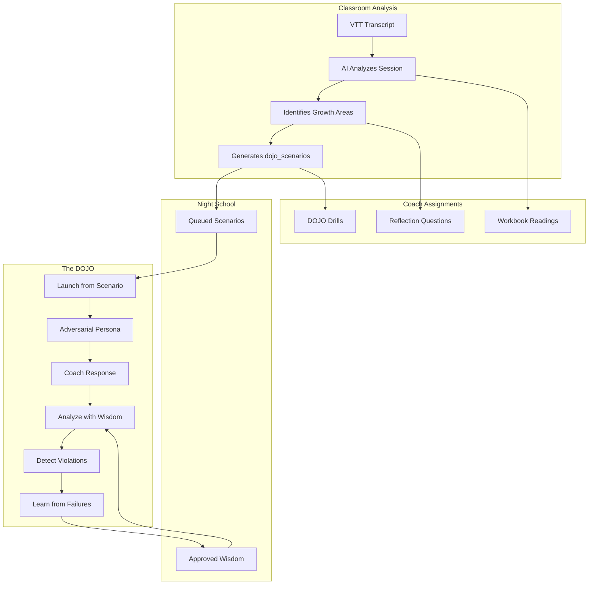
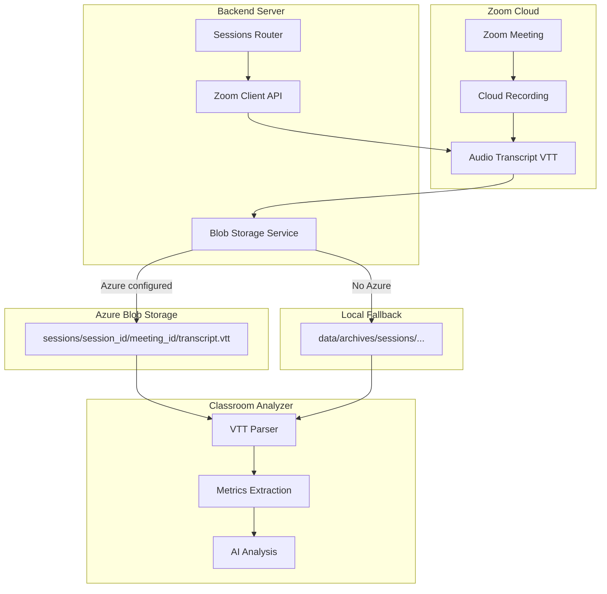
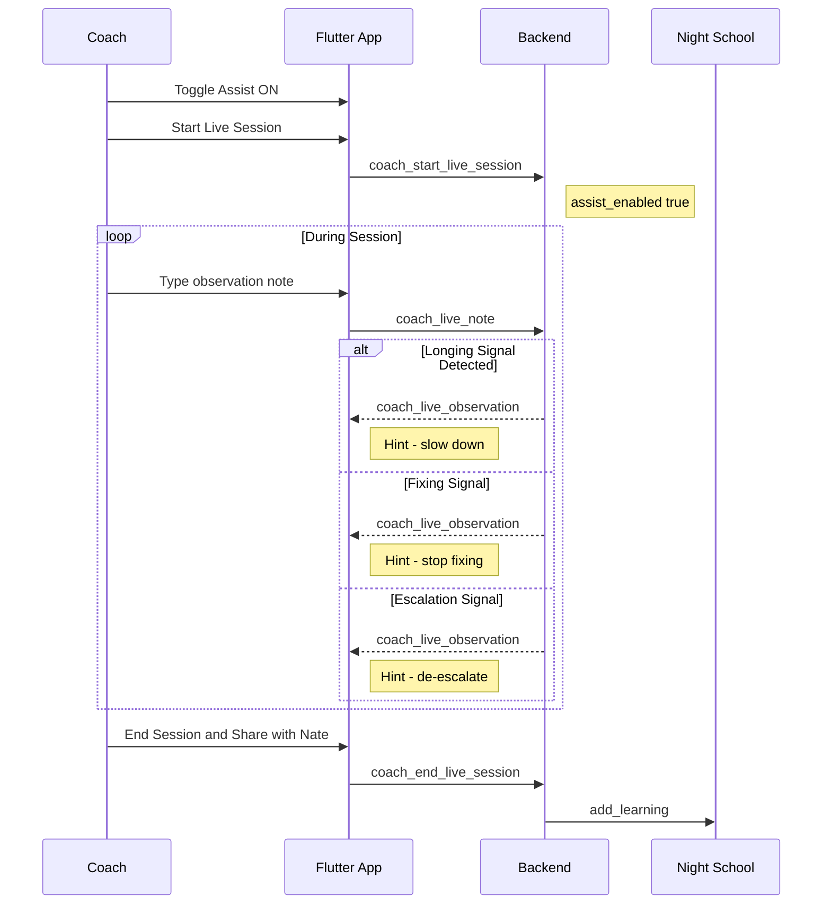
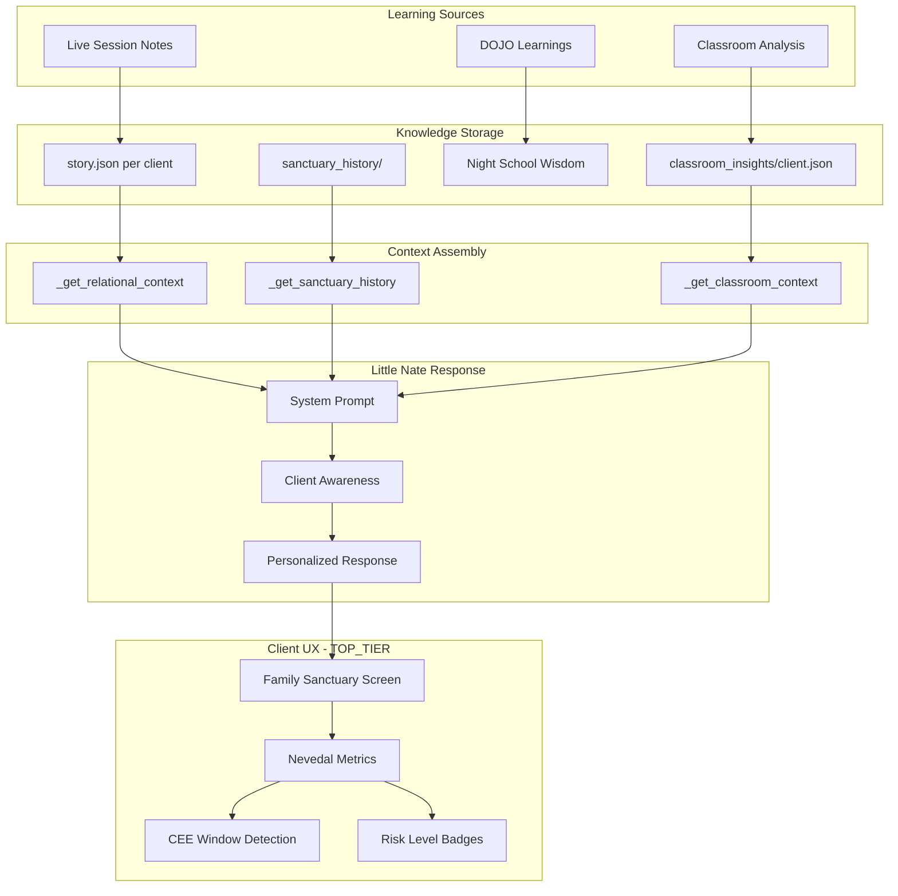
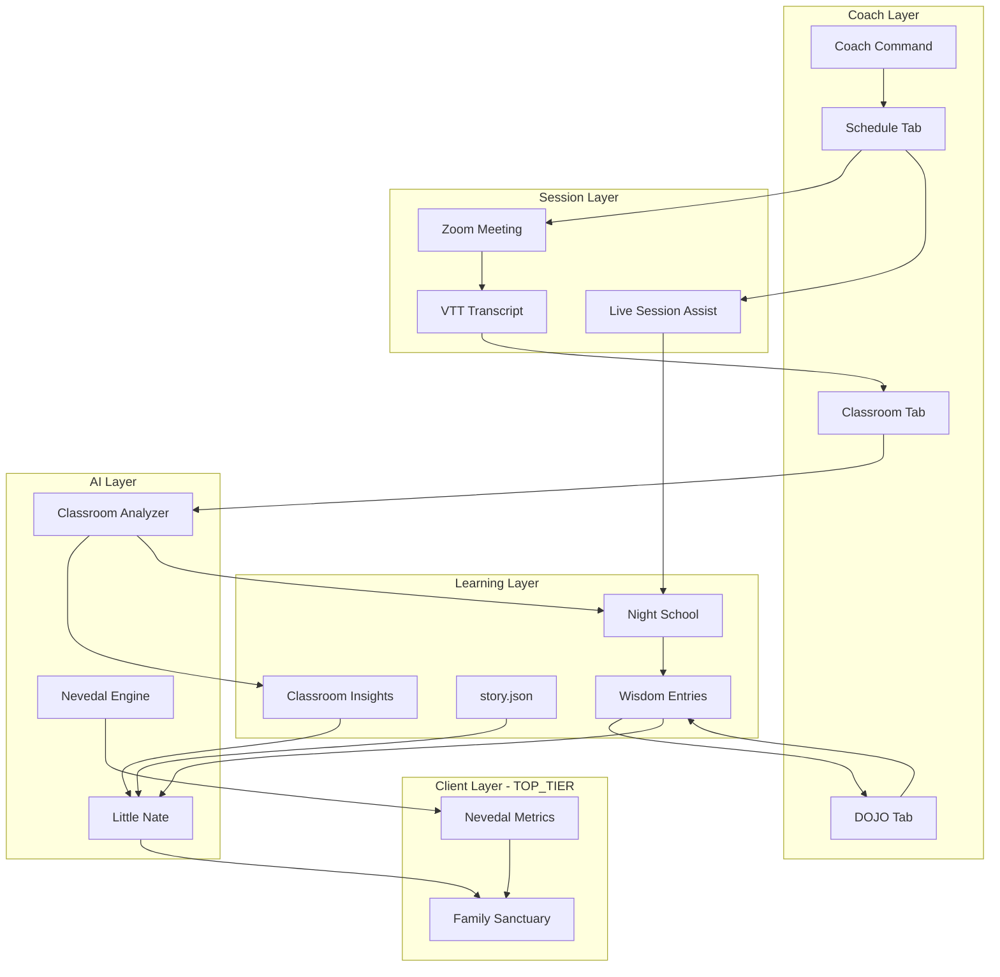

# Little Nate Coach Command - Complete Architecture

## 1. Coach Command Tab Tree




### Tab Functionality Summary


| Tab       | Purpose              | Key Features                     |
| --------- | -------------------- | -------------------------------- |
| CLIENTS   | Client management    | Folders, risk badges, metrics    |
| SCHEDULE  | Session scheduling   | Zoom integration, live assist    |
| INSIGHTS  | Analytics            | Stats, performance metrics       |
| BRIEFINGS | Pre-session prep     | Client briefs, notes, history    |
| DOJO      | Adversarial training | Persona testing, wisdom learning |
| CLASSROOM | Transcript analysis  | AI feedback, assignments         |


---

## 2. Night School Learning Flow




### Wisdom Categories

- `CRISIS_INTERVENTION` - 988 hotline, safety protocols
- `CBT_TECHNIQUES` - Cognitive behavioral methods
- `BOUNDARY_SETTING` - Professional limits
- `ATTACHMENT_THEORY` - EFT, bonding patterns
- `TRAUMA_INFORMED` - Safety, triggers
- `MINDFULNESS` - Presence, grounding
- `FAMILY_SYSTEMS` - Couples, family dynamics
- `MOTIVATIONAL` - Change readiness
- `GENERAL` - Other therapeutic knowledge

### Learning Loop Connections

1. **Classroom -> Night School**: Session insights become pending wisdom entries
2. **DOJO -> Night School**: Test failures create wisdom about safety
3. **Night School -> DOJO**: Approved wisdom informs response analysis
4. **Classroom dojo_scenarios -> DOJO**: Growth areas become test scenarios

---

## 3. Zoom to Classroom Flow




### Zoom Configuration

- **Auto-recording**: Enabled by default (cloud)
- **Coach opt-out**: Toggle in session creation dialog
- **Waiting room**: Enabled for host control
- **Screen share**: Host only
- **Join before host**: Disabled

### Archive Transcript Endpoint

```
POST /api/sessions/{session_id}/zoom/archive_transcript
```

Process:

1. Get recordings from Zoom API
2. Download VTT transcript
3. Upload to Azure Blob Storage
4. Update session metadata
5. Trigger classroom auto-analysis

---

## 4. DOJO and Classroom Integration




### DOJO Personas


| Persona          | Tests                      | Key Violations           |
| ---------------- | -------------------------- | ------------------------ |
| HOSTILE          | Composure under aggression | Defensive responses      |
| CRISIS           | 988/emergency response     | Missing crisis resources |
| SKEPTIC          | Non-defensiveness          | Defensive justification  |
| MINOR            | Age-appropriate handling   | Adult content            |
| MANIPULATIVE     | Confidentiality boundaries | Info disclosure          |
| BOUNDARY_TESTING | Professional limits        | Romantic language        |


### Classroom to DOJO API

```
GET  /api/night-school/dojo/scenarios           # List queued scenarios
POST /api/night-school/dojo/scenarios/{id}/launch  # Start DOJO from scenario
GET  /api/night-school/dojo/wisdom/{persona}    # Get wisdom for persona
GET  /api/night-school/learning/stats           # Learning loop status
```

---

## 5. Azure Storage Flow




### Storage Path Structure

```
Azure Container (or local archives/):
└── sessions/
    └── {session_id}/
        └── {zoom_meeting_id}/
            └── transcript.vtt
```

### Session Metadata After Archive

```json
{
    "session_id": "...",
    "zoom_meeting_id": "...",
    "transcript_archived_at": "2026-02-05T...",
    "transcript_storage": "azure",
    "transcript_location": "https://storageaccount.blob.core.windows.net/..."
}
```

---

## 6. Live Session Assist Flow




### Signal Detection Keywords


| Signal Type | Keywords                                           |
| ----------- | -------------------------------------------------- |
| LONGING     | longing, need, i never, i always, i feel, i'm hurt |
| FIXING      | fix, solution, should, just, advice                |
| ESCALATION  | angry, shut down, silent, leave, divorce           |


### Live Session Storage

```json
{
    "live_id": "LS_abc123",
    "status": "ACTIVE",
    "assist_enabled": true,
    "notes": ["..."],
    "observations": ["..."]
}
```

Location: `backend_data/coach_live_sessions.json`

---

## 7. Lived Wisdom to Client UX




### story.json Structure

Location: `Vaults/Clients/{client_id}/story.json`

```json
{
  "who_you_are": {
    "strengths": ["empathetic", "creative"],
    "values": ["family", "honesty"]
  },
  "wounds": {
    "core_wounds": ["abandonment"],
    "recent_hurts": ["job loss"]
  },
  "growth": {
    "breakthroughs": [
      {"date": "2026-01-15", "insight": "Recognized pattern"}
    ]
  },
  "patterns": {
    "when_activated": ["withdraws when criticized"],
    "session_patterns": ["tends to intellectualize"]
  },
  "therapeutic_alliance": {
    "what_builds_trust": ["directness", "humor"]
  },
  "little_nate_notes": {
    "remember_to": ["check on job search"],
    "watch_for": ["signs of isolation"]
  }
}
```

### Classroom Insights Structure

Location: `classroom_insights/{client_id}.json`

```json
{
  "client_id": "...",
  "sessions_analyzed": 5,
  "emotional_patterns": ["anxiety around change"],
  "engagement_level": "high",
  "session_summaries": [
    {"date": "...", "summary": "Explored attachment fears"}
  ]
}
```

---

## 8. TOP_TIER vs Standard Features


| Feature            | THRESHOLD  | INNER_CHAMBER | SOVEREIGN_CIRCLE |
| ------------------ | ---------- | ------------- | ---------------- |
| Price              | Free 7-day | $49/mo        | $149/mo          |
| Family Sanctuary   | Trial      | Yes           | Yes              |
| Nevedal Metrics    | Basic      | Full          | Full             |
| Coaching Sessions  | No         | No            | Yes (packs)      |
| Recorded Sessions  | No         | No            | Yes              |
| Pre-Session Briefs | No         | No            | Yes              |
| Family Linking     | No         | No            | Spouse + 1       |
| Classroom Analysis | No         | No            | Yes              |


---

## 9. Complete System Integration




---

## 10. Key Files Reference


| Component             | File                                            |
| --------------------- | ----------------------------------------------- |
| Coach Command UI      | `mobile/lib/updated_screens.dart`               |
| Night School Director | `backend/app/services/night_school_director.py` |
| Classroom Analyzer    | `backend/app/services/classroom_analyzer.py`    |
| Zoom Client           | `backend/app/services/zoom_client.py`           |
| Blob Storage          | `backend/app/services/blob_storage.py`          |
| Nevedal Engine        | `backend/app/services/nevedal_engine.py`        |
| Bridge Server         | `backend/app/websocket/bridge_server.py`        |
| Sessions API          | `backend/app/routers/sessions.py`               |
| Night School API      | `backend/app/routers/night_school_api.py`       |


---

## Learning Loop Summary

This architecture creates a continuous learning loop:

1. Coaches conduct sessions (Zoom + Live Assist)
2. Transcripts are analyzed (Classroom)
3. Insights become wisdom (Night School)
4. Wisdom improves DOJO testing and Little Nate responses
5. Better responses improve client outcomes (Family Sanctuary)
6. Client progress updates story.json
7. Cycle repeats with enriched context

