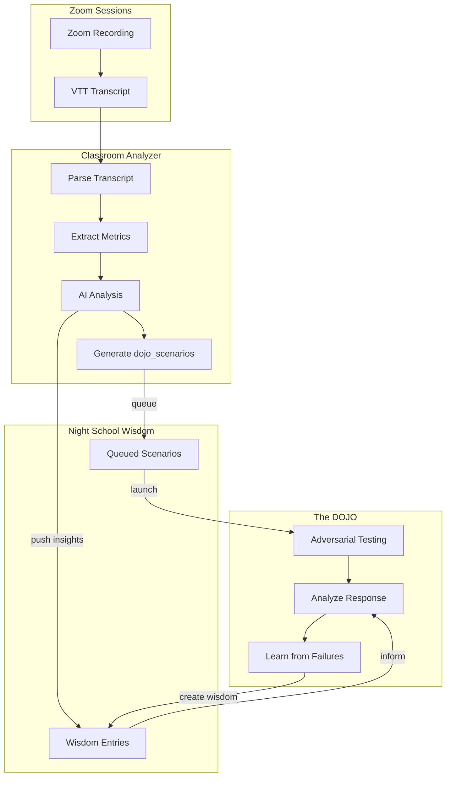

# Coach Command Full Verification Plan

## Current Status

All 6 tabs are implemented, but deployment is incomplete:


| Component              | Local Status                | Server Status             |
| ---------------------- | --------------------------- | ------------------------- |
| Frontend (Flutter web) | Updated with Zoom fix       | Needs rebuild + deploy    |
| Backend services       | Updated with learning loops | Needs file copy + restart |
| Zoom integration       | Configured                  | Ready                     |


---

## Step 1: Rebuild Flutter Web App

The Zoom launcher was just fixed to use `html.window.open` via the existing `launchDojoUrl` function.

```bash
cd /Users/nathannevedal/Desktop/Clinical-Sovereignty-Lab-2/mobile
flutter build web --release
```

---

## Step 2: Deploy Frontend to Server

From local Mac terminal:

```bash
scp -r /Users/nathannevedal/Desktop/Clinical-Sovereignty-Lab-2/mobile/build/web/* \
  root@68.183.168.75:/var/www/sovereignsanctuary-web/
```

---

## Step 3: Deploy Backend Files

Copy the 3 updated files to the server:

```bash
scp /Users/nathannevedal/Desktop/Clinical-Sovereignty-Lab-2/backend/app/services/night_school_director.py \
  root@68.183.168.75:/opt/clinical-sovereignty-lab/backend/app/services/

scp /Users/nathannevedal/Desktop/Clinical-Sovereignty-Lab-2/backend/app/services/classroom_analyzer.py \
  root@68.183.168.75:/opt/clinical-sovereignty-lab/backend/app/services/

scp /Users/nathannevedal/Desktop/Clinical-Sovereignty-Lab-2/backend/app/routers/night_school_api.py \
  root@68.183.168.75:/opt/clinical-sovereignty-lab/backend/app/routers/
```

---

## Step 4: Restart Backend Container

```bash
ssh root@68.183.168.75 "cd /opt/clinical-sovereignty-lab && docker compose -f docker-compose.prod.yml restart backend"
```

---

## Step 5: Verification Checklist

### Frontend Verification


| Feature          | Tab       | Test                                                      |
| ---------------- | --------- | --------------------------------------------------------- |
| Zoom Launch      | SCHEDULE  | Click "Start Zoom" - should open Zoom directly in new tab |
| Session Creation | SCHEDULE  | Create new session with Zoom link                         |
| Recording Toggle | SCHEDULE  | Toggle "Disable Recording" in session dialog              |
| 3-dot Menu       | SCHEDULE  | Verify Archive/Delete options visible                     |
| Delete Session   | SCHEDULE  | Delete session removes it from list                       |
| Classroom Tab    | CLASSROOM | Tab visible and lists archived sessions                   |
| DOJO Tab         | DOJO      | Opens Dojo interface                                      |


### Backend Verification

Test the new learning loop endpoints:

```bash
# Check learning stats (should show connections status)
curl https://api.sovereignsanctuary.net/api/night-school/learning/stats

# Get queued DOJO scenarios from classroom
curl https://api.sovereignsanctuary.net/api/night-school/dojo/scenarios
```

---

## What Was Fixed

### Zoom Launcher ([updated_screens.dart](mobile/lib/updated_screens.dart))

- Changed from `url_launcher` plugin to `launchDojoUrl()` 
- Uses `html.window.open()` directly on web (avoids MissingPluginException)
- Same pattern already used by DOJO tab

### Learning Loop Connections ([night_school_director.py](backend/app/services/night_school_director.py))

- `learn_from_dojo_session()` - DOJO failures create wisdom entries
- `learn_from_classroom_analysis()` - Classroom insights become wisdom
- `get_wisdom_for_dojo_analysis()` - DOJO uses approved wisdom
- `create_dojo_from_classroom_scenario()` - Launch DOJO from classroom scenarios

### Classroom Integration ([classroom_analyzer.py](backend/app/services/classroom_analyzer.py))

- `_push_to_night_school()` - Pushes analysis insights to Night School after AI analysis completes

### New API Endpoints ([night_school_api.py](backend/app/routers/night_school_api.py))

- `GET /api/night-school/dojo/scenarios` - List queued scenarios
- `POST /api/night-school/dojo/scenarios/{id}/launch` - Launch DOJO from scenario
- `GET /api/night-school/learning/stats` - Learning loop status

---

## Architecture: Learning Loop Flow




