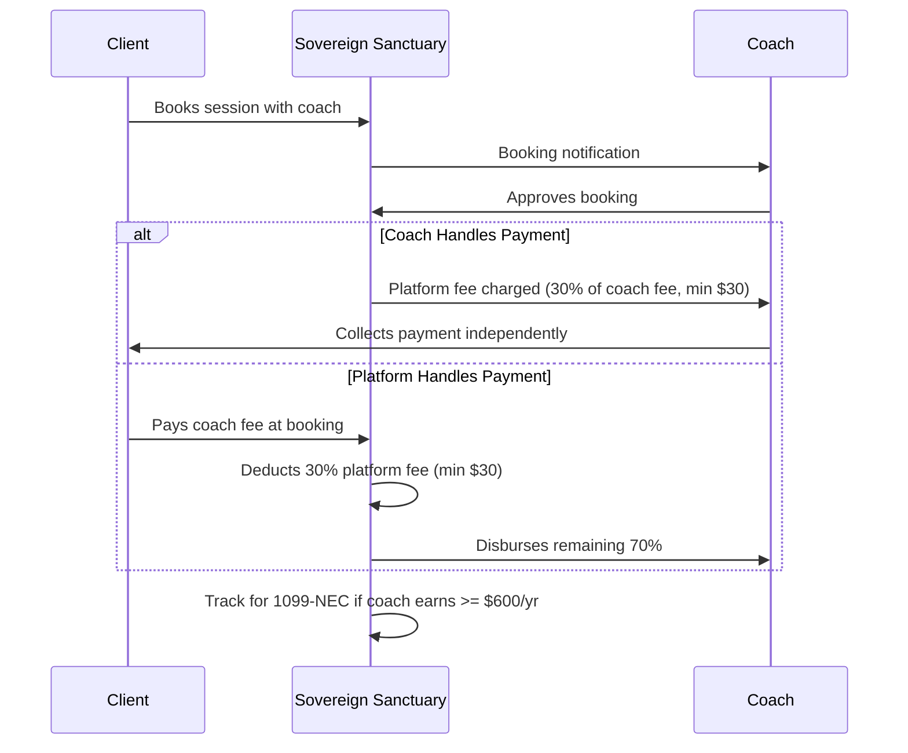

# Coach Financial System

## Overview

Coaches are 1099 independent contractors who set their own fees. When a coach-only client books and the coach approves, the platform charges 30% of the coach's fee (minimum $30). Two payment modes: coach collects payment independently, or the platform handles it. A new FINANCIALS tab in Coach Command tracks all earnings, fees, and provides W-9/1099 management.

## Money Flow




## Changes Required

### 1. Backend: Coach Profile Fields

**File:** [backend/app/websocket/bridge_server.py](backend/app/websocket/bridge_server.py) -- `register_new_user()` coach section (line ~998)

Add to the coach profile:

```python
if role == "COACH":
    new_profile["coaching_fee"] = 0  # Coach sets this (hourly rate in dollars)
    new_profile["platform_fee_pct"] = 30  # 30% platform cut
    new_profile["platform_fee_min"] = 30.00  # Minimum $30 per session
    new_profile["payment_mode"] = "coach_handles"  # or "platform_handles"
    new_profile["total_earnings_ytd"] = 0.0  # Year-to-date earnings
    new_profile["total_platform_fees_ytd"] = 0.0
    new_profile["total_sessions_billable"] = 0
    new_profile["w9_submitted"] = False
    new_profile["w9_data"] = {}  # Name, TIN, address, etc.
    new_profile["requires_1099"] = False  # True when earnings >= $600
    new_profile["financial_ledger"] = []  # Transaction history
```

### 2. Backend: Booking Approval Flow

**File:** [backend/app/websocket/bridge_server.py](backend/app/websocket/bridge_server.py)

Currently bookings are auto-confirmed. Add a coach approval step:

**New WebSocket handlers:**

- `coach_approve_booking` -- Coach approves a pending booking. Calculates platform fee, records transaction, notifies client.
- `coach_decline_booking` -- Coach declines. Notifies client.
- `coach_set_fee` -- Coach updates their hourly rate.
- `coach_set_payment_mode` -- Toggle between "coach_handles" and "platform_handles".
- `coach_get_financials` -- Returns financial summary and ledger for the FINANCIALS tab.
- `coach_submit_w9` -- Stores W-9 data on coach profile.

**Modify existing `client_book_session`:** Change session status from "scheduled" to "pending_approval". Send notification to coach with session details and fee calculation.

**Fee calculation logic:**

```python
def calculate_platform_fee(coach_fee):
    fee = coach_fee * 0.30
    return max(fee, 30.00)  # Minimum $30
```

**Transaction record structure:**

```python
{
    "txn_id": "TXN_...",
    "date": "2026-02-07",
    "type": "session_fee",  # or "platform_fee", "payout"
    "session_id": "...",
    "client_name": "...",
    "coach_fee": 175.00,
    "platform_fee": 52.50,  # 30% of 175
    "coach_payout": 122.50,  # 70% of 175
    "status": "recorded"  # or "pending", "paid", "disbursed"
}
```

### 3. Flutter: New FINANCIALS Tab

**File:** [mobile/lib/updated_screens.dart](mobile/lib/updated_screens.dart)

Add a 7th tab to `CoachDashboardScreenV2`:

**Update tab definitions** (line ~4060):

```dart
static const _tabLabels = ["CLIENTS", "SCHEDULE", "INSIGHTS", "BRIEFINGS", "DOJO", "CLASSROOM", "FINANCIALS"];
static const _tabIcons = [..., Icons.account_balance_wallet];
```

Update `TabController(length: 7, ...)`.

`**_buildFinancialsTab()` sections:**

- **Summary Cards** (top row):
  - Earnings This Month / YTD
  - Platform Fees This Month / YTD
  - Net Payout This Month / YTD
  - Sessions Billed
- **My Coaching Rate**: Display current rate with edit button. Coach can update their hourly fee.
- **Payment Mode Toggle**: Switch between "I collect payment" and "Platform handles payment"
- **Transaction Ledger**: Scrollable list of all transactions (date, client, gross fee, platform fee, net payout, status). Filter by month.
- **Tax Documents Section**:
  - W-9 status badge (submitted / not submitted)
  - "Update W-9" button
  - 1099-NEC status: "On track for 1099" if YTD >= $600, with projected annual amount
  - Download 1099-NEC (when available, end of year)

### 4. Flutter: W-9 Form in Registration

**File:** [mobile/lib/main.dart](mobile/lib/main.dart)

Add a new step in SignUpWizard for coaches (after dojo selection, before final form):

**W-9 Form Fields:**

- Legal Name (as shown on tax return)
- Business Name (if different)
- Tax Classification (Individual/Sole proprietor, LLC, etc.) -- radio buttons
- Address (street, city, state, ZIP)
- Taxpayer Identification Number (SSN or EIN) -- masked input
- Certification checkbox ("Under penalties of perjury, I certify...")
- Electronic Signature (typed name + date)

The W-9 data is sent as `w9_data` in the `register_request` payload. Stored encrypted on the profile (for now stored as-is in JSON; encryption added when Stripe goes live).

### 5. Flutter: Booking Approval in SCHEDULE Tab

**File:** [mobile/lib/updated_screens.dart](mobile/lib/updated_screens.dart)

Modify `_buildScheduleTab()` to show pending bookings with approve/decline buttons:

- Pending bookings show in an "AWAITING YOUR APPROVAL" section at the top
- Each pending card shows: client name, date/time, session duration, fee breakdown (coach fee, platform fee, coach net)
- "Approve" button (green) -- sends `coach_approve_booking`
- "Decline" button (red) -- sends `coach_decline_booking` with optional reason

### 6. Admin: Financial Visibility in The Eye

**File:** [dashboard/the_eye.html](dashboard/the_eye.html)

Add a "Platform Revenue" section:

- Total platform fees collected (monthly / YTD)
- Revenue by coach (table: coach name, sessions, gross fees, platform fees)
- Coaches approaching 1099 threshold ($600)
- Outstanding platform fees

This data comes from the existing admin WebSocket handlers -- add a `admin_get_financial_summary` handler that aggregates coach financial ledgers.

### 7. Backend: Admin Financial Handler

**File:** [backend/app/websocket/bridge_server.py](backend/app/websocket/bridge_server.py)

Add `admin_get_financial_summary` handler that:

- Iterates all coach profiles
- Sums `total_earnings_ytd`, `total_platform_fees_ytd`
- Identifies coaches with `total_earnings_ytd >= 600` (1099 threshold)
- Returns summary to admin dashboard

## Files to Modify

- [backend/app/websocket/bridge_server.py](backend/app/websocket/bridge_server.py) -- Coach profile fields, booking approval handlers, fee calculation, financial handlers
- [mobile/lib/updated_screens.dart](mobile/lib/updated_screens.dart) -- New FINANCIALS tab, booking approval UI in SCHEDULE tab
- [mobile/lib/main.dart](mobile/lib/main.dart) -- W-9 form step in coach registration
- [dashboard/the_eye.html](dashboard/the_eye.html) -- Platform revenue section
- [dashboard/night_school_dojo.html](dashboard/night_school_dojo.html) -- No changes for this feature

## Implementation Order

Since this builds on the registration redesign plan, implement in this order:

1. Backend: Coach profile fields + fee calculation + booking approval handlers
2. Flutter: Booking approval in SCHEDULE tab
3. Flutter: FINANCIALS tab
4. Flutter: W-9 form in registration
5. Admin: Financial visibility in The Eye
6. Backend: Admin financial summary handler

## What Does NOT Change (Yet)

- Actual Stripe payment processing -- UI/tracking only for now
- Real fund disbursement -- tracked but not automated
- 1099-NEC generation -- tracked, generated manually for now
- W-9 encryption -- stored as-is until Stripe Connect is wired up

