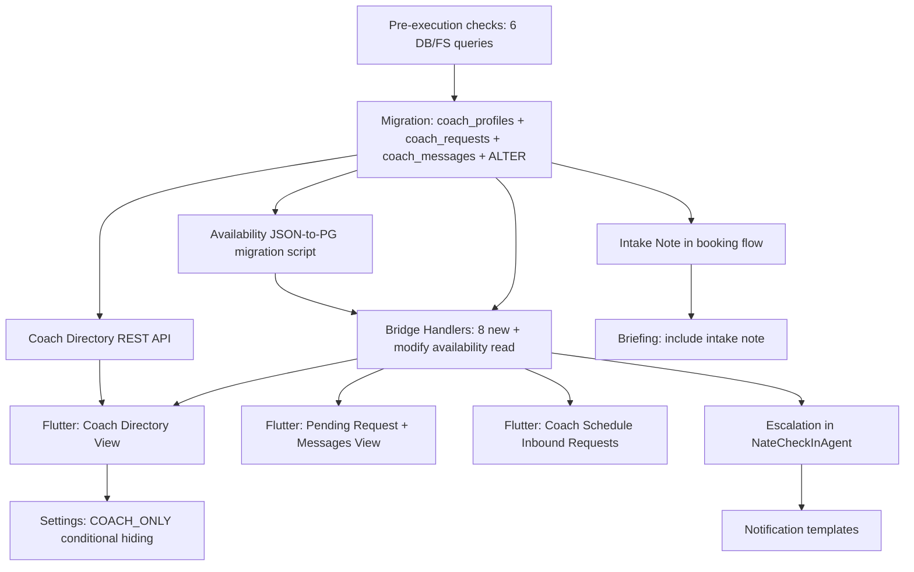

# Coach Only Client Experience and Coach Command Schedule Enhancements

## Fixes Applied (Apr 16 update)

| Fix | Section | Change |
|-----|---------|--------|
| FIX 1 | 1b | Replaced `UNIQUE(client_id, coach_user_id, status)` with two partial unique indexes (`idx_coach_requests_active` on pending per coach-client pair, `idx_coach_requests_one_pending` on one pending per client) |
| FIX 2 | 1f, 3b | `coach_accept_request` wraps profile_data update + coach_assignments insert + caseload update in a single DB transaction. All or nothing. |
| FIX 3 | 1a | `accepting_new_clients` defaults to `false` in migration seeding. Coaches must opt in to appear in the directory. |
| FIX 4 | 1g, 5a | Added availability.json-to-PG migration step as a prerequisite. Parse 7 JSON files, INSERT into `coach_availability`, verify, THEN switch bridge handler. |
| FIX 5 | 2d, bridge | 24-hour nudge rate limit enforced SERVER-SIDE in bridge handler. Bridge checks `last_nudge_at > NOW() - INTERVAL '24 hours'` and rejects with `coach_request_nudge_error`. Flutter UI disable is informational only. |
| FIX 6 | 1c, 2d, 3e | Added `coach_messages` table for pre-acceptance coach-to-client messaging. One-directional v1: coach sends, client sees in pending request view and as push notification. Client cannot reply. |
| FIX 7 | Pre-checks | All 6 pre-execution checks must be run and reported before writing any code. Results documented in the infrastructure audit section. |

---

## Existing Infrastructure Audit

Before planning new work, here is what already exists and must NOT be duplicated.

### What Already Exists

**Coach-client assignment** (bridge_server.py ~15139):
- Three fields on client `profile_data`: `coach_id`, `assigned_coach_id`, `assigned_coach`
- `coach_assignments` junction table (migration 083) for multi-entity assignment
- `coach_hierarchy` table (migration 068) for master/assistant relationships
- `coach_get_clients` handler checks all three fields + hierarchy + sessions.json

**Session scheduling** (two parallel stacks):
- **File-based**: `Vaults/Coaches/{coach_id}/availability.json` — used by bridge handlers `client_get_coach_availability`, `client_book_session` and REST endpoints in [sessions.py](backend/app/routers/sessions.py)
- **PG-based**: `coach_availability` table + `coaching_sessions` table — used by [schedule_api.py](backend/app/routers/schedule_api.py) (`/api/coach/schedule/availability`, `/api/coach/schedule/calendar`)
- Both stacks are live; the file-based stack is what Flutter currently uses

**Client scheduling screen** ([main.dart](mobile/lib/main.dart) ~10189):
- `ClientScheduleScreen` — already the landing screen for COACH_ONLY tier
- WebSocket messages: `client_get_upcoming_sessions`, `client_get_coach_availability`, `client_book_session`, `client_cancel_session`
- Shows upcoming sessions, date picker, available slots, Book/Cancel

**Coach Schedule tab** ([updated_screens.dart](mobile/lib/updated_screens.dart) ~6750):
- `_buildScheduleTab()` — pending bookings (approve/decline with fee breakdown), confirmed sessions list
- WebSocket: `coach_get_pending_bookings`, `coach_approve_booking`, `coach_decline_booking`
- Zoom integration: Start Zoom, recording status, archive transcript

**Settings screen** ([settings_screen.dart](mobile/lib/screens/settings_screen.dart)):
- `_currentPlanKey` already returns `'COACH_ONLY'` for Coach Only users
- `_hasVaultAccess` already excludes COACH_ONLY
- `_isSovereignCircle` gates Family section
- 19 sections rendered for clients; no COACH_ONLY conditional hiding beyond vault

**Notification system** ([notification_system.py](backend/app/websocket/notification_system.py)):
- WebSocket push via `_push_to_websocket(hardware_id, notification)`
- Email via SendGrid (`_send_email`)
- SMS via Twilio (`send_sms`)
- No Firebase/APNs mobile push — all real-time delivery is WebSocket

**Tier routing** (main.dart ~6736):
- COACH_ONLY clients already route to `ClientScheduleScreen` after login
- `can_access_nate == false` also routes there

### What Does NOT Exist (Must Be Built)

- No `coach_profiles` table (coach bio, specialties, accepting_new_clients, etc. — currently scattered in `profile_data` JSONB)
- No `coach_requests` table (client-initiated coach selection)
- No `coach_messages` table (pre-acceptance coach-to-client messaging)
- No coach directory screen (client-facing browse/select)
- No coach request accept/decline WebSocket handlers
- No intake note field on `coaching_sessions` (confirmed missing via production query)
- No request escalation/nudge scheduled task
- No conditional settings hiding for COACH_ONLY tier

### Pre-Execution Checks (must pass before any code is written)

All 6 checks were run against production on Apr 16, 2026. Results:

1. **Coach profile_data keys**: 102 distinct keys found. Relevant existing keys: `specialties`, `specializations`, `specialty` (3 overlapping), `zoom_link`, `name`, `profile_photo_url`, `coaching_style`, `coaching_fee`, `hourly_rate`, `client_count`. Missing: `bio`, `accepting_new_clients`, `max_caseload`, `years_experience`.

2. **session_notifications table**: EXISTS in public schema.

3. **coaching_sessions.intake_note**: DOES NOT EXIST (0 rows). Column must be added.

4. **availability.json files**: 7 files across 7 coach directories. All need JSON-to-PG migration.

5. **coach_availability table**: EXISTS with columns: `id` (UUID PK), `coach_id` (UUID FK to users.id), `day_of_week` (INT 0-6), `start_time`/`end_time` (TIME), `specific_date` (DATE — already exists), `is_available` (BOOL), `recurring` (BOOL), `max_sessions_per_slot`, `session_duration_minutes`, `calendar_sync_email`, `created_at`/`updated_at`. Missing: `is_blocked` column. Note: `coach_id` is UUID FK, not hardware_id.

6. **coach_hierarchy table**: EXISTS with `master_coach_id` (VARCHAR 64, hardware_id), `assistant_id` (VARCHAR 64), `status`, timestamps. UNIQUE on `(master_coach_id, assistant_id)`.

---

## SECTION 1 — DATABASE SCHEMA CHANGES

### 1a. `coach_profiles` — NEW TABLE

```sql
CREATE TABLE IF NOT EXISTS coach_profiles (
    id UUID PRIMARY KEY DEFAULT gen_random_uuid(),
    coach_user_id VARCHAR NOT NULL UNIQUE,  -- hardware_id from users
    username VARCHAR,                        -- users.username
    display_name VARCHAR NOT NULL,
    photo_url TEXT,
    bio TEXT,
    specialty_tags JSONB DEFAULT '[]'::jsonb, -- ["couples","trauma","family","addiction"]
    years_experience INT DEFAULT 0,
    accepting_new_clients BOOLEAN DEFAULT false, -- FIX 3: coaches must opt in
    max_caseload INT DEFAULT 20,
    current_caseload INT DEFAULT 0,
    zoom_link TEXT,                           -- manual Zoom PMI link
    session_duration_minutes INT DEFAULT 60,
    master_coach_id VARCHAR,                 -- FK concept to users hardware_id
    created_at TIMESTAMPTZ DEFAULT NOW(),
    updated_at TIMESTAMPTZ DEFAULT NOW()
);
CREATE INDEX idx_coach_profiles_accepting ON coach_profiles(accepting_new_clients) WHERE accepting_new_clients = true;
```

**Seeding** (FIX 3): On migration, INSERT from existing `users` WHERE `role = 'COACH'`, pulling `profile_data->>'name'` as `display_name`, `profile_data->>'zoom_link'` as `zoom_link`, coalescing `specialties`/`specializations`/`specialty` into `specialty_tags`, `profile_data->>'profile_photo_url'` as `photo_url`. **`accepting_new_clients` defaults to `false`** — coaches must explicitly opt in via Coach Command settings before appearing in the directory. This prevents surprise directory listings.

### 1b. `coach_requests` — NEW TABLE

```sql
CREATE TABLE IF NOT EXISTS coach_requests (
    request_id UUID PRIMARY KEY DEFAULT gen_random_uuid(),
    client_id VARCHAR NOT NULL,              -- hardware_id
    client_username VARCHAR,
    coach_user_id VARCHAR NOT NULL,          -- hardware_id
    intake_note TEXT,
    status VARCHAR NOT NULL DEFAULT 'pending'
        CHECK (status IN ('pending','accepted','declined','cancelled_by_client')),
    requested_at TIMESTAMPTZ DEFAULT NOW(),
    responded_at TIMESTAMPTZ,
    decline_reason TEXT,                     -- internal, not shown to client
    last_nudge_at TIMESTAMPTZ,
    nudge_count INT DEFAULT 0
);

-- FIX 1: Replace compound UNIQUE with two partial unique indexes
-- Prevents a client from having two pending requests to the same coach
CREATE UNIQUE INDEX idx_coach_requests_active
    ON coach_requests(client_id, coach_user_id)
    WHERE status = 'pending';

-- Prevents a client from having more than one pending request total
CREATE UNIQUE INDEX idx_coach_requests_one_pending
    ON coach_requests(client_id)
    WHERE status = 'pending';

-- Lookup indexes
CREATE INDEX idx_coach_requests_coach_pending ON coach_requests(coach_user_id, status)
    WHERE status = 'pending';
CREATE INDEX idx_coach_requests_client ON coach_requests(client_id, status);
```

**Why partial indexes instead of UNIQUE constraint** (FIX 1): The original `UNIQUE(client_id, coach_user_id, status)` would allow a client to have pending requests to multiple coaches simultaneously (different `coach_user_id` values) and would also conflict when a client requests, gets declined, then re-requests the same coach (same tuple with `status='declined'` already exists). Partial indexes solve both: `idx_coach_requests_one_pending` enforces one pending request per client globally, and `idx_coach_requests_active` prevents duplicates to the same coach while pending. Declined/cancelled rows are not constrained.

### 1c. `coach_messages` — NEW TABLE (FIX 6)

```sql
CREATE TABLE IF NOT EXISTS coach_messages (
    id UUID PRIMARY KEY DEFAULT gen_random_uuid(),
    from_id VARCHAR NOT NULL,   -- coach hardware_id (coach-to-client only in v1)
    to_id VARCHAR NOT NULL,     -- client hardware_id
    request_id UUID,            -- FK concept to coach_requests.request_id
    message_text TEXT NOT NULL,
    read_at TIMESTAMPTZ,
    created_at TIMESTAMPTZ DEFAULT NOW()
);
CREATE INDEX idx_coach_messages_to ON coach_messages(to_id, created_at DESC);
CREATE INDEX idx_coach_messages_request ON coach_messages(request_id) WHERE request_id IS NOT NULL;
```

**Purpose**: Pre-acceptance messaging. A coach can send a message to a client who has a pending request before accepting or declining. One-directional in v1 — coach sends, client receives as push notification and sees in pending request view. Client cannot reply (they can use the intake note for their side). `request_id` links the message to the specific request for context.

### 1d. `coach_availability` — EXISTS, needs `is_blocked`

Table exists from migrations 001/081/093. Production schema confirmed. `specific_date` and `recurring` already exist.

**What needs adding**:
```sql
ALTER TABLE coach_availability ADD COLUMN IF NOT EXISTS is_blocked BOOLEAN DEFAULT false;
```

Note: `coach_id` is UUID FK to `users(id)`, not hardware_id. Bridge handlers that use hardware_id must resolve to UUID for availability queries.

### 1e. `coaching_sessions` — EXISTS, needs `intake_note`

Confirmed missing via production query. 47 columns already exist.

```sql
ALTER TABLE coaching_sessions ADD COLUMN IF NOT EXISTS intake_note TEXT;
```

### 1f. Coach assignment — transactional accept (FIX 2)

**Existing**: Assignment stored on client `profile_data` JSONB (`coach_id`, `assigned_coach_id`, `assigned_coach`). `coach_assignments` table (migration 083) exists for multi-entity assignment.

**Decision**: When a coach accepts a request, the accept handler wraps ALL of these in a **single database transaction** (FIX 2):

```
BEGIN;
  1. UPDATE coach_requests SET status='accepted', responded_at=NOW() WHERE request_id=$1
  2. UPDATE users SET profile_data = jsonb_set(jsonb_set(jsonb_set(profile_data,
       '{coach_id}', ...), '{assigned_coach_id}', ...), '{assigned_coach}', ...)
     WHERE hardware_id = $client_hw_id
  3. INSERT INTO coach_assignments (coach_id, entity_type, entity_id, is_primary)
     VALUES ($coach_hw_id, 'client', $client_hw_id, true)
     ON CONFLICT (coach_id, entity_type, entity_id) DO NOTHING
  4. UPDATE coach_profiles SET current_caseload = current_caseload + 1
     WHERE coach_user_id = $coach_hw_id
COMMIT;
```

If any step fails, the entire transaction rolls back. Notifications are sent AFTER commit succeeds.

### 1g. Availability JSON-to-PG migration (FIX 4)

**Before** switching the bridge handler to read from PG, a one-time migration step must:

1. For each of the 7 coach directories, parse `Vaults/Coaches/{coach_id}/availability.json`
2. Resolve `coach_id` (hardware_id) to UUID via `SELECT id FROM users WHERE hardware_id = $1`
3. INSERT parsed slots into `coach_availability` with `ON CONFLICT DO NOTHING`
4. Log results (N slots migrated per coach)
5. Only AFTER successful migration: update bridge handler to read from PG

This is a Python script run once, NOT a SQL migration. It goes in the implementation step between migration and bridge handler changes.

### Migration file

All SQL schema changes go in a single new migration: `backend/migrations/XXX_coach_only_experience.sql`. The availability JSON-to-PG data migration is a separate one-time script.

---

## SECTION 2 — COACH DIRECTORY (CLIENT SIDE)

### 2a. Where it lives

- COACH_ONLY clients already land on `ClientScheduleScreen` after login (main.dart ~6736)
- **New behavior**: If no coach is assigned AND no pending request exists, show the **coach directory** instead of an empty schedule
- If a request is pending, show the **pending request view**
- If coach is assigned, show the existing `ClientScheduleScreen` (schedule + booking)

**Implementation**: Modify `ClientScheduleScreen` to check assignment state on load and render the appropriate sub-view. No new top-level screen needed.

### 2b. Coach directory UI

New widget: `_buildCoachDirectoryView()` inside `ClientScheduleScreen`

- REST endpoint: `GET /api/coach/directory` (new) — returns coaches WHERE `accepting_new_clients = true`
- Each card: photo, display_name, specialty_tags badges, years_experience, bio (truncated)
- Button: "Request This Coach"
- Empty state: "No coaches are currently accepting new clients. Please check back later."

### 2c. Request flow

- Client taps "Request This Coach" → modal with optional intake note textarea
- WebSocket: `coach_request_submit {coach_user_id, intake_note}`
- Bridge handler validates:
  - Client has no existing pending request (query `coach_requests WHERE client_id = X AND status = 'pending'`)
  - Coach is still accepting clients
- INSERT into `coach_requests`
- Send notification to coach
- Client view transitions to pending request view

### 2d. Pending request view

New widget: `_buildPendingRequestView()` inside `ClientScheduleScreen`

- Shows coach name, photo, "Requested X days ago" timer
- Coach messages section: if `coach_messages` exist for this request, show them in chronological order (read-only, client cannot reply in v1)
- "Remind Coach" button — enabled after 24h since `requested_at` or `last_nudge_at`. **Both Flutter UI and bridge handler enforce the 24h limit** (FIX 5). Bridge handler rejects with error if `last_nudge_at > NOW() - INTERVAL '24 hours'`.
- "Cancel Request" button — sends `coach_request_cancel`, returns to directory

### 2e. WebSocket messages (client-side)

| Message | Direction | Payload |
|---------|-----------|---------|
| `coach_request_submit` | Client sends | `{coach_user_id, intake_note}` |
| `coach_request_cancel` | Client sends | `{request_id}` |
| `coach_request_nudge` | Client sends | `{request_id}` |
| `coach_request_status` | Client receives | `{status, coach_name, coach_photo, requested_at, request_id, messages: [...]}` |
| `coach_request_accepted` | Client receives | `{coach_user_id, coach_name}` |
| `coach_request_declined` | Client receives | `{coach_user_id}` |
| `coach_message_received` | Client receives (push) | `{message_id, coach_name, message_text, created_at}` |
| `coach_request_nudge_error` | Client receives | `{error: "24h rate limit", next_allowed_at}` |

### Files to modify

- **[main.dart](mobile/lib/main.dart)**: Modify `ClientScheduleScreen` to add directory and pending request sub-views, new WebSocket handlers
- **No new Flutter files needed** — extend the existing screen

---

## SECTION 3 — COACH COMMAND: INBOUND REQUESTS

### 3a. Schedule tab enhancement

Modify `_buildScheduleTab()` in [updated_screens.dart](mobile/lib/updated_screens.dart) to add an "INBOUND REQUESTS" section ABOVE the existing pending bookings section.

**Data**: New WebSocket message `coach_get_inbound_requests` fetched during `_fetchDashboard()`.

Each request card shows:
- Client name, requested date, days elapsed
- Intake note (if provided, expandable)
- Accept button (gold), Decline button (muted), Message button

### 3b. Accept flow (FIX 2 — single transaction)

- Coach taps Accept → bridge handler `coach_accept_request {request_id}`
- Bridge wraps ALL database mutations in a single transaction:
  ```
  async with db_pool.acquire() as conn:
      async with conn.transaction():
          1. UPDATE coach_requests SET status='accepted', responded_at=NOW()
          2. UPDATE users SET profile_data = ... (coach_id, assigned_coach_id, assigned_coach)
          3. INSERT INTO coach_assignments ON CONFLICT DO NOTHING
          4. UPDATE coach_profiles SET current_caseload = current_caseload + 1
  ```
- If any step fails → entire transaction rolls back → error response to coach
- Notifications sent ONLY after successful commit:
  5. Send `coach_request_accepted` to client via WebSocket push
  6. Send notification (email/SMS based on preference)
- Client transitions from pending view to schedule view

### 3c. Decline flow

- Coach taps Decline → optional decline reason modal
- Bridge handler `coach_decline_request {request_id, decline_reason}`
- UPDATE `coach_requests` SET status='declined', responded_at=NOW(), decline_reason
- Send `coach_request_declined` to client
- Client returns to coach directory

### 3d. 3-day escalation

Integrate into `NateCheckInAgent` (30-min cycle, already has coach alert patterns):

- Query: `SELECT * FROM coach_requests WHERE status = 'pending' AND requested_at < NOW() - INTERVAL '3 days' AND (last_nudge_at IS NULL OR last_nudge_at < NOW() - INTERVAL '3 days')`
- Send push notification to coach
- If coach has `master_coach_id` in `coach_profiles`: also notify master coach
- UPDATE `last_nudge_at = NOW()`, `nudge_count += 1`

### 3e. Pre-acceptance messaging (FIX 6)

Coach taps "Message" on a pending request card → text input modal → `coach_send_message`:
- Bridge handler validates: coach owns this request, request is still pending, message_text is non-empty
- INSERT into `coach_messages` (from_id=coach_hw_id, to_id=client_hw_id, request_id, message_text)
- Send `coach_message_received` push notification to client via WebSocket
- Client sees message in their pending request view (read-only, no reply in v1)
- On `coach_request_status` load, include all `coach_messages` for the request

### 3f. WebSocket messages (coach-side)

| Message | Direction | Payload |
|---------|-----------|---------|
| `coach_get_inbound_requests` | Coach sends | `{}` |
| `coach_inbound_requests` | Coach receives | `{requests: [{request_id, client_name, intake_note, requested_at, days_elapsed}]}` |
| `coach_accept_request` | Coach sends | `{request_id}` |
| `coach_decline_request` | Coach sends | `{request_id, decline_reason}` |
| `coach_send_message` | Coach sends | `{request_id, message_text}` |
| `coach_message_sent` | Coach receives | `{message_id, created_at}` |
| `coach_request_new` | Coach receives (push) | `{request_id, client_name, intake_note, requested_at}` |
| `coach_request_nudge_alert` | Coach receives (push) | `{request_id, client_name, days_elapsed}` |
| `coach_assistant_escalation` | Master receives (push) | `{assistant_name, client_name, days_elapsed}` |

### Files to modify

- **[updated_screens.dart](mobile/lib/updated_screens.dart)**: Add inbound requests section to `_buildScheduleTab()`, add `_inboundRequests` state variable, add handlers for accept/decline/message
- **[bridge_server.py](backend/app/websocket/bridge_server.py)**: Add handlers for `coach_get_inbound_requests`, `coach_accept_request` (transactional), `coach_decline_request`, `coach_request_submit`, `coach_request_cancel`, `coach_request_nudge` (server-side 24h rate limit), `coach_send_message`
- **[nate_checkin_agent.py](backend/app/services/nate_checkin_agent.py)**: Add request escalation check in the 30-min cycle

---

## SECTION 4 — COACH RELATIONSHIP VIEW (CLIENT SIDE)

### 4a. Coach relationship home

This is the **existing** `ClientScheduleScreen` behavior when a coach is assigned — it already shows upcoming sessions, date picker, available slots, and booking.

**Enhancements needed**:
- Add coach info header (name, photo, specialty tags) — fetch from `GET /api/coach/directory/{coach_user_id}` or include in availability response
- Add past sessions list below upcoming sessions
- Show intake note on session cards

### 4b. Session booking with intake note

**Existing flow**: Client picks date → sees slots → taps Book → `client_book_session` fires.

**Enhancement**: After slot selection, show intake note modal: "What would you like to focus on in this session?" (required, min 10 chars). Pass `intake_note` in the `client_book_session` payload.

**Bridge modification**: `client_book_session` handler writes `intake_note` to `coaching_sessions.intake_note`.

### 4c. Session cancellation

Already exists: `client_cancel_session` handler updates status. Add notification push to coach.

### 4d. Intake note in briefings

The pre-session briefing is generated in `bridge_server.py` handlers `coach_get_briefing` / `coach_get_client_briefing`. Enhancement: when loading the next upcoming session for a client, include `intake_note` from `coaching_sessions` in the briefing data.

For COACH_ONLY clients (no Little Nate briefing): intake note appears directly on the session card in Coach Command Schedule tab.

### Files to modify

- **[main.dart](mobile/lib/main.dart)**: Add coach info header, intake note modal to booking flow, past sessions list to `ClientScheduleScreen`
- **[bridge_server.py](backend/app/websocket/bridge_server.py)**: Modify `client_book_session` to accept `intake_note`, modify briefing handlers to include it

---

## SECTION 5 — COACH AVAILABILITY MANAGEMENT

### 5a. Current state and migration plan (FIX 4)

Two parallel systems exist:
- **File-based**: `availability.json` per coach (7 files found on production) — used by current Flutter flows
- **PG-based**: `coach_availability` table + `schedule_api.py` — CRUD endpoints exist but not wired to Flutter

**Decision**: Use the **PG-based** system as the canonical source. **Migration sequence is critical** (FIX 4):

1. **Step 1 (migration SQL)**: Add `is_blocked` column to `coach_availability`
2. **Step 2 (one-time script)**: Parse all 7 `availability.json` files, INSERT into `coach_availability` table. For each coach:
   - Read `Vaults/Coaches/{hw_id}/availability.json`
   - Resolve `hw_id` to UUID via `SELECT id FROM users WHERE hardware_id = $1`
   - Map JSON time slots to `coach_availability` rows (day_of_week, start_time, end_time, recurring, etc.)
   - Use `ON CONFLICT DO NOTHING` for idempotency
   - Log: "Coach {username}: migrated N slots"
3. **Step 3 (verify)**: Query `coach_availability` to confirm row count matches JSON slot count
4. **Step 4 (switch handler)**: ONLY NOW modify bridge handler `client_get_coach_availability` to read from PG

Do NOT switch the bridge handler read source until data migration is complete and verified.

### 5b. Availability editor in Schedule tab

Add to `_buildScheduleTab()` in `updated_screens.dart`:
- "Manage Availability" button/section
- Weekly grid editor: select day → set start/end time ranges
- One-off slot addition for specific dates
- Block time ranges (vacation, sick day)
- Uses REST: `POST /api/coach/schedule/availability`, `GET /api/coach/schedule/availability`, `DELETE /api/coach/schedule/availability/{slot_id}`

### 5c. Zoom link management

Add to coach settings (`CoachSettingsScreen` in `settings_screen.dart`):
- "Your Zoom Link" field under PRACTICE & FEES section
- Saves to `coach_profiles.zoom_link`
- Auto-attached to new `coaching_sessions` rows when coach has no Zoom OAuth

### 5d. Calendar view enhancements

In `_buildScheduleTab()`:
- Green: published availability slots
- Gold/amber: booked sessions
- Gray: blocked time
- Badge count: pending inbound requests

### Files to modify

- **[updated_screens.dart](mobile/lib/updated_screens.dart)**: Add availability editor and enhanced calendar to Schedule tab
- **[settings_screen.dart](mobile/lib/screens/settings_screen.dart)**: Add Zoom link field to `CoachSettingsScreen`
- **[bridge_server.py](backend/app/websocket/bridge_server.py)**: Modify `client_get_coach_availability` to read from PG `coach_availability` table instead of JSON file
- **[schedule_api.py](backend/app/routers/schedule_api.py)**: Verify existing endpoints cover needed CRUD; add `is_blocked` support if missing

---

## SECTION 6 — COACH ONLY SETTINGS PAGE

### 6a. Items to INCLUDE for COACH_ONLY

- PROFILE (name, email, phone, photo)
- SUBSCRIPTION (shows "Coach Only — Free" + Upgrade button)
- ASSIGNED COACH (if assigned — already exists)
- PREFERENCES (push, session reminders)
- SECURITY (biometric)
- LEGAL & PRIVACY
- ABOUT & SUPPORT
- ACCOUNT (logout, delete)

### 6b. Items to EXCLUDE for COACH_ONLY

- SHARE (invite a friend)
- FAMILY (Sovereign Circle only)
- TOKEN VAULT
- SOVEREIGN VAULT
- YOUR TOOLS (assessments, coherence reports — these require AI)
- COACHING TOOLS (group session, community)
- YOUR ARCHETYPE
- YOUR QUESTS & MISSIONS
- BECOME A COACH
- HOME WIDGET

### 6c. Implementation

In `ClientSettingsScreen.build()`, add a `_isCoachOnly` getter:

```dart
bool get _isCoachOnly => _currentPlanKey == 'COACH_ONLY';
```

Wrap excluded sections with `if (!_isCoachOnly)` guards. This follows the same pattern as `_isSovereignCircle` and `_hasVaultAccess`.

### Files to modify

- **[settings_screen.dart](mobile/lib/screens/settings_screen.dart)**: Add `_isCoachOnly` getter, wrap 10 sections with conditional visibility

---

## SECTION 7 — NOTIFICATION PIPELINE

### Complete notification trigger list

**FROM CLIENT:**

| Trigger | Recipient | Channel | Message |
|---------|-----------|---------|---------|
| Request submitted | Coach | WebSocket push + email | "[Client] requested you as their coach" |
| Request cancelled | Coach | WebSocket push | "[Client] cancelled their coaching request" |
| Nudge sent (24h rate limit) | Coach | WebSocket push | "[Client] is waiting for your response (X days)" |
| Session booked | Coach | WebSocket push + email | "[Client] booked a session for [Date] at [Time]" |
| Session cancelled | Coach | WebSocket push + email | "[Client] cancelled their session on [Date]" |

**FROM COACH:**

| Trigger | Recipient | Channel | Message |
|---------|-----------|---------|---------|
| Request accepted | Client | WebSocket push + email | "[Coach] accepted your request! Book your first session." |
| Request declined | Client | WebSocket push | "[Coach] is unable to take new clients. Request another coach." |
| Pre-acceptance message (FIX 6) | Client | WebSocket push | "[Coach] sent you a message: [text]" |
| Session cancelled by coach | Client | WebSocket push + email | "[Coach] cancelled your session on [Date]" |

**FROM SYSTEM:**

| Trigger | Recipient | Channel | Message |
|---------|-----------|---------|---------|
| 3-day no-response | Coach | WebSocket push + email | "Reminder: [Client] requested coaching X days ago" |
| 3-day escalation (assistant) | Master coach | WebSocket push + email | "[Assistant] has not responded to [Client] (X days)" |
| Session reminder (24h before) | Both | WebSocket push | "Session tomorrow at [Time] with [Name]" |
| Session reminder (1h before) | Both | WebSocket push | "Session in 1 hour with [Name]" |

### Infrastructure needed

- **WebSocket push**: Already exists via `NotificationSystem._push_to_websocket()`. Use `send()` method with `recipient_id = hardware_id`.
- **Email**: Already exists via `NotificationSystem._send_email()` (SendGrid).
- **Session reminders**: Add to `NateCheckInAgent` cycle — query `coaching_sessions WHERE scheduled_start BETWEEN NOW() AND NOW() + INTERVAL '24 hours'` and `NOW() + INTERVAL '1 hour'`, dedup via `session_notifications` table (exists from migration 081).
- **No new infrastructure needed** — all channels already exist.

---

## SECTION 8 — SECURITY AND SCOPING

### 8a. Coach directory

- `GET /api/coach/directory` — requires authentication (`get_current_user`), returns only public fields (display_name, photo_url, bio, specialty_tags, years_experience). No email, no client lists, no financials.

### 8b. Coach requests

- Client endpoints: filter by `client_id = caller's hardware_id`
- Coach endpoints: filter by `coach_user_id = caller's hardware_id`
- Master coach: can see requests for assistants via `coach_hierarchy` join
- Bridge handlers: validate caller role and ownership before any operation

### 8c. Session bookings

- Client sees only `coaching_sessions WHERE client_id = own hardware_id`
- Coach sees only `coaching_sessions WHERE coach_id = own hardware_id` (or assistant's master's clients)
- `intake_note` visible to assigned coach only — not in directory or public responses

### 8d. Coach availability

- Published slots visible to: clients assigned to this coach AND clients with pending requests to this coach
- Coaches manage only their own slots — verified by `coach_user_id` match

### 8e. Authentication

- All new REST endpoints use `Depends(get_current_user)` or `Depends(require_coach)`
- All new WebSocket handlers verify caller role and ownership
- Add new handler types to `_SENTINEL_SKIP` if read-only

---

## FILES SUMMARY

### New files to create

| File | Purpose |
|------|---------|
| `backend/migrations/XXX_coach_only_experience.sql` | Schema: `coach_profiles` (accepting=false), `coach_requests` (partial indexes), `coach_messages`, ALTER `coaching_sessions`, ALTER `coach_availability` |
| `backend/app/routers/coach_directory_api.py` | REST: `GET /api/coach/directory`, `GET /api/coach/directory/{coach_id}` |
| `backend/scripts/migrate_availability_json.py` | One-time script: parse 7 availability.json files into `coach_availability` PG table |

### Files to modify

| File | Changes |
|------|---------|
| [bridge_server.py](backend/app/websocket/bridge_server.py) | 8 new handlers: `coach_request_submit`, `coach_request_cancel`, `coach_request_nudge` (server-side 24h rate limit), `coach_get_inbound_requests`, `coach_accept_request` (transactional), `coach_decline_request`, `coach_send_message`, `coach_get_messages`. Modify `client_book_session` for intake_note. Modify `client_get_coach_availability` to read PG. Add Sentinel skip entries. |
| [main.dart](mobile/lib/main.dart) | Extend `ClientScheduleScreen`: add coach directory view, pending request view, intake note modal, coach info header, past sessions. Add WebSocket message handlers. |
| [updated_screens.dart](mobile/lib/updated_screens.dart) | Extend `_buildScheduleTab()`: add inbound requests section, availability editor, enhanced calendar. Add `_inboundRequests` state. |
| [settings_screen.dart](mobile/lib/screens/settings_screen.dart) | Add `_isCoachOnly` getter, wrap 10 premium sections. Add Zoom link field to `CoachSettingsScreen`. |
| [nate_checkin_agent.py](backend/app/services/nate_checkin_agent.py) | Add request escalation check (3-day pending) and session reminder checks (24h / 1h) to the 30-min cycle. |
| [schedule_api.py](backend/app/routers/schedule_api.py) | Add `is_blocked` slot support if missing. Verify availability CRUD completeness. |
| [main.py](backend/app/main.py) | Register `coach_directory_api` router. |
| [notification_system.py](backend/app/websocket/notification_system.py) | Add email templates for coach request accepted/declined and session reminders (if not already present). |

### WebSocket message catalog (complete)

| Message | Direction | Handler location |
|---------|-----------|-----------------|
| `coach_request_submit` | Client → Bridge | bridge_server.py (new) |
| `coach_request_cancel` | Client → Bridge | bridge_server.py (new) |
| `coach_request_nudge` | Client → Bridge | bridge_server.py (new, 24h server-side rate limit) |
| `coach_request_nudge_error` | Bridge → Client | bridge_server.py (new, returned on rate limit violation) |
| `coach_request_status` | Bridge → Client | bridge_server.py (new, includes messages array) |
| `coach_request_accepted` | Bridge → Client | bridge_server.py (new) |
| `coach_request_declined` | Bridge → Client | bridge_server.py (new) |
| `coach_message_received` | Bridge → Client (push) | bridge_server.py (new) |
| `coach_get_inbound_requests` | Coach → Bridge | bridge_server.py (new) |
| `coach_inbound_requests` | Bridge → Coach | bridge_server.py (new) |
| `coach_accept_request` | Coach → Bridge | bridge_server.py (new, transactional) |
| `coach_decline_request` | Coach → Bridge | bridge_server.py (new) |
| `coach_send_message` | Coach → Bridge | bridge_server.py (new) |
| `coach_message_sent` | Bridge → Coach | bridge_server.py (new) |
| `coach_request_new` | Bridge → Coach (push) | bridge_server.py (new) |
| `coach_request_nudge_alert` | Bridge → Coach (push) | nate_checkin_agent.py (new) |
| `coach_assistant_escalation` | Bridge → Master (push) | nate_checkin_agent.py (new) |
| `client_book_session` | Client → Bridge | bridge_server.py (modified — add intake_note) |

---

## DEPENDENCIES AND IMPLEMENTATION ORDER



### Recommended build order

1. **Pre-execution checks** — run all 6 DB/FS queries and report results
2. **Migration** — schema: `coach_profiles` (accepting=false), `coach_requests` (partial indexes), `coach_messages`, ALTER `coaching_sessions` + `coach_availability`
3. **Availability JSON-to-PG migration** — parse 7 availability.json files into PG, verify, THEN switch bridge handler
4. **Coach Directory REST API** — `coach_directory_api.py` + register in main.py
5. **Bridge handlers** — all 8 new request handlers (accept is transactional, nudge has server-side 24h rate limit, send_message for pre-acceptance messaging) + modify `client_book_session` + modify `client_get_coach_availability` to read PG
6. **Flutter: Coach Directory + Pending Request + Messages** — extend `ClientScheduleScreen`
7. **Flutter: Coach Schedule Inbound Requests + Message button** — extend `_buildScheduleTab()`
8. **Intake note** — booking modal + briefing integration
9. **Availability editor** — Schedule tab enhancement
10. **Settings** — COACH_ONLY conditional hiding
11. **Escalation** — NateCheckInAgent additions
12. **Notifications** — email templates + session reminders
13. **Testing and verification** — trust auditor endpoint count updates if new REST routes added
